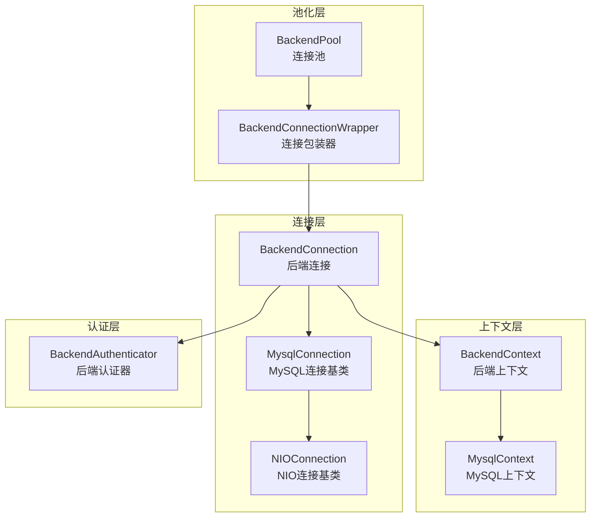
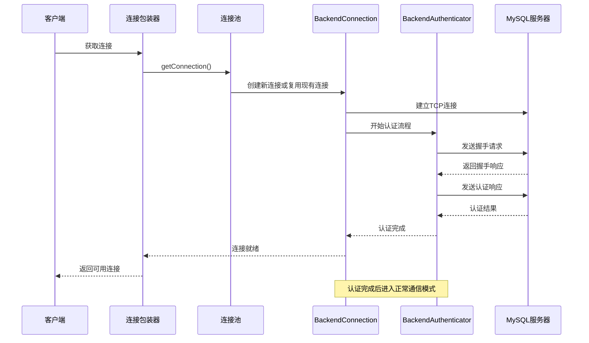
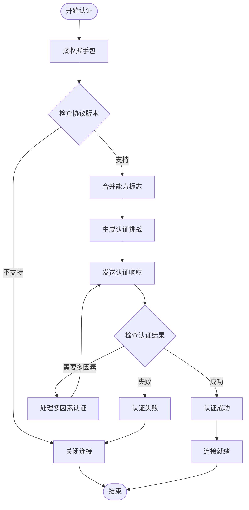
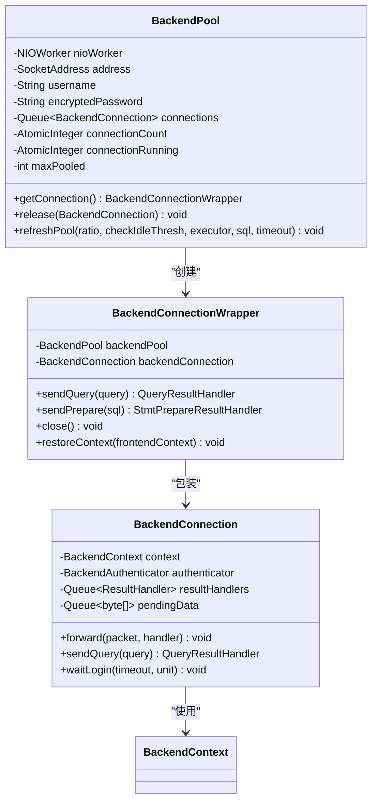
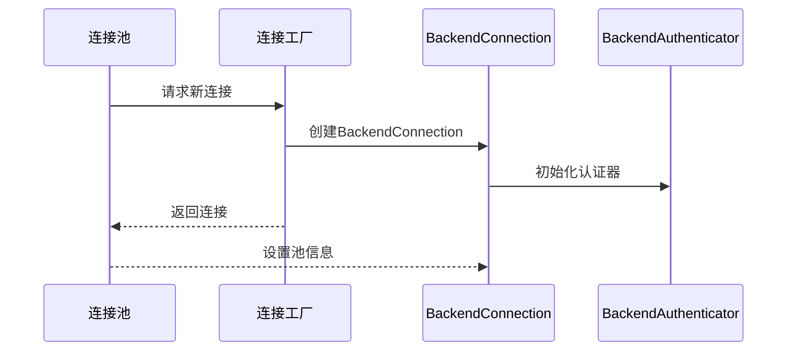
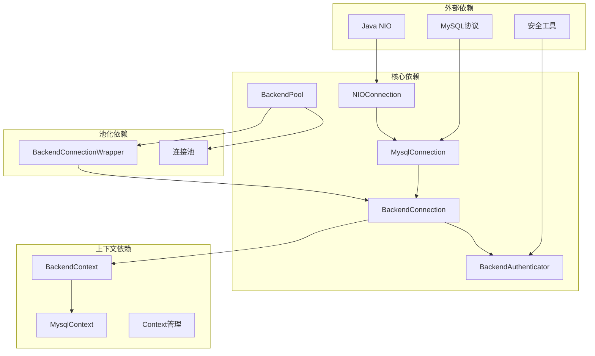

# 后端连接管理

<cite>
**本文档引用的文件**
- [BackendConnection.java](file://proxy-core/src/main/java/com/alibaba/polardbx/proxy/connection/BackendConnection.java)
- [BackendContext.java](file://proxy-core/src/main/java/com/alibaba/polardbx/proxy/context/BackendContext.java)
- [MysqlConnection.java](file://proxy-core/src/main/java/com/alibaba/polardbx/proxy/connection/MysqlConnection.java)
- [BackendAuthenticator.java](file://proxy-core/src/main/java/com/alibaba/polardbx/proxy/protocol/handler/BackendAuthenticator.java)
- [BackendPool.java](file://proxy-core/src/main/java/com/alibaba/polardbx/proxy/connection/pool/BackendPool.java)
- [BackendConnectionWrapper.java](file://proxy-core/src/main/java/com/alibaba/polardbx/proxy/connection/pool/BackendConnectionWrapper.java)
- [MysqlContext.java](file://proxy-core/src/main/java/com/alibaba/polardbx/proxy/context/MysqlContext.java)
- [NIOConnection.java](file://proxy-net/src/main/java/com/alibaba/polardbx/proxy/net/NIOConnection.java)
</cite>

## 目录
1. [简介](#简介)
2. [项目结构](#项目结构)
3. [核心组件](#核心组件)
4. [架构概览](#架构概览)
5. [详细组件分析](#详细组件分析)
6. [依赖关系分析](#依赖关系分析)
7. [性能考虑](#性能考虑)
8. [故障排除指南](#故障排除指南)
9. [结论](#结论)

## 简介

PolarDB-X Proxy的后端连接管理系统是整个代理架构的核心组成部分，负责管理与MySQL后端服务器的连接、认证和状态同步。该系统采用事件驱动的NIO架构，提供了高性能的连接池管理、安全的认证机制和完善的生命周期管理。

系统主要包含以下关键特性：
- 基于NIO的异步连接管理
- 安全的MySQL认证协议支持
- 连接池化和复用策略
- 事务状态和会话变量管理
- 完整的生命周期管理（创建、使用、回收）

## 项目结构

后端连接管理相关的代码主要分布在以下模块中：

**图表来源**
- [BackendConnection.java](file://proxy-core/src/main/java/com/alibaba/polardbx/proxy/connection/BackendConnection.java#L67-L109)
- [MysqlConnection.java](file://proxy-core/src/main/java/com/alibaba/polardbx/proxy/connection/MysqlConnection.java#L37-L45)
- [NIOConnection.java](file://proxy-net/src/main/java/com/alibaba/polardbx/proxy/net/NIOConnection.java#L51-L54)

**章节来源**
- [BackendConnection.java](file://proxy-core/src/main/java/com/alibaba/polardbx/proxy/connection/BackendConnection.java#L1-L813)
- [BackendPool.java](file://proxy-core/src/main/java/com/alibaba/polardbx/proxy/connection/pool/BackendPool.java#L46-L98)

## 核心组件

### BackendConnection 类

BackendConnection是后端连接管理的核心类，继承自MysqlConnection，负责与MySQL后端服务器的直接通信。

#### 主要特性
- **异步认证处理**：通过BackendAuthenticator处理MySQL认证协议
- **结果处理器队列**：管理查询结果的异步处理
- **连接状态管理**：跟踪认证状态和连接有效性
- **数据包路由**：根据认证状态将数据包路由到相应处理器

#### 关键字段和方法
- `contextReference`: 原子引用的BackendContext
- `authenticator`: 当前认证处理器
- `resultHandlers`: 结果处理器队列
- `pendingData`: 待发送的数据包队列

**章节来源**
- [BackendConnection.java](file://proxy-core/src/main/java/com/alibaba/polardbx/proxy/connection/BackendConnection.java#L67-L116)

### BackendContext 上下文管理

BackendContext扩展了MysqlContext，专门用于管理后端连接的上下文信息。

#### 核心功能
- **状态跟踪**：维护MySQL客户端状态（Init、WaitAuth、Authenticated等）
- **预处理语句缓存**：LRU缓存管理预处理语句
- **连接信息存储**：存储远程地址、连接ID、能力标志等
- **字符集管理**：客户端、连接和结果字符集的统一管理

**章节来源**
- [BackendContext.java](file://proxy-core/src/main/java/com/alibaba/polardbx/proxy/context/BackendContext.java#L37-L55)

### MysqlConnection 基类

MysqlConnection作为所有MySQL连接的基类，提供了通用的MySQL协议处理能力。

#### 主要职责
- **包探测**：实现MySQL包头大小探测算法
- **包处理框架**：提供handleAndTakePacket和handleFinish抽象方法
- **编码器/解码器**：管理MySQL包的编码和解码
- **错误处理**：统一的异常处理和连接关闭机制

**章节来源**
- [MysqlConnection.java](file://proxy-core/src/main/java/com/alibaba/polardbx/proxy/connection/MysqlConnection.java#L37-L94)

## 架构概览

后端连接管理采用分层架构设计，每层都有明确的职责分工：

**图表来源**
- [BackendPool.java](file://proxy-core/src/main/java/com/alibaba/polardbx/proxy/connection/pool/BackendPool.java#L115-L131)
- [BackendConnection.java](file://proxy-core/src/main/java/com/alibaba/polardbx/proxy/connection/BackendConnection.java#L118-L160)

## 详细组件分析

### BackendAuthenticator 认证实现

BackendAuthenticator实现了完整的MySQL认证协议处理，支持多种认证方式。

#### 认证流程
1. **握手阶段**：接收MySQL服务器的握手包
2. **能力协商**：合并客户端和服务器的能力标志
3. **认证挑战**：基于密码和随机数生成认证令牌
4. **认证响应**：发送认证响应给MySQL服务器
5. **结果处理**：处理认证成功、失败或多因素认证

**图表来源**
- [BackendAuthenticator.java](file://proxy-core/src/main/java/com/alibaba/polardbx/proxy/protocol/handler/BackendAuthenticator.java#L69-L210)

**章节来源**
- [BackendAuthenticator.java](file://proxy-core/src/main/java/com/alibaba/polardbx/proxy/protocol/handler/BackendAuthenticator.java#L45-L212)

### BackendPool 连接池管理

BackendPool提供了完整的连接池管理功能，包括连接创建、复用和回收。

#### 连接池特性
- **动态扩容**：根据需求动态创建新连接
- **连接复用**：智能复用有效的空闲连接
- **容量控制**：限制最大连接数量
- **健康检查**：定期刷新和验证连接有效性

**图表来源**
- [BackendPool.java](file://proxy-core/src/main/java/com/alibaba/polardbx/proxy/connection/pool/BackendPool.java#L46-L98)
- [BackendConnectionWrapper.java](file://proxy-core/src/main/java/com/alibaba/polardbx/proxy/connection/pool/BackendConnectionWrapper.java#L44-L55)

**章节来源**
- [BackendPool.java](file://proxy-core/src/main/java/com/alibaba/polardbx/proxy/connection/pool/BackendPool.java#L46-L284)

### 生命周期管理

后端连接的生命周期管理包括创建、使用、回收和销毁四个阶段。

#### 连接创建

**图表来源**
- [BackendConnection.java](file://proxy-core/src/main/java/com/alibaba/polardbx/proxy/connection/BackendConnection.java#L100-L116)

#### 连接使用
- **查询执行**：通过sendQuery方法发送SQL查询
- **预处理语句**：支持COM_STMT_PREPARE协议
- **结果处理**：异步处理查询结果
- **状态同步**：维护事务和会话状态

#### 连接回收
- **健康检查**：验证连接是否仍然有效
- **资源清理**：清理未完成的请求和处理器
- **池化复用**：将连接放回连接池等待复用

**章节来源**
- [BackendConnectionWrapper.java](file://proxy-core/src/main/java/com/alibaba/polardbx/proxy/connection/pool/BackendConnectionWrapper.java#L240-L265)

## 依赖关系分析

后端连接管理系统具有清晰的依赖层次结构：

**图表来源**
- [NIOConnection.java](file://proxy-net/src/main/java/com/alibaba/polardbx/proxy/net/NIOConnection.java#L51-L54)
- [MysqlConnection.java](file://proxy-core/src/main/java/com/alibaba/polardbx/proxy/connection/MysqlConnection.java#L37-L45)

**章节来源**
- [MysqlContext.java](file://proxy-core/src/main/java/com/alibaba/polardbx/proxy/context/MysqlContext.java#L48-L106)

## 性能考虑

### 连接池优化
- **动态容量调整**：根据负载动态调整连接池大小
- **连接复用策略**：优先复用已认证的有效连接
- **健康检查机制**：定期验证连接有效性，避免使用失效连接

### 内存管理
- **缓冲区池化**：使用FastBufferPool减少内存分配开销
- **对象复用**：复用ResultHandler和Context对象
- **垃圾回收优化**：最小化临时对象创建

### 网络性能
- **NIO事件驱动**：基于选择器的非阻塞I/O模型
- **批量处理**：支持批量数据包处理和发送
- **流控机制**：实现读写流控防止内存溢出

## 故障排除指南

### 常见问题及解决方案

#### 连接认证失败
**症状**：连接建立后立即断开
**原因**：
- 用户名或密码错误
- MySQL服务器不支持的认证协议
- 网络连接问题

**解决方法**：
1. 验证用户名和密码配置
2. 检查MySQL服务器的认证插件设置
3. 确认网络连通性和防火墙设置

#### 连接池耗尽
**症状**：应用程序出现连接超时错误
**原因**：
- 连接池最大容量设置过小
- 连接泄漏导致连接无法回收
- 长时间运行的应用程序

**解决方法**：
1. 增加maxPooled参数值
2. 检查代码中的连接释放逻辑
3. 实施连接超时和健康检查机制

#### 性能问题
**症状**：响应时间过长或吞吐量不足
**原因**：
- 缓冲区配置不当
- 连接池大小不合适
- 网络延迟过高

**解决方法**：
1. 调整缓冲区大小和连接池参数
2. 优化查询和索引使用
3. 检查网络基础设施

**章节来源**
- [BackendAuthenticator.java](file://proxy-core/src/main/java/com/alibaba/polardbx/proxy/protocol/handler/BackendAuthenticator.java#L191-L207)
- [BackendPool.java](file://proxy-core/src/main/java/com/alibaba/polardbx/proxy/connection/pool/BackendPool.java#L134-L165)

## 结论

PolarDB-X Proxy的后端连接管理系统展现了现代数据库代理架构的最佳实践。通过精心设计的分层架构、高效的连接池管理和完善的生命周期控制，系统能够提供高性能、高可靠性的后端连接服务。

关键优势包括：
- **模块化设计**：清晰的职责分离和依赖关系
- **性能优化**：基于NIO的异步处理和连接池化
- **安全性保障**：完整的认证协议支持和安全连接建立
- **可维护性**：良好的代码组织和错误处理机制

该系统为PolarDB-X的整体架构奠定了坚实的基础，确保了大规模分布式环境下的稳定性和性能表现。