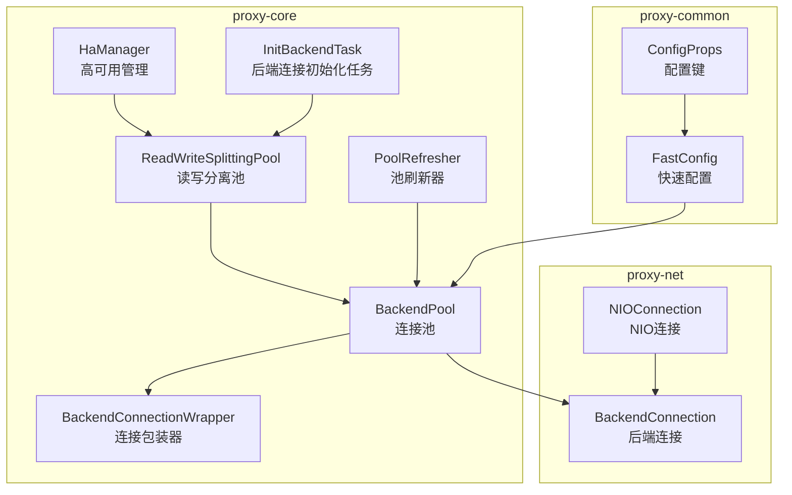
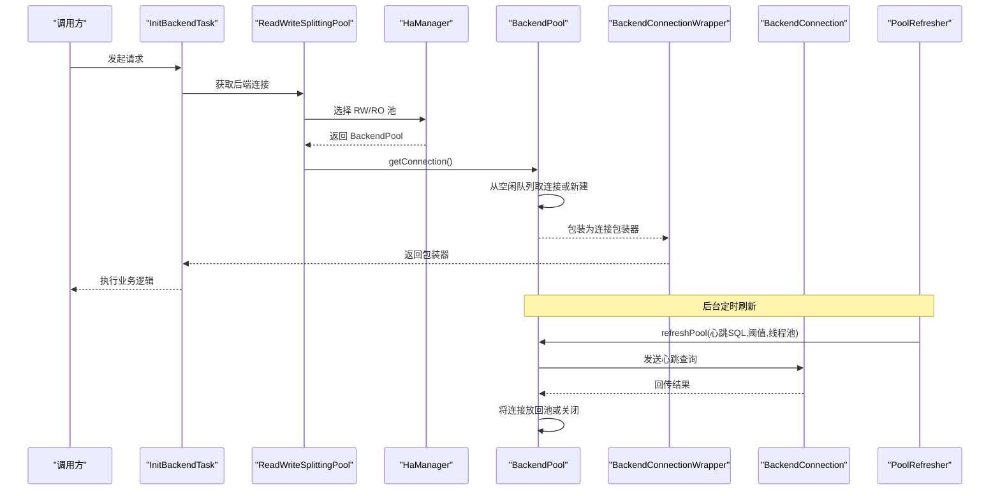
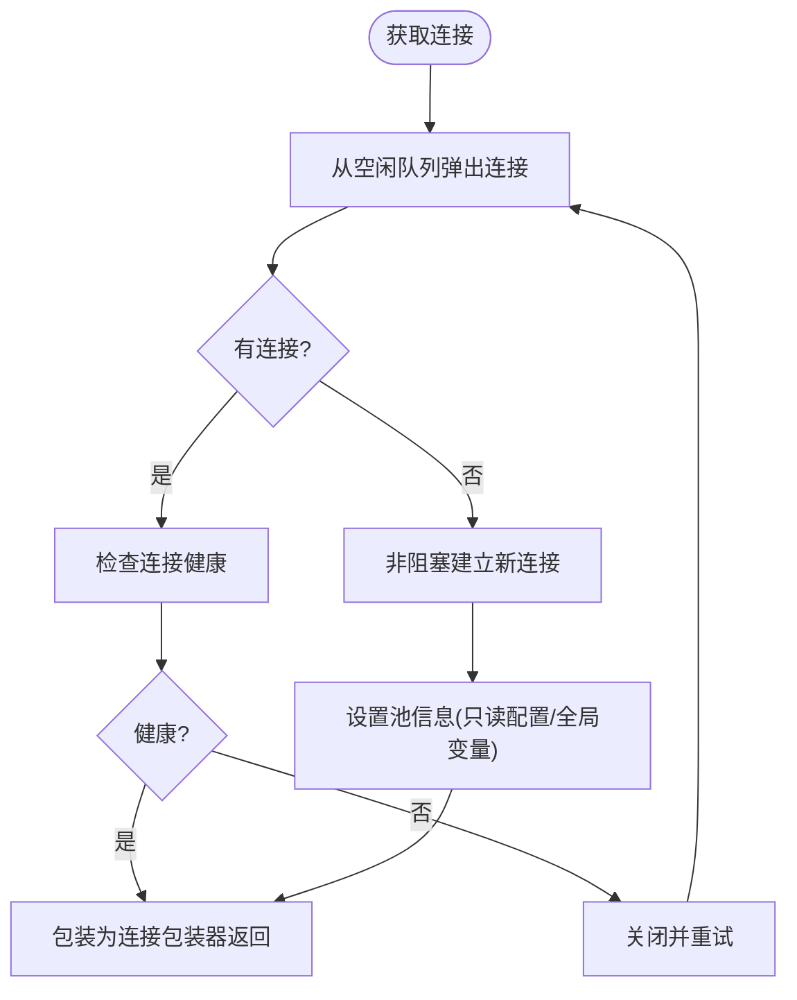
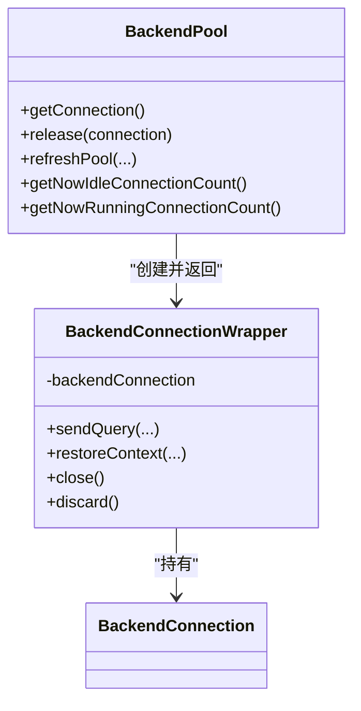
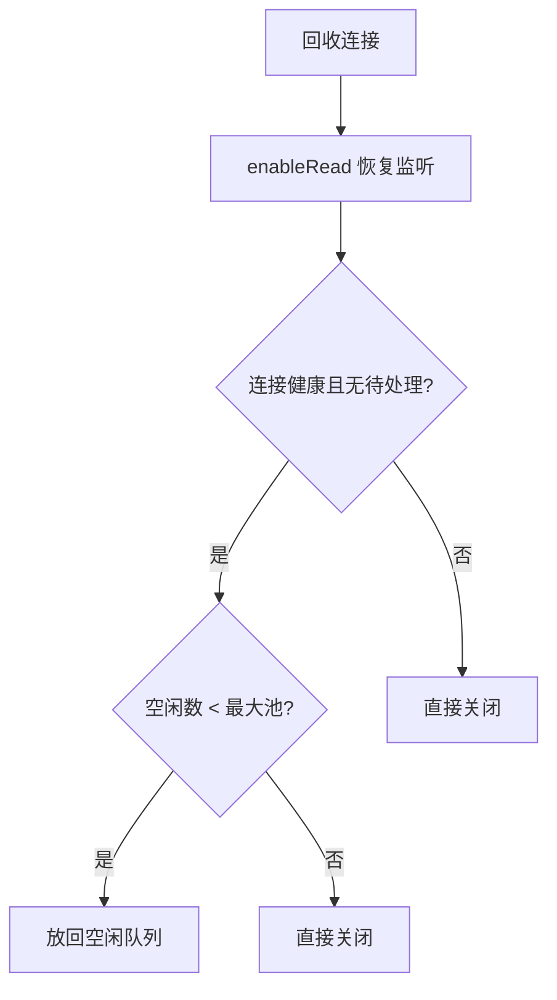
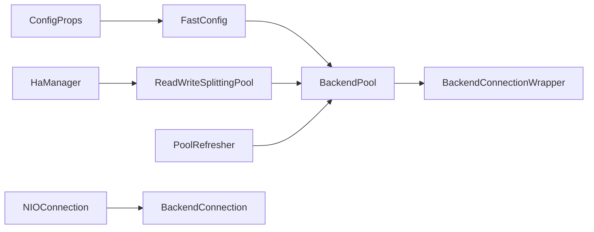

# 连接池机制

<cite>
**本文引用的文件**
- [BackendPool.java](file://proxy-core/src/main/java/com/alibaba/polardbx/proxy/connection/pool/BackendPool.java)
- [BackendConnectionWrapper.java](file://proxy-core/src/main/java/com/alibaba/polardbx/proxy/connection/pool/BackendConnectionWrapper.java)
- [ConfigProps.java](file://proxy-common/src/main/java/com/alibaba/polardbx/proxy/config/ConfigProps.java)
- [FastConfig.java](file://proxy-common/src/main/java/com/alibaba/polardbx/proxy/config/FastConfig.java)
- [PoolRefresher.java](file://proxy-core/src/main/java/com/alibaba/polardbx/proxy/serverless/PoolRefresher.java)
- [HaManager.java](file://proxy-core/src/main/java/com/alibaba/polardbx/proxy/serverless/HaManager.java)
- [ReadWriteSplittingPool.java](file://proxy-core/src/main/java/com/alibaba/polardbx/proxy/serverless/ReadWriteSplittingPool.java)
- [InitBackendTask.java](file://proxy-core/src/main/java/com/alibaba/polardbx/proxy/scheduler/InitBackendTask.java)
- [LeakChecker.java](file://proxy-common/src/main/java/com/alibaba/polardbx/proxy/utils/LeakChecker.java)
- [NIOConnection.java](file://proxy-net/src/main/java/com/alibaba/polardbx/proxy/net/NIOConnection.java)
- [BackendConnection.java](file://proxy-core/src/main/java/com/alibaba/polardbx/proxy/connection/BackendConnection.java)
- [ShowRwHandler.java](file://proxy-core/src/main/java/com/alibaba/polardbx/proxy/protocol/handler/request/ShowRwHandler.java)
- [ShowBackendHandler.java](file://proxy-core/src/main/java/com/alibaba/polardbx/proxy/protocol/handler/request/ShowBackendHandler.java)
</cite>

## 目录
1. [引言](#引言)
2. [项目结构](#项目结构)
3. [核心组件](#核心组件)
4. [架构总览](#架构总览)
5. [组件详解](#组件详解)
6. [依赖关系分析](#依赖关系分析)
7. [性能考量](#性能考量)
8. [故障排查指南](#故障排查指南)
9. [结论](#结论)
10. [附录](#附录)

## 引言
本文件围绕 PolarDB-X Proxy 的后端连接池（BackendPool）与连接包装器（BackendConnectionWrapper）展开，系统性阐述其初始化、连接分配与回收策略、状态与资源管理、核心配置参数、性能优化手段、监控与调试方法，以及故障处理与恢复机制。目标是帮助读者在不深入源码的前提下理解整体设计，并在需要时快速定位到关键实现位置。

## 项目结构
与连接池直接相关的代码主要分布在以下模块：
- proxy-core：连接池、连接包装器、读写分离与高可用管理、调度任务等
- proxy-common：配置项定义与快速配置加载
- proxy-net：网络层基础能力（NIO 连接、事件循环）
- proxy-parser：SQL 解析（与连接池无直接耦合）

**图表来源**
- [BackendPool.java](file://proxy-core/src/main/java/com/alibaba/polardbx/proxy/connection/pool/BackendPool.java#L46-L283)
- [BackendConnectionWrapper.java](file://proxy-core/src/main/java/com/alibaba/polardbx/proxy/connection/pool/BackendConnectionWrapper.java#L44-L274)
- [ReadWriteSplittingPool.java](file://proxy-core/src/main/java/com/alibaba/polardbx/proxy/serverless/ReadWriteSplittingPool.java#L339-L363)
- [HaManager.java](file://proxy-core/src/main/java/com/alibaba/polardbx/proxy/serverless/HaManager.java#L596-L602)
- [PoolRefresher.java](file://proxy-core/src/main/java/com/alibaba/polardbx/proxy/serverless/PoolRefresher.java#L41-L145)
- [InitBackendTask.java](file://proxy-core/src/main/java/com/alibaba/polardbx/proxy/scheduler/InitBackendTask.java#L28-L49)
- [ConfigProps.java](file://proxy-common/src/main/java/com/alibaba/polardbx/proxy/config/ConfigProps.java#L127-L207)
- [FastConfig.java](file://proxy-common/src/main/java/com/alibaba/polardbx/proxy/config/FastConfig.java#L45-L73)
- [NIOConnection.java](file://proxy-net/src/main/java/com/alibaba/polardbx/proxy/net/NIOConnection.java#L844-L883)
- [BackendConnection.java](file://proxy-core/src/main/java/com/alibaba/polardbx/proxy/connection/BackendConnection.java#L722-L753)

**章节来源**
- [BackendPool.java](file://proxy-core/src/main/java/com/alibaba/polardbx/proxy/connection/pool/BackendPool.java#L46-L283)
- [BackendConnectionWrapper.java](file://proxy-core/src/main/java/com/alibaba/polardbx/proxy/connection/pool/BackendConnectionWrapper.java#L44-L274)
- [ConfigProps.java](file://proxy-common/src/main/java/com/alibaba/polardbx/proxy/config/ConfigProps.java#L127-L207)
- [FastConfig.java](file://proxy-common/src/main/java/com/alibaba/polardbx/proxy/config/FastConfig.java#L45-L73)
- [PoolRefresher.java](file://proxy-core/src/main/java/com/alibaba/polardbx/proxy/serverless/PoolRefresher.java#L41-L145)
- [HaManager.java](file://proxy-core/src/main/java/com/alibaba/polardbx/proxy/serverless/HaManager.java#L596-L602)
- [ReadWriteSplittingPool.java](file://proxy-core/src/main/java/com/alibaba/polardbx/proxy/serverless/ReadWriteSplittingPool.java#L339-L363)
- [InitBackendTask.java](file://proxy-core/src/main/java/com/alibaba/polardbx/proxy/scheduler/InitBackendTask.java#L28-L49)
- [NIOConnection.java](file://proxy-net/src/main/java/com/alibaba/polardbx/proxy/net/NIOConnection.java#L844-L883)
- [BackendConnection.java](file://proxy-core/src/main/java/com/alibaba/polardbx/proxy/connection/BackendConnection.java#L722-L753)

## 核心组件
- BackendPool：后端连接池，负责连接的创建、复用、回收与健康检查；维护最大池大小、空闲队列与运行中计数。
- BackendConnectionWrapper：连接包装器，封装底层 BackendConnection，提供统一的发送查询、准备语句、上下文恢复等接口，并负责连接释放回池或丢弃。
- PoolRefresher：周期性刷新连接池，执行“心跳”查询以维持连接健康并回收过期连接。
- HaManager 与 ReadWriteSplittingPool：管理主从拓扑与读写分离池，驱动 BackendPool 的创建与切换。
- 配置体系：ConfigProps 定义配置键，FastConfig 提供运行时快速配置读取。

**章节来源**
- [BackendPool.java](file://proxy-core/src/main/java/com/alibaba/polardbx/proxy/connection/pool/BackendPool.java#L46-L132)
- [BackendConnectionWrapper.java](file://proxy-core/src/main/java/com/alibaba/polardbx/proxy/connection/pool/BackendConnectionWrapper.java#L44-L274)
- [PoolRefresher.java](file://proxy-core/src/main/java/com/alibaba/polardbx/proxy/serverless/PoolRefresher.java#L41-L145)
- [HaManager.java](file://proxy-core/src/main/java/com/alibaba/polardbx/proxy/serverless/HaManager.java#L596-L602)
- [ReadWriteSplittingPool.java](file://proxy-core/src/main/java/com/alibaba/polardbx/proxy/serverless/ReadWriteSplittingPool.java#L339-L363)
- [ConfigProps.java](file://proxy-common/src/main/java/com/alibaba/polardbx/proxy/config/ConfigProps.java#L127-L207)
- [FastConfig.java](file://proxy-common/src/main/java/com/alibaba/polardbx/proxy/config/FastConfig.java#L45-L73)

## 架构总览
下面的序列图展示了典型的一次连接获取与释放流程，以及连接健康检查与全局变量刷新的后台机制。

**图表来源**
- [InitBackendTask.java](file://proxy-core/src/main/java/com/alibaba/polardbx/proxy/scheduler/InitBackendTask.java#L28-L49)
- [ReadWriteSplittingPool.java](file://proxy-core/src/main/java/com/alibaba/polardbx/proxy/serverless/ReadWriteSplittingPool.java#L339-L363)
- [HaManager.java](file://proxy-core/src/main/java/com/alibaba/polardbx/proxy/serverless/HaManager.java#L596-L602)
- [BackendPool.java](file://proxy-core/src/main/java/com/alibaba/polardbx/proxy/connection/pool/BackendPool.java#L115-L132)
- [PoolRefresher.java](file://proxy-core/src/main/java/com/alibaba/polardbx/proxy/serverless/PoolRefresher.java#L41-L145)

## 组件详解

### BackendPool：连接池实现
- 初始化与参数
  - 构造函数接收后端地址、代理令牌、用户名、加密密码、默认库、最大池大小与是否从库标记。
  - 最大池大小可运行时调整，且在关闭时置为负值以阻止新连接入池。
- 连接分配策略
  - getConnection 循环尝试从空闲队列取出连接；若为空则非阻塞建立新连接。
  - 取出的连接会进行健康检查（isGood），否则立即关闭并继续尝试。
  - 成功获取的连接被包装为 BackendConnectionWrapper 返回给上层。
- 连接回收机制
  - release 将连接恢复读监听并进行健康检查与待处理请求检查。
  - 若连接健康且无待处理请求，则根据当前空闲数量与最大池大小决定放回空闲队列或直接关闭。
- 健康检查与全局变量刷新
  - refreshPool 以固定比例扫描空闲连接，对超过空闲阈值的健康连接异步发送心跳 SQL 并回收。
  - 全局变量刷新周期性拉取后端 global variables 并缓存，用于后续决策。
- 数据统计与状态
  - 提供当前空闲连接数与运行中连接数查询接口，便于监控与诊断。

**图表来源**
- [BackendPool.java](file://proxy-core/src/main/java/com/alibaba/polardbx/proxy/connection/pool/BackendPool.java#L115-L132)
- [BackendPool.java](file://proxy-core/src/main/java/com/alibaba/polardbx/proxy/connection/pool/BackendPool.java#L167-L209)

**章节来源**
- [BackendPool.java](file://proxy-core/src/main/java/com/alibaba/polardbx/proxy/connection/pool/BackendPool.java#L76-L132)
- [BackendPool.java](file://proxy-core/src/main/java/com/alibaba/polardbx/proxy/connection/pool/BackendPool.java#L134-L165)
- [BackendPool.java](file://proxy-core/src/main/java/com/alibaba/polardbx/proxy/connection/pool/BackendPool.java#L167-L250)
- [BackendPool.java](file://proxy-core/src/main/java/com/alibaba/polardbx/proxy/connection/pool/BackendPool.java#L252-L271)
- [BackendPool.java](file://proxy-core/src/main/java/com/alibaba/polardbx/proxy/connection/pool/BackendPool.java#L273-L283)

### BackendConnectionWrapper：连接包装与资源管理
- 角色与职责
  - 对外暴露统一的发送查询、准备语句、上下文恢复等接口，内部持有 BackendConnection。
  - 负责连接生命周期内的状态跟踪与资源回收：close 将连接归还池，discard 直接关闭并释放计数。
- 上下文恢复
  - 在切换用户或恢复 autocommit 等场景，通过包装器向后端发送必要命令并校验结果，确保前后端状态一致。
- 线程安全
  - 关键操作采用同步块保护，避免在回调中提前关闭导致的竞争问题。

**图表来源**
- [BackendConnectionWrapper.java](file://proxy-core/src/main/java/com/alibaba/polardbx/proxy/connection/pool/BackendConnectionWrapper.java#L44-L274)
- [BackendPool.java](file://proxy-core/src/main/java/com/alibaba/polardbx/proxy/connection/pool/BackendPool.java#L115-L165)

**章节来源**
- [BackendConnectionWrapper.java](file://proxy-core/src/main/java/com/alibaba/polardbx/proxy/connection/pool/BackendConnectionWrapper.java#L44-L274)

### 连接池核心配置参数
- 连接池规模
  - 后端管理员池最大数：backend_admin_max_pooled_size
  - 后端读写池最大数：backend_rw_max_pooled_size
  - 后端只读池最大数：backend_ro_max_pooled_size
- 连接超时
  - 后端连接超时：backend_connect_timeout
- 刷新与心跳
  - 后端池刷新线程数：backend_pool_refresh_threads
  - 刷新任务间隔：backend_pool_refresh_task_interval
  - 刷新间隔：backend_pool_refresh_interval
  - 刷新心跳 SQL：backend_pool_refresh_sql
  - 刷新超时：backend_pool_refresh_timeout
- 全局变量刷新间隔：global_variables_refresh_interval
- 默认值参考见配置类静态初始化段落。

**章节来源**
- [ConfigProps.java](file://proxy-common/src/main/java/com/alibaba/polardbx/proxy/config/ConfigProps.java#L146-L148)
- [ConfigProps.java](file://proxy-common/src/main/java/com/alibaba/polardbx/proxy/config/ConfigProps.java#L174-L178)
- [ConfigProps.java](file://proxy-common/src/main/java/com/alibaba/polardbx/proxy/config/ConfigProps.java#L188-L188)

### 性能优化策略
- 连接预热
  - 通过合理设置最大池大小与后台刷新，使连接在空闲期内保持健康，减少首次使用的抖动。
- 动态扩容
  - 运行时可调最大池大小（setMaxPooled），配合 HA 切换与拓扑变化动态调整。
- 负载均衡
  - 读写分离池按权重与延迟策略选择后端，结合连接池上限控制流量。
- 连接验证机制
  - refreshPool 使用心跳 SQL 验证连接健康；全局变量缓存降低重复查询开销。
- 线程池隔离
  - 刷新任务在独立线程池执行，避免阻塞主事件循环。

**章节来源**
- [BackendPool.java](file://proxy-core/src/main/java/com/alibaba/polardbx/proxy/connection/pool/BackendPool.java#L167-L209)
- [PoolRefresher.java](file://proxy-core/src/main/java/com/alibaba/polardbx/proxy/serverless/PoolRefresher.java#L41-L145)
- [ReadWriteSplittingPool.java](file://proxy-core/src/main/java/com/alibaba/polardbx/proxy/serverless/ReadWriteSplittingPool.java#L339-L363)

### 监控与调试
- 运行时指标
  - 空闲连接数与运行中连接数：getNowIdleConnectionCount、getNowRunningConnectionCount
  - 系统表展示：ShowRwHandler 展示 RW 池地址、权重、运行中/空闲/最大池大小等
  - ShowBackendHandler 展示后端连接详情
- 连接标识与诊断
  - NIOConnection.connectionString 提供本地-远端地址串，便于日志关联
  - BackendConnectionWrapper.probeConnectionId/探针标签可用于追踪
- 泄漏检测
  - LeakChecker 抽象基类提供清理器钩子，可在资源未正常关闭时触发告警或终止进程（受 enable_leak_check 控制）

**章节来源**
- [BackendPool.java](file://proxy-core/src/main/java/com/alibaba/polardbx/proxy/connection/pool/BackendPool.java#L107-L113)
- [ShowRwHandler.java](file://proxy-core/src/main/java/com/alibaba/polardbx/proxy/protocol/handler/request/ShowRwHandler.java#L37-L61)
- [ShowBackendHandler.java](file://proxy-core/src/main/java/com/alibaba/polardbx/proxy/protocol/handler/request/ShowBackendHandler.java)
- [NIOConnection.java](file://proxy-net/src/main/java/com/alibaba/polardbx/proxy/net/NIOConnection.java#L844-L883)
- [LeakChecker.java](file://proxy-common/src/main/java/com/alibaba/polardbx/proxy/utils/LeakChecker.java#L30-L112)

### 故障处理与恢复
- 连接失效检测
  - 连接池在获取与回收时均进行 isGood 检查；refreshPool 对空闲连接执行心跳验证。
- 自动重建
  - 获取失败或健康检查失败时，连接池会主动关闭并重新建立新连接。
- 故障转移
  - HA 管理器在主节点变更时触发池重建与切换（reloadPool），确保服务连续性。
- 事务一致性
  - 连接包装器在恢复上下文时严格校验 autocommit 与事务状态，异常即抛出，避免状态漂移。

**图表来源**
- [BackendPool.java](file://proxy-core/src/main/java/com/alibaba/polardbx/proxy/connection/pool/BackendPool.java#L134-L165)

**章节来源**
- [BackendPool.java](file://proxy-core/src/main/java/com/alibaba/polardbx/proxy/connection/pool/BackendPool.java#L134-L165)
- [HaManager.java](file://proxy-core/src/main/java/com/alibaba/polardbx/proxy/serverless/HaManager.java#L596-L602)
- [BackendConnectionWrapper.java](file://proxy-core/src/main/java/com/alibaba/polardbx/proxy/connection/pool/BackendConnectionWrapper.java#L165-L238)

## 依赖关系分析
- 组件耦合
  - BackendPool 依赖 NIO 连接与处理器，间接依赖网络层基础设施。
  - BackendConnectionWrapper 依赖 BackendPool 的回收策略与上下文恢复能力。
  - PoolRefresher 依赖 HaManager 与读写分离池，统一刷新所有池。
- 外部依赖
  - 配置系统（ConfigProps/FastConfig）贯穿连接池行为，如最大池大小、刷新间隔、心跳 SQL 等。
- 潜在风险
  - 刷新线程池与定时任务需正确关闭，避免资源泄露。
  - HA 切换期间的连接状态一致性需由包装器恢复逻辑保障。

**图表来源**
- [ConfigProps.java](file://proxy-common/src/main/java/com/alibaba/polardbx/proxy/config/ConfigProps.java#L127-L207)
- [FastConfig.java](file://proxy-common/src/main/java/com/alibaba/polardbx/proxy/config/FastConfig.java#L45-L73)
- [BackendPool.java](file://proxy-core/src/main/java/com/alibaba/polardbx/proxy/connection/pool/BackendPool.java#L46-L98)
- [HaManager.java](file://proxy-core/src/main/java/com/alibaba/polardbx/proxy/serverless/HaManager.java#L596-L602)
- [ReadWriteSplittingPool.java](file://proxy-core/src/main/java/com/alibaba/polardbx/proxy/serverless/ReadWriteSplittingPool.java#L339-L363)
- [PoolRefresher.java](file://proxy-core/src/main/java/com/alibaba/polardbx/proxy/serverless/PoolRefresher.java#L41-L145)
- [NIOConnection.java](file://proxy-net/src/main/java/com/alibaba/polardbx/proxy/net/NIOConnection.java#L844-L883)
- [BackendConnection.java](file://proxy-core/src/main/java/com/alibaba/polardbx/proxy/connection/BackendConnection.java#L722-L753)

**章节来源**
- [BackendPool.java](file://proxy-core/src/main/java/com/alibaba/polardbx/proxy/connection/pool/BackendPool.java#L46-L98)
- [PoolRefresher.java](file://proxy-core/src/main/java/com/alibaba/polardbx/proxy/serverless/PoolRefresher.java#L41-L145)
- [HaManager.java](file://proxy-core/src/main/java/com/alibaba/polardbx/proxy/serverless/HaManager.java#L596-L602)
- [ReadWriteSplittingPool.java](file://proxy-core/src/main/java/com/alibaba/polardbx/proxy/serverless/ReadWriteSplittingPool.java#L339-L363)

## 性能考量
- 连接池上限与并发
  - 合理设置最大池大小，避免过度占用内存与后端资源；结合业务峰值与延迟目标评估。
- 心跳与刷新
  - 刷新间隔与心跳 SQL 的选择应平衡健康探测成本与连接保活效果。
- 线程隔离
  - 刷新任务在独立线程池执行，避免影响前端请求处理。
- 连接建立耗时
  - 非阻塞连接建立与等待有效状态的机制，有助于降低首包延迟。

**章节来源**
- [BackendPool.java](file://proxy-core/src/main/java/com/alibaba/polardbx/proxy/connection/pool/BackendPool.java#L167-L209)
- [BackendConnection.java](file://proxy-core/src/main/java/com/alibaba/polardbx/proxy/connection/BackendConnection.java#L722-L753)
- [NIOConnection.java](file://proxy-net/src/main/java/com/alibaba/polardbx/proxy/net/NIOConnection.java#L844-L883)

## 故障排查指南
- 连接无法获取
  - 检查最大池大小与当前空闲/运行中连接数；确认 HA 是否已初始化对应池。
- 连接频繁重建
  - 查看刷新任务日志与心跳 SQL 执行情况；核对后端健康状态。
- 事务状态异常
  - 检查连接包装器恢复 autocommit 与事务状态的校验逻辑是否触发异常。
- 连接泄漏
  - 开启泄漏检测（enable_leak_check），关注清理器回调日志；确保所有路径均调用 close 或 discard。
- 连接字符串与标签
  - 使用 NIOConnection.connectionString 与包装器探针标签辅助定位具体连接。

**章节来源**
- [BackendPool.java](file://proxy-core/src/main/java/com/alibaba/polardbx/proxy/connection/pool/BackendPool.java#L107-L113)
- [BackendConnectionWrapper.java](file://proxy-core/src/main/java/com/alibaba/polardbx/proxy/connection/pool/BackendConnectionWrapper.java#L61-L80)
- [NIOConnection.java](file://proxy-net/src/main/java/com/alibaba/polardbx/proxy/net/NIOConnection.java#L844-L883)
- [LeakChecker.java](file://proxy-common/src/main/java/com/alibaba/polardbx/proxy/utils/LeakChecker.java#L30-L112)

## 结论
BackendPool 与 BackendConnectionWrapper 构成了 PolarDB-X Proxy 后端连接池的核心：前者负责连接的生命周期管理与健康维护，后者提供稳定的上层接口与上下文一致性保障。配合 HA 与读写分离、定时刷新与配置体系，实现了高可用、可扩展且可观测的连接池机制。通过合理的参数调优与监控手段，可在生产环境中获得稳定与高性能的表现。

## 附录
- 关键实现路径索引
  - 连接池初始化与分配：[BackendPool.java](file://proxy-core/src/main/java/com/alibaba/polardbx/proxy/connection/pool/BackendPool.java#L76-L132)
  - 连接回收与健康检查：[BackendPool.java](file://proxy-core/src/main/java/com/alibaba/polardbx/proxy/connection/pool/BackendPool.java#L134-L165)
  - 刷新与全局变量更新：[BackendPool.java](file://proxy-core/src/main/java/com/alibaba/polardbx/proxy/connection/pool/BackendPool.java#L167-L250)
  - 包装器上下文恢复与关闭语义：[BackendConnectionWrapper.java](file://proxy-core/src/main/java/com/alibaba/polardbx/proxy/connection/pool/BackendConnectionWrapper.java#L165-L238)
  - 刷新任务调度与线程池：[PoolRefresher.java](file://proxy-core/src/main/java/com/alibaba/polardbx/proxy/serverless/PoolRefresher.java#L41-L145)
  - HA 切换与池重建：[HaManager.java](file://proxy-core/src/main/java/com/alibaba/polardbx/proxy/serverless/HaManager.java#L596-L602)
  - 读写分离池获取连接：[ReadWriteSplittingPool.java](file://proxy-core/src/main/java/com/alibaba/polardbx/proxy/serverless/ReadWriteSplittingPool.java#L339-L363)
  - 调度任务中获取后端连接：[InitBackendTask.java](file://proxy-core/src/main/java/com/alibaba/polardbx/proxy/scheduler/InitBackendTask.java#L28-L49)
  - 配置键与默认值：[ConfigProps.java](file://proxy-common/src/main/java/com/alibaba/polardbx/proxy/config/ConfigProps.java#L127-L207)
  - 快速配置刷新：[FastConfig.java](file://proxy-common/src/main/java/com/alibaba/polardbx/proxy/config/FastConfig.java#L45-L73)
  - 连接字符串与诊断：[NIOConnection.java](file://proxy-net/src/main/java/com/alibaba/polardbx/proxy/net/NIOConnection.java#L844-L883)
  - 连接建立与等待有效状态：[BackendConnection.java](file://proxy-core/src/main/java/com/alibaba/polardbx/proxy/connection/BackendConnection.java#L722-L753)
  - 运行时监控系统表：[ShowRwHandler.java](file://proxy-core/src/main/java/com/alibaba/polardbx/proxy/protocol/handler/request/ShowRwHandler.java#L37-L61)
  - 泄漏检测基类：[LeakChecker.java](file://proxy-common/src/main/java/com/alibaba/polardbx/proxy/utils/LeakChecker.java#L30-L112)