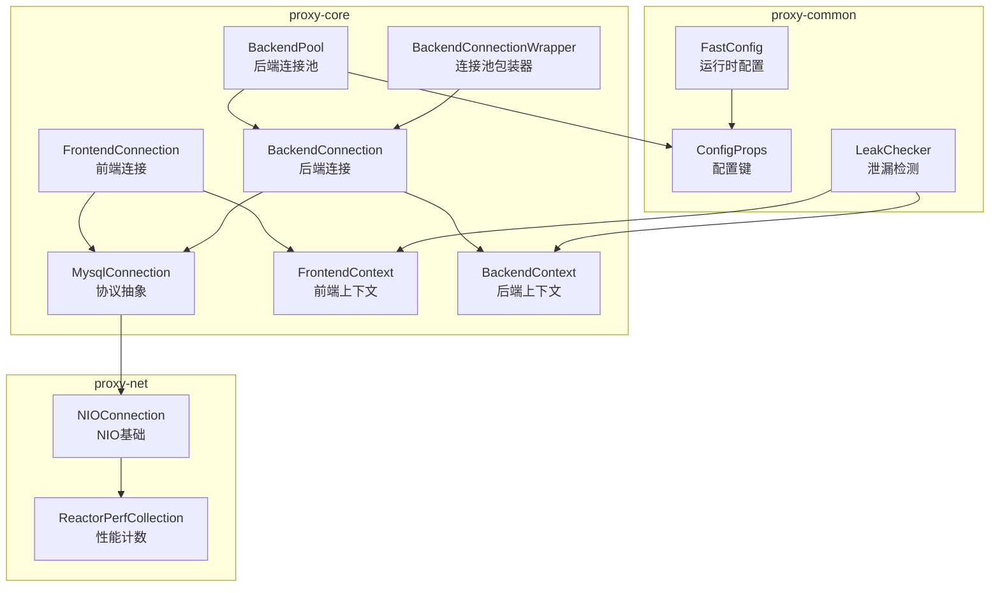
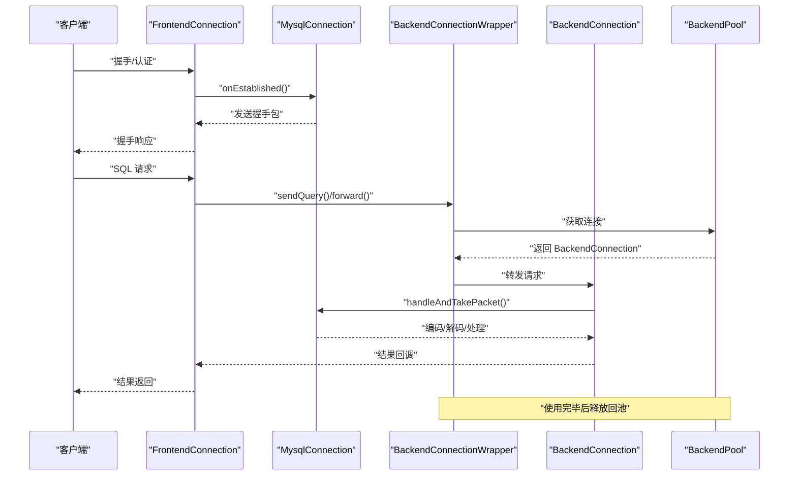
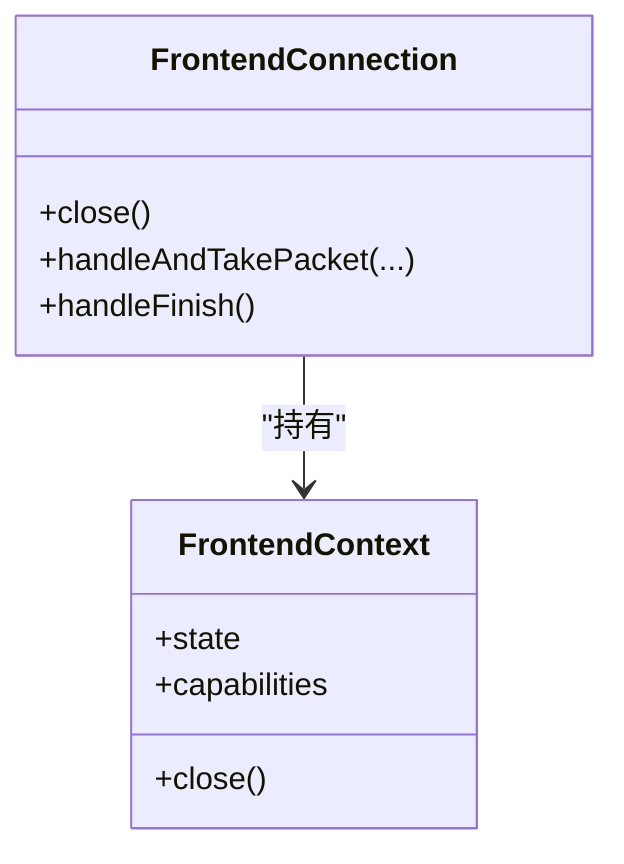
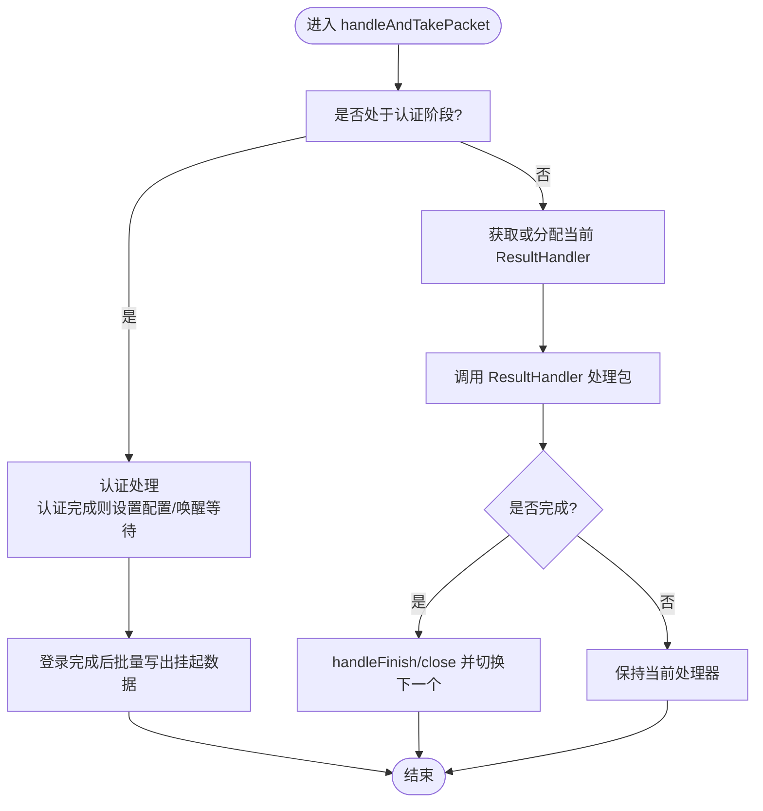
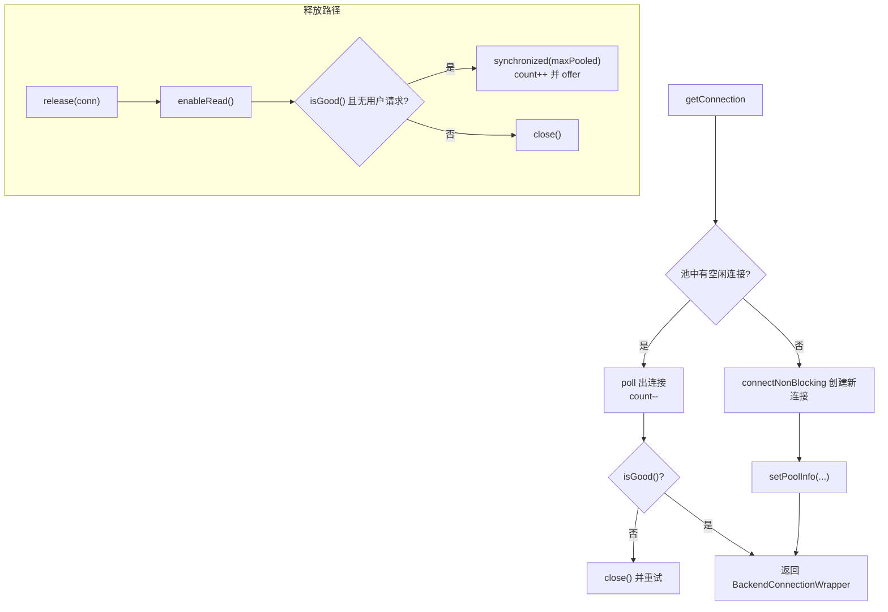
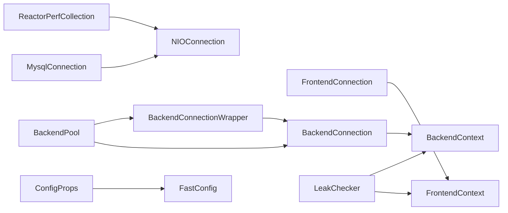

# 连接管理

<cite>
**本文引用的文件列表**
- [FrontendConnection.java](file://proxy-core/src/main/java/com/alibaba/polardbx/proxy/connection/FrontendConnection.java)
- [BackendConnection.java](file://proxy-core/src/main/java/com/alibaba/polardbx/proxy/connection/BackendConnection.java)
- [MysqlConnection.java](file://proxy-core/src/main/java/com/alibaba/polardbx/proxy/connection/MysqlConnection.java)
- [BackendPool.java](file://proxy-core/src/main/java/com/alibaba/polardbx/proxy/connection/pool/BackendPool.java)
- [BackendConnectionWrapper.java](file://proxy-core/src/main/java/com/alibaba/polardbx/proxy/connection/pool/BackendConnectionWrapper.java)
- [FrontendContext.java](file://proxy-core/src/main/java/com/alibaba/polardbx/proxy/context/FrontendContext.java)
- [BackendContext.java](file://proxy-core/src/main/java/com/alibaba/polardbx/proxy/context/BackendContext.java)
- [ConfigProps.java](file://proxy-common/src/main/java/com/alibaba/polardbx/proxy/config/ConfigProps.java)
- [FastConfig.java](file://proxy-common/src/main/java/com/alibaba/polardbx/proxy/config/FastConfig.java)
- [LeakChecker.java](file://proxy-common/src/main/java/com/alibaba/polardbx/proxy/utils/LeakChecker.java)
- [NIOConnection.java](file://proxy-net/src/main/java/com/alibaba/polardbx/proxy/net/NIOConnection.java)
- [ReactorPerfCollection.java](file://proxy-net/src/main/java/com/alibaba/polardbx/proxy/perf/ReactorPerfCollection.java)
</cite>

## 目录
1. [引言](#引言)
2. [项目结构](#项目结构)
3. [核心组件](#核心组件)
4. [架构总览](#架构总览)
5. [详细组件分析](#详细组件分析)
6. [依赖关系分析](#依赖关系分析)
7. [性能与容量规划](#性能与容量规划)
8. [故障排查指南](#故障排查指南)
9. [结论](#结论)
10. [附录：配置参数速查](#附录配置参数速查)

## 引言
本文件面向 PolarDB-X Proxy 的连接管理系统，系统性梳理前端连接（FrontendConnection）与后端连接（BackendConnection）的设计差异与管理策略，详解连接池（BackendPool）的实现原理（创建、复用、回收、刷新），并给出连接生命周期管理的全流程说明。同时覆盖连接池配置参数、连接泄漏检测、性能监控与故障恢复机制，帮助读者在生产环境中安全、稳定地使用与运维该模块。

## 项目结构
连接管理相关代码主要分布在以下模块：
- proxy-core：连接抽象与具体实现、上下文、连接池与包装器
- proxy-net：NIO 基础设施与性能采集
- proxy-common：配置项与通用工具（含泄漏检测）

图表来源
- [FrontendConnection.java](file://proxy-core/src/main/java/com/alibaba/polardbx/proxy/connection/FrontendConnection.java#L47-L224)
- [BackendConnection.java](file://proxy-core/src/main/java/com/alibaba/polardbx/proxy/connection/BackendConnection.java#L67-L813)
- [MysqlConnection.java](file://proxy-core/src/main/java/com/alibaba/polardbx/proxy/connection/MysqlConnection.java#L37-L158)
- [BackendPool.java](file://proxy-core/src/main/java/com/alibaba/polardbx/proxy/connection/pool/BackendPool.java#L46-L284)
- [BackendConnectionWrapper.java](file://proxy-core/src/main/java/com/alibaba/polardbx/proxy/connection/pool/BackendConnectionWrapper.java#L44-L275)
- [FrontendContext.java](file://proxy-core/src/main/java/com/alibaba/polardbx/proxy/context/FrontendContext.java#L45-L308)
- [BackendContext.java](file://proxy-core/src/main/java/com/alibaba/polardbx/proxy/context/BackendContext.java#L37-L156)
- [NIOConnection.java](file://proxy-net/src/main/java/com/alibaba/polardbx/proxy/net/NIOConnection.java#L51-L200)
- [ReactorPerfCollection.java](file://proxy-net/src/main/java/com/alibaba/polardbx/proxy/perf/ReactorPerfCollection.java#L26-L33)
- [ConfigProps.java](file://proxy-common/src/main/java/com/alibaba/polardbx/proxy/config/ConfigProps.java#L23-L200)
- [FastConfig.java](file://proxy-common/src/main/java/com/alibaba/polardbx/proxy/config/FastConfig.java#L45-L74)
- [LeakChecker.java](file://proxy-common/src/main/java/com/alibaba/polardbx/proxy/utils/LeakChecker.java#L30-L112)

章节来源
- [FrontendConnection.java](file://proxy-core/src/main/java/com/alibaba/polardbx/proxy/connection/FrontendConnection.java#L47-L224)
- [BackendConnection.java](file://proxy-core/src/main/java/com/alibaba/polardbx/proxy/connection/BackendConnection.java#L67-L813)
- [MysqlConnection.java](file://proxy-core/src/main/java/com/alibaba/polardbx/proxy/connection/MysqlConnection.java#L37-L158)
- [BackendPool.java](file://proxy-core/src/main/java/com/alibaba/polardbx/proxy/connection/pool/BackendPool.java#L46-L284)
- [BackendConnectionWrapper.java](file://proxy-core/src/main/java/com/alibaba/polardbx/proxy/connection/pool/BackendConnectionWrapper.java#L44-L275)
- [FrontendContext.java](file://proxy-core/src/main/java/com/alibaba/polardbx/proxy/context/FrontendContext.java#L45-L308)
- [BackendContext.java](file://proxy-core/src/main/java/com/alibaba/polardbx/proxy/context/BackendContext.java#L37-L156)
- [NIOConnection.java](file://proxy-net/src/main/java/com/alibaba/polardbx/proxy/net/NIOConnection.java#L51-L200)
- [ReactorPerfCollection.java](file://proxy-net/src/main/java/com/alibaba/polardbx/proxy/perf/ReactorPerfCollection.java#L26-L33)
- [ConfigProps.java](file://proxy-common/src/main/java/com/alibaba/polardbx/proxy/config/ConfigProps.java#L23-L200)
- [FastConfig.java](file://proxy-common/src/main/java/com/alibaba/polardbx/proxy/config/FastConfig.java#L45-L74)
- [LeakChecker.java](file://proxy-common/src/main/java/com/alibaba/polardbx/proxy/utils/LeakChecker.java#L30-L112)

## 核心组件
- 前端连接 FrontendConnection：负责与客户端的握手、认证与命令分发，维护 FrontendContext。
- 后端连接 BackendConnection：负责与后端 MySQL 的登录、鉴权、查询转发与结果处理，维护 BackendContext。
- 协议抽象 MysqlConnection：统一处理 MySQL 协议包探测、解码、编码与错误处理。
- 连接池 BackendPool：后端连接池，负责连接创建、复用、回收与健康检查。
- 包装器 BackendConnectionWrapper：对 BackendConnection 的轻量封装，提供线程安全的访问与资源回收。
- 上下文 FrontendContext/BackendContext：保存连接状态、能力位、字符集、事务与预处理语句缓存等。
- 配置 ConfigProps/FastConfig：集中定义与加载运行时配置。
- 泄漏检测 LeakChecker：基于 Cleaner 的资源泄漏兜底检测。
- NIO 基础 NIOConnection：TCP 连接、读写缓冲、事件循环与性能计数。

章节来源
- [FrontendConnection.java](file://proxy-core/src/main/java/com/alibaba/polardbx/proxy/connection/FrontendConnection.java#L47-L224)
- [BackendConnection.java](file://proxy-core/src/main/java/com/alibaba/polardbx/proxy/connection/BackendConnection.java#L67-L813)
- [MysqlConnection.java](file://proxy-core/src/main/java/com/alibaba/polardbx/proxy/connection/MysqlConnection.java#L37-L158)
- [BackendPool.java](file://proxy-core/src/main/java/com/alibaba/polardbx/proxy/connection/pool/BackendPool.java#L46-L284)
- [BackendConnectionWrapper.java](file://proxy-core/src/main/java/com/alibaba/polardbx/proxy/connection/pool/BackendConnectionWrapper.java#L44-L275)
- [FrontendContext.java](file://proxy-core/src/main/java/com/alibaba/polardbx/proxy/context/FrontendContext.java#L45-L308)
- [BackendContext.java](file://proxy-core/src/main/java/com/alibaba/polardbx/proxy/context/BackendContext.java#L37-L156)
- [ConfigProps.java](file://proxy-common/src/main/java/com/alibaba/polardbx/proxy/config/ConfigProps.java#L23-L200)
- [FastConfig.java](file://proxy-common/src/main/java/com/alibaba/polardbx/proxy/config/FastConfig.java#L45-L74)
- [LeakChecker.java](file://proxy-common/src/main/java/com/alibaba/polardbx/proxy/utils/LeakChecker.java#L30-L112)
- [NIOConnection.java](file://proxy-net/src/main/java/com/alibaba/polardbx/proxy/net/NIOConnection.java#L51-L200)

## 架构总览
前端连接与后端连接通过协议抽象 MysqlConnection 统一处理网络层；FrontendConnection 负责认证与命令分发，BackendConnection 负责登录与结果处理；BackendPool 管理后端连接的生命周期，提供连接复用与健康检查；上下文对象承载状态与能力位；配置与泄漏检测贯穿全链路。

图表来源
- [FrontendConnection.java](file://proxy-core/src/main/java/com/alibaba/polardbx/proxy/connection/FrontendConnection.java#L88-L160)
- [BackendConnectionWrapper.java](file://proxy-core/src/main/java/com/alibaba/polardbx/proxy/connection/pool/BackendConnectionWrapper.java#L125-L149)
- [BackendPool.java](file://proxy-core/src/main/java/com/alibaba/polardbx/proxy/connection/pool/BackendPool.java#L115-L132)
- [BackendConnection.java](file://proxy-core/src/main/java/com/alibaba/polardbx/proxy/connection/BackendConnection.java#L355-L422)

## 详细组件分析

### 前端连接 FrontendConnection
- 设计要点
  - 维护 FrontendContext，记录握手、认证状态与能力位。
  - 在握手成功后切换到命令处理阶段，避免重复初始化。
  - 使用原子标志与同步块保证关闭过程的幂等与资源释放顺序。
- 关键行为
  - 握手：发送握手包，设置服务器状态。
  - 认证：委托 FrontendAuthenticator 处理，认证完成后释放资源。
  - 命令处理：延迟初始化 FrontendCommandHandler，按包处理并完成收尾。
  - 关闭：异步释放认证器、处理器与上下文，确保无死锁风险。

图表来源
- [FrontendConnection.java](file://proxy-core/src/main/java/com/alibaba/polardbx/proxy/connection/FrontendConnection.java#L47-L224)
- [FrontendContext.java](file://proxy-core/src/main/java/com/alibaba/polardbx/proxy/context/FrontendContext.java#L45-L308)

章节来源
- [FrontendConnection.java](file://proxy-core/src/main/java/com/alibaba/polardbx/proxy/connection/FrontendConnection.java#L47-L224)
- [FrontendContext.java](file://proxy-core/src/main/java/com/alibaba/polardbx/proxy/context/FrontendContext.java#L45-L308)

### 后端连接 BackendConnection
- 设计要点
  - 维护 BackendContext 与登录 Future，确保登录完成后再进行业务操作。
  - 使用队列保存待处理的 ResultHandler 与待发送数据，登录完成后再批量下发。
  - 提供 forward/sendQuery/sendPrepare/reset/closePreparedStatement 等方法。
- 关键行为
  - 登录阶段：BackendAuthenticator 完成认证后设置全局只读配置与全局变量，并唤醒等待者。
  - 结果处理：当前 ResultHandler 完成后自动切换下一个，支持链式处理。
  - 发送控制：登录未完成时将请求入队，登录完成后批量写出。
  - 关闭：异步释放认证器、处理器与上下文，清理挂起数据。

图表来源
- [BackendConnection.java](file://proxy-core/src/main/java/com/alibaba/polardbx/proxy/connection/BackendConnection.java#L123-L200)
- [BackendConnection.java](file://proxy-core/src/main/java/com/alibaba/polardbx/proxy/connection/BackendConnection.java#L290-L321)

章节来源
- [BackendConnection.java](file://proxy-core/src/main/java/com/alibaba/polardbx/proxy/connection/BackendConnection.java#L67-L813)
- [BackendContext.java](file://proxy-core/src/main/java/com/alibaba/polardbx/proxy/context/BackendContext.java#L37-L156)

### 协议抽象 MysqlConnection
- 设计要点
  - 统一探测 MySQL 包长度、解码与编码，支持压缩包头（当前注释为不支持）。
  - 将 onPacket 分发给子类的 handleAndTakePacket 与 handleFinish，确保异常时自动关闭连接。
- 关键行为
  - 探测：根据包头大小计算完整包长，处理大包拼接。
  - 分发：逐包解码并调用子类处理逻辑，最后 flush 编码器。
  - 错误：捕获异常并关闭连接，触发上层重试或降级。

章节来源
- [MysqlConnection.java](file://proxy-core/src/main/java/com/alibaba/polardbx/proxy/connection/MysqlConnection.java#L37-L158)

### 连接池 BackendPool
- 设计要点
  - 使用无界队列存储空闲连接，以 AtomicInteger 记录空闲/运行中连接数。
  - getConnection 优先从池中取出，若不可用则新建连接；release 放回池前校验 isGood 与 pending 请求。
  - refreshPool 按比例轮询空闲连接，执行健康查询并回收；定期刷新全局变量。
  - loadDbConfigs 用于加载数据库端配置（如 lower_case_table_names）。
- 关键行为
  - 获取：poll 取空闲连接，否则 connectNonBlocking 创建新连接。
  - 释放：enableRead 恢复读监控；good 且无用户请求则放回池，否则关闭。
  - 刷新：对空闲时间超过阈值的连接执行健康查询，失败则关闭。
  - 关闭：清空池内连接并重置计数。

图表来源
- [BackendPool.java](file://proxy-core/src/main/java/com/alibaba/polardbx/proxy/connection/pool/BackendPool.java#L115-L165)

章节来源
- [BackendPool.java](file://proxy-core/src/main/java/com/alibaba/polardbx/proxy/connection/pool/BackendPool.java#L46-L284)

### 包装器 BackendConnectionWrapper
- 设计要点
  - 对 BackendConnection 的轻量封装，提供线程安全的转发与查询接口。
  - 在 close 时将连接归还池，discard 时直接关闭连接。
  - restoreContext 支持用户切换与会话状态恢复（autocommit、schema 等）。
- 关键行为
  - forward/sendQuery/sendPrepare：委托底层连接执行，异常时确保资源释放。
  - close/discard：更新运行中计数并交由 BackendPool 回收或关闭。

章节来源
- [BackendConnectionWrapper.java](file://proxy-core/src/main/java/com/alibaba/polardbx/proxy/connection/pool/BackendConnectionWrapper.java#L44-L275)

### 上下文 FrontendContext 与 BackendContext
- 设计要点
  - FrontendContext：维护握手状态、能力位、事务上下文、查询上下文与预处理语句映射。
  - BackendContext：维护后端状态、版本、能力位、预处理语句缓存与当前活跃连接引用。
- 关键行为
  - FrontendContext：提供 sendOk/sendErr、事务引用计数、查询上下文清理。
  - BackendContext：LRU 缓存预处理语句 ID，自动关闭过期语句；记录活跃连接以便回收时清理。

章节来源
- [FrontendContext.java](file://proxy-core/src/main/java/com/alibaba/polardbx/proxy/context/FrontendContext.java#L45-L308)
- [BackendContext.java](file://proxy-core/src/main/java/com/alibaba/polardbx/proxy/context/BackendContext.java#L37-L156)

## 依赖关系分析
- 组件耦合
  - FrontendConnection 依赖 FrontendContext 与 FrontendCommandHandler；BackendConnection 依赖 BackendContext 与多个 ResultHandler。
  - BackendPool 依赖 NIOProcessor 与 BackendConnection，向其提供连接。
  - BackendConnectionWrapper 作为池与连接之间的薄层，降低外部对池内部状态的感知。
- 外部依赖
  - 配置：ConfigProps 定义键名，FastConfig 动态刷新运行时参数。
  - 性能：NIOConnection 提供事件计数，ReactorPerfCollection 汇总统计。
  - 泄漏检测：LeakChecker 为上下文与连接提供兜底检测。

图表来源
- [FrontendConnection.java](file://proxy-core/src/main/java/com/alibaba/polardbx/proxy/connection/FrontendConnection.java#L47-L224)
- [BackendConnection.java](file://proxy-core/src/main/java/com/alibaba/polardbx/proxy/connection/BackendConnection.java#L67-L813)
- [BackendConnectionWrapper.java](file://proxy-core/src/main/java/com/alibaba/polardbx/proxy/connection/pool/BackendConnectionWrapper.java#L44-L275)
- [BackendPool.java](file://proxy-core/src/main/java/com/alibaba/polardbx/proxy/connection/pool/BackendPool.java#L46-L284)
- [MysqlConnection.java](file://proxy-core/src/main/java/com/alibaba/polardbx/proxy/connection/MysqlConnection.java#L37-L158)
- [NIOConnection.java](file://proxy-net/src/main/java/com/alibaba/polardbx/proxy/net/NIOConnection.java#L51-L200)
- [ReactorPerfCollection.java](file://proxy-net/src/main/java/com/alibaba/polardbx/proxy/perf/ReactorPerfCollection.java#L26-L33)
- [ConfigProps.java](file://proxy-common/src/main/java/com/alibaba/polardbx/proxy/config/ConfigProps.java#L23-L200)
- [FastConfig.java](file://proxy-common/src/main/java/com/alibaba/polardbx/proxy/config/FastConfig.java#L45-L74)
- [LeakChecker.java](file://proxy-common/src/main/java/com/alibaba/polardbx/proxy/utils/LeakChecker.java#L30-L112)

## 性能与容量规划
- 连接池容量
  - 后端池最大连接数：admin/rw/ro 分别对应配置键 backend_admin_max_pooled_size、backend_rw_max_pooled_size、backend_ro_max_pooled_size。
  - 默认值：admin=2，rw=600，ro=600。
- 连接健康检查
  - 后端池刷新任务：线程数 backend_pool_refresh_threads，默认 4；任务间隔 backend_pool_refresh_task_interval，默认 1000；刷新间隔 backend_pool_refresh_interval，默认 49000；刷新 SQL backend_pool_refresh_sql，默认 “select 1”；刷新超时 backend_pool_refresh_timeout，默认 3000。
  - 全局变量刷新：间隔由 global_variables_refresh_interval 控制，默认 60000。
- 查询重传与延迟
  - enable_connection_hold、query_retransmit_timeout、query_retransmit_fast_retries、query_retransmit_fast_retry_delay、query_retransmit_slow_retry_delay。
- 最大包大小
  - max_allowed_packet，默认 1GB。
- 性能监控
  - Reactor 层面的 socketCount、eventLoopCount、registerCount、readCount、writeCount、connectCount 等计数可辅助定位热点与瓶颈。

章节来源
- [ConfigProps.java](file://proxy-common/src/main/java/com/alibaba/polardbx/proxy/config/ConfigProps.java#L141-L188)
- [FastConfig.java](file://proxy-common/src/main/java/com/alibaba/polardbx/proxy/config/FastConfig.java#L45-L74)
- [ReactorPerfCollection.java](file://proxy-net/src/main/java/com/alibaba/polardbx/proxy/perf/ReactorPerfCollection.java#L26-L33)

## 故障排查指南
- 连接无法获取
  - 检查 BackendPool 的 maxPooled 与当前 running/idle 数量；确认连接池是否被关闭（负值）。
  - 观察 refreshPool 是否频繁关闭连接，排查后端健康查询失败原因。
- 认证/登录失败
  - 查看 FrontendConnection/BackendConnection 的 onFatalError 与 handleFinish 行为，确认是否因异常关闭。
  - BackendConnection 的 waitLogin 超时可能由后端不可达或密码错误导致。
- 结果处理异常
  - BackendConnection 的 ResultHandler 链路未完成或未正确切换，检查 handleAndTakePacket 的返回与 isDone。
- 泄漏检测
  - 若启用 enable_leak_check，LeakChecker 会在对象被 GC 时检测是否正常 close；必要时触发进程退出以快速暴露问题。
- 性能问题
  - 使用 ReactorPerfCollection 的计数观察读写事件频率；结合 max_allowed_packet 与 buffer 策略调整。

章节来源
- [BackendPool.java](file://proxy-core/src/main/java/com/alibaba/polardbx/proxy/connection/pool/BackendPool.java#L167-L250)
- [BackendConnection.java](file://proxy-core/src/main/java/com/alibaba/polardbx/proxy/connection/BackendConnection.java#L328-L340)
- [FrontendConnection.java](file://proxy-core/src/main/java/com/alibaba/polardbx/proxy/connection/FrontendConnection.java#L163-L166)
- [LeakChecker.java](file://proxy-common/src/main/java/com/alibaba/polardbx/proxy/utils/LeakChecker.java#L30-L112)
- [NIOConnection.java](file://proxy-net/src/main/java/com/alibaba/polardbx/proxy/net/NIOConnection.java#L822-L844)

## 结论
PolarDB-X Proxy 的连接管理以清晰的职责分离与严格的生命周期控制为核心：前端连接专注客户端交互，后端连接专注后端交互，连接池统一调度与回收。通过上下文对象承载状态、配置与缓存，配合健康检查与全局变量刷新，系统在高并发场景下具备良好的稳定性与可观测性。建议在生产环境合理设置连接池容量与健康检查参数，并开启泄漏检测与性能监控，以获得更佳的可用性与可维护性。

## 附录：配置参数速查
- 后端连接与池
  - backend_connect_timeout：后端连接超时（毫秒）
  - backend_admin_max_pooled_size：管理类连接池最大数
  - backend_rw_max_pooled_size：读写类连接池最大数
  - backend_ro_max_pooled_size：只读类连接池最大数
- 连接池刷新
  - backend_pool_refresh_threads：刷新线程数
  - backend_pool_refresh_task_interval：刷新任务间隔（毫秒）
  - backend_pool_refresh_interval：刷新周期（毫秒）
  - backend_pool_refresh_sql：健康查询 SQL
  - backend_pool_refresh_timeout：刷新超时（毫秒）
- 全局变量刷新
  - global_variables_refresh_interval：刷新间隔（毫秒）
- 查询重传与连接保持
  - enable_connection_hold：事务级别连接保持
  - query_retransmit_timeout：重传超时（毫秒）
  - query_retransmit_fast_retries：快速重试次数
  - query_retransmit_fast_retry_delay：快速重试延迟（毫秒）
  - query_retransmit_slow_retry_delay：慢速重试延迟（毫秒）
- 预处理语句缓存
  - prepared_statement_cache_size：缓存大小
- 日志与性能
  - log_sql_max_length、log_sql_param_max_length：日志截断长度
  - max_allowed_packet：最大包大小
- 其他
  - enable_leak_check：启用泄漏检测

章节来源
- [ConfigProps.java](file://proxy-common/src/main/java/com/alibaba/polardbx/proxy/config/ConfigProps.java#L36-L200)
- [FastConfig.java](file://proxy-common/src/main/java/com/alibaba/polardbx/proxy/config/FastConfig.java#L45-L74)