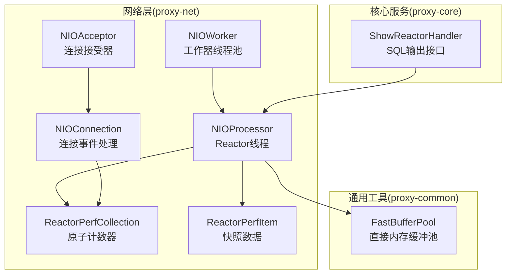
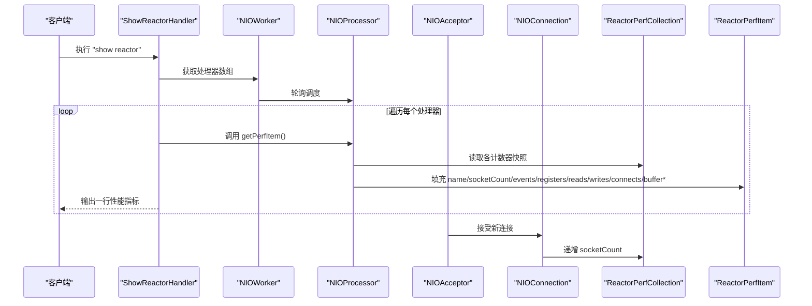
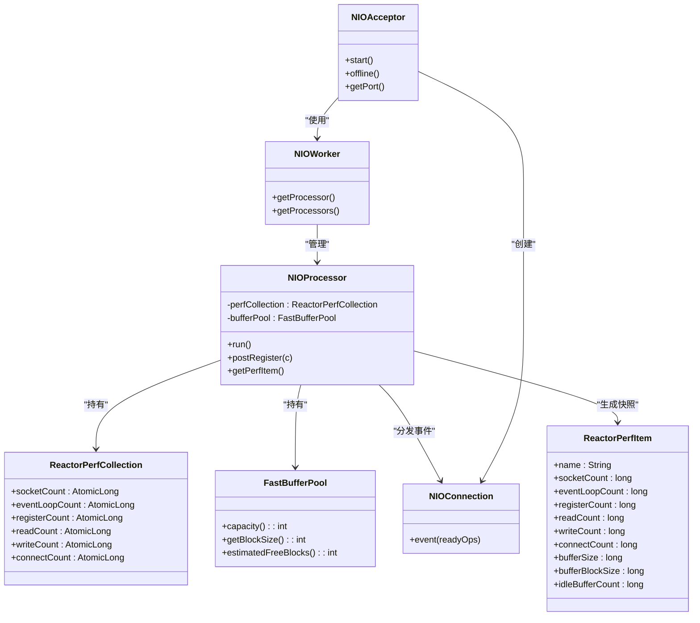

# 性能监控机制

<cite>
**本文引用的文件列表**
- [ReactorPerfCollection.java](file://proxy-net/src/main/java/com/alibaba/polardbx/proxy/perf/ReactorPerfCollection.java)
- [ReactorPerfItem.java](file://proxy-net/src/main/java/com/alibaba/polardbx/proxy/perf/ReactorPerfItem.java)
- [NIOProcessor.java](file://proxy-net/src/main/java/com/alibaba/polardbx/proxy/net/NIOProcessor.java)
- [NIOConnection.java](file://proxy-net/src/main/java/com/alibaba/polardbx/proxy/net/NIOConnection.java)
- [ShowReactorHandler.java](file://proxy-core/src/main/java/com/alibaba/polardbx/proxy/protocol/handler/request/ShowReactorHandler.java)
- [FastBufferPool.java](file://proxy-common/src/main/java/com/alibaba/polardbx/proxy/utils/FastBufferPool.java)
- [NIOProcessorTest.java](file://proxy-net/src/test/java/com/alibaba/polardbx/proxy/net/NIOProcessorTest.java)
- [NIOConnectionTest.java](file://proxy-net/src/test/java/com/alibaba/polardbx/proxy/net/NIOConnectionTest.java)
- [NIOAcceptorTest.java](file://proxy-net/src/test/java/com/alibaba/polardbx/proxy/net/NIOAcceptorTest.java)
- [NIOWorkerTest.java](file://proxy-net/src/test/java/com/alibaba/polardbx/proxy/net/NIOWorkerTest.java)
- [ReactorPerfCollectionTest.java](file://proxy-net/src/test/java/com/alibaba/polardbx/proxy/perf/ReactorPerfCollectionTest.java)
- [ReactorPerfItemTest.java](file://proxy-net/src/test/java/com/alibaba/polardbx/proxy/perf/ReactorPerfItemTest.java)
- [polardbx_proxy_user_manual.md](file://polardbx_proxy_user_manual.md)
</cite>

## 更新摘要
**变更内容**
- 新增全面的性能测试套件覆盖，包括连接生命周期、缓冲区操作、性能指标和多线程场景
- 扩展测试验证范围，涵盖NIOAcceptor、NIOWorker等核心组件
- 增强性能监控机制的可靠性验证，包括原子计数器的并发安全性
- 完善性能指标边界条件和异常处理测试

## 目录
1. [引言](#引言)
2. [项目结构](#项目结构)
3. [核心组件](#核心组件)
4. [架构总览](#架构总览)
5. [组件详解](#组件详解)
6. [全面性能测试套件](#全面性能测试套件)
7. [依赖关系分析](#依赖关系分析)
8. [性能考量与调优建议](#性能考量与调优建议)
9. [故障排查指南](#故障排查指南)
10. [结论](#结论)
11. [附录：性能基准与告警阈值](#附录性能基准与告警阈值)

## 引言
本文件围绕PolarDB-X Proxy的Reactor模式性能监控机制展开，重点解析ReactorPerfCollection的计数采集、ReactorPerfItem的数据结构与统计逻辑，并结合NIOProcessor/NIOConnection在Reactor循环中的事件处理路径，说明网络I/O、事件处理效率与内存缓冲池的监控方式。新增的全面性能测试套件进一步验证了连接生命周期管理、缓冲区操作、性能指标和多线程操作场景的可靠性。同时给出性能基准测试思路、瓶颈识别技巧、调优建议及与监控系统的集成与告警阈值设定方法。

## 项目结构
与Reactor性能监控直接相关的代码分布在以下模块：
- proxy-net：Reactor核心（NIOProcessor、NIOConnection、NIOAcceptor、NIOWorker）与性能采集（ReactorPerfCollection、ReactorPerfItem），以及全面的性能测试套件
- proxy-common：高性能缓冲池FastBufferPool
- proxy-core：对外展示接口ShowReactorHandler，将性能指标以SQL结果形式输出
- 文档：用户手册包含show reactor示例与关键配置项

**图表来源**
- [NIOProcessor.java](file://proxy-net/src/main/java/com/alibaba/polardbx/proxy/net/NIOProcessor.java#L37-L141)
- [NIOConnection.java](file://proxy-net/src/main/java/com/alibaba/polardbx/proxy/net/NIOConnection.java#L822-L842)
- [NIOAcceptorTest.java](file://proxy-net/src/test/java/com/alibaba/polardbx/proxy/net/NIOAcceptorTest.java#L38-L184)
- [NIOWorkerTest.java](file://proxy-net/src/test/java/com/alibaba/polardbx/proxy/net/NIOWorkerTest.java#L25-L117)
- [ReactorPerfCollection.java](file://proxy-net/src/main/java/com/alibaba/polardbx/proxy/perf/ReactorPerfCollection.java#L26-L33)
- [ReactorPerfItem.java](file://proxy-net/src/main/java/com/alibaba/polardbx/proxy/perf/ReactorPerfItem.java#L26-L40)
- [FastBufferPool.java](file://proxy-common/src/main/java/com/alibaba/polardbx/proxy/utils/FastBufferPool.java#L27-L185)
- [ShowReactorHandler.java](file://proxy-core/src/main/java/com/alibaba/polardbx/proxy/protocol/handler/request/ShowReactorHandler.java#L31-L89)

**章节来源**
- [NIOProcessor.java](file://proxy-net/src/main/java/com/alibaba/polardbx/proxy/net/NIOProcessor.java#L37-L141)
- [NIOConnection.java](file://proxy-net/src/main/java/com/alibaba/polardbx/proxy/net/NIOConnection.java#L822-L842)
- [NIOAcceptorTest.java](file://proxy-net/src/test/java/com/alibaba/polardbx/proxy/net/NIOAcceptorTest.java#L38-L184)
- [NIOWorkerTest.java](file://proxy-net/src/test/java/com/alibaba/polardbx/proxy/net/NIOWorkerTest.java#L25-L117)
- [ReactorPerfCollection.java](file://proxy-net/src/main/java/com/alibaba/polardbx/proxy/perf/ReactorPerfCollection.java#L26-L33)
- [ReactorPerfItem.java](file://proxy-net/src/main/java/com/alibaba/polardbx/proxy/perf/ReactorPerfItem.java#L26-L40)
- [FastBufferPool.java](file://proxy-common/src/main/java/com/alibaba/polardbx/proxy/utils/FastBufferPool.java#L27-L185)
- [ShowReactorHandler.java](file://proxy-core/src/main/java/com/alibaba/polardbx/proxy/protocol/handler/request/ShowReactorHandler.java#L31-L89)

## 核心组件
- ReactorPerfCollection：每个NIOProcessor持有的原子计数器集合，用于统计socket、事件循环、注册、读、写、连接等事件次数。
- ReactorPerfItem：从ReactorPerfCollection快照生成的不可变指标对象，附加缓冲池容量、块大小、空闲块数等内存相关指标。
- NIOProcessor：Reactor线程，负责selector轮询、注册队列处理、事件分发，并维护perfCollection与bufferPool。
- NIOConnection：连接事件处理入口，在CONNECT/READ/WRITE事件发生时对相应计数器进行原子递增。
- NIOAcceptor：连接接受器，负责监听端口并接受新的客户端连接，支持多接受器场景。
- NIOWorker：工作器线程池，管理多个NIOProcessor并提供轮询调度算法。
- ShowReactorHandler：对外提供show reactor命令，遍历所有NIOProcessor并输出性能指标行。
- FastBufferPool：直接内存缓冲池，提供块分配/回收与空闲块估算能力。

**章节来源**
- [ReactorPerfCollection.java](file://proxy-net/src/main/java/com/alibaba/polardbx/proxy/perf/ReactorPerfCollection.java#L26-L33)
- [ReactorPerfItem.java](file://proxy-net/src/main/java/com/alibaba/polardbx/proxy/perf/ReactorPerfItem.java#L26-L40)
- [NIOProcessor.java](file://proxy-net/src/main/java/com/alibaba/polardbx/proxy/net/NIOProcessor.java#L37-L141)
- [NIOConnection.java](file://proxy-net/src/main/java/com/alibaba/polardbx/proxy/net/NIOConnection.java#L822-L842)
- [NIOAcceptorTest.java](file://proxy-net/src/test/java/com/alibaba/polardbx/proxy/net/NIOAcceptorTest.java#L38-L184)
- [NIOWorkerTest.java](file://proxy-net/src/test/java/com/alibaba/polardbx/proxy/net/NIOWorkerTest.java#L25-L117)
- [ShowReactorHandler.java](file://proxy-core/src/main/java/com/alibaba/polardbx/proxy/protocol/handler/request/ShowReactorHandler.java#L31-L89)
- [FastBufferPool.java](file://proxy-common/src/main/java/com/alibaba/polardbx/proxy/utils/FastBufferPool.java#L27-L185)

## 架构总览
Reactor模式下的性能监控链路如下：
- NIOProcessor在run()中每轮selector.select后，递增事件循环计数，并遍历selectedKeys，分发给对应NIOConnection.event处理。
- NIOConnection.event根据readyOps分别对connect/read/write计数器进行原子递增。
- 外部通过ShowReactorHandler触发NIOProcessor.getPerfItem()，将当前计数快照与缓冲池状态打包为ReactorPerfItem并输出。
- NIOAcceptor负责接受新连接，NIOWorker提供多处理器的轮询调度。

**图表来源**
- [ShowReactorHandler.java](file://proxy-core/src/main/java/com/alibaba/polardbx/proxy/protocol/handler/request/ShowReactorHandler.java#L67-L89)
- [NIOProcessor.java](file://proxy-net/src/main/java/com/alibaba/polardbx/proxy/net/NIOProcessor.java#L84-L141)
- [NIOConnection.java](file://proxy-net/src/main/java/com/alibaba/polardbx/proxy/net/NIOConnection.java#L822-L842)
- [NIOAcceptorTest.java](file://proxy-net/src/test/java/com/alibaba/polardbx/proxy/net/NIOAcceptorTest.java#L137-L151)
- [NIOWorkerTest.java](file://proxy-net/src/test/java/com/alibaba/polardbx/proxy/net/NIOWorkerTest.java#L44-L61)
- [ReactorPerfCollection.java](file://proxy-net/src/main/java/com/alibaba/polardbx/proxy/perf/ReactorPerfCollection.java#L26-L33)
- [ReactorPerfItem.java](file://proxy-net/src/main/java/com/alibaba/polardbx/proxy/perf/ReactorPerfItem.java#L26-L40)

## 组件详解

### ReactorPerfCollection：计数采集
- 字段含义
  - socketCount：已注册socket数量（由连接建立或注册队列处理时更新）
  - eventLoopCount：事件循环次数（每轮selector.select后递增）
  - registerCount：注册操作次数（注册队列出队并完成register）
  - readCount：读事件次数（OP_READ事件回调）
  - writeCount：写事件次数（OP_WRITE事件回调）
  - connectCount：连接事件次数（OP_CONNECT事件回调）

- 线程安全
  - 使用AtomicLong保证多线程下计数的原子性与可见性。

- 更新时机
  - register：在NIOProcessor.register中对registerCount递增
  - event：在NIOProcessor.run中对eventLoopCount递增
  - NIOConnection.event：根据readyOps对read/write/connect计数递增

**章节来源**
- [ReactorPerfCollection.java](file://proxy-net/src/main/java/com/alibaba/polardbx/proxy/perf/ReactorPerfCollection.java#L26-L33)
- [NIOProcessor.java](file://proxy-net/src/main/java/com/alibaba/polardbx/proxy/net/NIOProcessor.java#L72-L114)
- [NIOConnection.java](file://proxy-net/src/main/java/com/alibaba/polardbx/proxy/net/NIOConnection.java#L822-L842)

### ReactorPerfItem：指标快照与统计
- 字段含义
  - name：处理器名称
  - socketCount/eventLoopCount/registerCount/readCount/writeCount/connectCount：来自ReactorPerfCollection的快照
  - bufferSize：缓冲池总容量（字节）
  - bufferBlockSize：单块大小（字节）
  - idleBufferCount：空闲块估算数量

- 生成流程
  - NIOProcessor.getPerfItem()从perfCollection读取各计数器的快照值，并填充缓冲池相关字段。

- 指标解读
  - 事件循环速率：eventLoopCount可反映Reactor线程的活跃度
  - 注册/读/写/连接频率：registerCount/readCount/writeCount/connectCount可衡量I/O负载
  - 缓冲池健康：bufferSize、bufferBlockSize、idleBufferCount反映内存使用与碎片化风险

**章节来源**
- [ReactorPerfItem.java](file://proxy-net/src/main/java/com/alibaba/polardbx/proxy/perf/ReactorPerfItem.java#L26-L40)
- [NIOProcessor.java](file://proxy-net/src/main/java/com/alibaba/polardbx/proxy/net/NIOProcessor.java#L116-L132)
- [FastBufferPool.java](file://proxy-common/src/main/java/com/alibaba/polardbx/proxy/utils/FastBufferPool.java#L169-L185)

### NIOProcessor：Reactor线程与事件循环
- 关键职责
  - 启动selector轮询，处理注册队列，遍历selectedKeys并分发事件
  - 维护perfCollection与bufferPool
  - 提供getPerfItem()生成指标快照

- 事件循环逻辑
  - 每次select后递增eventLoopCount
  - 遍历keys并调用NIOConnection.event处理readyOps
  - register队列出队并完成注册，同时递增registerCount

- 线程属性
  - 守护线程，名称即处理器名

**章节来源**
- [NIOProcessor.java](file://proxy-net/src/main/java/com/alibaba/polardbx/proxy/net/NIOProcessor.java#L37-L141)

### NIOConnection：事件处理与计数
- 事件处理
  - 在event方法中根据readyOps分别对connectCount、readCount、writeCount进行原子递增
  - 异常时进行日志记录并取消key

- 连接生命周期
  - CONNECT优先处理，随后独立处理READ/WRITE，支持并发同时发生

**章节来源**
- [NIOConnection.java](file://proxy-net/src/main/java/com/alibaba/polardbx/proxy/net/NIOConnection.java#L822-L842)

### NIOAcceptor：连接接受器
- 功能特性
  - 监听指定端口接受新的客户端连接
  - 支持多接受器实例，自动分配不同端口
  - 非守护线程，确保JVM不会因接受器线程而退出

- 线程管理
  - 接受器线程非守护线程，防止JVM提前退出
  - 支持offline操作优雅关闭

**章节来源**
- [NIOAcceptorTest.java](file://proxy-net/src/test/java/com/alibaba/polardbx/proxy/net/NIOAcceptorTest.java#L38-L184)

### NIOWorker：工作器线程池
- 轮询调度
  - 提供round-robin轮询算法选择NIOProcessor
  - 确保处理器索引溢出时正确回绕
  - 单处理器情况下始终返回相同处理器

- 线程管理
  - 创建指定数量的NIOProcessor
  - 所有处理器均为守护线程
  - 处理器启动后立即可用

**章节来源**
- [NIOWorkerTest.java](file://proxy-net/src/test/java/com/alibaba/polardbx/proxy/net/NIOWorkerTest.java#L25-L117)

### ShowReactorHandler：性能指标输出
- 功能
  - 遍历所有NIOProcessor，调用getPerfItem()获取指标快照
  - 将name、sockets、events、registers、reads、writes、connects、buffer、block、total、idle等字段输出为SQL行

- 字段映射
  - 与ReactorPerfItem字段一一对应，其中total为buffer/block的整除结果

**章节来源**
- [ShowReactorHandler.java](file://proxy-core/src/main/java/com/alibaba/polardbx/proxy/protocol/handler/request/ShowReactorHandler.java#L37-L89)

### FastBufferPool：缓冲池与内存监控
- 结构
  - 直接内存ByteBuffer池化，固定块大小与块数量
  - 通过CAS栈管理空闲块，提供estimatedFreeBlocks估算空闲块数量

- 监控字段
  - capacity()返回总容量
  - getBlockSize()返回块大小
  - estimatedFreeBlocks()返回空闲块估算值

**章节来源**
- [FastBufferPool.java](file://proxy-common/src/main/java/com/alibaba/polardbx/proxy/utils/FastBufferPool.java#L27-L185)

## 全面性能测试套件

### NIOConnectionTest：连接生命周期与缓冲区操作
- 连接建立测试
  - 验证阻塞和非阻塞连接建立
  - 测试连接超时处理
  - TCP缓冲区最小值设置验证

- 生命周期管理
  - 连接创建、关闭的幂等性测试
  - 连接空闲时间计算
  - 连接比较和字符串表示

- 缓冲区操作
  - 写入操作的阻塞状态检测
  - 写恢复监听器注册和移除
  - 关闭连接的写入异常处理

**章节来源**
- [NIOConnectionTest.java](file://proxy-net/src/test/java/com/alibaba/polardbx/proxy/net/NIOConnectionTest.java#L41-L531)

### NIOAcceptorTest：接受器功能验证
- 接受器创建和启动
  - 验证接受器实例创建
  - 测试接受器线程启动和非守护属性
  - 端口分配验证

- 多接受器场景
  - 多个接受器实例的端口分配
  - 接受器优雅关闭
  - 工作器和工厂注入验证

**章节来源**
- [NIOAcceptorTest.java](file://proxy-net/src/test/java/com/alibaba/polardbx/proxy/net/NIOAcceptorTest.java#L38-L184)

### NIOProcessorTest：处理器构造与性能收集
- 构造函数测试
  - 默认构造和自定义参数构造
  - 缓冲池大小和块数量验证
  - 线程属性验证

- 性能收集验证
  - 初始计数器值验证
  - getPerfItem()输出验证
  - 缓冲池分配测试

- 多处理器独立性
  - 不同处理器的缓冲池和计数器独立性
  - 默认块大小和数量验证

**章节来源**
- [NIOProcessorTest.java](file://proxy-net/src/test/java/com/alibaba/polardbx/proxy/net/NIOProcessorTest.java#L31-L159)

### NIOWorkerTest：线程管理与轮询算法
- 线程数量控制
  - 小数量和大数量线程的处理
  - 线程数量上限验证

- 轮询算法验证
  - round-robin轮询行为
  - 索引溢出处理
  - 多次调用的稳定性

- 处理器状态
  - 处理器启动状态验证
  - 缓冲池创建验证
  - 字符串表示验证

**章节来源**
- [NIOWorkerTest.java](file://proxy-net/src/test/java/com/alibaba/polardbx/proxy/net/NIOWorkerTest.java#L25-L117)

### ReactorPerfCollectionTest：原子计数器功能
- 初始值测试
  - 所有计数器初始值为0
  - getter返回的AtomicLong非空验证

- 单次和多次递增
  - 单个计数器递增验证
  - 所有计数器同时递增验证

- 独立性测试
  - 修改一个计数器不影响其他计数器
  - getAndIncrement返回旧值语义验证

- 并发安全性
  - 多线程并发递增的正确性
  - 大数值和负数值处理

- 实例独立性
  - 两个实例的计数器独立性
  - AtomicLong引用稳定性

**章节来源**
- [ReactorPerfCollectionTest.java](file://proxy-net/src/test/java/com/alibaba/polardbx/proxy/perf/ReactorPerfCollectionTest.java#L31-L287)

### ReactorPerfItemTest：数据结构与边界条件
- 默认值测试
  - 所有数值字段默认为0
  - String字段默认为null

- setter/getter验证
  - 字段设置和获取的正确性
  - 字段独立性验证

- 边界条件
  - Long.MAX_VALUE和Long.MIN_VALUE处理
  - 负数值处理
  - 特殊字符和Unicode名称处理

- 除零风险
  - bufferBlockSize默认为0的风险提示
  - 除零异常的预期行为

- 实例独立性
  - 两个实例的完全独立性
  - 多次设置的覆盖行为

**章节来源**
- [ReactorPerfItemTest.java](file://proxy-net/src/test/java/com/alibaba/polardbx/proxy/perf/ReactorPerfItemTest.java#L26-L344)

## 依赖关系分析
- NIOProcessor依赖
  - ReactorPerfCollection：计数器集合
  - FastBufferPool：缓冲池
  - NIOConnection：事件回调入口
- NIOAcceptor依赖
  - NIOWorker：处理器分配
  - NIOConnectionFactory：连接创建
- NIOWorker依赖
  - NIOProcessor：线程池管理
- ShowReactorHandler依赖
  - NIOProcessor.getPerfItem()：获取指标快照
  - ReactorPerfItem：封装输出字段

**图表来源**
- [NIOProcessor.java](file://proxy-net/src/main/java/com/alibaba/polardbx/proxy/net/NIOProcessor.java#L37-L141)
- [ReactorPerfCollection.java](file://proxy-net/src/main/java/com/alibaba/polardbx/proxy/perf/ReactorPerfCollection.java#L26-L33)
- [ReactorPerfItem.java](file://proxy-net/src/main/java/com/alibaba/polardbx/proxy/perf/ReactorPerfItem.java#L26-L40)
- [NIOConnection.java](file://proxy-net/src/main/java/com/alibaba/polardbx/proxy/net/NIOConnection.java#L822-L842)
- [NIOAcceptorTest.java](file://proxy-net/src/test/java/com/alibaba/polardbx/proxy/net/NIOAcceptorTest.java#L38-L184)
- [NIOWorkerTest.java](file://proxy-net/src/test/java/com/alibaba/polardbx/proxy/net/NIOWorkerTest.java#L25-L117)
- [FastBufferPool.java](file://proxy-common/src/main/java/com/alibaba/polardbx/proxy/utils/FastBufferPool.java#L27-L185)

## 性能考量与调优建议

### 线程数量配置
- reactor_factor与worker_threads
  - 用户手册显示存在reactor_factor配置项，通常用于控制Reactor线程数量与CPU核数的配比
  - 建议依据CPU核数与网络I/O负载动态调整，避免过多线程导致上下文切换开销

**章节来源**
- [polardbx_proxy_user_manual.md](file://polardbx_proxy_user_manual.md#L505-L505)

### 缓冲区大小与块数量
- 默认块大小与块数量
  - NIOProcessor默认块大小为8KB，块数量为2048
  - 可通过构造函数参数调整，以适配高吞吐或低延迟场景
- 内存占用与空闲评估
  - bufferSize = blockNumber × blockSize
  - idleBufferCount用于评估内存压力，过低可能引发频繁分配/回收

**章节来源**
- [NIOProcessor.java](file://proxy-net/src/main/java/com/alibaba/polardbx/proxy/net/NIOProcessor.java#L38-L59)
- [FastBufferPool.java](file://proxy-common/src/main/java/com/alibaba/polardbx/proxy/utils/FastBufferPool.java#L169-L185)

### 连接池与后端资源
- 后端连接池规模
  - 用户手册提供后端连接池最大值配置项（如backend_rw_max_pooled_size、backend_ro_max_pooled_size），应与前端Reactor线程数匹配
- 重传与超时
  - query_retransmit_timeout/fast/slow_retry_delay等参数影响整体响应时间与Reactor事件积压

**章节来源**
- [polardbx_proxy_user_manual.md](file://polardbx_proxy_user_manual.md#L470-L504)

### 性能基准测试方法
- 基准目标
  - 评估不同线程数、缓冲块大小、连接池规模下的QPS、P99延迟、事件循环频率与缓冲池空闲率
- 测试步骤
  - 使用稳定压测工具（如sysbench/tpcc）持续发起查询
  - 间隔采集show reactor输出，记录sockets、events、reads、writes、connects、idle等指标
  - 观察buffer与idle变化，定位是否出现内存不足或过度分配
- 数据采集
  - 通过ShowReactorHandler定期拉取指标，或在业务侧自定义定时任务调用NIOProcessor.getPerfItem()

**章节来源**
- [ShowReactorHandler.java](file://proxy-core/src/main/java/com/alibaba/polardbx/proxy/protocol/handler/request/ShowReactorHandler.java#L67-L89)
- [NIOProcessorTest.java](file://proxy-net/src/test/java/com/alibaba/polardbx/proxy/net/NIOProcessorTest.java#L76-L119)

### 瓶颈识别技巧
- 高connectCount：可能为连接风暴或后端不可用
- 高readCount/低writeCount：可能为读多写少或后端写阻塞
- 低idleBufferCount：可能为缓冲池过小或突发流量
- 事件循环频率异常：可能为CPU竞争或selector阻塞

**章节来源**
- [NIOConnection.java](file://proxy-net/src/main/java/com/alibaba/polardbx/proxy/net/NIOConnection.java#L822-L842)
- [NIOProcessor.java](file://proxy-net/src/main/java/com/alibaba/polardbx/proxy/net/NIOProcessor.java#L84-L114)

## 故障排查指南
- 计数器异常增长
  - 检查NIOConnection.event异常分支是否频繁触发，确认错误日志
- 事件循环卡顿
  - 查看eventLoopCount增长是否异常，结合CPU使用率判断是否存在阻塞
- 缓冲池耗尽
  - 观察idleBufferCount接近0且频繁分配失败，考虑增大块数量或调整块大小
- 连接泄漏
  - 检查socketCount持续增长且不下降，确认连接正确关闭

**章节来源**
- [NIOConnection.java](file://proxy-net/src/main/java/com/alibaba/polardbx/proxy/net/NIOConnection.java#L822-L842)
- [FastBufferPool.java](file://proxy-common/src/main/java/com/alibaba/polardbx/proxy/utils/FastBufferPool.java#L150-L167)

## 结论
ReactorPerfCollection与ReactorPerfItem构成了PolarDB-X Proxy在Reactor模式下的轻量级性能监控基础：前者以原子计数器记录网络事件与连接状态，后者以快照形式提供统一的指标视图。新增的全面性能测试套件进一步验证了连接生命周期管理、缓冲区操作、性能指标和多线程操作场景的可靠性。结合ShowReactorHandler与FastBufferPool，可以有效观测网络I/O、事件处理效率与内存使用情况，并据此进行线程数、缓冲区与连接池的调优。

## 附录：性能基准与告警阈值

### 性能基准测试流程
- 准备阶段
  - 固定压测参数（并发、请求类型、持续时间）
  - 预热运行，确保JIT与GC稳定
- 采集阶段
  - 每秒采集一次show reactor，记录sockets、events、reads、writes、connects、idle
  - 记录系统CPU、内存、磁盘I/O与网络带宽
- 分析阶段
  - 对比不同配置组合下的指标差异，确定最优参数

**章节来源**
- [ShowReactorHandler.java](file://proxy-core/src/main/java/com/alibaba/polardbx/proxy/protocol/handler/request/ShowReactorHandler.java#L67-L89)
- [NIOProcessorTest.java](file://proxy-net/src/test/java/com/alibaba/polardbx/proxy/net/NIOProcessorTest.java#L76-L119)

### 告警阈值建议
- 事件循环频率骤降：可能表示selector阻塞或线程不足
- idleBufferCount持续低于阈值：可能触发频繁分配，建议扩容
- connectCount/reads/writes异常升高：检查后端可用性与网络质量
- sockets持续增长且不下降：可能存在连接泄漏或未正确关闭
- bufferBlockSize为0：调用方需防御性检查，避免除零异常

**章节来源**
- [FastBufferPool.java](file://proxy-common/src/main/java/com/alibaba/polardbx/proxy/utils/FastBufferPool.java#L150-L167)
- [NIOConnection.java](file://proxy-net/src/main/java/com/alibaba/polardbx/proxy/net/NIOConnection.java#L822-L842)
- [ReactorPerfItemTest.java](file://proxy-net/src/test/java/com/alibaba/polardbx/proxy/perf/ReactorPerfItemTest.java#L256-L276)