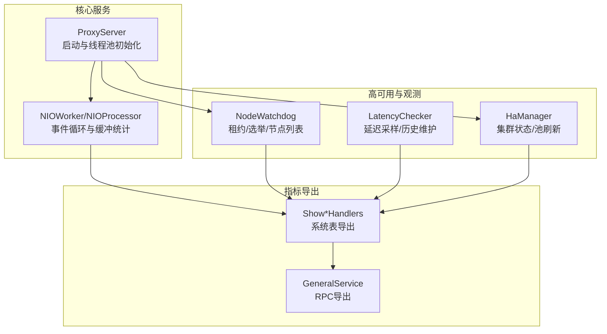
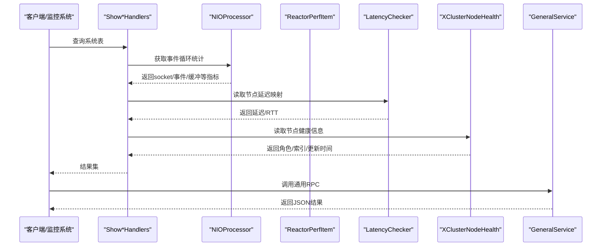
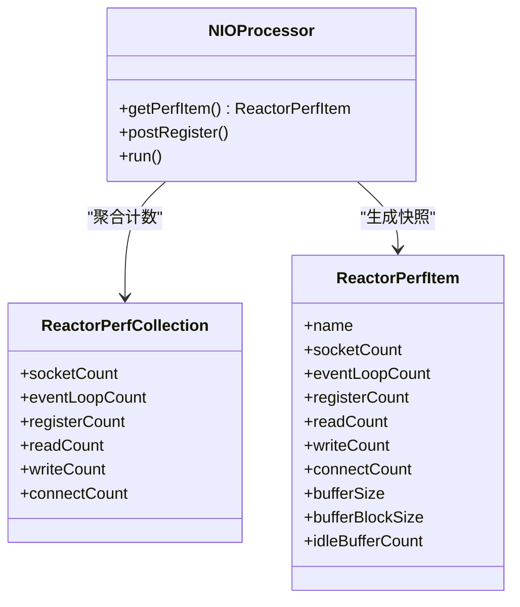
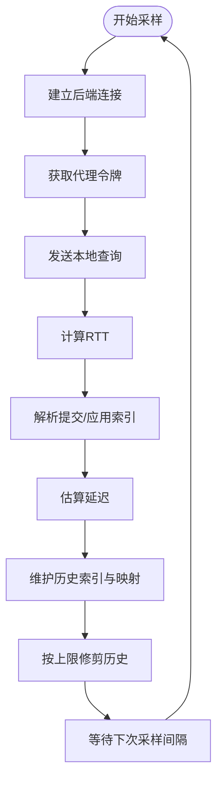
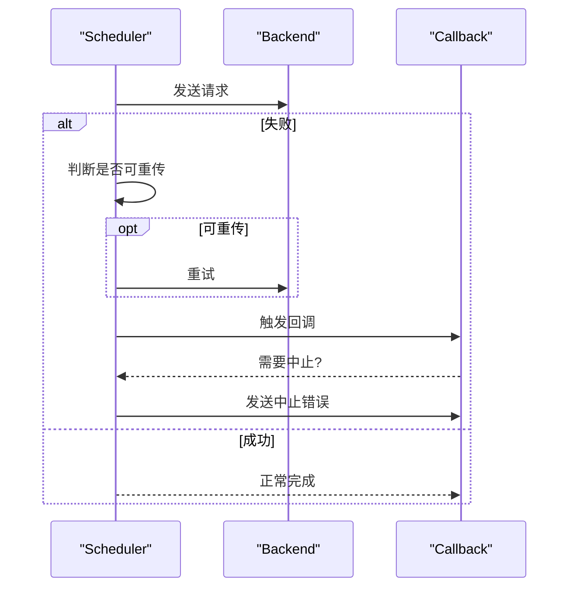
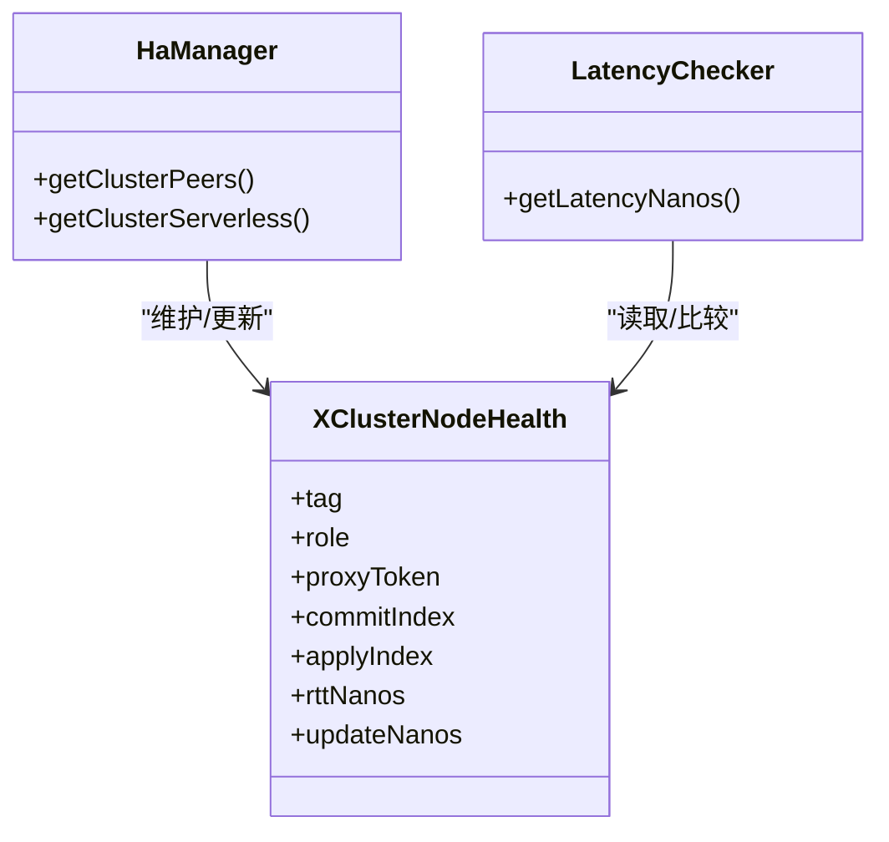
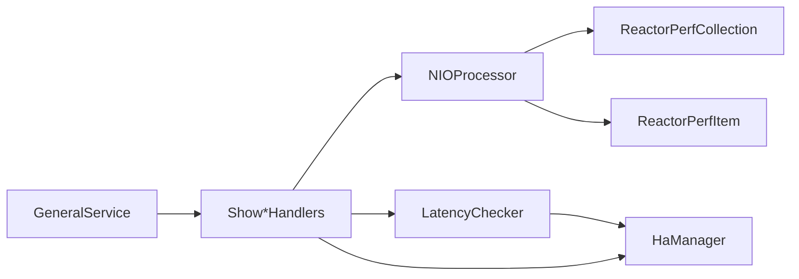

# 指标分析与告警

<cite>
**本文引用的文件**   
- [proxy-core/src/main/java/com/alibaba/polardbx/proxy/ProxyServer.java](file://proxy-core/src/main/java/com/alibaba/polardbx/proxy/ProxyServer.java)
- [proxy-core/src/main/java/com/alibaba/polardbx/proxy/cluster/NodeWatchdog.java](file://proxy-core/src/main/java/com/alibaba/polardbx/proxy/cluster/NodeWatchdog.java)
- [proxy-core/src/main/java/com/alibaba/polardbx/proxy/serverless/LatencyChecker.java](file://proxy-core/src/main/java/com/alibaba/polardbx/proxy/serverless/LatencyChecker.java)
- [proxy-core/src/main/java/com/alibaba/polardbx/proxy/serverless/HaManager.java](file://proxy-core/src/main/java/com/alibaba/polardbx/proxy/serverless/HaManager.java)
- [proxy-core/src/main/java/com/alibaba/polardbx/proxy/protocol/handler/request/ShowReactorHandler.java](file://proxy-core/src/main/java/com/alibaba/polardbx/proxy/protocol/handler/request/ShowReactorHandler.java)
- [proxy-core/src/main/java/com/alibaba/polardbx/proxy/protocol/handler/request/ShowClusterHandler.java](file://proxy-core/src/main/java/com/alibaba/polardbx/proxy/protocol/handler/request/ShowClusterHandler.java)
- [proxy-core/src/main/java/com/alibaba/polardbx/proxy/protocol/handler/request/ShowRoHandler.java](file://proxy-core/src/main/java/com/alibaba/polardbx/proxy/protocol/handler/request/ShowRoHandler.java)
- [proxy-core/src/main/java/com/alibaba/polardbx/proxy/protocol/handler/request/ShowRwHandler.java](file://proxy-core/src/main/java/com/alibaba/polardbx/proxy/protocol/handler/request/ShowRwHandler.java)
- [proxy-core/src/main/java/com/alibaba/polardbx/proxy/protocol/handler/request/ShowPropertiesHandler.java](file://proxy-core/src/main/java/com/alibaba/polardbx/proxy/protocol/handler/request/ShowPropertiesHandler.java)
- [proxy-core/src/main/java/com/alibaba/polardbx/proxy/scheduler/Scheduler.java](file://proxy-core/src/main/java/com/alibaba/polardbx/proxy/scheduler/Scheduler.java)
- [proxy-core/src/main/java/com/alibaba/polardbx/proxy/callback/ResultCallbackBase.java](file://proxy-core/src/main/java/com/alibaba/polardbx/proxy/callback/ResultCallbackBase.java)
- [proxy-core/src/main/java/com/alibaba/polardbx/proxy/callback/AbortReporter.java](file://proxy-core/src/main/java/com/alibaba/polardbx/proxy/callback/AbortReporter.java)
- [proxy-core/src/main/java/com/alibaba/polardbx/proxy/callback/SimpleResultCallback.java](file://proxy-core/src/main/java/com/alibaba/polardbx/proxy/callback/SimpleResultCallback.java)
- [proxy-net/src/main/java/com/alibaba/polardbx/proxy/net/NIOProcessor.java](file://proxy-net/src/main/java/com/alibaba/polardbx/proxy/net/NIOProcessor.java)
- [proxy-net/src/main/java/com/alibaba/polardbx/proxy/perf/ReactorPerfCollection.java](file://proxy-net/src/main/java/com/alibaba/polardbx/proxy/perf/ReactorPerfCollection.java)
- [proxy-net/src/main/java/com/alibaba/polardbx/proxy/perf/ReactorPerfItem.java](file://proxy-net/src/main/java/com/alibaba/polardbx/proxy/perf/ReactorPerfItem.java)
- [proxy-common/src/main/java/com/alibaba/polardbx/proxy/common/XClusterNodeHealth.java](file://proxy-common/src/main/java/com/alibaba/polardbx/proxy/common/XClusterNodeHealth.java)
- [proxy-common/src/main/resources/config.properties](file://proxy-common/src/main/resources/config.properties)
- [proxy-rpc/src/main/java/com/alibaba/polardbx/proxy/GeneralService.java](file://proxy-rpc/src/main/java/com/alibaba/polardbx/proxy/GeneralService.java)
- [polardbx_proxy_user_manual.md](file://polardbx_proxy_user_manual.md)
</cite>

## 目录
1. [简介](#简介)
2. [项目结构](#项目结构)
3. [核心组件](#核心组件)
4. [架构总览](#架构总览)
5. [详细组件分析](#详细组件分析)
6. [依赖关系分析](#依赖关系分析)
7. [性能考量](#性能考量)
8. [故障排查指南](#故障排查指南)
9. [结论](#结论)
10. [附录](#附录)

## 简介
本文件面向PolarDB-X Proxy的运维与开发人员，系统化梳理代理层的关键性能指标（KPI）定义与计算方法，覆盖连接数、查询延迟、吞吐量、错误率与资源利用率；明确指标采集频率、存储策略与历史数据管理方式；给出告警规则配置思路（阈值、级别与通知）；并提供Prometheus/Grafana集成与自定义报表生成指引，以及基于指标的故障诊断流程、可视化与趋势分析技巧、指标调优与容量规划建议。

## 项目结构
- 核心服务启动与网络线程模型位于proxy-core与proxy-net模块，负责前端接入、后端连接池与事件循环统计。
- 高可用与延迟观测由proxy-core中的serverless与cluster模块实现，提供集群节点健康、RTT与延迟历史记录。
- 指标导出通过系统表命令与RPC服务暴露，便于外部监控系统抓取。
- 配置项集中于proxy-common的配置文件与运行时属性，支持动态调整监控相关参数。

**图示来源**
- [proxy-core/src/main/java/com/alibaba/polardbx/proxy/ProxyServer.java](file://proxy-core/src/main/java/com/alibaba/polardbx/proxy/ProxyServer.java#L55-L96)
- [proxy-net/src/main/java/com/alibaba/polardbx/proxy/net/NIOProcessor.java](file://proxy-net/src/main/java/com/alibaba/polardbx/proxy/net/NIOProcessor.java#L44-L50)
- [proxy-core/src/main/java/com/alibaba/polardbx/proxy/cluster/NodeWatchdog.java](file://proxy-core/src/main/java/com/alibaba/polardbx/proxy/cluster/NodeWatchdog.java#L110-L117)
- [proxy-core/src/main/java/com/alibaba/polardbx/proxy/serverless/LatencyChecker.java](file://proxy-core/src/main/java/com/alibaba/polardbx/proxy/serverless/LatencyChecker.java#L63-L73)
- [proxy-core/src/main/java/com/alibaba/polardbx/proxy/serverless/HaManager.java](file://proxy-core/src/main/java/com/alibaba/polardbx/proxy/serverless/HaManager.java#L403-L423)
- [proxy-core/src/main/java/com/alibaba/polardbx/proxy/protocol/handler/request/ShowReactorHandler.java](file://proxy-core/src/main/java/com/alibaba/polardbx/proxy/protocol/handler/request/ShowReactorHandler.java#L68-L88)
- [proxy-rpc/src/main/java/com/alibaba/polardbx/proxy/GeneralService.java](file://proxy-rpc/src/main/java/com/alibaba/polardbx/proxy/GeneralService.java#L67-L72)

**章节来源**
- [proxy-core/src/main/java/com/alibaba/polardbx/proxy/ProxyServer.java](file://proxy-core/src/main/java/com/alibaba/polardbx/proxy/ProxyServer.java#L55-L96)
- [proxy-common/src/main/resources/config.properties](file://proxy-common/src/main/resources/config.properties#L18-L29)

## 核心组件
- 事件循环与缓冲统计：NIOProcessor聚合socket、事件循环、注册、读写、连接计数与缓冲区状态，用于衡量网络线程负载与内存使用。
- 延迟观测：LatencyChecker周期性对后端节点执行轻量查询，计算RTT与延迟，维护历史索引与映射，并按配置限制历史长度。
- 集群健康：XClusterNodeHealth封装节点角色、代理令牌、提交/应用索引、RTT与更新时间，驱动读写分离与只读池选择。
- 系统表导出：ShowReactorHandler、ShowClusterHandler、ShowRoHandler、ShowRwHandler、ShowPropertiesHandler将内部指标以系统表形式输出，供外部监控抓取。
- RPC导出：GeneralService提供统一RPC入口，便于远程拉取指标或触发运维操作。
- 启动与线程池：ProxyServer根据配置初始化工作线程、HA线程池与监听器，决定整体并发能力与监控开销。

**章节来源**
- [proxy-net/src/main/java/com/alibaba/polardbx/proxy/net/NIOProcessor.java](file://proxy-net/src/main/java/com/alibaba/polardbx/proxy/net/NIOProcessor.java#L44-L50)
- [proxy-net/src/main/java/com/alibaba/polardbx/proxy/perf/ReactorPerfCollection.java](file://proxy-net/src/main/java/com/alibaba/polardbx/proxy/perf/ReactorPerfCollection.java#L25-L33)
- [proxy-core/src/main/java/com/alibaba/polardbx/proxy/serverless/LatencyChecker.java](file://proxy-core/src/main/java/com/alibaba/polardbx/proxy/serverless/LatencyChecker.java#L63-L73)
- [proxy-common/src/main/java/com/alibaba/polardbx/proxy/common/XClusterNodeHealth.java](file://proxy-common/src/main/java/com/alibaba/polardbx/proxy/common/XClusterNodeHealth.java#L24-L42)
- [proxy-core/src/main/java/com/alibaba/polardbx/proxy/protocol/handler/request/ShowReactorHandler.java](file://proxy-core/src/main/java/com/alibaba/polardbx/proxy/protocol/handler/request/ShowReactorHandler.java#L68-L88)
- [proxy-rpc/src/main/java/com/alibaba/polardbx/proxy/GeneralService.java](file://proxy-rpc/src/main/java/com/alibaba/polardbx/proxy/GeneralService.java#L67-L72)
- [proxy-core/src/main/java/com/alibaba/polardbx/proxy/ProxyServer.java](file://proxy-core/src/main/java/com/alibaba/polardbx/proxy/ProxyServer.java#L65-L84)

## 架构总览
下图展示了从事件循环到系统表导出的整体链路，以及延迟观测与高可用模块如何参与指标生成与健康判断。

**图示来源**
- [proxy-core/src/main/java/com/alibaba/polardbx/proxy/protocol/handler/request/ShowReactorHandler.java](file://proxy-core/src/main/java/com/alibaba/polardbx/proxy/protocol/handler/request/ShowReactorHandler.java#L68-L88)
- [proxy-net/src/main/java/com/alibaba/polardbx/proxy/net/NIOProcessor.java](file://proxy-net/src/main/java/com/alibaba/polardbx/proxy/net/NIOProcessor.java#L116-L132)
- [proxy-core/src/main/java/com/alibaba/polardbx/proxy/serverless/LatencyChecker.java](file://proxy-core/src/main/java/com/alibaba/polardbx/proxy/serverless/LatencyChecker.java#L75-L77)
- [proxy-common/src/main/java/com/alibaba/polardbx/proxy/common/XClusterNodeHealth.java](file://proxy-common/src/main/java/com/alibaba/polardbx/proxy/common/XClusterNodeHealth.java#L24-L42)
- [proxy-rpc/src/main/java/com/alibaba/polardbx/proxy/GeneralService.java](file://proxy-rpc/src/main/java/com/alibaba/polardbx/proxy/GeneralService.java#L44-L65)

## 详细组件分析

### 连接数与资源利用率指标
- 定义与来源
  - 前端连接数：来自事件循环统计中的socket计数。
  - 事件循环次数：每轮select计数，反映事件循环活跃度。
  - 注册/读/写/连接计数：分别统计注册、读、写、连接事件发生次数。
  - 缓冲区：总容量、块大小、空闲块数量，用于评估内存压力。
- 计算与口径
  - 连接数：直接取socket计数。
  - 资源利用率：可按“空闲缓冲块/总块数”衡量内存占用；事件循环次数/时间窗口得到平均事件处理强度。
- 采集频率与存储
  - 采集：系统表查询即刻获取当前快照；也可通过定时任务定期抓取。
  - 存储：建议结合Prometheus时序数据库，保留短期高频样本与长期低频样本。
- 历史数据管理
  - 可在采集侧进行滑动窗口聚合，避免无限增长；或在存储侧设置保留策略。

**图示来源**
- [proxy-net/src/main/java/com/alibaba/polardbx/proxy/net/NIOProcessor.java](file://proxy-net/src/main/java/com/alibaba/polardbx/proxy/net/NIOProcessor.java#L44-L50)
- [proxy-net/src/main/java/com/alibaba/polardbx/proxy/net/NIOProcessor.java](file://proxy-net/src/main/java/com/alibaba/polardbx/proxy/net/NIOProcessor.java#L116-L132)
- [proxy-net/src/main/java/com/alibaba/polardbx/proxy/perf/ReactorPerfCollection.java](file://proxy-net/src/main/java/com/alibaba/polardbx/proxy/perf/ReactorPerfCollection.java#L25-L33)
- [proxy-net/src/main/java/com/alibaba/polardbx/proxy/perf/ReactorPerfItem.java](file://proxy-net/src/main/java/com/alibaba/polardbx/proxy/perf/ReactorPerfItem.java#L24-L40)

**章节来源**
- [proxy-net/src/main/java/com/alibaba/polardbx/proxy/net/NIOProcessor.java](file://proxy-net/src/main/java/com/alibaba/polardbx/proxy/net/NIOProcessor.java#L116-L132)
- [proxy-core/src/main/java/com/alibaba/polardbx/proxy/protocol/handler/request/ShowReactorHandler.java](file://proxy-core/src/main/java/com/alibaba/polardbx/proxy/protocol/handler/request/ShowReactorHandler.java#L68-L88)

### 查询延迟与吞吐量指标
- 延迟
  - RTT：通过LatencyChecker对后端节点执行轻量查询，计算往返时间。
  - 延迟（应用索引差）：基于提交/应用索引估算，结合历史索引表维护上限。
- 吞吐量
  - 可基于事件循环读/写计数变化率近似衡量网络吞吐；或通过系统表导出的连接运行/空闲计数评估连接池吞吐。
- 采集与存储
  - 延迟采样周期由配置项控制；历史记录数量受上限限制，超出则淘汰最早条目。
- 告警建议
  - RTT超阈值、延迟突增、连接池运行数持续高位可触发不同级别告警。

**图示来源**
- [proxy-core/src/main/java/com/alibaba/polardbx/proxy/serverless/LatencyChecker.java](file://proxy-core/src/main/java/com/alibaba/polardbx/proxy/serverless/LatencyChecker.java#L137-L181)
- [proxy-core/src/main/java/com/alibaba/polardbx/proxy/serverless/LatencyChecker.java](file://proxy-core/src/main/java/com/alibaba/polardbx/proxy/serverless/LatencyChecker.java#L128-L135)
- [proxy-core/src/main/java/com/alibaba/polardbx/proxy/serverless/LatencyChecker.java](file://proxy-core/src/main/java/com/alibaba/polardbx/proxy/serverless/LatencyChecker.java#L267-L275)

**章节来源**
- [proxy-core/src/main/java/com/alibaba/polardbx/proxy/serverless/LatencyChecker.java](file://proxy-core/src/main/java/com/alibaba/polardbx/proxy/serverless/LatencyChecker.java#L63-L73)
- [proxy-core/src/main/java/com/alibaba/polardbx/proxy/serverless/LatencyChecker.java](file://proxy-core/src/main/java/com/alibaba/polardbx/proxy/serverless/LatencyChecker.java#L128-L135)
- [proxy-core/src/main/java/com/alibaba/polardbx/proxy/serverless/LatencyChecker.java](file://proxy-core/src/main/java/com/alibaba/polardbx/proxy/serverless/LatencyChecker.java#L137-L181)
- [proxy-core/src/main/java/com/alibaba/polardbx/proxy/serverless/LatencyChecker.java](file://proxy-core/src/main/java/com/alibaba/polardbx/proxy/serverless/LatencyChecker.java#L267-L275)
- [proxy-common/src/main/java/com/alibaba/polardbx/proxy/common/XClusterNodeHealth.java](file://proxy-common/src/main/java/com/alibaba/polardbx/proxy/common/XClusterNodeHealth.java#L24-L42)

### 错误率与重传/中止
- 错误率
  - 可通过结果处理器的状态转换统计错误包比例；或基于AbortReporter触发的错误上报进行汇总。
- 重传与中止
  - 在转发失败时，调度器可进行有限次重试；若不可重试则发送中止错误给前端。
- 告警建议
  - 错误率突增、重传次数异常上升、中止错误频繁出现应触发告警。

**图示来源**
- [proxy-core/src/main/java/com/alibaba/polardbx/proxy/scheduler/Scheduler.java](file://proxy-core/src/main/java/com/alibaba/polardbx/proxy/scheduler/Scheduler.java#L234-L266)
- [proxy-core/src/main/java/com/alibaba/polardbx/proxy/callback/ResultCallbackBase.java](file://proxy-core/src/main/java/com/alibaba/polardbx/proxy/callback/ResultCallbackBase.java#L146-L153)
- [proxy-core/src/main/java/com/alibaba/polardbx/proxy/callback/AbortReporter.java](file://proxy-core/src/main/java/com/alibaba/polardbx/proxy/callback/AbortReporter.java#L31-L46)
- [proxy-core/src/main/java/com/alibaba/polardbx/proxy/callback/SimpleResultCallback.java](file://proxy-core/src/main/java/com/alibaba/polardbx/proxy/callback/SimpleResultCallback.java#L48-L54)

**章节来源**
- [proxy-core/src/main/java/com/alibaba/polardbx/proxy/scheduler/Scheduler.java](file://proxy-core/src/main/java/com/alibaba/polardbx/proxy/scheduler/Scheduler.java#L234-L266)
- [proxy-core/src/main/java/com/alibaba/polardbx/proxy/callback/ResultCallbackBase.java](file://proxy-core/src/main/java/com/alibaba/polardbx/proxy/callback/ResultCallbackBase.java#L146-L153)
- [proxy-core/src/main/java/com/alibaba/polardbx/proxy/callback/AbortReporter.java](file://proxy-core/src/main/java/com/alibaba/polardbx/proxy/callback/AbortReporter.java#L31-L46)
- [proxy-core/src/main/java/com/alibaba/polardbx/proxy/callback/SimpleResultCallback.java](file://proxy-core/src/main/java/com/alibaba/polardbx/proxy/callback/SimpleResultCallback.java#L48-L54)

### 集群健康与读写分离指标
- 指标
  - 集群节点列表、角色（Leader/Follower/Candidate/Learner）、代理令牌、提交/应用索引、RTT、延迟、更新时间。
  - 读写池运行/空闲连接数、权重、最大池大小。
- 导出
  - 通过ShowClusterHandler、ShowRoHandler、ShowRwHandler输出系统表行，供监控抓取。
- 告警建议
  - Leader缺失、Follower延迟持续偏高、只读池空闲过少等。

**图示来源**
- [proxy-common/src/main/java/com/alibaba/polardbx/proxy/common/XClusterNodeHealth.java](file://proxy-common/src/main/java/com/alibaba/polardbx/proxy/common/XClusterNodeHealth.java#L24-L42)
- [proxy-core/src/main/java/com/alibaba/polardbx/proxy/serverless/HaManager.java](file://proxy-core/src/main/java/com/alibaba/polardbx/proxy/serverless/HaManager.java#L403-L423)
- [proxy-core/src/main/java/com/alibaba/polardbx/proxy/serverless/LatencyChecker.java](file://proxy-core/src/main/java/com/alibaba/polardbx/proxy/serverless/LatencyChecker.java#L75-L77)

**章节来源**
- [proxy-core/src/main/java/com/alibaba/polardbx/proxy/protocol/handler/request/ShowClusterHandler.java](file://proxy-core/src/main/java/com/alibaba/polardbx/proxy/protocol/handler/request/ShowClusterHandler.java#L68-L86)
- [proxy-core/src/main/java/com/alibaba/polardbx/proxy/protocol/handler/request/ShowRoHandler.java](file://proxy-core/src/main/java/com/alibaba/polardbx/proxy/protocol/handler/request/ShowRoHandler.java#L80-L95)
- [proxy-core/src/main/java/com/alibaba/polardbx/proxy/protocol/handler/request/ShowRwHandler.java](file://proxy-core/src/main/java/com/alibaba/polardbx/proxy/protocol/handler/request/ShowRwHandler.java#L37-L61)
- [proxy-core/src/main/java/com/alibaba/polardbx/proxy/serverless/HaManager.java](file://proxy-core/src/main/java/com/alibaba/polardbx/proxy/serverless/HaManager.java#L403-L423)

### 配置与采集频率
- 关键配置项（节选）
  - 延迟采样间隔、延迟记录数量、延迟采样超时、节点租约、更新租约超时、后台HA检查间隔/线程数、前端端口、CPU核数、反应堆因子等。
- 采集频率
  - 延迟采样按配置间隔执行；系统表查询为即时快照；可通过定时任务定期抓取以形成时序数据。
- 历史数据管理
  - 延迟历史记录按上限修剪；连接池运行/空闲计数作为瞬时指标，适合短周期采样。

**章节来源**
- [polardbx_proxy_user_manual.md](file://polardbx_proxy_user_manual.md#L449-L509)
- [proxy-common/src/main/resources/config.properties](file://proxy-common/src/main/resources/config.properties#L18-L29)
- [proxy-core/src/main/java/com/alibaba/polardbx/proxy/serverless/LatencyChecker.java](file://proxy-core/src/main/java/com/alibaba/polardbx/proxy/serverless/LatencyChecker.java#L267-L275)
- [proxy-core/src/main/java/com/alibaba/polardbx/proxy/cluster/NodeWatchdog.java](file://proxy-core/src/main/java/com/alibaba/polardbx/proxy/cluster/NodeWatchdog.java#L176-L181)

## 依赖关系分析
- 组件耦合
  - NIOProcessor与ReactorPerfCollection强内聚，提供稳定的事件循环指标。
  - LatencyChecker依赖HaManager与后端连接，输出延迟与健康信息。
  - Show*Handlers依赖ProxyServer与NIOProcessor获取实时指标。
- 外部依赖
  - Prometheus/Grafana通过系统表或RPC接口抓取指标；日志丢弃统计可用于评估系统压力。

**图示来源**
- [proxy-net/src/main/java/com/alibaba/polardbx/proxy/net/NIOProcessor.java](file://proxy-net/src/main/java/com/alibaba/polardbx/proxy/net/NIOProcessor.java#L44-L50)
- [proxy-net/src/main/java/com/alibaba/polardbx/proxy/perf/ReactorPerfCollection.java](file://proxy-net/src/main/java/com/alibaba/polardbx/proxy/perf/ReactorPerfCollection.java#L25-L33)
- [proxy-core/src/main/java/com/alibaba/polardbx/proxy/serverless/LatencyChecker.java](file://proxy-core/src/main/java/com/alibaba/polardbx/proxy/serverless/LatencyChecker.java#L63-L73)
- [proxy-core/src/main/java/com/alibaba/polardbx/proxy/serverless/HaManager.java](file://proxy-core/src/main/java/com/alibaba/polardbx/proxy/serverless/HaManager.java#L403-L423)
- [proxy-core/src/main/java/com/alibaba/polardbx/proxy/protocol/handler/request/ShowReactorHandler.java](file://proxy-core/src/main/java/com/alibaba/polardbx/proxy/protocol/handler/request/ShowReactorHandler.java#L68-L88)
- [proxy-rpc/src/main/java/com/alibaba/polardbx/proxy/GeneralService.java](file://proxy-rpc/src/main/java/com/alibaba/polardbx/proxy/GeneralService.java#L67-L72)

**章节来源**
- [proxy-core/src/main/java/com/alibaba/polardbx/proxy/ProxyServer.java](file://proxy-core/src/main/java/com/alibaba/polardbx/proxy/ProxyServer.java#L65-L84)

## 性能考量
- 事件循环与缓冲
  - 事件循环次数过高可能意味着大量就绪事件或阻塞操作；缓冲区空闲块过少提示内存压力。
- 延迟采样
  - 采样间隔过短会增加后端压力；历史记录上限过小可能导致波动被过度平滑。
- 连接池
  - 运行/空闲连接数与最大池大小的比例可作为容量预警依据。

[本节为通用指导，无需特定文件引用]

## 故障排查指南
- 快速定位步骤
  - 检查ShowReactorHandler输出的socket/事件/缓冲指标，确认是否存在事件风暴或内存紧张。
  - 查看ShowClusterHandler/ShowRoHandler/ShowRwHandler输出，确认Leader存在且Follower延迟正常。
  - 若出现错误率升高，结合Scheduler与AbortReporter的错误路径定位是连接丢失还是后端异常。
- 典型场景
  - 延迟持续升高：检查LatencyChecker采样间隔与历史上限，确认后端节点是否存在慢查询或网络抖动。
  - 连接池耗尽：查看运行连接数接近最大池大小，考虑扩容或优化SQL/连接复用。
  - 领导者变更频繁：检查NodeWatchdog的租约与超时配置，确保后端一致性服务稳定。

**章节来源**
- [proxy-core/src/main/java/com/alibaba/polardbx/proxy/protocol/handler/request/ShowReactorHandler.java](file://proxy-core/src/main/java/com/alibaba/polardbx/proxy/protocol/handler/request/ShowReactorHandler.java#L68-L88)
- [proxy-core/src/main/java/com/alibaba/polardbx/proxy/protocol/handler/request/ShowClusterHandler.java](file://proxy-core/src/main/java/com/alibaba/polardbx/proxy/protocol/handler/request/ShowClusterHandler.java#L68-L86)
- [proxy-core/src/main/java/com/alibaba/polardbx/proxy/protocol/handler/request/ShowRoHandler.java](file://proxy-core/src/main/java/com/alibaba/polardbx/proxy/protocol/handler/request/ShowRoHandler.java#L80-L95)
- [proxy-core/src/main/java/com/alibaba/polardbx/proxy/protocol/handler/request/ShowRwHandler.java](file://proxy-core/src/main/java/com/alibaba/polardbx/proxy/protocol/handler/request/ShowRwHandler.java#L37-L61)
- [proxy-core/src/main/java/com/alibaba/polardbx/proxy/scheduler/Scheduler.java](file://proxy-core/src/main/java/com/alibaba/polardbx/proxy/scheduler/Scheduler.java#L234-L266)
- [proxy-core/src/main/java/com/alibaba/polardbx/proxy/callback/AbortReporter.java](file://proxy-core/src/main/java/com/alibaba/polardbx/proxy/callback/AbortReporter.java#L31-L46)

## 结论
PolarDB-X Proxy通过事件循环统计、延迟采样与集群健康信息，提供了连接数、资源利用率、查询延迟与吞吐量、错误率等关键指标的基础支撑。结合系统表与RPC导出，可无缝对接Prometheus/Grafana实现可视化与告警。建议以“短周期高频采样+长周期聚合”的策略管理历史数据，并针对延迟、连接池与领导者稳定性设置差异化阈值与通知策略。

[本节为总结，无需特定文件引用]

## 附录

### 指标定义与计算方法清单
- 连接数
  - 来源：事件循环socket计数
  - 计算：直接取值
- 事件循环活跃度
  - 来源：事件循环计数
  - 计算：单位时间增量
- 网络I/O
  - 来源：读/写计数
  - 计算：单位时间增量
- 缓冲区利用率
  - 来源：空闲块/总块数
  - 计算：比率
- RTT
  - 来源：延迟采样
  - 计算：往返时间
- 延迟（应用索引差）
  - 来源：提交/应用索引
  - 计算：基于历史索引估算
- 错误率
  - 来源：错误包/总请求数
  - 计算：比例

**章节来源**
- [proxy-net/src/main/java/com/alibaba/polardbx/proxy/net/NIOProcessor.java](file://proxy-net/src/main/java/com/alibaba/polardbx/proxy/net/NIOProcessor.java#L116-L132)
- [proxy-core/src/main/java/com/alibaba/polardbx/proxy/serverless/LatencyChecker.java](file://proxy-core/src/main/java/com/alibaba/polardbx/proxy/serverless/LatencyChecker.java#L137-L181)
- [proxy-common/src/main/java/com/alibaba/polardbx/proxy/common/XClusterNodeHealth.java](file://proxy-common/src/main/java/com/alibaba/polardbx/proxy/common/XClusterNodeHealth.java#L24-L42)

### 采集频率与存储策略
- 采集频率
  - 延迟采样：按配置间隔执行
  - 系统表查询：即时快照
  - 定时抓取：建议分钟级或更高粒度
- 存储策略
  - 短期：高频样本，保留较短周期
  - 长期：低频聚合样本，保留更久
- 历史管理
  - 延迟历史按上限修剪
  - 连接池计数作为瞬时指标，适合短周期采样

**章节来源**
- [proxy-core/src/main/java/com/alibaba/polardbx/proxy/serverless/LatencyChecker.java](file://proxy-core/src/main/java/com/alibaba/polardbx/proxy/serverless/LatencyChecker.java#L128-L135)
- [proxy-core/src/main/java/com/alibaba/polardbx/proxy/serverless/LatencyChecker.java](file://proxy-core/src/main/java/com/alibaba/polardbx/proxy/serverless/LatencyChecker.java#L267-L275)

### 告警规则配置建议
- 阈值设置
  - RTT：基于SLA设定分位阈值
  - 延迟：应用索引差超过安全阈值
  - 连接池：运行/空闲比接近上限/下限
  - 错误率：突发性升高触发
- 告警级别
  - 轻微：瞬时波动
  - 中等：持续偏高/偏小
  - 严重：Leader缺失/连接池耗尽
- 通知机制
  - 分级通知至IM/邮件；支持静默窗口与抑制策略

[本节为通用指导，无需特定文件引用]

### 指标分析工具使用指南
- Prometheus集成
  - 通过系统表或RPC接口抓取指标；配置抓取任务与目标标签
- Grafana仪表板
  - 使用连接数、事件循环、RTT、延迟、错误率等面板构建仪表板
- 自定义报表
  - 基于时序数据生成趋势报告与容量预测

[本节为通用指导，无需特定文件引用]

### 可视化与趋势分析技巧
- 联动面板：将连接数与缓冲区利用率联动，识别内存压力
- 分位分析：对RTT与延迟采用分位数展示，规避极端值影响
- 趋势外推：基于近期斜率判断容量风险

[本节为通用指导，无需特定文件引用]

### 指标调优与容量规划
- 调优方向
  - 降低事件风暴：优化I/O模式与批处理
  - 控制延迟：缩短采样间隔、优化后端查询
  - 扩容连接池：提升最大池大小并监控运行/空闲比
- 容量规划
  - 基于峰值连接数与RTT分布确定CPU/内存/网络容量

[本节为通用指导，无需特定文件引用]