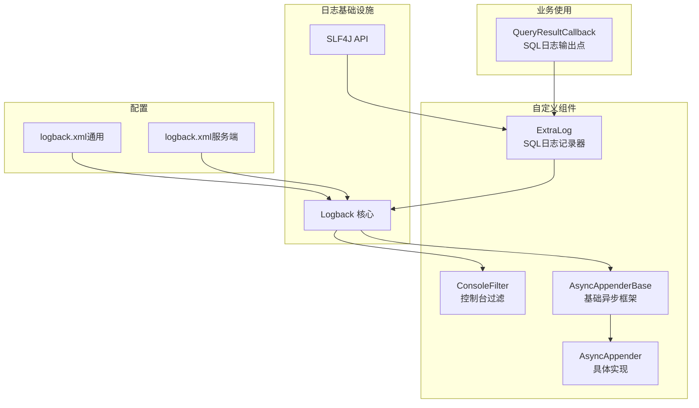
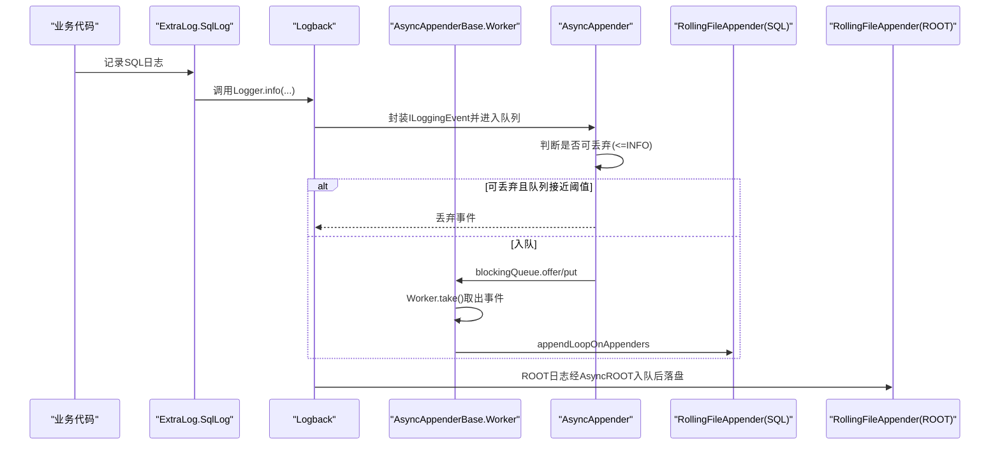
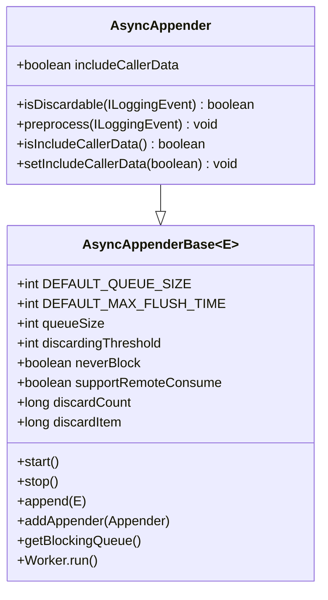
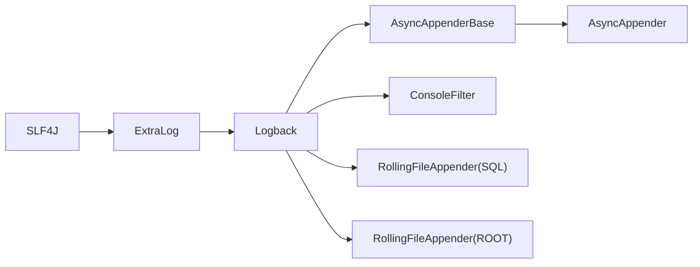

# 日志系统设计

<cite>
**本文引用的文件列表**
- [ExtraLog.java](file://proxy-common/src/main/java/com/alibaba/polardbx/proxy/logger/ExtraLog.java)
- [AsyncAppender.java](file://proxy-common/src/main/java/com/alibaba/polardbx/proxy/logger/AsyncAppender.java)
- [AsyncAppenderBase.java](file://proxy-common/src/main/java/com/alibaba/polardbx/proxy/logger/AsyncAppenderBase.java)
- [ConsoleFilter.java](file://proxy-common/src/main/java/com/alibaba/polardbx/proxy/logger/ConsoleFilter.java)
- [logback.xml（通用）](file://proxy-common/src/main/resources/logback.xml)
- [logback.xml（服务端）](file://proxy-server/src/main/conf/logback.xml)
- [QueryResultCallback.java](file://proxy-core/src/main/java/com/alibaba/polardbx/proxy/callback/QueryResultCallback.java)
</cite>

## 目录
1. [简介](#简介)
2. [项目结构与日志模块定位](#项目结构与日志模块定位)
3. [核心组件](#核心组件)
4. [架构总览](#架构总览)
5. [组件详解](#组件详解)
6. [依赖关系分析](#依赖关系分析)
7. [性能与容量规划](#性能与容量规划)
8. [最佳实践与排障指南](#最佳实践与排障指南)
9. [结论](#结论)

## 简介
本文件面向PolarDB-X Proxy的日志系统，重点围绕以下目标展开：
- 解释ExtraLog类的设计理念与SQL日志记录器的配置及使用场景
- 深入剖析AsyncAppender异步日志记录器的实现原理：日志缓冲机制、异步处理流程与性能优化策略
- 说明AsyncAppenderBase的基础架构与扩展机制
- 详解Logback配置文件结构：appender配置、logger定义、日志级别与文件轮转策略
- 提供日志记录最佳实践：格式规范、敏感信息过滤、性能影响评估
- 推荐日志分析工具与常见问题排查方法

## 项目结构与日志模块定位
日志系统主要由以下部分组成：
- 日志门面与基础设施：SLF4J、Logback
- 自定义组件：AsyncAppenderBase（基础异步框架）、AsyncAppender（具体实现）、ConsoleFilter（控制台过滤）、ExtraLog（SQL日志记录器）
- 配置文件：proxy-common与proxy-server分别提供通用与服务端专用的logback.xml
- 使用方：在业务逻辑中通过ExtraLog.SqlLog进行SQL日志输出

图表来源
- [ExtraLog.java](file://proxy-common/src/main/java/com/alibaba/polardbx/proxy/logger/ExtraLog.java#L24-L26)
- [AsyncAppenderBase.java](file://proxy-common/src/main/java/com/alibaba/polardbx/proxy/logger/AsyncAppenderBase.java#L32-L346)
- [AsyncAppender.java](file://proxy-common/src/main/java/com/alibaba/polardbx/proxy/logger/AsyncAppender.java#L24-L53)
- [ConsoleFilter.java](file://proxy-common/src/main/java/com/alibaba/polardbx/proxy/logger/ConsoleFilter.java#L25-L44)
- [logback.xml（通用）](file://proxy-common/src/main/resources/logback.xml#L19-L101)
- [logback.xml（服务端）](file://proxy-server/src/main/conf/logback.xml#L19-L98)
- [QueryResultCallback.java](file://proxy-core/src/main/java/com/alibaba/polardbx/proxy/callback/QueryResultCallback.java#L246-L288)

章节来源
- [logback.xml（通用）](file://proxy-common/src/main/resources/logback.xml#L19-L101)
- [logback.xml（服务端）](file://proxy-server/src/main/conf/logback.xml#L19-L98)

## 核心组件
- ExtraLog：提供名为“sql”的SLF4J Logger实例，用于SQL日志记录。该名称与配置文件中的logger定义一致。
- AsyncAppenderBase：通用异步Appender基类，封装队列、工作线程、丢弃策略、停止流程等。
- AsyncAppender：针对ILoggingEvent的异步实现，定义可丢弃级别（TRACE/DEBUG/INFO），支持预处理事件与调用者数据收集。
- ConsoleFilter：基于运行环境（是否在线）决定是否允许控制台输出。
- 配置文件：定义ROOT与SQL两类日志流，分别映射到RollingFileAppender与AsyncAppender；并通过logger节点绑定“sql”命名空间。

章节来源
- [ExtraLog.java](file://proxy-common/src/main/java/com/alibaba/polardbx/proxy/logger/ExtraLog.java#L24-L26)
- [AsyncAppenderBase.java](file://proxy-common/src/main/java/com/alibaba/polardbx/proxy/logger/AsyncAppenderBase.java#L32-L346)
- [AsyncAppender.java](file://proxy-common/src/main/java/com/alibaba/polardbx/proxy/logger/AsyncAppender.java#L24-L53)
- [ConsoleFilter.java](file://proxy-common/src/main/java/com/alibaba/polardbx/proxy/logger/ConsoleFilter.java#L25-L44)
- [logback.xml（通用）](file://proxy-common/src/main/resources/logback.xml#L47-L88)
- [logback.xml（服务端）](file://proxy-server/src/main/conf/logback.xml#L47-L88)

## 架构总览
下图展示了从应用代码到最终落盘的关键路径，以及异步缓冲与丢弃策略的工作方式。

图表来源
- [AsyncAppender.java](file://proxy-common/src/main/java/com/alibaba/polardbx/proxy/logger/AsyncAppender.java#L24-L53)
- [AsyncAppenderBase.java](file://proxy-common/src/main/java/com/alibaba/polardbx/proxy/logger/AsyncAppenderBase.java#L150-L198)
- [logback.xml（通用）](file://proxy-common/src/main/resources/logback.xml#L77-L88)

## 组件详解

### ExtraLog：SQL日志记录器
- 设计理念
  - 通过SLF4J提供一个固定命名的Logger实例，便于集中配置与统一管理。
  - 命名“sql”与配置文件中的logger节点一致，确保日志路由正确。
- 使用场景
  - 在查询执行完成时，记录SQL文本、连接上下文、耗时与重试统计等关键指标。
  - 通过MDC注入连接信息，便于多租户与多连接场景下的关联分析。
- 关键点
  - 条件判断：仅当启用SQL日志且当前级别允许时才记录，避免无谓开销。
  - 内容裁剪：对超长SQL进行截断，防止日志过大。
  - 参数拼接：对于预编译语句，追加参数日志字符串，便于调试。

章节来源
- [ExtraLog.java](file://proxy-common/src/main/java/com/alibaba/polardbx/proxy/logger/ExtraLog.java#L24-L26)
- [QueryResultCallback.java](file://proxy-core/src/main/java/com/alibaba/polardbx/proxy/callback/QueryResultCallback.java#L246-L288)

### AsyncAppender：异步日志记录器
- 实现要点
  - 可丢弃级别：<=INFO级别的事件被视为可丢弃，以降低高并发下的内存压力。
  - 预处理：调用prepareForDeferredProcessing，必要时收集调用者数据。
  - 控制台数据开关：可通过includeCallerData控制是否收集调用者信息。
- 适用场景
  - SQL日志高频写入但对极少量丢失容忍度较高的场景。
  - 需要异步落盘以减少主线程阻塞的业务路径。

章节来源
- [AsyncAppender.java](file://proxy-common/src/main/java/com/alibaba/polardbx/proxy/logger/AsyncAppender.java#L24-L53)

### AsyncAppenderBase：基础架构与扩展机制
- 基础架构
  - 单一子Appender绑定：限制只能附加一个子Appender，避免复杂耦合。
  - 阻塞队列：默认队列大小、丢弃阈值、永不阻塞模式、远程消费支持等参数。
  - 工作线程：独立线程从队列取事件并调用子Appender批量输出。
- 扩展机制
  - 子类可覆盖isDiscardable与preprocess，定制丢弃策略与事件预处理。
  - 支持neverBlock与supportRemoteConsume两种吞吐优化路径。
- 生命周期
  - start：校验参数、初始化队列、启动工作线程。
  - stop：中断工作线程、等待最大刷新时间、清理剩余事件并停止子Appender。

图表来源
- [AsyncAppenderBase.java](file://proxy-common/src/main/java/com/alibaba/polardbx/proxy/logger/AsyncAppenderBase.java#L32-L346)
- [AsyncAppender.java](file://proxy-common/src/main/java/com/alibaba/polardbx/proxy/logger/AsyncAppender.java#L24-L53)

章节来源
- [AsyncAppenderBase.java](file://proxy-common/src/main/java/com/alibaba/polardbx/proxy/logger/AsyncAppenderBase.java#L32-L346)
- [AsyncAppender.java](file://proxy-common/src/main/java/com/alibaba/polardbx/proxy/logger/AsyncAppender.java#L24-L53)

### ConsoleFilter：控制台输出过滤
- 运行环境判定
  - 通过系统属性判断是否在线环境，IDE环境下允许控制台输出，线上环境禁止。
- 作用
  - 避免生产环境大量控制台噪声，同时保留开发调试便利性。

章节来源
- [ConsoleFilter.java](file://proxy-common/src/main/java/com/alibaba/polardbx/proxy/logger/ConsoleFilter.java#L25-L44)

### Logback配置文件结构
- 通用配置（proxy-common）
  - 控制台输出：ConsoleAppender + ConsoleFilter，统一编码格式。
  - ROOT日志：RollingFileAppender + AsyncAppender，按大小+时间滚动，总量与历史天数限制。
  - SQL日志：RollingFileAppender + AsyncAppender，每日滚动，大小触发与总量限制。
  - 日志器绑定：logger name="sql"指向asyncSQL，root level="debug"。
  - 级别覆盖：对特定第三方库与内部组件设置更严格的日志级别。
- 服务端配置（proxy-server）
  - 结构与通用配置一致，但root level="info"，适合生产环境默认级别。

章节来源
- [logback.xml（通用）](file://proxy-common/src/main/resources/logback.xml#L19-L101)
- [logback.xml（服务端）](file://proxy-server/src/main/conf/logback.xml#L19-L98)

## 依赖关系分析
- 组件耦合
  - AsyncAppender继承AsyncAppenderBase，复用队列与工作线程机制。
  - AsyncAppenderBase通过AppenderAttachableImpl附加单一子Appender，保证职责清晰。
  - ConsoleFilter作为过滤器插入ConsoleAppender，控制输出渠道。
- 外部依赖
  - SLF4J：统一日志接口
  - Logback：日志实现与配置解析
  - MDC：线程本地上下文，用于连接标识等字段注入

图表来源
- [ExtraLog.java](file://proxy-common/src/main/java/com/alibaba/polardbx/proxy/logger/ExtraLog.java#L24-L26)
- [AsyncAppenderBase.java](file://proxy-common/src/main/java/com/alibaba/polardbx/proxy/logger/AsyncAppenderBase.java#L32-L346)
- [AsyncAppender.java](file://proxy-common/src/main/java/com/alibaba/polardbx/proxy/logger/AsyncAppender.java#L24-L53)
- [ConsoleFilter.java](file://proxy-common/src/main/java/com/alibaba/polardbx/proxy/logger/ConsoleFilter.java#L25-L44)
- [logback.xml（通用）](file://proxy-common/src/main/resources/logback.xml#L47-L88)

## 性能与容量规划
- 队列与丢弃策略
  - 默认队列大小与丢弃阈值：根据业务峰值QPS与单条日志大小估算，避免内存暴涨。
  - 可丢弃级别：<=INFO事件优先丢弃，降低高并发下阻塞概率。
  - neverBlock：在极端情况下允许丢弃，换取吞吐；需结合业务容忍度权衡。
- 异步处理流程
  - Worker线程从队列take事件，批量转发给子Appender，减少锁竞争与I/O阻塞。
  - stop阶段支持最大刷新时间，避免停机时无限等待。
- 文件轮转
  - ROOT与SQL均采用按大小+时间的滚动策略，限制单文件大小与历史天数，控制磁盘占用。
  - totalSizeCap限制总容量，避免磁盘爆满。
- 建议
  - 生产环境建议开启neverBlock并合理设置queueSize与maxFlushTime。
  - 对于超大SQL或频繁参数日志，适当降低日志级别或缩短SQL长度，避免频繁丢弃。

章节来源
- [AsyncAppenderBase.java](file://proxy-common/src/main/java/com/alibaba/polardbx/proxy/logger/AsyncAppenderBase.java#L48-L108)
- [AsyncAppender.java](file://proxy-common/src/main/java/com/alibaba/polardbx/proxy/logger/AsyncAppender.java#L24-L53)
- [logback.xml（通用）](file://proxy-common/src/main/resources/logback.xml#L47-L88)

## 最佳实践与排障指南

### 日志格式规范
- 统一时间戳、线程名、级别与logger名称，便于检索与聚合。
- SQL日志建议包含连接上下文（如用户、主机、端口、schema、是否自动提交、LSN等），并使用MDC注入。
- 对超长SQL进行截断与换行替换，避免日志膨胀。

章节来源
- [logback.xml（通用）](file://proxy-common/src/main/resources/logback.xml#L41-L44)
- [logback.xml（通用）](file://proxy-common/src/main/resources/logback.xml#L71-L74)
- [QueryResultCallback.java](file://proxy-core/src/main/java/com/alibaba/polardbx/proxy/callback/QueryResultCallback.java#L250-L269)

### 敏感信息过滤
- 控制台输出：通过ConsoleFilter仅在IDE环境放行，避免生产泄露。
- SQL日志：避免记录明文密码、密钥等敏感字段；若必须记录，请脱敏处理。
- 日志轮转：注意压缩与权限控制，防止日志文件被未授权访问。

章节来源
- [ConsoleFilter.java](file://proxy-common/src/main/java/com/alibaba/polardbx/proxy/logger/ConsoleFilter.java#L25-L44)

### 性能影响评估
- 异步队列与丢弃策略：在高QPS场景下显著降低主线程阻塞，但需关注丢弃率。
- I/O瓶颈：磁盘写入速度与文件系统性能是关键；建议使用SSD与合适的文件系统。
- 日志级别：生产环境建议提升至INFO或WARN，减少冗余日志。

### 常见问题与排查
- SQL日志缺失
  - 检查enableSqlLog开关与日志级别；确认FastConfig.logSqlMaxLength是否过短导致截断。
  - 查看AsyncAppenderBase的丢弃计数与profile输出，确认是否存在大量丢弃。
- 控制台噪音
  - 确认运行环境变量与ConsoleFilter生效情况；确保生产环境禁用控制台输出。
- 停机时日志未落盘
  - 检查maxFlushTime设置与stop流程；必要时增大超时或调整neverBlock策略。
- 磁盘占用过高
  - 调整maxFileSize、maxHistory、totalSizeCap；检查文件压缩与清理策略。

章节来源
- [AsyncAppenderBase.java](file://proxy-common/src/main/java/com/alibaba/polardbx/proxy/logger/AsyncAppenderBase.java#L112-L147)
- [AsyncAppenderBase.java](file://proxy-common/src/main/java/com/alibaba/polardbx/proxy/logger/AsyncAppenderBase.java#L150-L198)
- [logback.xml（通用）](file://proxy-common/src/main/resources/logback.xml#L31-L45)
- [logback.xml（通用）](file://proxy-common/src/main/resources/logback.xml#L58-L75)

## 结论
PolarDB-X Proxy的日志系统通过ExtraLog统一SQL日志入口、AsyncAppenderBase提供稳定的异步缓冲与丢弃策略，并结合Logback的灵活配置实现高效、可控的日志输出。生产环境中应重点关注队列容量、丢弃策略与文件轮转参数的平衡，确保在高并发场景下既能满足可观测性需求，又能维持系统稳定与性能。