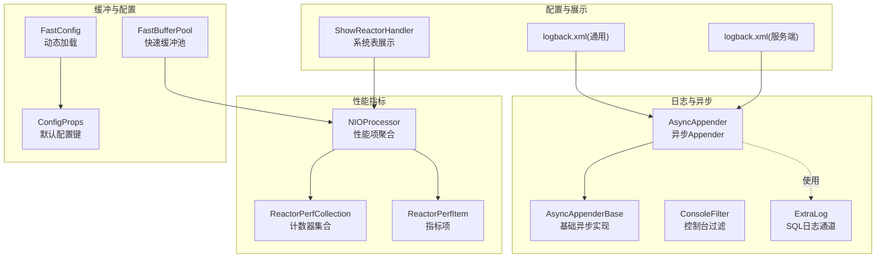
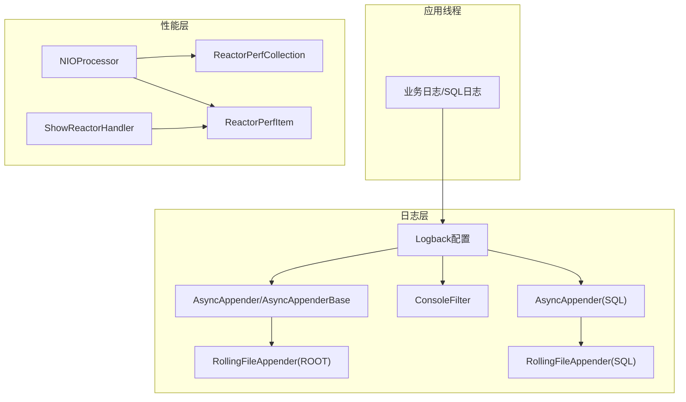
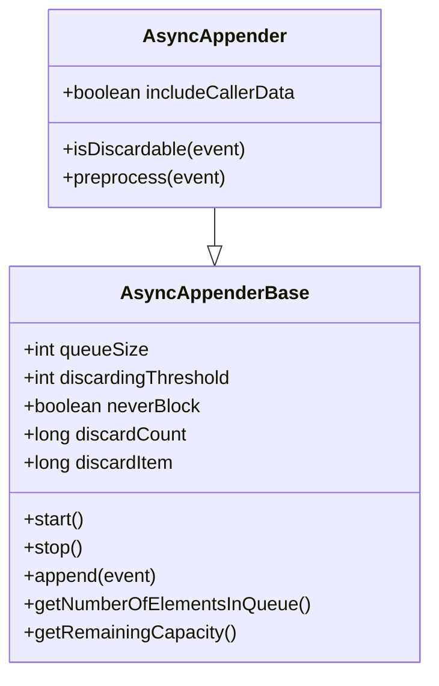
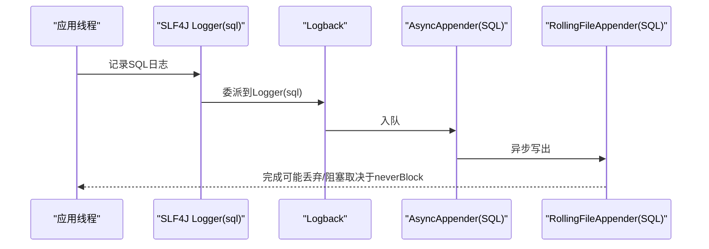
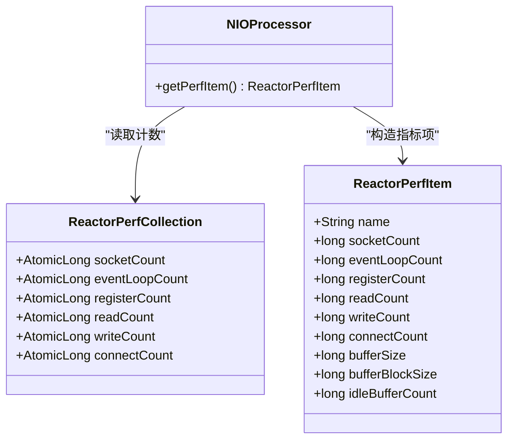
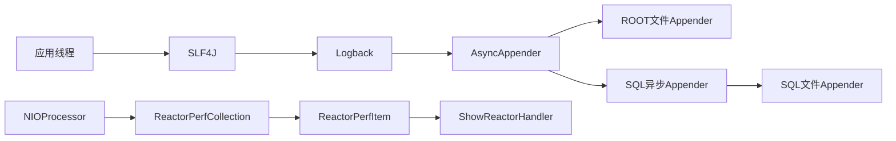

# 监控与日志

<cite>
**本文引用的文件**
- [AsyncAppender.java](file://proxy-common/src/main/java/com/alibaba/polardbx/proxy/logger/AsyncAppender.java)
- [AsyncAppenderBase.java](file://proxy-common/src/main/java/com/alibaba/polardbx/proxy/logger/AsyncAppenderBase.java)
- [ConsoleFilter.java](file://proxy-common/src/main/java/com/alibaba/polardbx/proxy/logger/ConsoleFilter.java)
- [ExtraLog.java](file://proxy-common/src/main/java/com/alibaba/polardbx/proxy/logger/ExtraLog.java)
- [logback.xml（通用资源）](file://proxy-common/src/main/resources/logback.xml)
- [logback.xml（服务端配置）](file://proxy-server/src/main/conf/logback.xml)
- [ReactorPerfCollection.java](file://proxy-net/src/main/java/com/alibaba/polardbx/proxy/perf/ReactorPerfCollection.java)
- [ReactorPerfItem.java](file://proxy-net/src/main/java/com/alibaba/polardbx/proxy/perf/ReactorPerfItem.java)
- [NIOProcessor.java](file://proxy-net/src/main/java/com/alibaba/polardbx/proxy/net/NIOProcessor.java)
- [ShowReactorHandler.java](file://proxy-core/src/main/java/com/alibaba/polardbx/proxy/protocol/handler/request/ShowReactorHandler.java)
- [FastBufferPool.java](file://proxy-common/src/main/java/com/alibaba/polardbx/proxy/utils/FastBufferPool.java)
- [ConfigProps.java](file://proxy-common/src/main/java/com/alibaba/polardbx/proxy/config/ConfigProps.java)
- [FastConfig.java](file://proxy-common/src/main/java/com/alibaba/polardbx/proxy/config/FastConfig.java)
- [LatencyChecker.java](file://proxy-core/src/main/java/com/alibaba/polardbx/proxy/serverless/LatencyChecker.java)
</cite>

## 目录
1. [简介](#简介)
2. [项目结构](#项目结构)
3. [核心组件](#核心组件)
4. [架构总览](#架构总览)
5. [组件详解](#组件详解)
6. [依赖关系分析](#依赖关系分析)
7. [性能考量](#性能考量)
8. [故障排查指南](#故障排查指南)
9. [结论](#结论)
10. [附录](#附录)

## 简介
本文件面向PolarDB-X Proxy的监控与日志体系，聚焦以下主题：
- 异步日志记录器（AsyncAppender）的实现原理：日志缓冲、异步处理、丢弃策略与性能优化。
- 额外日志（ExtraLog）的使用：SQL日志通道与输出格式。
- Reactor性能收集器（ReactorPerfCollection）与数据模型（ReactorPerfItem）：指标采集、统计与系统可观测性。
- Logback配置文件结构与参数：日志级别、输出格式、文件轮转策略与异步队列行为。
- 监控指标定义与含义：连接数、事件计数、缓冲区状态等。
- 日志分析方法、性能调优建议与故障诊断技巧。
- 监控仪表板配置与告警规则设置指南。

## 项目结构
围绕监控与日志的关键模块分布如下：
- 日志与异步：proxy-common/logger
- 性能指标：proxy-net/perf、proxy-net/NIOProcessor
- SQL日志通道：proxy-common/logger/ExtraLog
- Logback配置：proxy-common/resources/logback.xml、proxy-server/conf/logback.xml
- 指标展示：proxy-core/protocol/handler/request/ShowReactorHandler
- 缓冲池：proxy-common/utils/FastBufferPool
- 动态配置：proxy-common/config/ConfigProps、proxy-common/config/FastConfig

图表来源
- [AsyncAppender.java](file://proxy-common/src/main/java/com/alibaba/polardbx/proxy/logger/AsyncAppender.java#L24-L52)
- [AsyncAppenderBase.java](file://proxy-common/src/main/java/com/alibaba/polardbx/proxy/logger/AsyncAppenderBase.java#L32-L108)
- [ConsoleFilter.java](file://proxy-common/src/main/java/com/alibaba/polardbx/proxy/logger/ConsoleFilter.java#L25-L42)
- [ExtraLog.java](file://proxy-common/src/main/java/com/alibaba/polardbx/proxy/logger/ExtraLog.java#L24-L26)
- [logback.xml（通用资源）](file://proxy-common/src/main/resources/logback.xml#L19-L100)
- [logback.xml（服务端配置）](file://proxy-server/src/main/conf/logback.xml#L19-L97)
- [ReactorPerfCollection.java](file://proxy-net/src/main/java/com/alibaba/polardbx/proxy/perf/ReactorPerfCollection.java#L26-L33)
- [ReactorPerfItem.java](file://proxy-net/src/main/java/com/alibaba/polardbx/proxy/perf/ReactorPerfItem.java#L26-L40)
- [NIOProcessor.java](file://proxy-net/src/main/java/com/alibaba/polardbx/proxy/net/NIOProcessor.java#L116-L132)
- [ShowReactorHandler.java](file://proxy-core/src/main/java/com/alibaba/polardbx/proxy/protocol/handler/request/ShowReactorHandler.java#L37-L89)
- [FastBufferPool.java](file://proxy-common/src/main/java/com/alibaba/polardbx/proxy/utils/FastBufferPool.java#L27-L185)
- [ConfigProps.java](file://proxy-common/src/main/java/com/alibaba/polardbx/proxy/config/ConfigProps.java#L23-L209)
- [FastConfig.java](file://proxy-common/src/main/java/com/alibaba/polardbx/proxy/config/FastConfig.java#L61-L74)

章节来源
- [logback.xml（通用资源）](file://proxy-common/src/main/resources/logback.xml#L19-L100)
- [logback.xml（服务端配置）](file://proxy-server/src/main/conf/logback.xml#L19-L97)

## 核心组件
- 异步日志记录器（AsyncAppender/AsyncAppenderBase）
  - 基于阻塞队列的异步写入，支持丢弃阈值、永不阻塞策略与最大刷新时间。
  - 提供丢弃计数统计与队列容量监控接口。
- 额外日志（ExtraLog）
  - 定义“sql”日志通道，用于SQL执行日志的独立输出与轮转。
- Reactor性能收集器（ReactorPerfCollection/ReactorPerfItem）
  - 统计socket数量、事件循环次数、注册/读/写/连接计数以及缓冲区状态。
  - 通过NIOProcessor聚合并对外暴露指标项。
- Logback配置
  - 控制台与文件输出、异步Appender、SQL专用通道、按大小与时间滚动策略、级别覆盖。

章节来源
- [AsyncAppender.java](file://proxy-common/src/main/java/com/alibaba/polardbx/proxy/logger/AsyncAppender.java#L24-L52)
- [AsyncAppenderBase.java](file://proxy-common/src/main/java/com/alibaba/polardbx/proxy/logger/AsyncAppenderBase.java#L32-L108)
- [ExtraLog.java](file://proxy-common/src/main/java/com/alibaba/polardbx/proxy/logger/ExtraLog.java#L24-L26)
- [ReactorPerfCollection.java](file://proxy-net/src/main/java/com/alibaba/polardbx/proxy/perf/ReactorPerfCollection.java#L26-L33)
- [ReactorPerfItem.java](file://proxy-net/src/main/java/com/alibaba/polardbx/proxy/perf/ReactorPerfItem.java#L26-L40)
- [NIOProcessor.java](file://proxy-net/src/main/java/com/alibaba/polardbx/proxy/net/NIOProcessor.java#L116-L132)
- [logback.xml（通用资源）](file://proxy-common/src/main/resources/logback.xml#L19-L100)
- [logback.xml（服务端配置）](file://proxy-server/src/main/conf/logback.xml#L19-L97)

## 架构总览
下图展示了日志与性能监控在系统中的交互关系：

图表来源
- [AsyncAppender.java](file://proxy-common/src/main/java/com/alibaba/polardbx/proxy/logger/AsyncAppender.java#L24-L52)
- [AsyncAppenderBase.java](file://proxy-common/src/main/java/com/alibaba/polardbx/proxy/logger/AsyncAppenderBase.java#L32-L108)
- [ConsoleFilter.java](file://proxy-common/src/main/java/com/alibaba/polardbx/proxy/logger/ConsoleFilter.java#L25-L42)
- [logback.xml（通用资源）](file://proxy-common/src/main/resources/logback.xml#L19-L100)
- [logback.xml（服务端配置）](file://proxy-server/src/main/conf/logback.xml#L19-L97)
- [NIOProcessor.java](file://proxy-net/src/main/java/com/alibaba/polardbx/proxy/net/NIOProcessor.java#L116-L132)
- [ReactorPerfItem.java](file://proxy-net/src/main/java/com/alibaba/polardbx/proxy/perf/ReactorPerfItem.java#L26-L40)
- [ShowReactorHandler.java](file://proxy-core/src/main/java/com/alibaba/polardbx/proxy/protocol/handler/request/ShowReactorHandler.java#L67-L89)

## 组件详解

### 异步日志记录器（AsyncAppender 与 AsyncAppenderBase）
- 实现要点
  - 使用有界阻塞队列承载日志事件，工作线程从队列取出并同步写入下游Appender。
  - 支持“永不阻塞”模式：当队列满时直接丢弃，避免生产者被阻塞；否则采用不可中断插入。
  - 丢弃阈值：当剩余容量低于阈值时，可丢弃低优先级事件（如TRACE/DEBUG/INFO）。
  - 最大刷新时间：停止阶段等待最多指定毫秒数以刷完队列，超时则警告并丢弃剩余事件。
  - 预处理：可对事件进行deferred准备与可选的调用者数据提取。
- 关键参数
  - 队列大小、丢弃阈值、永不阻塞、最大刷新时间、是否包含调用者数据。
- 性能优化
  - 合理设置队列大小与丢弃阈值，避免频繁丢弃或内存占用过高。
  - 对于高吞吐SQL日志，启用“永不阻塞”以保证请求路径不被阻塞。
  - 控制台输出可通过过滤器仅在IDE环境开启，减少线上噪声。

图表来源
- [AsyncAppenderBase.java](file://proxy-common/src/main/java/com/alibaba/polardbx/proxy/logger/AsyncAppenderBase.java#L32-L108)
- [AsyncAppenderBase.java](file://proxy-common/src/main/java/com/alibaba/polardbx/proxy/logger/AsyncAppenderBase.java#L150-L198)
- [AsyncAppenderBase.java](file://proxy-common/src/main/java/com/alibaba/polardbx/proxy/logger/AsyncAppenderBase.java#L200-L257)
- [AsyncAppenderBase.java](file://proxy-common/src/main/java/com/alibaba/polardbx/proxy/logger/AsyncAppenderBase.java#L305-L343)
- [AsyncAppender.java](file://proxy-common/src/main/java/com/alibaba/polardbx/proxy/logger/AsyncAppender.java#L24-L52)

章节来源
- [AsyncAppenderBase.java](file://proxy-common/src/main/java/com/alibaba/polardbx/proxy/logger/AsyncAppenderBase.java#L32-L108)
- [AsyncAppenderBase.java](file://proxy-common/src/main/java/com/alibaba/polardbx/proxy/logger/AsyncAppenderBase.java#L150-L198)
- [AsyncAppenderBase.java](file://proxy-common/src/main/java/com/alibaba/polardbx/proxy/logger/AsyncAppenderBase.java#L200-L257)
- [AsyncAppenderBase.java](file://proxy-common/src/main/java/com/alibaba/polardbx/proxy/logger/AsyncAppenderBase.java#L305-L343)
- [AsyncAppender.java](file://proxy-common/src/main/java/com/alibaba/polardbx/proxy/logger/AsyncAppender.java#L24-L52)

### 额外日志（ExtraLog）与SQL日志通道
- SQL日志通道
  - 通过“sql”Logger名称绑定独立的异步Appender与滚动文件输出。
  - 输出格式包含时间戳与MDC中的连接标识，便于关联会话。
- 使用场景
  - 调试SQL执行路径、慢查询定位、事务上下文追踪。
- 配置要点
  - 在Logback中为“sql”日志器配置异步Appender，确保高并发下的稳定性。

图表来源
- [ExtraLog.java](file://proxy-common/src/main/java/com/alibaba/polardbx/proxy/logger/ExtraLog.java#L24-L26)
- [logback.xml（通用资源）](file://proxy-common/src/main/resources/logback.xml#L77-L88)
- [logback.xml（服务端配置）](file://proxy-server/src/main/conf/logback.xml#L77-L88)

章节来源
- [ExtraLog.java](file://proxy-common/src/main/java/com/alibaba/polardbx/proxy/logger/ExtraLog.java#L24-L26)
- [logback.xml（通用资源）](file://proxy-common/src/main/resources/logback.xml#L77-L88)
- [logback.xml（服务端配置）](file://proxy-server/src/main/conf/logback.xml#L77-L88)

### Reactor性能收集器（ReactorPerfCollection 与 ReactorPerfItem）
- 数据模型
  - 计数器：socketCount、eventLoopCount、registerCount、readCount、writeCount、connectCount。
  - 缓冲区：bufferSize、bufferBlockSize、idleBufferCount。
- 聚合与导出
  - NIOProcessor将原子计数器快照到ReactorPerfItem，并补充缓冲池状态。
  - ShowReactorHandler遍历所有处理器，将指标项转换为系统表行，供查询展示。
- 可视化与监控
  - 通过系统表查询获取每处理器的事件与缓冲区状态，辅助定位热点与资源瓶颈。

图表来源
- [ReactorPerfCollection.java](file://proxy-net/src/main/java/com/alibaba/polardbx/proxy/perf/ReactorPerfCollection.java#L26-L33)
- [ReactorPerfItem.java](file://proxy-net/src/main/java/com/alibaba/polardbx/proxy/perf/ReactorPerfItem.java#L26-L40)
- [NIOProcessor.java](file://proxy-net/src/main/java/com/alibaba/polardbx/proxy/net/NIOProcessor.java#L116-L132)

章节来源
- [ReactorPerfCollection.java](file://proxy-net/src/main/java/com/alibaba/polardbx/proxy/perf/ReactorPerfCollection.java#L26-L33)
- [ReactorPerfItem.java](file://proxy-net/src/main/java/com/alibaba/polardbx/proxy/perf/ReactorPerfItem.java#L26-L40)
- [NIOProcessor.java](file://proxy-net/src/main/java/com/alibaba/polardbx/proxy/net/NIOProcessor.java#L116-L132)
- [ShowReactorHandler.java](file://proxy-core/src/main/java/com/alibaba/polardbx/proxy/protocol/handler/request/ShowReactorHandler.java#L67-L89)

### Logback配置文件结构与参数
- 通用配置（proxy-common/resources/logback.xml）
  - 控制台输出：ConsoleAppender + ConsoleFilter（仅IDE环境允许）。
  - ROOT文件输出：RollingFileAppender（按大小+时间滚动），编码格式统一。
  - 异步ROOT：AsyncAppender，队列10万，永不阻塞，最大刷新3秒。
  - SQL通道：独立RollingFileAppender与AsyncAppender，每日滚动，立即刷新。
  - 日志器覆盖：对特定包设置INFO级别，降低噪声。
- 服务端配置（proxy-server/conf/logback.xml）
  - 结构与通用配置一致，根级别默认提升至info，适合生产环境。

章节来源
- [logback.xml（通用资源）](file://proxy-common/src/main/resources/logback.xml#L19-L100)
- [logback.xml（服务端配置）](file://proxy-server/src/main/conf/logback.xml#L19-L97)
- [ConsoleFilter.java](file://proxy-common/src/main/java/com/alibaba/polardbx/proxy/logger/ConsoleFilter.java#L25-L42)

### 监控指标定义与含义
- 连接与事件
  - sockets：当前处理器持有的socket数量。
  - events：事件循环累计计数。
  - registers/reads/writes/connects：注册、读、写、连接事件计数。
- 缓冲区
  - buffer/block/total/idle：缓冲区总量、块大小、总块数、空闲块数。
- SQL日志
  - 可结合“sql”日志通道的滚动策略与丢弃情况评估SQL输出负载。
- 动态配置
  - enable_sql_log：是否启用SQL日志。
  - log_sql_max_length、log_sql_param_max_length：SQL与参数截断长度。
  - max_allowed_packet：最大包大小，影响缓冲池与网络层处理。

章节来源
- [ShowReactorHandler.java](file://proxy-core/src/main/java/com/alibaba/polardbx/proxy/protocol/handler/request/ShowReactorHandler.java#L37-L89)
- [ReactorPerfItem.java](file://proxy-net/src/main/java/com/alibaba/polardbx/proxy/perf/ReactorPerfItem.java#L26-L40)
- [ConfigProps.java](file://proxy-common/src/main/java/com/alibaba/polardbx/proxy/config/ConfigProps.java#L92-L121)
- [FastConfig.java](file://proxy-common/src/main/java/com/alibaba/polardbx/proxy/config/FastConfig.java#L61-L74)

## 依赖关系分析
- 日志链路
  - 应用线程 → SLF4J → Logback → AsyncAppender → 下游Appender（文件/控制台）。
  - SQL日志经由独立通道，避免干扰常规日志。
- 性能链路
  - NIOProcessor维护原子计数器，聚合缓冲池状态，供系统表查询展示。
- 配置链路
  - ConfigProps定义默认键，FastConfig从系统属性/环境变量/命令行参数加载并校验。

图表来源
- [AsyncAppender.java](file://proxy-common/src/main/java/com/alibaba/polardbx/proxy/logger/AsyncAppender.java#L24-L52)
- [AsyncAppenderBase.java](file://proxy-common/src/main/java/com/alibaba/polardbx/proxy/logger/AsyncAppenderBase.java#L32-L108)
- [logback.xml（通用资源）](file://proxy-common/src/main/resources/logback.xml#L19-L100)
- [NIOProcessor.java](file://proxy-net/src/main/java/com/alibaba/polardbx/proxy/net/NIOProcessor.java#L116-L132)
- [ReactorPerfCollection.java](file://proxy-net/src/main/java/com/alibaba/polardbx/proxy/perf/ReactorPerfCollection.java#L26-L33)
- [ReactorPerfItem.java](file://proxy-net/src/main/java/com/alibaba/polardbx/proxy/perf/ReactorPerfItem.java#L26-L40)
- [ShowReactorHandler.java](file://proxy-core/src/main/java/com/alibaba/polardbx/proxy/protocol/handler/request/ShowReactorHandler.java#L67-L89)

## 性能考量
- 异步日志
  - 队列大小与丢弃阈值需根据峰值QPS与磁盘能力权衡，避免频繁丢弃或内存压力。
  - 对于错误日志与堆栈，建议启用“永不阻塞”，防止阻塞主请求路径。
  - 控制台输出在生产环境建议关闭，或仅在IDE环境放行，减少I/O与TTY开销。
- SQL日志
  - 启用SQL日志会显著增加I/O与磁盘占用，应结合max_allowed_packet与缓冲池大小评估。
  - 若SQL量巨大，可考虑临时降低日志级别或限制输出字段长度。
- Reactor性能
  - 通过系统表观察每处理器的事件与缓冲区状态，识别热点处理器与缓冲池紧张。
  - 结合LatencyChecker等组件，综合评估后端延迟与切换策略对性能的影响。

[本节为通用性能建议，无需列出具体文件来源]

## 故障排查指南
- 日志丢失
  - 检查AsyncAppender的neverBlock与队列剩余容量，确认是否达到丢弃阈值。
  - 查看discardCount/discardItem统计，定位高频丢弃时段。
- 控制台输出异常
  - 确认ConsoleFilter的运行环境变量，确保在非IDE环境不会输出控制台。
- SQL日志异常
  - 检查“sql”日志器是否正确绑定异步Appender与文件输出。
  - 关注SQL文件滚动策略与历史保留天数，避免磁盘空间不足。
- 性能异常
  - 使用系统表查询每处理器的事件与缓冲区状态，判断是否存在单点过载。
  - 结合LatencyChecker输出的延迟与健康信息，评估后端节点状态。

章节来源
- [AsyncAppenderBase.java](file://proxy-common/src/main/java/com/alibaba/polardbx/proxy/logger/AsyncAppenderBase.java#L150-L198)
- [ConsoleFilter.java](file://proxy-common/src/main/java/com/alibaba/polardbx/proxy/logger/ConsoleFilter.java#L25-L42)
- [logback.xml（通用资源）](file://proxy-common/src/main/resources/logback.xml#L77-L88)
- [ShowReactorHandler.java](file://proxy-core/src/main/java/com/alibaba/polardbx/proxy/protocol/handler/request/ShowReactorHandler.java#L67-L89)
- [LatencyChecker.java](file://proxy-core/src/main/java/com/alibaba/polardbx/proxy/serverless/LatencyChecker.java#L158-L202)

## 结论
PolarDB-X Proxy的监控与日志体系通过异步日志与独立SQL通道保障高吞吐下的稳定性，配合Reactor性能指标与系统表查询实现可观测性闭环。合理配置Logback参数、动态调整SQL日志策略与缓冲池大小，是获得稳定性能与高效排障的关键。

[本节为总结性内容，无需列出具体文件来源]

## 附录

### 监控仪表板配置与告警规则建议
- 仪表板维度
  - 每处理器：sockets、events、registers、reads、writes、connects、buffer、block、total、idle。
  - SQL日志：SQL文件大小增长速率、队列长度、丢弃计数。
- 告警规则示例
  - 事件速率突增：连续5分钟平均reads/writes增长超过阈值。
  - 缓冲池空闲率过低：idleBufferCount占比持续低于安全阈值。
  - SQL日志队列积压：队列长度超过阈值且丢弃计数上升。
  - 控制台输出：在生产环境出现控制台输出时触发告警。

[本节为通用实践建议，无需列出具体文件来源]