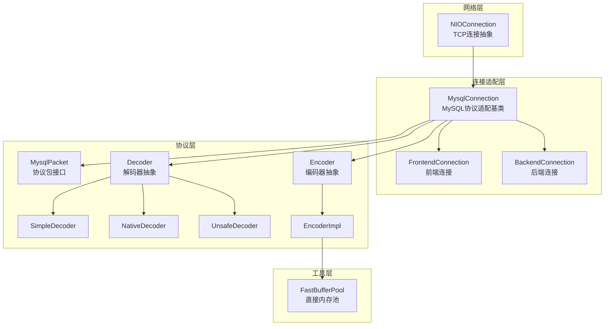
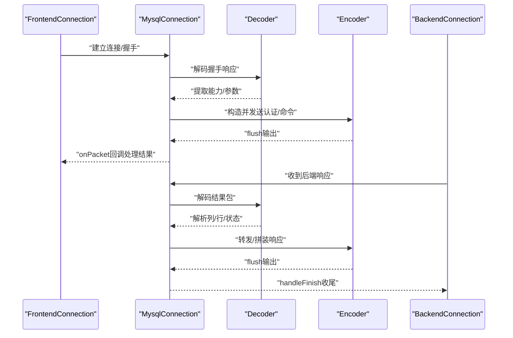
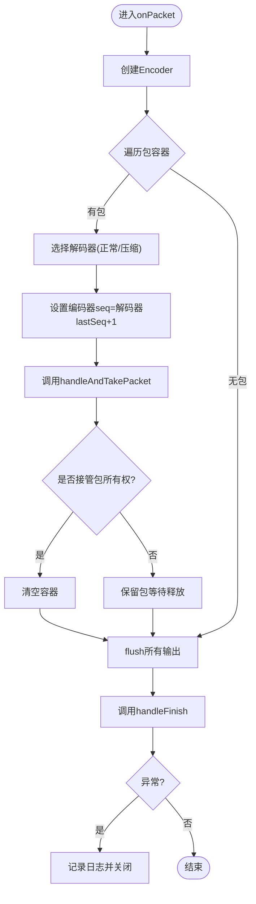
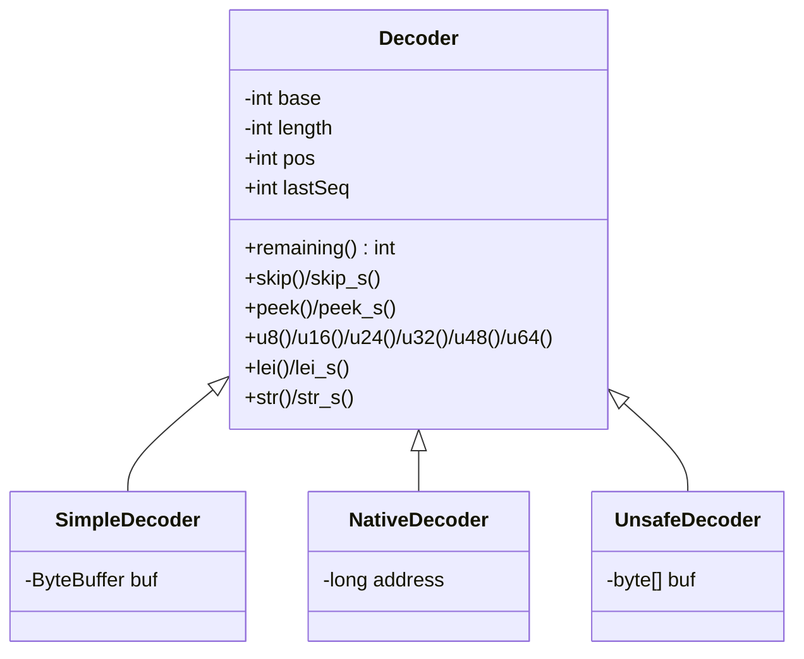
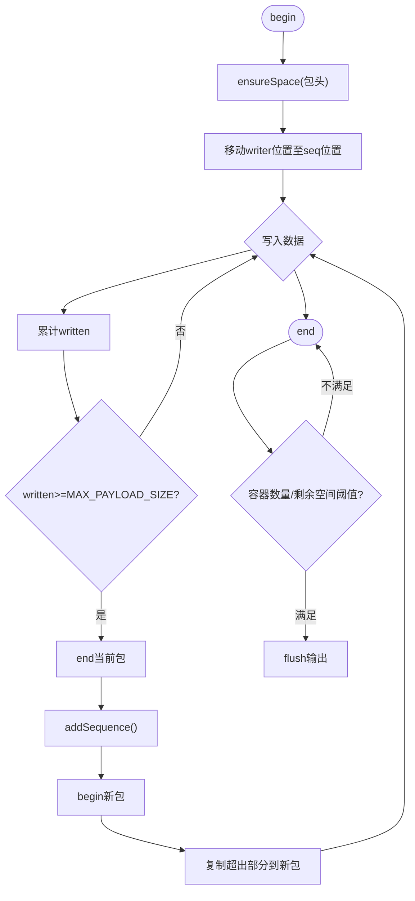
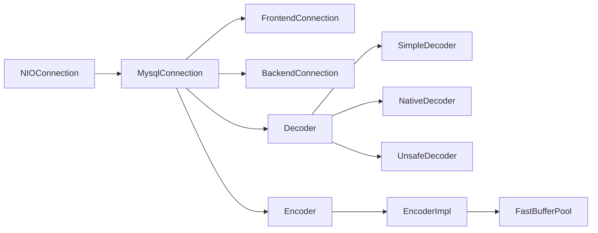

# MySQL连接适配

<cite>
**本文引用的文件**
- [MysqlConnection.java](file://proxy-core/src/main/java/com/alibaba/polardbx/proxy/connection/MysqlConnection.java)
- [FrontendConnection.java](file://proxy-core/src/main/java/com/alibaba/polardbx/proxy/connection/FrontendConnection.java)
- [BackendConnection.java](file://proxy-core/src/main/java/com/alibaba/polardbx/proxy/connection/BackendConnection.java)
- [MysqlPacket.java](file://proxy-core/src/main/java/com/alibaba/polardbx/proxy/protocol/common/MysqlPacket.java)
- [Decoder.java](file://proxy-core/src/main/java/com/alibaba/polardbx/proxy/protocol/decoder/Decoder.java)
- [SimpleDecoder.java](file://proxy-core/src/main/java/com/alibaba/polardbx/proxy/protocol/decoder/SimpleDecoder.java)
- [NativeDecoder.java](file://proxy-core/src/main/java/com/alibaba/polardbx/proxy/protocol/decoder/NativeDecoder.java)
- [UnsafeDecoder.java](file://proxy-core/src/main/java/com/alibaba/polardbx/proxy/protocol/decoder/UnsafeDecoder.java)
- [Encoder.java](file://proxy-core/src/main/java/com/alibaba/polardbx/proxy/protocol/encoder/Encoder.java)
- [EncoderImpl.java](file://proxy-core/src/main/java/com/alibaba/polardbx/proxy/protocol/encoder/EncoderImpl.java)
- [Capabilities.java](file://proxy-core/src/main/java/com/alibaba/polardbx/proxy/protocol/connection/Capabilities.java)
- [HandshakeResponse41.java](file://proxy-core/src/main/java/com/alibaba/polardbx/proxy/protocol/connection/HandshakeResponse41.java)
- [NIOConnection.java](file://proxy-net/src/main/java/com/alibaba/polardbx/proxy/net/NIOConnection.java)
- [FastBufferPool.java](file://proxy-common/src/main/java/com/alibaba/polardbx/proxy/utils/FastBufferPool.java)
</cite>

## 目录
1. [简介](#简介)
2. [项目结构](#项目结构)
3. [核心组件](#核心组件)
4. [架构总览](#架构总览)
5. [详细组件分析](#详细组件分析)
6. [依赖关系分析](#依赖关系分析)
7. [性能考量](#性能考量)
8. [故障排查指南](#故障排查指南)
9. [结论](#结论)
10. [附录](#附录)

## 简介
本文件面向PolarDB-X Proxy的MySQL连接适配层，系统化阐述MysqlConnection基类的设计架构与抽象机制，覆盖MySQL协议的统一处理、数据包编解码与状态管理；详解MysqlPacket数据包格式与处理流程（头部解析、负载处理、尾部校验）；剖析Decoder解码器与Encoder编码器的实现原理（协议解析、缓冲区管理、性能优化策略）；说明MySQL连接的通用特性（SSL支持、压缩传输、多路复用、错误处理）；给出协议版本兼容性、特性标志位管理与扩展机制；并提供协议交互示例、调试方法与性能调优建议。

## 项目结构
- 连接适配层位于proxy-core模块，核心为MysqlConnection及其前后端子类：FrontendConnection（面向客户端）、BackendConnection（面向后端MySQL实例）
- 协议层位于proxy-core/protocol，包含公共接口MysqlPacket、解码器集合（Decoder及其实现）、编码器集合（Encoder及其实现）
- 网络层位于proxy-net，提供NIOConnection抽象与TCP连接生命周期管理
- 缓冲池位于proxy-common/utils，提供高性能直接内存池FastBufferPool

**图表来源**
- [NIOConnection.java](file://proxy-net/src/main/java/com/alibaba/polardbx/proxy/net/NIOConnection.java#L50-L200)
- [MysqlConnection.java](file://proxy-core/src/main/java/com/alibaba/polardbx/proxy/connection/MysqlConnection.java#L37-L158)
- [FrontendConnection.java](file://proxy-core/src/main/java/com/alibaba/polardbx/proxy/connection/FrontendConnection.java#L47-L224)
- [BackendConnection.java](file://proxy-core/src/main/java/com/alibaba/polardbx/proxy/connection/BackendConnection.java#L67-L813)
- [MysqlPacket.java](file://proxy-core/src/main/java/com/alibaba/polardbx/proxy/protocol/common/MysqlPacket.java#L26-L42)
- [Decoder.java](file://proxy-core/src/main/java/com/alibaba/polardbx/proxy/protocol/decoder/Decoder.java#L29-L371)
- [Encoder.java](file://proxy-core/src/main/java/com/alibaba/polardbx/proxy/protocol/encoder/Encoder.java#L32-L168)
- [EncoderImpl.java](file://proxy-core/src/main/java/com/alibaba/polardbx/proxy/protocol/encoder/EncoderImpl.java#L31-L302)
- [FastBufferPool.java](file://proxy-common/src/main/java/com/alibaba/polardbx/proxy/utils/FastBufferPool.java#L27-L185)

**章节来源**
- [MysqlConnection.java](file://proxy-core/src/main/java/com/alibaba/polardbx/proxy/connection/MysqlConnection.java#L37-L158)
- [NIOConnection.java](file://proxy-net/src/main/java/com/alibaba/polardbx/proxy/net/NIOConnection.java#L50-L200)

## 核心组件
- MysqlConnection：抽象MySQL连接适配基类，负责探测包长、分包、序列号维护、统一处理入口与异常兜底关闭
- 前端连接FrontendConnection：负责握手、认证、命令处理与上下文状态流转
- 后端连接BackendConnection：负责后端认证、结果处理器队列、请求排队与转发、状态同步
- MysqlPacket：协议包接口，定义头部尺寸、最大负载、默认保留缓冲等常量与编解码约定
- Decoder：解码器抽象，提供u8/u16/u24/u32/u48/u64/lei等读取能力与字符串读取族
- Encoder：编码器抽象，提供写入与flush策略，支持多段包自动分割
- Capabilities：MySQL特性标志位集合，用于能力协商与兼容性控制
- HandshakeResponse41：握手响应包，承载客户端能力、字符集、用户名、鉴权响应、初始库、插件名、属性与压缩等级等字段

**章节来源**
- [MysqlConnection.java](file://proxy-core/src/main/java/com/alibaba/polardbx/proxy/connection/MysqlConnection.java#L37-L158)
- [FrontendConnection.java](file://proxy-core/src/main/java/com/alibaba/polardbx/proxy/connection/FrontendConnection.java#L47-L224)
- [BackendConnection.java](file://proxy-core/src/main/java/com/alibaba/polardbx/proxy/connection/BackendConnection.java#L67-L813)
- [MysqlPacket.java](file://proxy-core/src/main/java/com/alibaba/polardbx/proxy/protocol/common/MysqlPacket.java#L26-L42)
- [Decoder.java](file://proxy-core/src/main/java/com/alibaba/polardbx/proxy/protocol/decoder/Decoder.java#L29-L371)
- [Encoder.java](file://proxy-core/src/main/java/com/alibaba/polardbx/proxy/protocol/encoder/Encoder.java#L32-L168)
- [Capabilities.java](file://proxy-core/src/main/java/com/alibaba/polardbx/proxy/protocol/connection/Capabilities.java#L21-L82)
- [HandshakeResponse41.java](file://proxy-core/src/main/java/com/alibaba/polardbx/proxy/protocol/connection/HandshakeResponse41.java#L36-L243)

## 架构总览
MysqlConnection在NIOConnection之上，统一了MySQL协议的数据包探测、分包与处理流程；FrontendConnection与BackendConnection分别承担客户端与后端MySQL的握手、认证与命令/结果处理；Decoder/Encoder提供高性能的协议读写；Capabilities与HandshakeResponse41支撑能力协商与握手流程。

**图表来源**
- [FrontendConnection.java](file://proxy-core/src/main/java/com/alibaba/polardbx/proxy/connection/FrontendConnection.java#L88-L160)
- [BackendConnection.java](file://proxy-core/src/main/java/com/alibaba/polardbx/proxy/connection/BackendConnection.java#L118-L218)
- [MysqlConnection.java](file://proxy-core/src/main/java/com/alibaba/polardbx/proxy/connection/MysqlConnection.java#L95-L147)
- [Decoder.java](file://proxy-core/src/main/java/com/alibaba/polardbx/proxy/protocol/decoder/Decoder.java#L326-L371)
- [EncoderImpl.java](file://proxy-core/src/main/java/com/alibaba/polardbx/proxy/protocol/encoder/EncoderImpl.java#L102-L156)

## 详细组件分析

### MysqlConnection：统一协议适配与状态管理
- 探测包长：基于包头长度与payload大小计算完整包长，支持超大包的多段拼接
- 分包处理：在onPacket中逐包交由handleAndTakePacket处理，并在最后统一flush
- 序列号管理：根据解码器lastSeq设置编码器seq，保证响应顺序
- 异常处理：捕获处理异常与finish回调异常，记录日志并关闭连接
- 压缩支持：预留压缩包头尺寸与解码路径，当前抛出不支持异常

**图表来源**
- [MysqlConnection.java](file://proxy-core/src/main/java/com/alibaba/polardbx/proxy/connection/MysqlConnection.java#L95-L147)

**章节来源**
- [MysqlConnection.java](file://proxy-core/src/main/java/com/alibaba/polardbx/proxy/connection/MysqlConnection.java#L37-L158)

### MysqlPacket：数据包格式与处理约定
- 包头尺寸：普通包4字节，压缩包7字节
- 最大负载：0xFFFFFF（16MB）
- 默认保留缓冲：确保头部与payload安全拷贝
- 编解码约定：接口定义decode/encode，未实现encode时抛出异常

**章节来源**
- [MysqlPacket.java](file://proxy-core/src/main/java/com/alibaba/polardbx/proxy/protocol/common/MysqlPacket.java#L26-L42)

### Decoder：协议解析与缓冲区管理
- 抽象能力：提供u8/u16/u24/u32/u48/u64/lei/字符串族等读取方法
- 多实现策略：
  - SimpleDecoder：基于ByteBuffer，适用于常规堆缓冲
  - NativeDecoder：基于Unsafe直接内存地址，读取更快
  - UnsafeDecoder：基于字节数组，受限于UNSAFE可用性
- 大包合并：decodeNormalPacketLarge按4字节payload长度循环拼接，最终生成单一payload解码器
- 安全检查：剩余空间不足时抛出非法参数异常

**图表来源**
- [Decoder.java](file://proxy-core/src/main/java/com/alibaba/polardbx/proxy/protocol/decoder/Decoder.java#L29-L371)
- [SimpleDecoder.java](file://proxy-core/src/main/java/com/alibaba/polardbx/proxy/protocol/decoder/SimpleDecoder.java#L24-L275)
- [NativeDecoder.java](file://proxy-core/src/main/java/com/alibaba/polardbx/proxy/protocol/decoder/NativeDecoder.java#L23-L279)
- [UnsafeDecoder.java](file://proxy-core/src/main/java/com/alibaba/polardbx/proxy/protocol/decoder/UnsafeDecoder.java#L23-L287)

**章节来源**
- [Decoder.java](file://proxy-core/src/main/java/com/alibaba/polardbx/proxy/protocol/decoder/Decoder.java#L29-L371)
- [SimpleDecoder.java](file://proxy-core/src/main/java/com/alibaba/polardbx/proxy/protocol/decoder/SimpleDecoder.java#L24-L275)
- [NativeDecoder.java](file://proxy-core/src/main/java/com/alibaba/polardbx/proxy/protocol/decoder/NativeDecoder.java#L23-L279)
- [UnsafeDecoder.java](file://proxy-core/src/main/java/com/alibaba/polardbx/proxy/protocol/decoder/UnsafeDecoder.java#L23-L287)

### Encoder：编码器与多段包分割
- 写入族：u8/u16/u24/u32/u48/u64/f/d/str/lei等
- flush策略：当容器数量或剩余空间低于阈值时触发flush
- 多段包：当已写字节数达到MAX_PAYLOAD_SIZE时，自动截断并生成新包
- 输出容器：通过ExportConsumer将Slice容器导出到网络层

**图表来源**
- [EncoderImpl.java](file://proxy-core/src/main/java/com/alibaba/polardbx/proxy/protocol/encoder/EncoderImpl.java#L102-L156)
- [EncoderImpl.java](file://proxy-core/src/main/java/com/alibaba/polardbx/proxy/protocol/encoder/EncoderImpl.java#L285-L295)

**章节来源**
- [Encoder.java](file://proxy-core/src/main/java/com/alibaba/polardbx/proxy/protocol/encoder/Encoder.java#L32-L168)
- [EncoderImpl.java](file://proxy-core/src/main/java/com/alibaba/polardbx/proxy/protocol/encoder/EncoderImpl.java#L31-L302)

### 前端连接FrontendConnection：握手与认证
- 握手阶段：发送HandshakeV10，设置版本、连接ID、种子、能力标志、字符集、状态标志与认证插件名
- 认证阶段：委托FrontendAuthenticator处理握手响应与认证流程，切换到Authenticated后释放认证器
- 命令阶段：初始化FrontendCommandHandler，处理查询/预处理等命令
- 资源回收：异步关闭认证器、命令处理器与上下文，避免死锁

**章节来源**
- [FrontendConnection.java](file://proxy-core/src/main/java/com/alibaba/polardbx/proxy/connection/FrontendConnection.java#L47-L224)
- [HandshakeResponse41.java](file://proxy-core/src/main/java/com/alibaba/polardbx/proxy/protocol/connection/HandshakeResponse41.java#L36-L243)

### 后端连接BackendConnection：认证与结果处理
- 认证阶段：接收后端HandshakeV10，构建BackendContext，合并能力标志，检查协议版本
- 登录完成：通知FutureTask，清理pendingData并开始转发后续请求
- 结果处理：按序调度ResultHandler，支持链式处理与系统请求标记
- 请求排队：认证未完成时将请求放入pendingData，认证完成后批量发送

**章节来源**
- [BackendConnection.java](file://proxy-core/src/main/java/com/alibaba/polardbx/proxy/connection/BackendConnection.java#L67-L813)

### 能力标志与兼容性
- Capabilities：定义CLIENT_*标志位，如CLIENT_PROTOCOL_41、CLIENT_SSL、CLIENT_COMPRESS、CLIENT_PLUGIN_AUTH等
- 能力协商：FrontendConnection在握手时设置基础能力，HandshakeResponse41根据响应动态调整
- 兼容性策略：未满足CLIENT_PROTOCOL_41时拒绝连接；压缩传输预留但当前不支持

**章节来源**
- [Capabilities.java](file://proxy-core/src/main/java/com/alibaba/polardbx/proxy/protocol/connection/Capabilities.java#L21-L82)
- [HandshakeResponse41.java](file://proxy-core/src/main/java/com/alibaba/polardbx/proxy/protocol/connection/HandshakeResponse41.java#L98-L157)

## 依赖关系分析
- MysqlConnection依赖NIOConnection进行TCP生命周期管理与缓冲区持有
- 解码器与编码器均依赖FastBufferPool以减少GC与提升内存局部性
- 前后端连接分别依赖各自处理器（FrontendAuthenticator/FrontendCommandHandler与BackendAuthenticator/ResultHandler）

**图表来源**
- [NIOConnection.java](file://proxy-net/src/main/java/com/alibaba/polardbx/proxy/net/NIOConnection.java#L50-L200)
- [MysqlConnection.java](file://proxy-core/src/main/java/com/alibaba/polardbx/proxy/connection/MysqlConnection.java#L37-L158)
- [EncoderImpl.java](file://proxy-core/src/main/java/com/alibaba/polardbx/proxy/protocol/encoder/EncoderImpl.java#L31-L302)
- [FastBufferPool.java](file://proxy-common/src/main/java/com/alibaba/polardbx/proxy/utils/FastBufferPool.java#L27-L185)

**章节来源**
- [NIOConnection.java](file://proxy-net/src/main/java/com/alibaba/polardbx/proxy/net/NIOConnection.java#L50-L200)
- [FastBufferPool.java](file://proxy-common/src/main/java/com/alibaba/polardbx/proxy/utils/FastBufferPool.java#L27-L185)

## 性能考量
- 直接内存池：使用FastBufferPool分配固定块大小的直接内存，降低GC压力与拷贝成本
- 解码器选择：在可利用Unsafe时优先NativeDecoder/UnsafeDecoder，否则回退SimpleDecoder
- 编码器flush阈值：根据容器数量与剩余空间阈值主动flush，避免过长延迟
- 多段包自动分割：超过最大负载时自动切分为多个包，避免单包过大导致拥塞
- TCP缓冲区：根据角色（客户端/服务端）设置不同的发送与接收缓冲区大小

**章节来源**
- [FastBufferPool.java](file://proxy-common/src/main/java/com/alibaba/polardbx/proxy/utils/FastBufferPool.java#L27-L185)
- [EncoderImpl.java](file://proxy-core/src/main/java/com/alibaba/polardbx/proxy/protocol/encoder/EncoderImpl.java#L31-L302)
- [NIOConnection.java](file://proxy-net/src/main/java/com/alibaba/polardbx/proxy/net/NIOConnection.java#L50-L200)

## 故障排查指南
- 握手失败：检查FrontendConnection是否成功发送HandshakeV10，确认BackendContext是否正确解析能力标志
- 认证失败：查看FrontendAuthenticator/BackendAuthenticator的错误包解析与状态切换
- 结果处理异常：定位ResultHandler链路，确认handleFinish与close调用顺序
- 编码异常：检查EncoderImpl的flush阈值与多段包分割逻辑
- 压缩传输：当前压缩路径抛出不支持异常，需评估启用时机与兼容性

**章节来源**
- [FrontendConnection.java](file://proxy-core/src/main/java/com/alibaba/polardbx/proxy/connection/FrontendConnection.java#L113-L160)
- [BackendConnection.java](file://proxy-core/src/main/java/com/alibaba/polardbx/proxy/connection/BackendConnection.java#L123-L218)
- [EncoderImpl.java](file://proxy-core/src/main/java/com/alibaba/polardbx/proxy/protocol/encoder/EncoderImpl.java#L285-L295)

## 结论
MysqlConnection通过统一的包探测、分包与处理流程，将MySQL协议细节封装在Decoder/Encoder中，使前后端连接专注于业务逻辑。配合FastBufferPool与多实现解码器，实现了高性能与可移植的协议栈。未来可在压缩传输、特性扩展与版本兼容方面持续演进。

## 附录
- 协议交互示例（概念性）
  - 前端握手：FrontendConnection发送HandshakeV10 → 后端返回HandshakeV10 → 前端发送HandshakeResponse41 → 后端认证
  - 查询转发：前端发送ComQuery → BackendConnection排队/转发 → 后端返回结果集 → 前端组装响应
- 调试方法
  - 打印Decoder/Encoder的pos/remaining与written统计
  - 观察FastBufferPool的空闲块数与分配次数
  - 检查NIOConnection的读写锁与写队列长度
- 性能调优建议
  - 合理设置FastBufferPool块大小与数量
  - 在高并发场景下优先使用Unsafe解码器
  - 调整Encoder的flush阈值以平衡延迟与吞吐