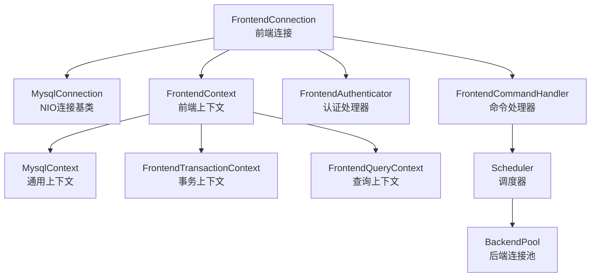
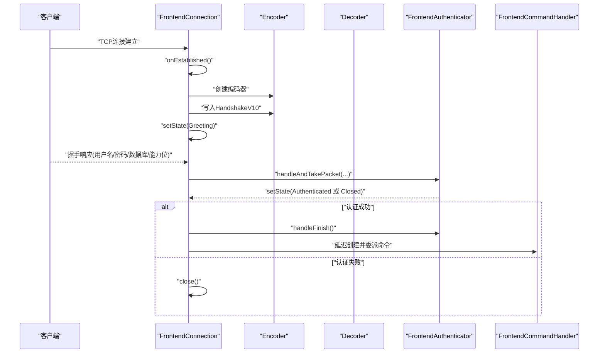
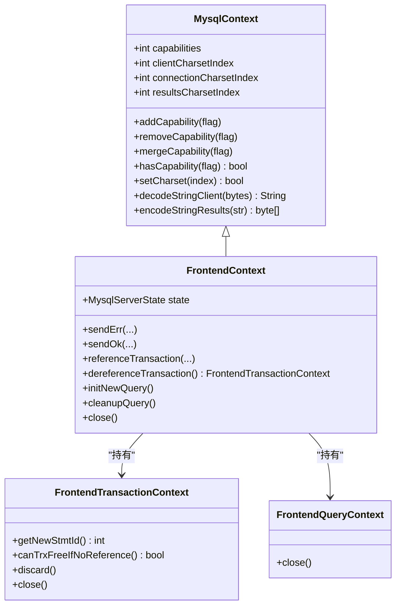
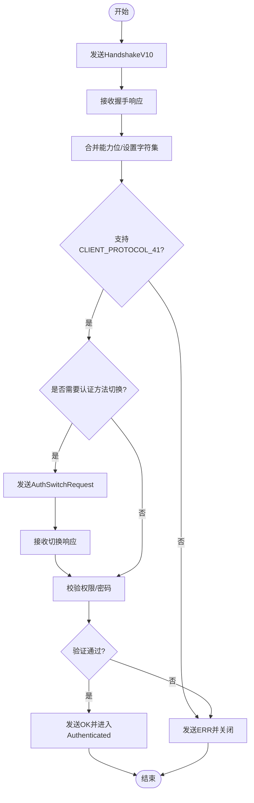
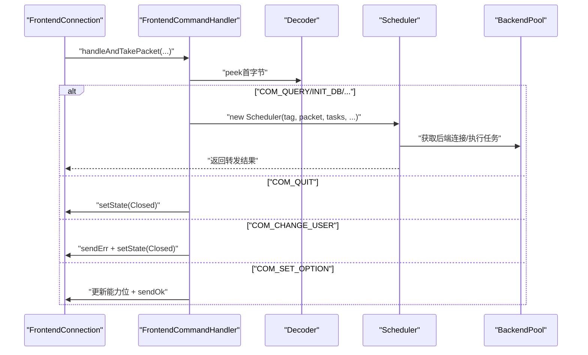
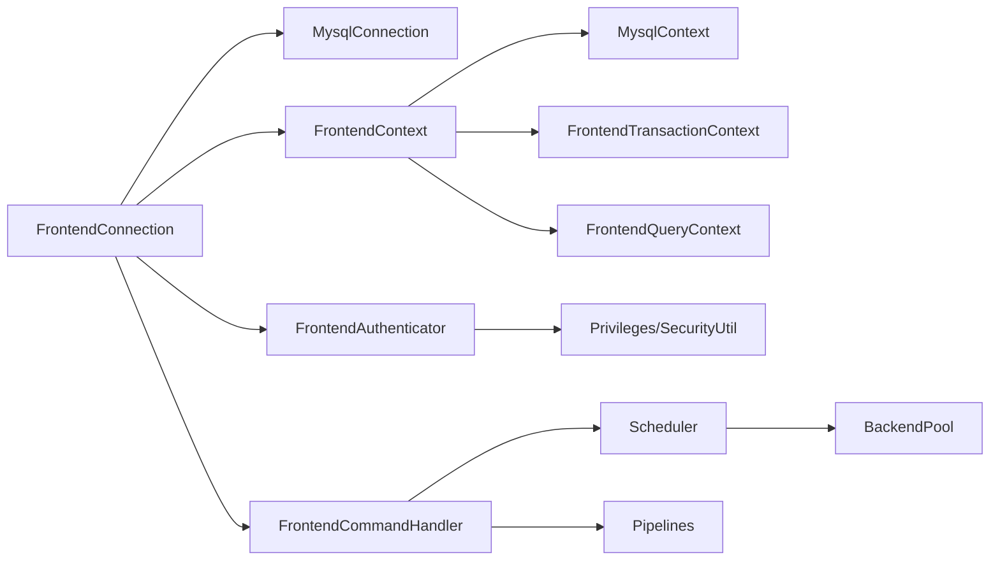

# 前端连接管理

<cite>
**本文引用的文件列表**
- [FrontendConnection.java](file://proxy-core/src/main/java/com/alibaba/polardbx/proxy/connection/FrontendConnection.java)
- [FrontendContext.java](file://proxy-core/src/main/java/com/alibaba/polardbx/proxy/context/FrontendContext.java)
- [FrontendAuthenticator.java](file://proxy-core/src/main/java/com/alibaba/polardbx/proxy/protocol/handler/FrontendAuthenticator.java)
- [FrontendCommandHandler.java](file://proxy-core/src/main/java/com/alibaba/polardbx/proxy/protocol/handler/FrontendCommandHandler.java)
- [MysqlContext.java](file://proxy-core/src/main/java/com/alibaba/polardbx/proxy/context/MysqlContext.java)
- [Capabilities.java](file://proxy-core/src/main/java/com/alibaba/polardbx/proxy/protocol/connection/Capabilities.java)
- [MysqlServerState.java](file://proxy-core/src/main/java/com/alibaba/polardbx/proxy/protocol/common/MysqlServerState.java)
- [MysqlConnection.java](file://proxy-core/src/main/java/com/alibaba/polardbx/proxy/connection/MysqlConnection.java)
- [HandshakeV10.java](file://proxy-core/src/main/java/com/alibaba/polardbx/proxy/protocol/connection/HandshakeV10.java)
- [BackendPool.java](file://proxy-core/src/main/java/com/alibaba/polardbx/proxy/connection/pool/BackendPool.java)
</cite>

## 目录
1. [简介](#简介)
2. [项目结构与定位](#项目结构与定位)
3. [核心组件总览](#核心组件总览)
4. [架构概览](#架构概览)
5. [详细组件分析](#详细组件分析)
6. [依赖关系分析](#依赖关系分析)
7. [性能与并发特性](#性能与并发特性)
8. [故障排查指南](#故障排查指南)
9. [结论](#结论)
10. [附录：使用示例与最佳实践](#附录使用示例与最佳实践)

## 简介
本文件面向PolarDB-X Proxy的前端连接管理模块，系统性梳理FrontendConnection类的设计与实现，覆盖连接生命周期（建立、握手认证、命令处理、关闭）、FrontendContext上下文管理机制（会话状态、能力标志位、字符集）、FrontendAuthenticator认证处理器（握手包发送、认证挑战响应、权限校验）、FrontendCommandHandler命令分发器（请求分发与状态管理），以及连接池中全局连接集合的管理、并发安全与资源清理策略。文档同时提供序列图、类图、流程图等可视化说明，并给出性能优化建议与常见问题排查方法。

## 项目结构与定位
- 前端连接管理位于proxy-core模块，核心代码集中在：
  - 连接层：FrontendConnection、MysqlConnection
  - 上下文层：FrontendContext、MysqlContext
  - 协议层：FrontendAuthenticator、FrontendCommandHandler、HandshakeV10、Capabilities、MysqlServerState
  - 后端连接池：BackendPool（用于后端连接复用与刷新）
- 该模块通过NIO事件循环驱动，采用“连接即上下文”的设计，将协议处理与业务上下文紧密耦合，确保状态机清晰、资源回收可控。

**章节来源**
- file://proxy-core/src/main/java/com/alibaba/polardbx/proxy/connection/FrontendConnection.java#L47-L86
- file://proxy-core/src/main/java/com/alibaba/polardbx/proxy/context/FrontendContext.java#L45-L54

## 核心组件总览
- FrontendConnection：前端连接主体，负责握手、认证、命令分发、生命周期管理与全局集合注册/注销。
- FrontendContext：前端会话上下文，维护状态机、能力标志位、字符集、事务与查询上下文、预编译语句映射等。
- FrontendAuthenticator：认证处理器，负责握手包发送、客户端响应解析、认证方法切换与权限校验。
- FrontendCommandHandler：命令处理器，根据命令类型分发到调度器Pipeline，执行具体任务。
- MysqlContext：通用MySQL上下文基类，封装能力位、字符集、变量、状态同步等。
- BackendPool：后端连接池，提供连接获取、释放、空闲刷新与全局变量缓存刷新。

**章节来源**
- file://proxy-core/src/main/java/com/alibaba/polardbx/proxy/connection/FrontendConnection.java#L47-L86
- file://proxy-core/src/main/java/com/alibaba/polardbx/proxy/context/FrontendContext.java#L45-L54
- file://proxy-core/src/main/java/com/alibaba/polardbx/proxy/protocol/handler/FrontendAuthenticator.java#L45-L65
- file://proxy-core/src/main/java/com/alibaba/polardbx/proxy/protocol/handler/FrontendCommandHandler.java#L39-L49
- file://proxy-core/src/main/java/com/alibaba/polardbx/proxy/context/MysqlContext.java#L48-L106
- file://proxy-core/src/main/java/com/alibaba/polardbx/proxy/connection/pool/BackendPool.java#L46-L98

## 架构概览
前端连接管理采用“连接即上下文”的架构，FrontendConnection继承自MysqlConnection，后者基于NIO事件循环解码/编码数据包，调用FrontendConnection的回调完成业务处理。FrontendConnection在握手阶段创建FrontendContext与FrontendAuthenticator，在认证成功后创建FrontendCommandHandler进行命令分发。

**图表来源**
- [FrontendConnection.java](file://proxy-core/src/main/java/com/alibaba/polardbx/proxy/connection/FrontendConnection.java#L47-L86)
- [FrontendContext.java](file://proxy-core/src/main/java/com/alibaba/polardbx/proxy/context/FrontendContext.java#L45-L54)
- [FrontendAuthenticator.java](file://proxy-core/src/main/java/com/alibaba/polardbx/proxy/protocol/handler/FrontendAuthenticator.java#L45-L65)
- [FrontendCommandHandler.java](file://proxy-core/src/main/java/com/alibaba/polardbx/proxy/protocol/handler/FrontendCommandHandler.java#L39-L49)
- [MysqlContext.java](file://proxy-core/src/main/java/com/alibaba/polardbx/proxy/context/MysqlContext.java#L48-L106)
- [BackendPool.java](file://proxy-core/src/main/java/com/alibaba/polardbx/proxy/connection/pool/BackendPool.java#L46-L98)

## 详细组件分析

### FrontendConnection：连接生命周期与全局集合管理
- 连接建立
  - 构造函数初始化FrontendContext（含连接ID、基础能力位、默认字符集），生成随机种子作为认证插件数据，创建FrontendAuthenticator。
  - 将自身加入全局连接集合，便于监控与统计。
- 握手阶段
  - onEstablished中构造HandshakeV10，填充版本、连接ID、认证种子、能力位、字符集、状态标志与认证插件名，通过Encoder写出并置状态为Greeting。
- 认证与命令处理
  - handleAndTakePacket优先委派给FrontendAuthenticator；认证完成后切换为FrontendCommandHandler；若异常或状态为Closed则触发关闭。
- 关闭流程
  - 使用原子布尔resourceClosed作为轻量锁，避免重复关闭；异步线程池回收认证器、命令处理器与上下文；从全局集合移除；最终调用父类关闭TCP连接。

**图表来源**
- [FrontendConnection.java](file://proxy-core/src/main/java/com/alibaba/polardbx/proxy/connection/FrontendConnection.java#L88-L160)
- [HandshakeV10.java](file://proxy-core/src/main/java/com/alibaba/polardbx/proxy/protocol/connection/HandshakeV10.java#L124-L173)
- [FrontendAuthenticator.java](file://proxy-core/src/main/java/com/alibaba/polardbx/proxy/protocol/handler/FrontendAuthenticator.java#L137-L201)

**章节来源**
- file://proxy-core/src/main/java/com/alibaba/polardbx/proxy/connection/FrontendConnection.java#L61-L86
- file://proxy-core/src/main/java/com/alibaba/polardbx/proxy/connection/FrontendConnection.java#L88-L160
- file://proxy-core/src/main/java/com/alibaba/polardbx/proxy/connection/FrontendConnection.java#L168-L213

### FrontendContext：上下文管理与状态机
- 状态机
  - 维护MysqlServerState枚举，贯穿Init、Greeting、AuthSwitched、Authenticated、Closed。
- 能力标志位管理
  - 提供addCapability/removeCapability/mergeCapability/hasCapability等接口，统一管理客户端能力位。
- 字符集设置
  - setCharset支持按索引设置client、connection、results三套字符集，返回是否支持；提供decode/encode工具方法。
- 会话状态维护
  - 维护自动提交、事务状态、警告数、游标存在等；提供genStatusFlags生成状态标志。
- 预编译语句与事务上下文
  - 持有PreparedStatementContext映射与事务上下文，支持引用计数与清理策略。
- 错误/成功包发送
  - sendErr/sendOk封装错误与成功包编码与flush，异常时强制关闭连接。

**图表来源**
- [MysqlContext.java](file://proxy-core/src/main/java/com/alibaba/polardbx/proxy/context/MysqlContext.java#L112-L151)
- [FrontendContext.java](file://proxy-core/src/main/java/com/alibaba/polardbx/proxy/context/FrontendContext.java#L45-L54)
- [FrontendContext.java](file://proxy-core/src/main/java/com/alibaba/polardbx/proxy/context/FrontendContext.java#L132-L252)

**章节来源**
- file://proxy-core/src/main/java/com/alibaba/polardbx/proxy/context/FrontendContext.java#L45-L54
- file://proxy-core/src/main/java/com/alibaba/polardbx/proxy/context/MysqlContext.java#L112-L151

### FrontendAuthenticator：认证处理器工作流
- 握手包发送
  - FrontendConnection在onEstablished中构造HandshakeV10并写出，包含版本、连接ID、认证种子、能力位、字符集、状态标志与认证插件名。
- 认证挑战响应
  - 解析HandshakeResponse41，合并客户端能力位，设置字符集；若客户端指定非默认认证方法且支持插件认证，则发送AuthSwitchRequest要求客户端以指定方法重试。
- 权限验证
  - 校验schema是否存在；根据IP与用户名查找权限信息；若信任IP则提升为管理员用户；对密码进行验证；最终发送OK或ERR包并更新状态。

**图表来源**
- [FrontendConnection.java](file://proxy-core/src/main/java/com/alibaba/polardbx/proxy/connection/FrontendConnection.java#L88-L111)
- [FrontendAuthenticator.java](file://proxy-core/src/main/java/com/alibaba/polardbx/proxy/protocol/handler/FrontendAuthenticator.java#L137-L201)
- [HandshakeV10.java](file://proxy-core/src/main/java/com/alibaba/polardbx/proxy/protocol/connection/HandshakeV10.java#L124-L173)

**章节来源**
- file://proxy-core/src/main/java/com/alibaba/polardbx/proxy/protocol/handler/FrontendAuthenticator.java#L137-L201
- file://proxy-core/src/main/java/com/alibaba/polardbx/proxy/protocol/connection/HandshakeV10.java#L124-L173

### FrontendCommandHandler：命令分发与状态管理
- 命令识别
  - 通过解码器首字节判断命令类型（QUIT、INIT_DB、QUERY、FIELD_LIST、STATISTICS、DEBUG、PING、RESET_CONNECTION、CHANGE_USER、SET_OPTION、STMT_*系列）。
- 分发策略
  - 根据命令类型选择对应Pipeline（Pipelines.*_TASKS），构建Scheduler并forward执行。
- 特殊命令处理
  - COM_QUIT：直接置状态为Closed。
  - COM_CHANGE_USER：拒绝并关闭连接。
  - COM_SET_OPTION：动态增删CLIENT_MULTI_STATEMENTS能力位。
  - STMT_CLOSE：从预编译映射中移除语句ID。

**图表来源**
- [FrontendCommandHandler.java](file://proxy-core/src/main/java/com/alibaba/polardbx/proxy/protocol/handler/FrontendCommandHandler.java#L73-L170)
- [BackendPool.java](file://proxy-core/src/main/java/com/alibaba/polardbx/proxy/connection/pool/BackendPool.java#L115-L132)

**章节来源**
- file://proxy-core/src/main/java/com/alibaba/polardbx/proxy/protocol/handler/FrontendCommandHandler.java#L73-L170

### 全局连接集合管理与并发安全
- 全局集合
  - 使用ConcurrentSkipListSet维护所有FrontendConnection实例，便于统计与监控。
- 并发安全
  - 关闭流程使用AtomicBoolean(resourceClosed)作为轻量锁，避免重复关闭；异步线程池回收资源，防止死锁。
  - FrontendContext内部使用synchronized块保护事务引用计数与上下文清理，保证一致性。
- 资源清理
  - 关闭时顺序释放认证器、命令处理器、上下文，最后关闭TCP连接；全局集合移除当前连接。

**章节来源**
- file://proxy-core/src/main/java/com/alibaba/polardbx/proxy/connection/FrontendConnection.java#L49-L86
- file://proxy-core/src/main/java/com/alibaba/polardbx/proxy/connection/FrontendConnection.java#L168-L213
- file://proxy-core/src/main/java/com/alibaba/polardbx/proxy/context/FrontendContext.java#L164-L236

## 依赖关系分析
- FrontendConnection依赖
  - MysqlConnection：NIO事件循环与数据包处理框架。
  - FrontendContext：会话上下文与状态机。
  - FrontendAuthenticator：握手与认证。
  - FrontendCommandHandler：命令分发。
  - Capabilities：能力位常量与默认能力。
  - MysqlServerState：状态枚举。
  - HandshakeV10：握手包结构。
- FrontendContext依赖
  - MysqlContext：能力位、字符集、变量与状态同步。
  - FrontendTransactionContext/FrontendQueryContext：事务与查询上下文。
  - MysqlForwarder：转发器（懒加载）。
- FrontendAuthenticator依赖
  - Privileges/ProxyPrivileges/SecurityUtil：权限与密码校验。
  - HandshakeResponse41/AuthSwitchResponse：握手与切换响应包。
- FrontendCommandHandler依赖
  - Pipelines/Scheduler：命令分发与任务管线。
  - Commands：命令常量。
- BackendPool依赖
  - NIOWorker/NIOProcessor：后端连接建立与读监控。
  - QueryResultHandler：后端查询结果消费与刷新。

**图表来源**
- [FrontendConnection.java](file://proxy-core/src/main/java/com/alibaba/polardbx/proxy/connection/FrontendConnection.java#L47-L86)
- [FrontendContext.java](file://proxy-core/src/main/java/com/alibaba/polardbx/proxy/context/FrontendContext.java#L45-L54)
- [FrontendAuthenticator.java](file://proxy-core/src/main/java/com/alibaba/polardbx/proxy/protocol/handler/FrontendAuthenticator.java#L21-L28)
- [FrontendCommandHandler.java](file://proxy-core/src/main/java/com/alibaba/polardbx/proxy/protocol/handler/FrontendCommandHandler.java#L21-L33)
- [BackendPool.java](file://proxy-core/src/main/java/com/alibaba/polardbx/proxy/connection/pool/BackendPool.java#L21-L28)

**章节来源**
- file://proxy-core/src/main/java/com/alibaba/polardbx/proxy/connection/FrontendConnection.java#L47-L86
- file://proxy-core/src/main/java/com/alibaba/polardbx/proxy/context/FrontendContext.java#L45-L54
- file://proxy-core/src/main/java/com/alibaba/polardbx/proxy/protocol/handler/FrontendAuthenticator.java#L21-L28
- file://proxy-core/src/main/java/com/alibaba/polardbx/proxy/protocol/handler/FrontendCommandHandler.java#L21-L33
- file://proxy-core/src/main/java/com/alibaba/polardbx/proxy/connection/pool/BackendPool.java#L21-L28

## 性能与并发特性
- 编码器复用与快速路径
  - FrontendContext.sendOk针对特定序列号与条件提供快速路径，减少对象分配与拷贝。
- 异步资源回收
  - FrontendConnection关闭时通过线程池异步释放认证器、命令处理器与上下文，避免阻塞事件循环。
- 并发集合与原子操作
  - 全局连接集合使用ConcurrentSkipListSet；关闭流程使用AtomicBoolean与synchronized块，兼顾高并发与一致性。
- 后端连接池优化
  - BackendPool采用队列存储空闲连接，限制最大池大小；空闲连接定期刷新与全局变量缓存刷新，降低后端抖动影响。

**章节来源**
- file://proxy-core/src/main/java/com/alibaba/polardbx/proxy/context/FrontendContext.java#L87-L124
- file://proxy-core/src/main/java/com/alibaba/polardbx/proxy/connection/FrontendConnection.java#L191-L206
- file://proxy-core/src/main/java/com/alibaba/polardbx/proxy/connection/pool/BackendPool.java#L107-L132
- file://proxy-core/src/main/java/com/alibaba/polardbx/proxy/connection/pool/BackendPool.java#L167-L250

## 故障排查指南
- 认证失败
  - 症状：客户端收到Access denied错误。
  - 排查要点：检查客户端能力位是否包含CLIENT_PROTOCOL_41；确认字符集是否受支持；核对用户名/IP白名单与密码哈希；如需插件认证，确认AuthSwitchRequest是否正确发送与响应。
- 握手阶段异常
  - 症状：握手包发送失败或连接被关闭。
  - 排查要点：查看日志中握手包编码异常；确认随机种子长度与终止符；检查网络连通性与防火墙。
- 命令不支持
  - 症状：Unsupported command错误。
  - 排查要点：确认客户端命令常量是否正确；检查FrontendCommandHandler的命令分支是否覆盖。
- 连接泄漏
  - 症状：全局连接集合增长、内存占用上升。
  - 排查要点：确认FrontendConnection.close是否被调用；检查resourceClosed是否被正确置位；确保异常路径均触发close。
- 后端连接池问题
  - 症状：后端连接频繁重建或超时。
  - 排查要点：检查maxPooled配置；观察空闲连接刷新频率与阈值；核对全局变量缓存刷新间隔。

**章节来源**
- file://proxy-core/src/main/java/com/alibaba/polardbx/proxy/protocol/handler/FrontendAuthenticator.java#L167-L201
- file://proxy-core/src/main/java/com/alibaba/polardbx/proxy/protocol/handler/FrontendCommandHandler.java#L162-L165
- file://proxy-core/src/main/java/com/alibaba/polardbx/proxy/connection/FrontendConnection.java#L168-L213
- file://proxy-core/src/main/java/com/alibaba/polardbx/proxy/connection/pool/BackendPool.java#L167-L250

## 结论
前端连接管理模块通过“连接即上下文”的设计，将协议处理与会话状态、能力位、字符集、事务与查询上下文紧密耦合，形成清晰的状态机与稳定的生命周期管理。认证与命令处理分别由FrontendAuthenticator与FrontendCommandHandler承担，配合MysqlContext的能力位与字符集工具，确保兼容性与可扩展性。全局连接集合与异步资源回收策略提升了并发性能与稳定性。结合后端连接池的空闲刷新与全局变量缓存，整体具备良好的可运维性与性能表现。

## 附录：使用示例与最佳实践
- 连接使用示例（概念性步骤）
  - 客户端发起TCP连接，服务端创建FrontendConnection并发送HandshakeV10。
  - 客户端回传握手响应，服务端解析并进行权限校验；若需要插件认证，发送AuthSwitchRequest并等待响应。
  - 认证成功后，进入命令处理阶段；根据命令类型分发到相应Pipeline，执行查询或预编译语句。
  - 会话结束时，客户端发送COM_QUIT或异常导致状态变为Closed，服务端回收资源并从全局集合移除。
- 性能优化建议
  - 合理设置maxPooled与空闲刷新阈值，平衡连接复用与后端健康度。
  - 利用FrontendContext.sendOk的快速路径，减少小包编码开销。
  - 在高并发场景下，避免在事件循环线程中执行阻塞操作，后端配置加载等应异步化。
- 最佳实践
  - 明确区分能力位与字符集设置，确保与客户端一致。
  - 对事务上下文进行严格的引用计数管理，避免泄漏。
  - 在异常路径统一触发close，确保全局集合与资源回收一致性。