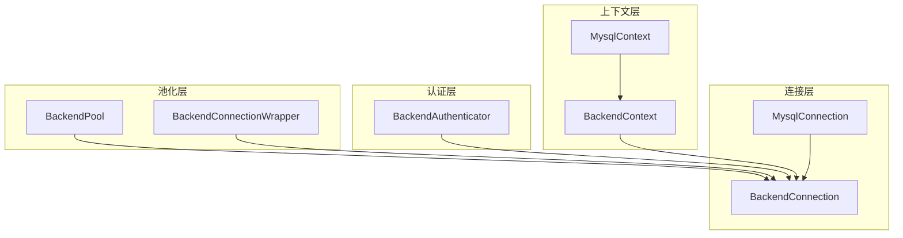
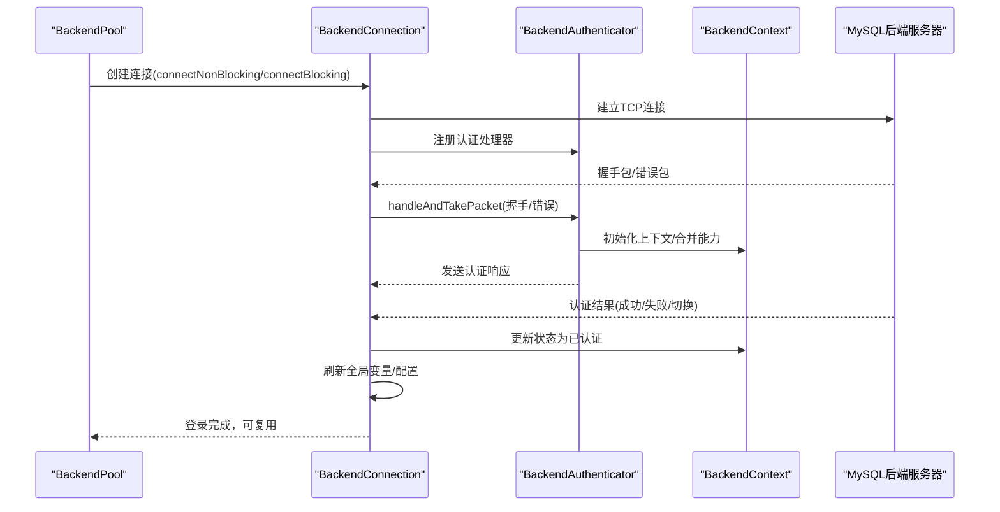
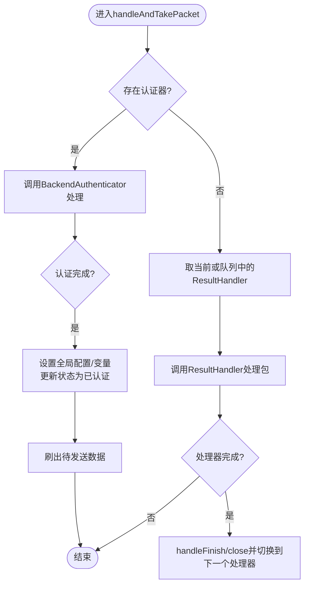
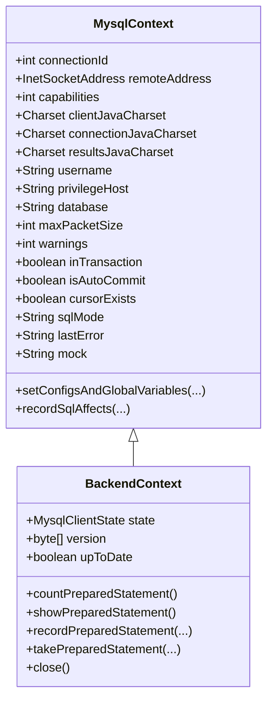
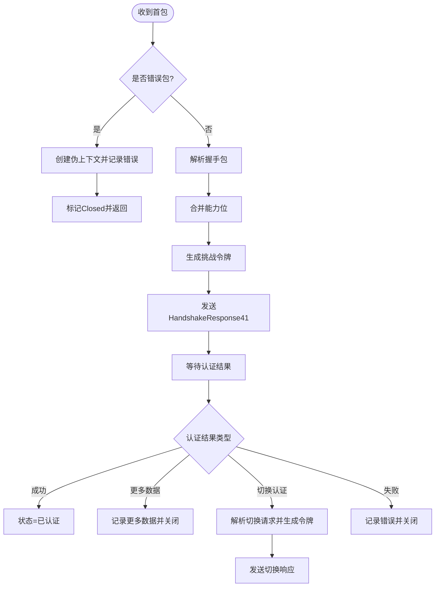
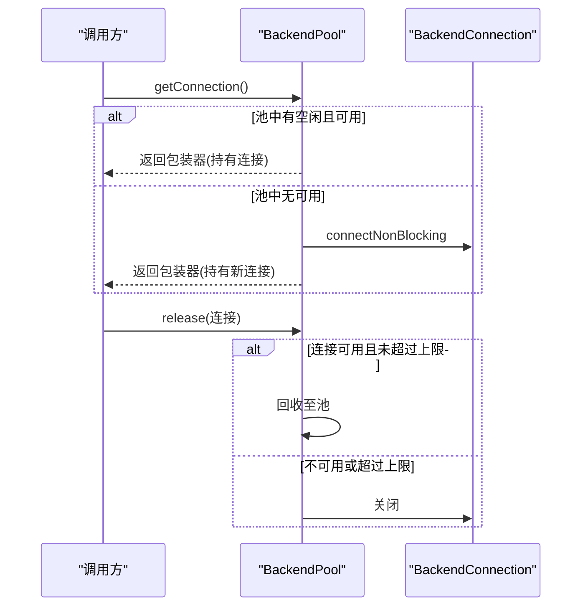
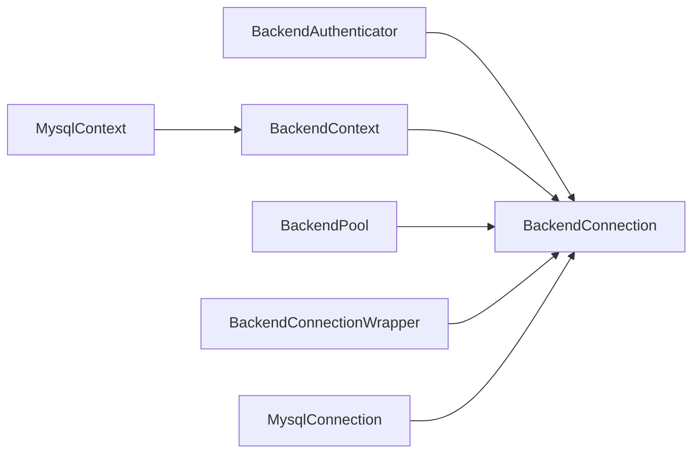

# 后端连接管理

<cite>
**本文引用的文件**
- [BackendConnection.java](file://proxy-core/src/main/java/com/alibaba/polardbx/proxy/connection/BackendConnection.java)
- [BackendContext.java](file://proxy-core/src/main/java/com/alibaba/polardbx/proxy/context/BackendContext.java)
- [BackendAuthenticator.java](file://proxy-core/src/main/java/com/alibaba/polardbx/proxy/protocol/handler/BackendAuthenticator.java)
- [MysqlConnection.java](file://proxy-core/src/main/java/com/alibaba/polardbx/proxy/connection/MysqlConnection.java)
- [BackendPool.java](file://proxy-core/src/main/java/com/alibaba/polardbx/proxy/connection/pool/BackendPool.java)
- [BackendConnectionWrapper.java](file://proxy-core/src/main/java/com/alibaba/polardbx/proxy/connection/pool/BackendConnectionWrapper.java)
- [MysqlContext.java](file://proxy-core/src/main/java/com/alibaba/polardbx/proxy/context/MysqlContext.java)
- [MysqlClientState.java](file://proxy-core/src/main/java/com/alibaba/polardbx/proxy/protocol/common/MysqlClientState.java)
- [config.properties](file://proxy-common/src/main/resources/config.properties)
- [BackendConnectionTest.java](file://proxy-core/src/test/java/com/alibaba/polardbx/proxy/client/BackendConnectionTest.java)
</cite>

## 目录
1. [简介](#简介)
2. [项目结构](#项目结构)
3. [核心组件](#核心组件)
4. [架构总览](#架构总览)
5. [组件详解](#组件详解)
6. [依赖关系分析](#依赖关系分析)
7. [性能考量](#性能考量)
8. [故障排查指南](#故障排查指南)
9. [结论](#结论)
10. [附录](#附录)

## 简介
本文件面向PolarDB-X Proxy的后端连接管理模块，系统性阐述BackendConnection类的设计架构与实现原理，覆盖与MySQL后端服务器的连接建立、认证流程、数据传输机制；BackendContext上下文管理（连接状态跟踪、会话信息维护、配置参数管理）；BackendAuthenticator后端认证处理器（认证协议适配、权限验证、连接池复用）；后端连接生命周期管理（创建、使用监控、异常处理、资源回收）；连接超时配置、重连机制与故障转移；连接池集成、性能监控与调试技巧等。

## 项目结构
后端连接管理位于proxy-core模块中，主要涉及以下包：
- connection：后端连接与MySQL协议封装
- context：前后端上下文与会话状态
- protocol：MySQL协议命令、解码器、编码器与处理器
- connection.pool：连接池与包装器
- serverless：高可用与读写分离相关能力（用于理解连接池刷新与故障转移）

图表来源
- [BackendConnection.java](file://proxy-core/src/main/java/com/alibaba/polardbx/proxy/connection/BackendConnection.java#L67-L813)
- [MysqlConnection.java](file://proxy-core/src/main/java/com/alibaba/polardbx/proxy/connection/MysqlConnection.java#L37-L158)
- [BackendContext.java](file://proxy-core/src/main/java/com/alibaba/polardbx/proxy/context/BackendContext.java#L37-L156)
- [MysqlContext.java](file://proxy-core/src/main/java/com/alibaba/polardbx/proxy/context/MysqlContext.java#L49-L266)
- [BackendAuthenticator.java](file://proxy-core/src/main/java/com/alibaba/polardbx/proxy/protocol/handler/BackendAuthenticator.java#L45-L212)
- [BackendPool.java](file://proxy-core/src/main/java/com/alibaba/polardbx/proxy/connection/pool/BackendPool.java#L46-L284)
- [BackendConnectionWrapper.java](file://proxy-core/src/main/java/com/alibaba/polardbx/proxy/connection/pool/BackendConnectionWrapper.java#L44-L275)

章节来源
- [BackendConnection.java](file://proxy-core/src/main/java/com/alibaba/polardbx/proxy/connection/BackendConnection.java#L67-L813)
- [BackendPool.java](file://proxy-core/src/main/java/com/alibaba/polardbx/proxy/connection/pool/BackendPool.java#L46-L284)

## 核心组件
- BackendConnection：后端MySQL连接的实现，继承自MysqlConnection，负责握手、认证、请求转发、结果处理、生命周期管理与资源回收。
- BackendContext：后端连接上下文，维护状态机、字符集、数据库、变量、预处理语句缓存等。
- BackendAuthenticator：后端认证处理器，适配MySQL握手响应、切换认证方式、处理错误与更多数据。
- MysqlConnection：通用MySQL协议连接基类，定义包探测、解码、编码与回调处理。
- BackendPool：后端连接池，负责连接创建、复用、空闲检查、全局变量刷新与池内回收。
- BackendConnectionWrapper：连接池包装器，对外暴露统一接口，负责持有与释放底层连接。
- MysqlContext：MySQL上下文抽象，提供字符集、状态、变量、SQL解析与影响记录等能力。
- MysqlClientState：客户端状态枚举，驱动认证流程推进。

章节来源
- [BackendConnection.java](file://proxy-core/src/main/java/com/alibaba/polardbx/proxy/connection/BackendConnection.java#L67-L813)
- [BackendContext.java](file://proxy-core/src/main/java/com/alibaba/polardbx/proxy/context/BackendContext.java#L37-L156)
- [BackendAuthenticator.java](file://proxy-core/src/main/java/com/alibaba/polardbx/proxy/protocol/handler/BackendAuthenticator.java#L45-L212)
- [MysqlConnection.java](file://proxy-core/src/main/java/com/alibaba/polardbx/proxy/connection/MysqlConnection.java#L37-L158)
- [BackendPool.java](file://proxy-core/src/main/java/com/alibaba/polardbx/proxy/connection/pool/BackendPool.java#L46-L284)
- [BackendConnectionWrapper.java](file://proxy-core/src/main/java/com/alibaba/polardbx/proxy/connection/pool/BackendConnectionWrapper.java#L44-L275)
- [MysqlContext.java](file://proxy-core/src/main/java/com/alibaba/polardbx/proxy/context/MysqlContext.java#L49-L266)
- [MysqlClientState.java](file://proxy-core/src/main/java/com/alibaba/polardbx/proxy/protocol/common/MysqlClientState.java#L21-L31)

## 架构总览
后端连接管理采用“连接+上下文+认证处理器”的分层设计：
- 连接层：MysqlConnection提供MySQL包解析与处理框架；BackendConnection在握手与认证阶段由BackendAuthenticator接管，认证完成后交由ResultHandler链路处理业务结果。
- 上下文层：MysqlContext统一管理字符集、状态、变量；BackendContext扩展状态机与PS缓存。
- 认证层：BackendAuthenticator根据首包类型判断是否握手成功或失败，并按需发送认证响应或切换认证插件。
- 池化层：BackendPool负责连接池化、空闲连接复用、全局变量刷新与池内回收；BackendConnectionWrapper提供线程安全的连接使用与释放。

图表来源
- [BackendPool.java](file://proxy-core/src/main/java/com/alibaba/polardbx/proxy/connection/pool/BackendPool.java#L115-L132)
- [BackendConnection.java](file://proxy-core/src/main/java/com/alibaba/polardbx/proxy/connection/BackendConnection.java#L118-L160)
- [BackendAuthenticator.java](file://proxy-core/src/main/java/com/alibaba/polardbx/proxy/protocol/handler/BackendAuthenticator.java#L70-L210)
- [BackendContext.java](file://proxy-core/src/main/java/com/alibaba/polardbx/proxy/context/BackendContext.java#L51-L58)

## 组件详解

### BackendConnection：后端连接实现
- 继承自MysqlConnection，扩展了认证阶段的处理器接管、结果处理器队列、待发送数据队列、连接状态原子引用与登录Future。
- 认证阶段：在handleAndTakePacket中优先交给BackendAuthenticator处理，认证完成后设置上下文配置并通知等待方。
- 正常阶段：从队列取出当前ResultHandler处理包，完成后触发handleFinish并清理。
- 生命周期：构造时注册BackendAuthenticator；关闭时异步释放认证器、结果处理器与上下文；移除全局集合。
- 请求发送：支持查询、初始化数据库、预处理、PS重置与关闭等，均通过Encoder编码并入队或直接写出，同时将ResultHandler入队以保证顺序与回调。

图表来源
- [BackendConnection.java](file://proxy-core/src/main/java/com/alibaba/polardbx/proxy/connection/BackendConnection.java#L124-L200)

章节来源
- [BackendConnection.java](file://proxy-core/src/main/java/com/alibaba/polardbx/proxy/connection/BackendConnection.java#L67-L813)

### BackendContext：后端上下文管理
- 维护MysqlClientState状态机、版本号、是否最新等元信息。
- 提供预处理语句LRU缓存，记录/取回PS ID并在切换活跃连接时自动关闭旧PS。
- 支持记录PreparedStatement数量与展示内容，便于诊断。
- 关闭时设置状态为Closed并执行泄漏检测收尾。

图表来源
- [MysqlContext.java](file://proxy-core/src/main/java/com/alibaba/polardbx/proxy/context/MysqlContext.java#L49-L266)
- [BackendContext.java](file://proxy-core/src/main/java/com/alibaba/polardbx/proxy/context/BackendContext.java#L37-L156)

章节来源
- [BackendContext.java](file://proxy-core/src/main/java/com/alibaba/polardbx/proxy/context/BackendContext.java#L37-L156)
- [MysqlContext.java](file://proxy-core/src/main/java/com/alibaba/polardbx/proxy/context/MysqlContext.java#L49-L266)

### BackendAuthenticator：后端认证处理器
- 首包处理：若首包为错误码则伪造上下文并标记Closed；否则解析握手包，合并能力位，准备挑战令牌并发送HandshakeResponse41。
- 认证结果处理：成功、更多数据、切换认证方式、失败等分支分别设置状态与错误信息。
- 支持caching_sha2_password切换场景，生成对应令牌并发送响应。
- 处理完成后不“吞掉”包，返回未处理标志以便上层继续流转。

图表来源
- [BackendAuthenticator.java](file://proxy-core/src/main/java/com/alibaba/polardbx/proxy/protocol/handler/BackendAuthenticator.java#L70-L210)

章节来源
- [BackendAuthenticator.java](file://proxy-core/src/main/java/com/alibaba/polardbx/proxy/protocol/handler/BackendAuthenticator.java#L45-L212)
- [MysqlClientState.java](file://proxy-core/src/main/java/com/alibaba/polardbx/proxy/protocol/common/MysqlClientState.java#L21-L31)

### MysqlConnection：MySQL协议连接基类
- 定义包探测逻辑（支持大包拼接），提供Decoder/Encoder框架。
- onPacket中逐包调用子类handleAndTakePacket，并在最后统一flush。
- handleFinish提供子类扩展点，用于收尾工作（如关闭认证器、处理器、上下文）。

章节来源
- [MysqlConnection.java](file://proxy-core/src/main/java/com/alibaba/polardbx/proxy/connection/MysqlConnection.java#L37-L158)

### BackendPool：后端连接池
- 负责连接池化：从池中取出或新建连接，设置池信息（只读配置、全局变量）。
- 复用策略：空闲连接复用，超过最大池大小则关闭；连接不可用或仍有用户请求则直接关闭。
- 全局变量刷新：周期性拉取后端全局变量，用于后续连接的上下文初始化。
- 连接健康检查：按比例对空闲连接执行轻量查询以保持活性。

图表来源
- [BackendPool.java](file://proxy-core/src/main/java/com/alibaba/polardbx/proxy/connection/pool/BackendPool.java#L115-L165)

章节来源
- [BackendPool.java](file://proxy-core/src/main/java/com/alibaba/polardbx/proxy/connection/pool/BackendPool.java#L46-L284)

### BackendConnectionWrapper：连接池包装器
- 对外提供统一接口：forward、sendQuery、sendPrepare、reset/close PS、initDB、restoreContext等。
- 在关闭时将连接归还给BackendPool，或在discard时直接关闭。
- 提供探针方法：获取后端标签、连接ID、是否从库等。

章节来源
- [BackendConnectionWrapper.java](file://proxy-core/src/main/java/com/alibaba/polardbx/proxy/connection/pool/BackendConnectionWrapper.java#L44-L275)

### MysqlContext：上下文与会话信息
- 统一管理字符集（客户端/连接/结果）、状态（事务、自动提交、游标）、变量（用户变量、系统变量）。
- 提供SQL解析与影响记录，用于权限刷新与数据库切换。
- 提供setConfigsAndGlobalVariables，将连接池传递的只读配置与全局变量注入上下文。

章节来源
- [MysqlContext.java](file://proxy-core/src/main/java/com/alibaba/polardbx/proxy/context/MysqlContext.java#L49-L266)

## 依赖关系分析
- BackendConnection依赖BackendAuthenticator进行认证，依赖BackendContext维护状态与配置。
- BackendPool管理BackendConnection的创建、复用与回收，并向连接注入只读配置与全局变量。
- BackendConnectionWrapper作为池化访问入口，向上层屏蔽连接生命周期细节。
- MysqlContext为BackendContext提供基础能力，二者共同构成后端会话上下文。

图表来源
- [BackendConnection.java](file://proxy-core/src/main/java/com/alibaba/polardbx/proxy/connection/BackendConnection.java#L67-L813)
- [BackendAuthenticator.java](file://proxy-core/src/main/java/com/alibaba/polardbx/proxy/protocol/handler/BackendAuthenticator.java#L45-L212)
- [BackendContext.java](file://proxy-core/src/main/java/com/alibaba/polardbx/proxy/context/BackendContext.java#L37-L156)
- [MysqlContext.java](file://proxy-core/src/main/java/com/alibaba/polardbx/proxy/context/MysqlContext.java#L49-L266)
- [BackendPool.java](file://proxy-core/src/main/java/com/alibaba/polardbx/proxy/connection/pool/BackendPool.java#L46-L284)
- [BackendConnectionWrapper.java](file://proxy-core/src/main/java/com/alibaba/polardbx/proxy/connection/pool/BackendConnectionWrapper.java#L44-L275)
- [MysqlConnection.java](file://proxy-core/src/main/java/com/alibaba/polardbx/proxy/connection/MysqlConnection.java#L37-L158)

## 性能考量
- 连接池复用：BackendPool通过ConcurrentLinkedQueue存放空闲连接，减少频繁建连开销；通过setMaxPooled限制池大小，避免过度占用资源。
- 全局变量缓存：BackendPool定期刷新全局变量，降低每次连接的额外查询成本；BackendContext维护PS LRU缓存，减少重复预处理开销。
- 字符集与编码：MysqlContext统一管理字符集，避免重复转换；BackendConnection在认证完成后根据上下文修正查询编码，减少错误重试。
- 异步关闭：BackendConnection在关闭时将认证器、处理器与上下文释放放入异步任务，避免阻塞事件循环。
- 大包处理：MysqlConnection的包探测支持最大负载包拼接，确保大数据包完整处理。

章节来源
- [BackendPool.java](file://proxy-core/src/main/java/com/alibaba/polardbx/proxy/connection/pool/BackendPool.java#L167-L250)
- [BackendContext.java](file://proxy-core/src/main/java/com/alibaba/polardbx/proxy/context/BackendContext.java#L57-L145)
- [MysqlContext.java](file://proxy-core/src/main/java/com/alibaba/polardbx/proxy/context/MysqlContext.java#L128-L183)
- [BackendConnection.java](file://proxy-core/src/main/java/com/alibaba/polardbx/proxy/connection/BackendConnection.java#L258-L287)
- [MysqlConnection.java](file://proxy-core/src/main/java/com/alibaba/polardbx/proxy/connection/MysqlConnection.java#L67-L89)

## 故障排查指南
- 认证失败定位
  - BackendAuthenticator在收到错误包时会记录错误码与消息，并将状态置为Closed；检查日志中的错误字符串与错误码。
  - 若出现“需要切换认证方式”，确认后端服务器的认证插件与代理侧支持情况。
- 连接不可用
  - BackendPool.release在回收前会检查连接是否isGood以及是否存在用户请求；若不可用或仍有用户请求，连接会被直接关闭。
  - 使用BackendConnectionWrapper.probeBackendTag()与probeConnectionId()快速定位后端连接标识。
- 查询异常
  - BackendConnection.sendQuery在发送前会根据上下文修正编码；若出现乱码或编码错误，检查MysqlContext的字符集设置。
  - 结果处理器未完成导致的异常，可在handleFinish中查看具体处理器状态。
- 超时与重连
  - BackendConnection.connectBlocking在指定超时内等待有效连接与登录完成；超时会抛出异常，建议结合日志定位网络或认证问题。
  - Scheduler在转发失败时可能触发重传或切换到主节点，检查重传限制与LSN过期策略。

章节来源
- [BackendAuthenticator.java](file://proxy-core/src/main/java/com/alibaba/polardbx/proxy/protocol/handler/BackendAuthenticator.java#L70-L210)
- [BackendPool.java](file://proxy-core/src/main/java/com/alibaba/polardbx/proxy/connection/pool/BackendPool.java#L134-L165)
- [BackendConnectionWrapper.java](file://proxy-core/src/main/java/com/alibaba/polardbx/proxy/connection/pool/BackendConnectionWrapper.java#L61-L84)
- [BackendConnection.java](file://proxy-core/src/main/java/com/alibaba/polardbx/proxy/connection/BackendConnection.java#L355-L422)
- [Scheduler.java](file://proxy-core/src/main/java/com/alibaba/polardbx/proxy/scheduler/Scheduler.java#L234-L266)

## 结论
后端连接管理模块通过清晰的分层设计实现了与MySQL后端的稳定交互：MysqlConnection提供协议处理框架，BackendConnection承载认证与业务处理，BackendContext与MysqlContext共同维护会话状态与配置，BackendPool与BackendConnectionWrapper实现高效的连接池化与复用。配合全局变量刷新、PS缓存与异步关闭等机制，在保证可靠性的同时兼顾性能与可观测性。

## 附录

### 连接超时与重连配置
- 后端连接超时：BackendConnection.connectBlocking在建立TCP连接与等待登录阶段均有超时控制，超时会抛出异常。
- 连接池最大容量：BackendPool.setMaxPooled可动态调整池大小。
- 全局变量刷新间隔：BackendPool.refreshPool按配置周期刷新全局变量。
- 重传与故障转移：Scheduler在转发失败时根据状态与限制条件触发重传或切换主节点。

章节来源
- [BackendConnection.java](file://proxy-core/src/main/java/com/alibaba/polardbx/proxy/connection/BackendConnection.java#L700-L775)
- [BackendPool.java](file://proxy-core/src/main/java/com/alibaba/polardbx/proxy/connection/pool/BackendPool.java#L100-L105)
- [BackendPool.java](file://proxy-core/src/main/java/com/alibaba/polardbx/proxy/connection/pool/BackendPool.java#L210-L250)
- [Scheduler.java](file://proxy-core/src/main/java/com/alibaba/polardbx/proxy/scheduler/Scheduler.java#L234-L266)

### 实际应用示例
- 连接池使用：通过BackendPool.getConnection()获取连接包装器，waitLogin等待认证完成，随后并发发送查询。
- 预处理语句：通过sendPrepare获取StmtPrepareResultHandler，结合BackendContext的PS缓存提升复用效率。
- 用户切换与上下文恢复：BackendConnectionWrapper.restoreContext支持在不同用户间切换并恢复会话状态。

章节来源
- [BackendConnectionTest.java](file://proxy-core/src/test/java/com/alibaba/polardbx/proxy/client/BackendConnectionTest.java#L87-L112)
- [BackendConnectionWrapper.java](file://proxy-core/src/main/java/com/alibaba/polardbx/proxy/connection/pool/BackendConnectionWrapper.java#L165-L238)
- [BackendContext.java](file://proxy-core/src/main/java/com/alibaba/polardbx/proxy/context/BackendContext.java#L118-L145)