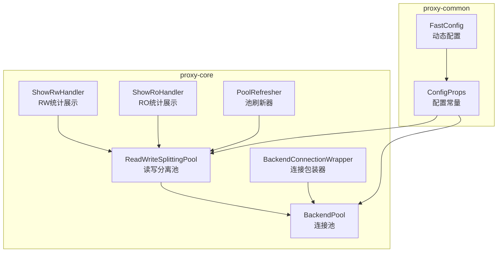
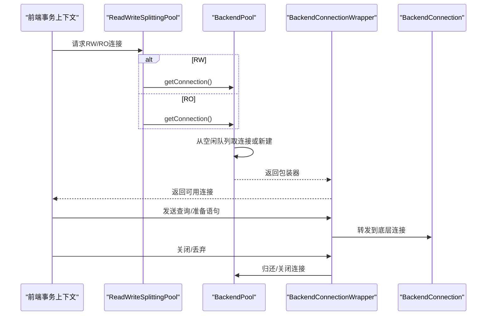
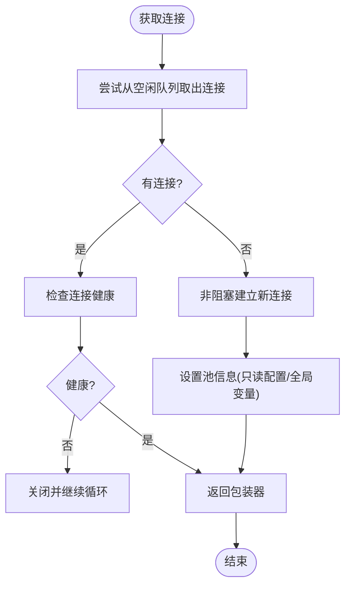
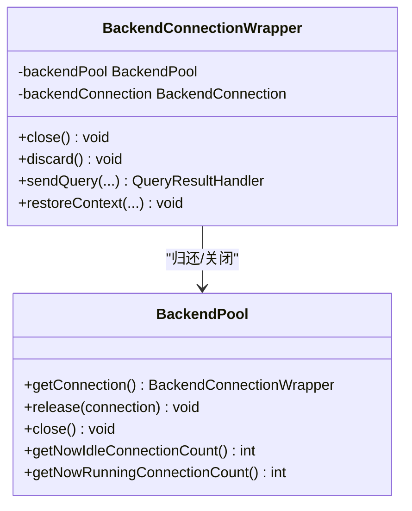
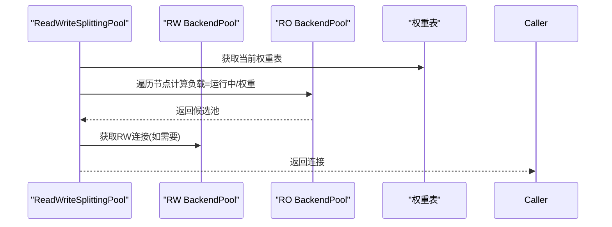
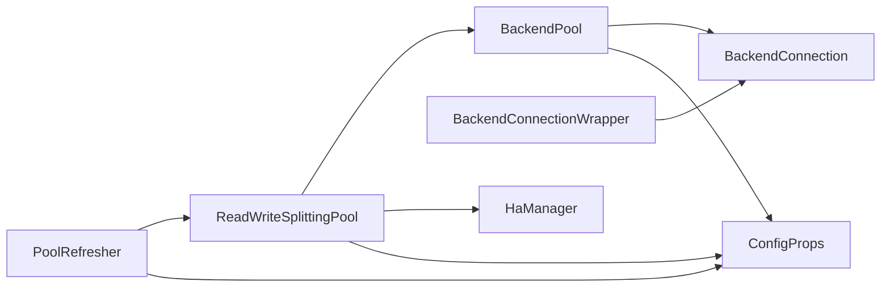
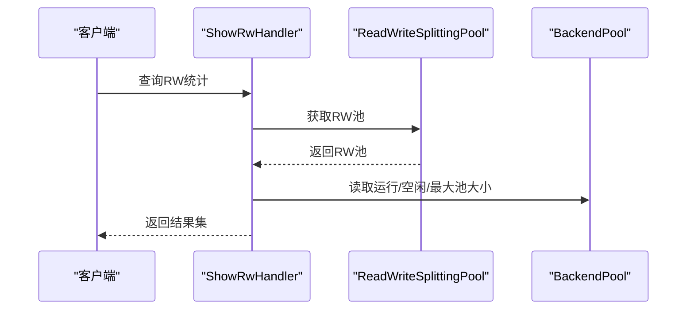

# 连接池机制

<cite>
**本文引用的文件**
- [BackendPool.java](file://proxy-core/src/main/java/com/alibaba/polardbx/proxy/connection/pool/BackendPool.java)
- [BackendConnectionWrapper.java](file://proxy-core/src/main/java/com/alibaba/polardbx/proxy/connection/pool/BackendConnectionWrapper.java)
- [ReadWriteSplittingPool.java](file://proxy-core/src/main/java/com/alibaba/polardbx/proxy/serverless/ReadWriteSplittingPool.java)
- [ConfigProps.java](file://proxy-common/src/main/java/com/alibaba/polardbx/proxy/config/ConfigProps.java)
- [FastConfig.java](file://proxy-common/src/main/java/com/alibaba/polardbx/proxy/config/FastConfig.java)
- [ShowRwHandler.java](file://proxy-core/src/main/java/com/alibaba/polardbx/proxy/protocol/handler/request/ShowRwHandler.java)
- [ShowRoHandler.java](file://proxy-core/src/main/java/com/alibaba/polardbx/proxy/protocol/handler/request/ShowRoHandler.java)
- [PoolRefresher.java](file://proxy-core/src/main/java/com/alibaba/polardbx/proxy/serverless/PoolRefresher.java)
- [BackendConnectionTest.java](file://proxy-core/src/test/java/com/alibaba/polardbx/proxy/client/BackendConnectionTest.java)
</cite>

## 目录
1. [简介](#简介)
2. [项目结构](#项目结构)
3. [核心组件](#核心组件)
4. [架构总览](#架构总览)
5. [组件详解](#组件详解)
6. [依赖关系分析](#依赖关系分析)
7. [性能与并发特性](#性能与并发特性)
8. [监控与统计](#监控与统计)
9. [故障与恢复](#故障与恢复)
10. [配置与调优](#配置与调优)
11. [排障指南](#排障指南)
12. [结论](#结论)

## 简介
本文件系统性解析 PolarDB-X Proxy 的后端连接池机制，重点覆盖 BackendPool 连接池的设计与实现、BackendConnectionWrapper 包装器的作用与生命周期管理，并结合读写分离池 ReadWriteSplittingPool 的组织方式，给出连接池的初始化、分配策略、资源回收、并发控制、监控统计、故障恢复与配置调优的完整说明。同时提供可操作的最佳实践与排障建议。

## 项目结构
围绕连接池的关键代码位于以下模块：
- proxy-core：连接池实现、包装器、读写分离池、监控展示、定时刷新
- proxy-common：配置常量与默认值

图表来源
- [BackendPool.java](file://proxy-core/src/main/java/com/alibaba/polardbx/proxy/connection/pool/BackendPool.java#L46-L283)
- [BackendConnectionWrapper.java](file://proxy-core/src/main/java/com/alibaba/polardbx/proxy/connection/pool/BackendConnectionWrapper.java#L44-L274)
- [ReadWriteSplittingPool.java](file://proxy-core/src/main/java/com/alibaba/polardbx/proxy/serverless/ReadWriteSplittingPool.java#L48-L406)
- [ShowRwHandler.java](file://proxy-core/src/main/java/com/alibaba/polardbx/proxy/protocol/handler/request/ShowRwHandler.java#L31-L90)
- [ShowRoHandler.java](file://proxy-core/src/main/java/com/alibaba/polardbx/proxy/protocol/handler/request/ShowRoHandler.java#L32-L95)
- [PoolRefresher.java](file://proxy-core/src/main/java/com/alibaba/polardbx/proxy/serverless/PoolRefresher.java#L35-L84)
- [ConfigProps.java](file://proxy-common/src/main/java/com/alibaba/polardbx/proxy/config/ConfigProps.java#L23-L209)
- [FastConfig.java](file://proxy-common/src/main/java/com/alibaba/polardbx/proxy/config/FastConfig.java#L21-L75)

章节来源
- [BackendPool.java](file://proxy-core/src/main/java/com/alibaba/polardbx/proxy/connection/pool/BackendPool.java#L46-L283)
- [ReadWriteSplittingPool.java](file://proxy-core/src/main/java/com/alibaba/polardbx/proxy/serverless/ReadWriteSplittingPool.java#L48-L406)
- [ConfigProps.java](file://proxy-common/src/main/java/com/alibaba/polardbx/proxy/config/ConfigProps.java#L23-L209)

## 核心组件
- BackendPool：后端连接池，负责连接的创建、复用、回收与健康检查；维护空闲队列与运行计数；支持按比例刷新空闲连接。
- BackendConnectionWrapper：连接包装器，封装底层 BackendConnection，提供统一的发送查询、准备语句、上下文恢复、读写控制等能力，并在关闭时将连接归还池中。
- ReadWriteSplittingPool：读写分离池，聚合 RW/RO 后端池，根据权重与延迟选择合适的 RO 节点，暴露获取连接的接口。
- 配置体系：ConfigProps 定义连接池相关配置项（如最大池大小、刷新间隔、超时等），FastConfig 提供运行时动态读取。

章节来源
- [BackendPool.java](file://proxy-core/src/main/java/com/alibaba/polardbx/proxy/connection/pool/BackendPool.java#L46-L283)
- [BackendConnectionWrapper.java](file://proxy-core/src/main/java/com/alibaba/polardbx/proxy/connection/pool/BackendConnectionWrapper.java#L44-L274)
- [ReadWriteSplittingPool.java](file://proxy-core/src/main/java/com/alibaba/polardbx/proxy/serverless/ReadWriteSplittingPool.java#L48-L406)
- [ConfigProps.java](file://proxy-common/src/main/java/com/alibaba/polardbx/proxy/config/ConfigProps.java#L23-L209)

## 架构总览
连接池在 Proxy 中的定位与交互如下：
- 前端事务上下文通过 ReadWriteSplittingPool 获取 RW 或 RO 连接。
- ReadWriteSplittingPool 内部持有多个 BackendPool 实例（RW 一个，RO 多个）。
- BackendPool 使用无锁队列存放空闲连接，必要时新建连接；释放连接时根据 maxPooled 判断是否复用或关闭。
- BackendConnectionWrapper 在构造时增加“运行中”计数，在关闭时减少并归还池。

图表来源
- [ReadWriteSplittingPool.java](file://proxy-core/src/main/java/com/alibaba/polardbx/proxy/serverless/ReadWriteSplittingPool.java#L343-L393)
- [BackendPool.java](file://proxy-core/src/main/java/com/alibaba/polardbx/proxy/connection/pool/BackendPool.java#L115-L132)
- [BackendConnectionWrapper.java](file://proxy-core/src/main/java/com/alibaba/polardbx/proxy/connection/pool/BackendConnectionWrapper.java#L240-L265)

## 组件详解

### BackendPool：连接池设计与实现
- 初始化与参数
  - 接收后端地址、代理令牌、用户名、加密密码、默认库、最大池大小、是否从节点标记。
  - 使用无锁队列保存空闲连接，使用原子计数记录空闲与运行中的连接数。
- 连接分配策略
  - 先尝试从空闲队列取出连接；若为空则非阻塞建立新连接。
  - 取出的连接会进行健康检查，不健康则立即关闭并重试。
  - 成功后返回包装器，包装器内部增加“运行中”计数。
- 资源回收机制
  - 释放连接时先恢复读监听，再判断连接健康与是否有待处理请求。
  - 若连接健康且无待处理请求，则在 synchronized 块内比较当前空闲数与 maxPooled，决定复用或关闭。
  - 池关闭时将 maxPooled 设为负值并清空队列，确保不再复用。
- 连接刷新
  - 支持按比例扫描空闲连接，对超过阈值的空闲连接执行轻量查询以保持活跃，失败则关闭。
  - 全局变量缓存定期刷新，避免长时间不更新导致的配置不同步。
- 数据与统计
  - 提供空闲连接数与运行中连接数的查询接口，用于监控与调度。

图表来源
- [BackendPool.java](file://proxy-core/src/main/java/com/alibaba/polardbx/proxy/connection/pool/BackendPool.java#L115-L132)

章节来源
- [BackendPool.java](file://proxy-core/src/main/java/com/alibaba/polardbx/proxy/connection/pool/BackendPool.java#L46-L283)

### BackendConnectionWrapper：包装器的作用与生命周期
- 生命周期管理
  - 构造时增加运行中计数；关闭时减少计数并将连接归还池；丢弃时直接关闭。
  - 包装器内部使用同步块避免在回调中关闭导致死锁。
- 功能封装
  - 提供转发、等待登录、启用/禁用读、初始化数据库、发送查询、准备语句、清理预处理语句等方法。
  - 支持上下文恢复：切换用户、恢复自动提交、恢复数据库等。
- 异常与资源回收
  - 所有方法均在 finally 中确保包与处理器资源被释放。
  - 当包装器已关闭时，后续调用抛出异常，防止误用。

图表来源
- [BackendPool.java](file://proxy-core/src/main/java/com/alibaba/polardbx/proxy/connection/pool/BackendPool.java#L115-L165)
- [BackendConnectionWrapper.java](file://proxy-core/src/main/java/com/alibaba/polardbx/proxy/connection/pool/BackendConnectionWrapper.java#L44-L274)

章节来源
- [BackendConnectionWrapper.java](file://proxy-core/src/main/java/com/alibaba/polardbx/proxy/connection/pool/BackendConnectionWrapper.java#L44-L274)

### 读写分离池 ReadWriteSplittingPool：组织与调度
- 维护 RW 与 RO 池
  - RW 池指向当前主节点；RO 池维护所有可读节点（可选包含主节点）。
  - 根据权重表与延迟阈值选择 RO 节点，优先选择空闲度高且延迟满足要求的节点。
- 连接获取
  - RW：直接从 RW 池获取。
  - RO：遍历权重表计算负载（运行中/权重），选择最优节点。
- 动态更新
  - 基于集群健康状态与延迟监控动态增删改 RO 池，权重表按排序后随机化以均衡分布。

图表来源
- [ReadWriteSplittingPool.java](file://proxy-core/src/main/java/com/alibaba/polardbx/proxy/serverless/ReadWriteSplittingPool.java#L365-L393)

章节来源
- [ReadWriteSplittingPool.java](file://proxy-core/src/main/java/com/alibaba/polardbx/proxy/serverless/ReadWriteSplittingPool.java#L48-L406)

## 依赖关系分析
- BackendPool 依赖：
  - NIOWorker/NIOProcessor：用于非阻塞建立连接。
  - BackendConnection：具体网络连接实现。
  - ReadOnlyConfigs/globalVariables：只读配置与全局变量缓存。
- BackendConnectionWrapper 依赖：
  - BackendConnection：底层连接。
  - 上下文：FrontendContext/BackendContext，用于恢复用户与状态。
- ReadWriteSplittingPool 依赖：
  - HaManager：集群健康与延迟监控。
  - ConfigProps：读写分离开关、权重、延迟阈值等。
- PoolRefresher 依赖：
  - ConfigProps：刷新线程数、间隔、SQL、超时等。

图表来源
- [BackendPool.java](file://proxy-core/src/main/java/com/alibaba/polardbx/proxy/connection/pool/BackendPool.java#L21-L44)
- [ReadWriteSplittingPool.java](file://proxy-core/src/main/java/com/alibaba/polardbx/proxy/serverless/ReadWriteSplittingPool.java#L21-L46)
- [PoolRefresher.java](file://proxy-core/src/main/java/com/alibaba/polardbx/proxy/serverless/PoolRefresher.java#L35-L84)

章节来源
- [BackendPool.java](file://proxy-core/src/main/java/com/alibaba/polardbx/proxy/connection/pool/BackendPool.java#L21-L44)
- [ReadWriteSplittingPool.java](file://proxy-core/src/main/java/com/alibaba/polardbx/proxy/serverless/ReadWriteSplittingPool.java#L21-L46)
- [PoolRefresher.java](file://proxy-core/src/main/java/com/alibaba/polardbx/proxy/serverless/PoolRefresher.java#L35-L84)

## 性能与并发特性
- 并发控制
  - 空闲队列采用无锁队列，降低锁竞争。
  - 释放连接时使用 synchronized 块保护 maxPooled 与空闲计数一致性，避免池关闭时的泄漏。
  - 包装器内部使用对象级同步，避免回调中关闭导致死锁。
- 性能优化
  - 非阻塞建立连接，避免阻塞 Reactor 线程。
  - 连接刷新采用异步线程池，避免阻塞主线程。
  - 权重表按排序后随机化，提升负载均衡效果。
- 时间复杂度
  - 获取连接：摊销 O(1)，最坏 O(n)（n 为空闲队列长度）。
  - 释放连接：O(1)（synchronized 仅在边界条件时触发）。
  - 刷新扫描：O(k)（k 为扫描比例 × 空闲数）。

章节来源
- [BackendPool.java](file://proxy-core/src/main/java/com/alibaba/polardbx/proxy/connection/pool/BackendPool.java#L58-L165)
- [BackendConnectionWrapper.java](file://proxy-core/src/main/java/com/alibaba/polardbx/proxy/connection/pool/BackendConnectionWrapper.java#L44-L110)
- [ReadWriteSplittingPool.java](file://proxy-core/src/main/java/com/alibaba/polardbx/proxy/serverless/ReadWriteSplittingPool.java#L365-L393)
- [PoolRefresher.java](file://proxy-core/src/main/java/com/alibaba/polardbx/proxy/serverless/PoolRefresher.java#L35-L84)

## 监控与统计
- 运行时指标
  - 空闲连接数：BackendPool.getNowIdleConnectionCount()
  - 运行中连接数：BackendPool.getNowRunningConnectionCount()
- 展示接口
  - ShowRwHandler：展示 RW 池的地址、权重、运行/空闲/最大池大小、角色、令牌前缀、RTT、延迟、更新时间等。
  - ShowRoHandler：展示 RO 池的地址、权重、运行/空闲/最大池大小、角色、令牌前缀、RTT、延迟、更新时间等。
- 全局变量与只读配置
  - 后端全局变量缓存定期刷新，避免长时间不更新导致的配置不同步。

图表来源
- [ShowRwHandler.java](file://proxy-core/src/main/java/com/alibaba/polardbx/proxy/protocol/handler/request/ShowRwHandler.java#L64-L89)
- [ShowRoHandler.java](file://proxy-core/src/main/java/com/alibaba/polardbx/proxy/protocol/handler/request/ShowRoHandler.java#L44-L94)
- [ReadWriteSplittingPool.java](file://proxy-core/src/main/java/com/alibaba/polardbx/proxy/serverless/ReadWriteSplittingPool.java#L343-L393)
- [BackendPool.java](file://proxy-core/src/main/java/com/alibaba/polardbx/proxy/connection/pool/BackendPool.java#L107-L113)

章节来源
- [ShowRwHandler.java](file://proxy-core/src/main/java/com/alibaba/polardbx/proxy/protocol/handler/request/ShowRwHandler.java#L31-L90)
- [ShowRoHandler.java](file://proxy-core/src/main/java/com/alibaba/polardbx/proxy/protocol/handler/request/ShowRoHandler.java#L32-L95)
- [BackendPool.java](file://proxy-core/src/main/java/com/alibaba/polardbx/proxy/connection/pool/BackendPool.java#L107-L113)

## 故障与恢复
- 连接健康检查
  - 获取连接时检查 isGood；释放连接时检查 pending 用户请求；不健康或有未完成请求则关闭。
- 异常处理
  - 刷新任务捕获异常并记录日志，确保不影响其他连接。
  - 包装器在 finally 中确保资源释放，避免泄漏。
- 关闭流程
  - BackendPool.close 将 maxPooled 置为负值并清空队列，确保不再复用。
  - 包装器关闭时减少运行中计数并归还池。
- 线程安全
  - 避免在 Reactor 线程中执行阻塞操作（如 loadDbConfigs 明确禁止在 Reactor 线程中调用）。

章节来源
- [BackendPool.java](file://proxy-core/src/main/java/com/alibaba/polardbx/proxy/connection/pool/BackendPool.java#L115-L165)
- [BackendConnectionWrapper.java](file://proxy-core/src/main/java/com/alibaba/polardbx/proxy/connection/pool/BackendConnectionWrapper.java#L240-L265)
- [ReadWriteSplittingPool.java](file://proxy-core/src/main/java/com/alibaba/polardbx/proxy/serverless/ReadWriteSplittingPool.java#L327-L341)

## 配置与调优
- 连接池核心配置（来自 ConfigProps）
  - 后端连接超时：backend_connect_timeout
  - 管理/读写/只读池最大连接数：backend_admin_max_pooled_size、backend_rw_max_pooled_size、backend_ro_max_pooled_size
  - 连接池刷新线程数/间隔/SQL/超时：backend_pool_refresh_threads、backend_pool_refresh_task_interval、backend_pool_refresh_interval、backend_pool_refresh_sql、backend_pool_refresh_timeout
  - 全局变量刷新间隔：global_variables_refresh_interval
  - 读写分离开关与权重：enable_read_write_splitting、enable_follower_read、enable_leader_in_ro_pools、read_weights、slave_read_latency_threshold
- 默认值参考
  - RW/RO 最大池大小默认较大，适合高并发场景。
  - 刷新间隔与线程数默认适中，可根据集群规模调整。
- 调优建议
  - 根据 QPS 与 RTT 设置 maxPooled，避免频繁创建/销毁连接。
  - 合理设置刷新间隔与线程数，平衡连接活性与 CPU 开销。
  - RO 节点权重与延迟阈值应结合实际拓扑与网络质量调整。

章节来源
- [ConfigProps.java](file://proxy-common/src/main/java/com/alibaba/polardbx/proxy/config/ConfigProps.java#L39-L98)
- [ConfigProps.java](file://proxy-common/src/main/java/com/alibaba/polardbx/proxy/config/ConfigProps.java#L146-L188)
- [FastConfig.java](file://proxy-common/src/main/java/com/alibaba/polardbx/proxy/config/FastConfig.java#L45-L73)

## 排障指南
- 连接泄漏
  - 确认所有通过包装器获取的连接最终都会被关闭或丢弃；包装器在 finally 中确保资源释放。
  - 检查事务上下文是否正确关闭，避免持有连接过久。
- 连接抖动
  - 检查刷新任务是否频繁关闭连接，适当增大刷新间隔或比例。
  - 观察 RO 节点延迟是否超过阈值，导致被剔除。
- 性能瓶颈
  - 检查刷新线程池是否饱和，适当增加线程数。
  - 评估 maxPooled 是否过小导致频繁创建连接。
- 测试验证
  - 可参考单元测试示例，验证池行为与连接生命周期。

章节来源
- [BackendConnectionWrapper.java](file://proxy-core/src/main/java/com/alibaba/polardbx/proxy/connection/pool/BackendConnectionWrapper.java#L87-L149)
- [BackendConnectionTest.java](file://proxy-core/src/test/java/com/alibaba/polardbx/proxy/client/BackendConnectionTest.java#L87-L113)

## 结论
PolarDB-X Proxy 的连接池通过 BackendPool 与 BackendConnectionWrapper 实现了高效、安全、可观测的后端连接管理。配合 ReadWriteSplittingPool 的读写分离与 PoolRefresher 的异步刷新，整体具备良好的扩展性与稳定性。合理配置与持续监控是保障生产环境稳定性的关键。