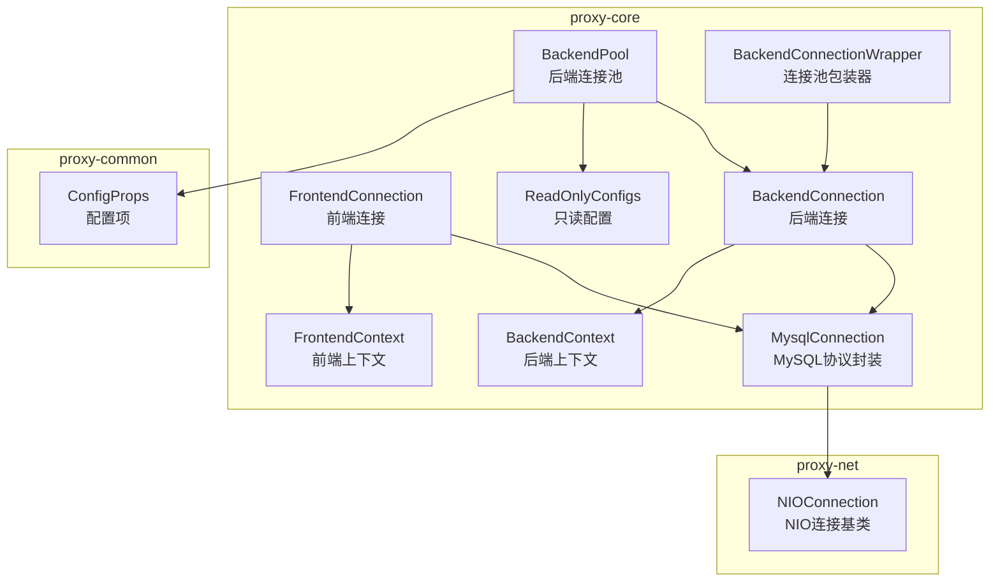
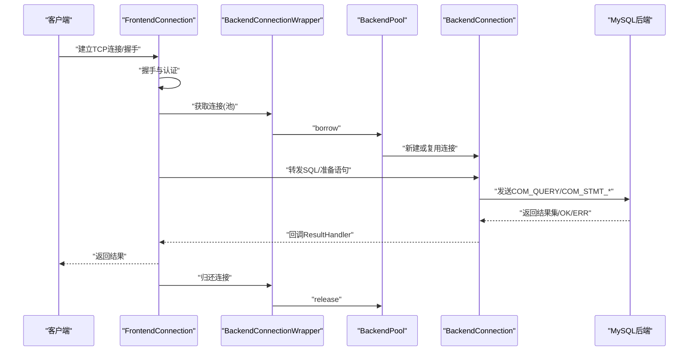
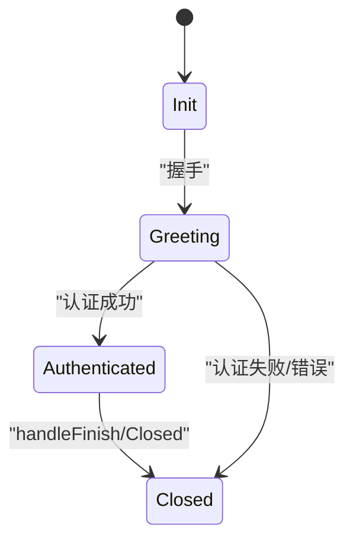
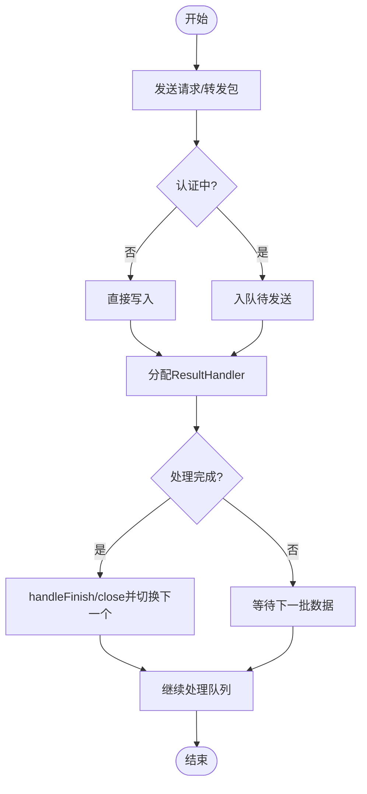
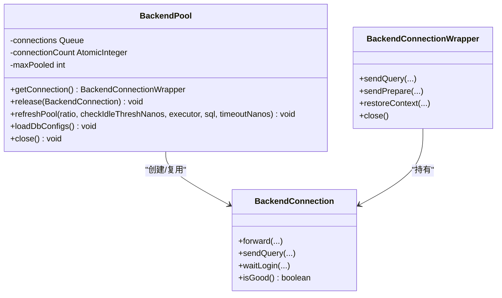
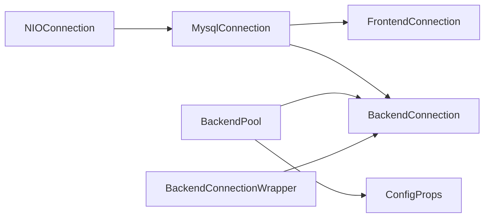

# 连接管理

<cite>
**本文引用的文件**
- [FrontendConnection.java](file://proxy-core/src/main/java/com/alibaba/polardbx/proxy/connection/FrontendConnection.java)
- [BackendConnection.java](file://proxy-core/src/main/java/com/alibaba/polardbx/proxy/connection/BackendConnection.java)
- [MysqlConnection.java](file://proxy-core/src/main/java/com/alibaba/polardbx/proxy/connection/MysqlConnection.java)
- [BackendPool.java](file://proxy-core/src/main/java/com/alibaba/polardbx/proxy/connection/pool/BackendPool.java)
- [BackendConnectionWrapper.java](file://proxy-core/src/main/java/com/alibaba/polardbx/proxy/connection/pool/BackendConnectionWrapper.java)
- [FrontendContext.java](file://proxy-core/src/main/java/com/alibaba/polardbx/proxy/context/FrontendContext.java)
- [BackendContext.java](file://proxy-core/src/main/java/com/alibaba/polardbx/proxy/context/BackendContext.java)
- [ReadOnlyConfigs.java](file://proxy-core/src/main/java/com/alibaba/polardbx/proxy/connection/configs/ReadOnlyConfigs.java)
- [ConfigProps.java](file://proxy-common/src/main/java/com/alibaba/polardbx/proxy/config/ConfigProps.java)
- [NIOConnection.java](file://proxy-net/src/main/java/com/alibaba/polardbx/proxy/net/NIOConnection.java)
- [ReactorPerfCollection.java](file://proxy-net/src/main/java/com/alibaba/polardbx/proxy/perf/ReactorPerfCollection.java)
</cite>

## 目录
1. [简介](#简介)
2. [项目结构](#项目结构)
3. [核心组件](#核心组件)
4. [架构总览](#架构总览)
5. [详细组件分析](#详细组件分析)
6. [依赖关系分析](#依赖关系分析)
7. [性能考量](#性能考量)
8. [故障排查指南](#故障排查指南)
9. [结论](#结论)
10. [附录：连接池配置参数说明](#附录连接池配置参数说明)

## 简介
本文件系统性梳理PolarDB-X Proxy的连接管理体系，围绕前端连接（FrontendConnection）、后端连接（BackendConnection）、连接池（BackendPool）及MySQL连接封装（MysqlConnection）展开，重点阐释：
- 前端连接与后端连接的生命周期与状态机
- 连接池的创建、复用、回收与清理策略
- MySQL协议封装与与底层数据库交互流程
- 连接状态管理、超时处理与异常恢复
- 连接池配置参数详解与最佳实践
- 连接泄漏检测、性能监控与故障排查方法

## 项目结构
连接管理相关代码主要分布在以下模块：
- proxy-core：连接模型、上下文、连接池与包装器
- proxy-net：NIO基础连接抽象与事件循环
- proxy-common：配置项定义与默认值

图表来源
- [FrontendConnection.java](file://proxy-core/src/main/java/com/alibaba/polardbx/proxy/connection/FrontendConnection.java#L47-L86)
- [BackendConnection.java](file://proxy-core/src/main/java/com/alibaba/polardbx/proxy/connection/BackendConnection.java#L67-L109)
- [MysqlConnection.java](file://proxy-core/src/main/java/com/alibaba/polardbx/proxy/connection/MysqlConnection.java#L37-L45)
- [BackendPool.java](file://proxy-core/src/main/java/com/alibaba/polardbx/proxy/connection/pool/BackendPool.java#L46-L98)
- [BackendConnectionWrapper.java](file://proxy-core/src/main/java/com/alibaba/polardbx/proxy/connection/pool/BackendConnectionWrapper.java#L44-L55)
- [FrontendContext.java](file://proxy-core/src/main/java/com/alibaba/polardbx/proxy/context/FrontendContext.java#L45-L54)
- [BackendContext.java](file://proxy-core/src/main/java/com/alibaba/polardbx/proxy/context/BackendContext.java#L37-L55)
- [ReadOnlyConfigs.java](file://proxy-core/src/main/java/com/alibaba/polardbx/proxy/connection/configs/ReadOnlyConfigs.java#L24-L28)
- [NIOConnection.java](file://proxy-net/src/main/java/com/alibaba/polardbx/proxy/net/NIOConnection.java#L800-L842)
- [ConfigProps.java](file://proxy-common/src/main/java/com/alibaba/polardbx/proxy/config/ConfigProps.java#L36-L98)

章节来源
- [FrontendConnection.java](file://proxy-core/src/main/java/com/alibaba/polardbx/proxy/connection/FrontendConnection.java#L47-L86)
- [BackendConnection.java](file://proxy-core/src/main/java/com/alibaba/polardbx/proxy/connection/BackendConnection.java#L67-L109)
- [MysqlConnection.java](file://proxy-core/src/main/java/com/alibaba/polardbx/proxy/connection/MysqlConnection.java#L37-L45)
- [BackendPool.java](file://proxy-core/src/main/java/com/alibaba/polardbx/proxy/connection/pool/BackendPool.java#L46-L98)
- [BackendConnectionWrapper.java](file://proxy-core/src/main/java/com/alibaba/polardbx/proxy/connection/pool/BackendConnectionWrapper.java#L44-L55)
- [FrontendContext.java](file://proxy-core/src/main/java/com/alibaba/polardbx/proxy/context/FrontendContext.java#L45-L54)
- [BackendContext.java](file://proxy-core/src/main/java/com/alibaba/polardbx/proxy/context/BackendContext.java#L37-L55)
- [ReadOnlyConfigs.java](file://proxy-core/src/main/java/com/alibaba/polardbx/proxy/connection/configs/ReadOnlyConfigs.java#L24-L28)
- [NIOConnection.java](file://proxy-net/src/main/java/com/alibaba/polardbx/proxy/net/NIOConnection.java#L800-L842)
- [ConfigProps.java](file://proxy-common/src/main/java/com/alibaba/polardbx/proxy/config/ConfigProps.java#L36-L98)

## 核心组件
- MysqlConnection：MySQL协议封装，负责报文探测、解码、编码与回调处理，抽象出handleAndTakePacket与handleFinish两个扩展点。
- FrontendConnection：面向客户端的连接，负责握手、认证、命令分发与资源释放。
- BackendConnection：面向后端MySQL的连接，负责认证、查询转发、结果处理器队列管理、上下文维护与连接健康检查。
- BackendPool：后端连接池，负责连接创建、复用、回收与全局变量刷新；提供连接包装器BackendConnectionWrapper以暴露安全接口。
- BackendConnectionWrapper：连接池包装器，持有BackendConnection并提供发送查询、准备语句、切换用户与恢复上下文等操作。
- 上下文：FrontendContext与BackendContext分别维护会话状态、能力位、事务与查询上下文、预编译语句缓存等。

章节来源
- [MysqlConnection.java](file://proxy-core/src/main/java/com/alibaba/polardbx/proxy/connection/MysqlConnection.java#L37-L158)
- [FrontendConnection.java](file://proxy-core/src/main/java/com/alibaba/polardbx/proxy/connection/FrontendConnection.java#L47-L224)
- [BackendConnection.java](file://proxy-core/src/main/java/com/alibaba/polardbx/proxy/connection/BackendConnection.java#L67-L813)
- [BackendPool.java](file://proxy-core/src/main/java/com/alibaba/polardbx/proxy/connection/pool/BackendPool.java#L46-L284)
- [BackendConnectionWrapper.java](file://proxy-core/src/main/java/com/alibaba/polardbx/proxy/connection/pool/BackendConnectionWrapper.java#L44-L275)
- [FrontendContext.java](file://proxy-core/src/main/java/com/alibaba/polardbx/proxy/context/FrontendContext.java#L45-L308)
- [BackendContext.java](file://proxy-core/src/main/java/com/alibaba/polardbx/proxy/context/BackendContext.java#L37-L156)

## 架构总览
连接管理采用“前端连接—后端连接池—后端连接”的分层设计，配合上下文与结果处理器完成请求的全链路流转。

图表来源
- [FrontendConnection.java](file://proxy-core/src/main/java/com/alibaba/polardbx/proxy/connection/FrontendConnection.java#L88-L160)
- [BackendConnectionWrapper.java](file://proxy-core/src/main/java/com/alibaba/polardbx/proxy/connection/pool/BackendConnectionWrapper.java#L113-L163)
- [BackendPool.java](file://proxy-core/src/main/java/com/alibaba/polardbx/proxy/connection/pool/BackendPool.java#L115-L132)
- [BackendConnection.java](file://proxy-core/src/main/java/com/alibaba/polardbx/proxy/connection/BackendConnection.java#L290-L321)

## 详细组件分析

### 前端连接（FrontendConnection）
- 生命周期
  - 构造阶段初始化FrontendContext、能力位与随机种子，注册到全局集合。
  - 握手阶段发送HandshakeV10，进入Greeting状态。
  - 认证阶段由FrontendAuthenticator处理，成功后切换至Authenticated状态。
  - 命令阶段由FrontendCommandHandler分发处理，错误时触发关闭。
  - 关闭阶段异步释放认证器、命令处理器与上下文，避免死锁。
- 状态管理
  - 使用MysqlServerState跟踪握手、认证与关闭状态。
  - 资源关闭通过AtomicBoolean与同步块保证幂等。
- 异常恢复
  - onFatalError统一记录错误并关闭连接。

图表来源
- [FrontendConnection.java](file://proxy-core/src/main/java/com/alibaba/polardbx/proxy/connection/FrontendConnection.java#L88-L160)
- [FrontendContext.java](file://proxy-core/src/main/java/com/alibaba/polardbx/proxy/context/FrontendContext.java#L48-L50)

章节来源
- [FrontendConnection.java](file://proxy-core/src/main/java/com/alibaba/polardbx/proxy/connection/FrontendConnection.java#L47-L224)
- [FrontendContext.java](file://proxy-core/src/main/java/com/alibaba/polardbx/proxy/context/FrontendContext.java#L45-L308)

### 后端连接（BackendConnection）
- 生命周期
  - 构造阶段创建BackendAuthenticator并加入全局集合。
  - 登录阶段由BackendAuthenticator完成认证，随后设置全局只读配置与全局变量。
  - 发送阶段支持查询、初始化数据库、准备语句、重置与关闭预编译语句。
  - 关闭阶段异步释放认证器、结果处理器队列与上下文。
- 结果处理器队列
  - 使用LinkedList维护ResultHandler队列，按到达顺序处理。
  - 处理完成后handleFinish与close，切换下一个处理器。
- 健康检查与等待
  - isGood基于认证状态与资源关闭标志判断。
  - waitLogin通过FutureTask等待认证完成。
- 超时与阻塞
  - connectBlocking在超时时间内等待有效与登录完成。
  - sendQuery/initDB/sendPrepare均在内部进行超时控制与异常关闭。

图表来源
- [BackendConnection.java](file://proxy-core/src/main/java/com/alibaba/polardbx/proxy/connection/BackendConnection.java#L123-L200)
- [BackendConnection.java](file://proxy-core/src/main/java/com/alibaba/polardbx/proxy/connection/BackendConnection.java#L290-L321)

章节来源
- [BackendConnection.java](file://proxy-core/src/main/java/com/alibaba/polardbx/proxy/connection/BackendConnection.java#L67-L813)

### MySQL连接封装（MysqlConnection）
- 报文探测与解码
  - 支持正常与压缩包头大小，处理超大包拼接。
  - 将Slice交由子类handleAndTakePacket处理，并在finally调用handleFinish。
- 编码与序列号
  - 统一使用Encoder创建，设置seq并flush。
- 错误处理
  - onPacket捕获异常后关闭连接，确保协议一致性。

章节来源
- [MysqlConnection.java](file://proxy-core/src/main/java/com/alibaba/polardbx/proxy/connection/MysqlConnection.java#L37-L158)

### 连接池（BackendPool）
- 连接创建与复用
  - getConnection优先从池中弹出，否则非阻塞连接后设置池信息。
  - release根据isGood与hasPendingUserRequests决定关闭或入队。
  - 最大池大小maxPooled受外部控制，防止无限增长。
- 全局变量与只读配置
  - 定期刷新show global variables，缓存到globalVariables。
  - 加载lower_case_table_names到ReadOnlyConfigs。
- 池内连接刷新
  - refreshPool按比例与空闲阈值对空闲连接执行轻量查询以保持活性。
- 关闭策略
  - close将maxPooled置为负值并清空队列，确保无泄漏。

图表来源
- [BackendPool.java](file://proxy-core/src/main/java/com/alibaba/polardbx/proxy/connection/pool/BackendPool.java#L46-L284)
- [BackendConnectionWrapper.java](file://proxy-core/src/main/java/com/alibaba/polardbx/proxy/connection/pool/BackendConnectionWrapper.java#L44-L275)
- [BackendConnection.java](file://proxy-core/src/main/java/com/alibaba/polardbx/proxy/connection/BackendConnection.java#L67-L813)

章节来源
- [BackendPool.java](file://proxy-core/src/main/java/com/alibaba/polardbx/proxy/connection/pool/BackendPool.java#L46-L284)
- [BackendConnectionWrapper.java](file://proxy-core/src/main/java/com/alibaba/polardbx/proxy/connection/pool/BackendConnectionWrapper.java#L44-L275)

### 连接池包装器（BackendConnectionWrapper）
- 安全接口
  - 所有对外方法均在同步块内执行，避免并发关闭导致的异常。
  - 提供forward、sendQuery、sendPrepare、reset/closePreparedStatement、restoreContext等。
- 上下文恢复
  - restoreContext支持切换用户（通过dbms_proxy.switch_user）、恢复schema与autocommit。
- 生命周期
  - close将连接归还池；discard强制丢弃并关闭连接。

章节来源
- [BackendConnectionWrapper.java](file://proxy-core/src/main/java/com/alibaba/polardbx/proxy/connection/pool/BackendConnectionWrapper.java#L44-L275)

### 上下文（FrontendContext/BackendContext）
- FrontendContext
  - 维护MysqlServerState、能力位、事务与查询上下文、预编译语句映射。
  - 提供sendOk/sendErr、事务引用计数与清理。
- BackendContext
  - 维护MysqlClientState、版本、是否就绪、当前活跃连接引用。
  - 预编译语句LRU缓存，自动清理过期语句。

章节来源
- [FrontendContext.java](file://proxy-core/src/main/java/com/alibaba/polardbx/proxy/context/FrontendContext.java#L45-L308)
- [BackendContext.java](file://proxy-core/src/main/java/com/alibaba/polardbx/proxy/context/BackendContext.java#L37-L156)

## 依赖关系分析
- FrontendConnection与BackendConnection均继承自MysqlConnection，后者继承自NIOConnection，形成清晰的层次化连接模型。
- BackendPool持有NIOWorker的Processor用于注册新连接，连接池中的连接通过Processor驱动事件循环。
- 配置项通过ConfigProps集中管理，影响连接超时、池大小、刷新策略等。

图表来源
- [NIOConnection.java](file://proxy-net/src/main/java/com/alibaba/polardbx/proxy/net/NIOConnection.java#L800-L842)
- [MysqlConnection.java](file://proxy-core/src/main/java/com/alibaba/polardbx/proxy/connection/MysqlConnection.java#L37-L45)
- [FrontendConnection.java](file://proxy-core/src/main/java/com/alibaba/polardbx/proxy/connection/FrontendConnection.java#L47-L66)
- [BackendConnection.java](file://proxy-core/src/main/java/com/alibaba/polardbx/proxy/connection/BackendConnection.java#L67-L105)
- [BackendPool.java](file://proxy-core/src/main/java/com/alibaba/polardbx/proxy/connection/pool/BackendPool.java#L49-L98)
- [ConfigProps.java](file://proxy-common/src/main/java/com/alibaba/polardbx/proxy/config/ConfigProps.java#L36-L98)

章节来源
- [NIOConnection.java](file://proxy-net/src/main/java/com/alibaba/polardbx/proxy/net/NIOConnection.java#L800-L884)
- [MysqlConnection.java](file://proxy-core/src/main/java/com/alibaba/polardbx/proxy/connection/MysqlConnection.java#L37-L158)
- [BackendPool.java](file://proxy-core/src/main/java/com/alibaba/polardbx/proxy/connection/pool/BackendPool.java#L46-L284)

## 性能考量
- 事件驱动与缓冲
  - NIOConnection在事件循环中独立处理读写，避免阻塞；ReactorPerfCollection统计读写/连接次数，便于性能观测。
- 连接池刷新
  - refreshPool按比例与空闲阈值刷新连接，减少长连接失效带来的抖动。
- 全局变量缓存
  - 后端全局变量定期刷新并缓存，降低重复查询开销。
- 预编译语句缓存
  - BackendContext维护LRU缓存，自动清理过期语句，平衡内存与性能。

章节来源
- [ReactorPerfCollection.java](file://proxy-net/src/main/java/com/alibaba/polardbx/proxy/perf/ReactorPerfCollection.java#L25-L33)
- [BackendPool.java](file://proxy-core/src/main/java/com/alibaba/polardbx/proxy/connection/pool/BackendPool.java#L167-L250)
- [BackendContext.java](file://proxy-core/src/main/java/com/alibaba/polardbx/proxy/context/BackendContext.java#L57-L156)

## 故障排查指南
- 连接泄漏检测
  - 启用enable_leak_check后，连接关闭路径会进行泄漏检查，异常时抛出错误。
- 连接关闭与资源释放
  - 前端/后端连接关闭均采用异步任务释放认证器、处理器与上下文，避免死锁。
- 超时与阻塞
  - connectBlocking在超时时间内等待有效与登录完成；sendQuery/initDB等操作内部进行超时控制。
- 性能监控
  - 通过ReactorPerfCollection统计读写/连接次数，结合日志定位瓶颈。
- 常见问题
  - 认证失败：FrontendAuthenticator与BackendAuthenticator均会触发关闭。
  - 协议错误：MysqlConnection在onPacket捕获异常后关闭连接，确保一致性。

章节来源
- [FrontendConnection.java](file://proxy-core/src/main/java/com/alibaba/polardbx/proxy/connection/FrontendConnection.java#L162-L213)
- [BackendConnection.java](file://proxy-core/src/main/java/com/alibaba/polardbx/proxy/connection/BackendConnection.java#L220-L287)
- [MysqlConnection.java](file://proxy-core/src/main/java/com/alibaba/polardbx/proxy/connection/MysqlConnection.java#L95-L147)
- [NIOConnection.java](file://proxy-net/src/main/java/com/alibaba/polardbx/proxy/net/NIOConnection.java#L822-L842)
- [ReactorPerfCollection.java](file://proxy-net/src/main/java/com/alibaba/polardbx/proxy/perf/ReactorPerfCollection.java#L25-L33)

## 结论
PolarDB-X Proxy的连接管理以MysqlConnection为核心，通过FrontendConnection与BackendConnection分别面向客户端与后端数据库，配合BackendPool与包装器实现高可用、高性能的连接复用与生命周期管理。通过严格的超时控制、异常恢复与性能监控，系统在复杂场景下仍能保持稳定与可观测性。

## 附录：连接池配置参数说明
以下参数来自配置项定义，直接影响连接池行为与性能：
- 后端连接超时：backend_connect_timeout
- 后端池最大连接数（管理/读写/只读）：backend_admin_max_pooled_size、backend_rw_max_pooled_size、backend_ro_max_pooled_size
- 连接池刷新线程数/间隔/SQL/超时：backend_pool_refresh_threads、backend_pool_refresh_task_interval、backend_pool_refresh_interval、backend_pool_refresh_sql、backend_pool_refresh_timeout
- 全局变量刷新间隔：global_variables_refresh_interval
- 预编译语句缓存大小：prepared_statement_cache_size
- 最大允许包大小：max_allowed_packet

章节来源
- [ConfigProps.java](file://proxy-common/src/main/java/com/alibaba/polardbx/proxy/config/ConfigProps.java#L36-L98)
- [ConfigProps.java](file://proxy-common/src/main/java/com/alibaba/polardbx/proxy/config/ConfigProps.java#L141-L197)