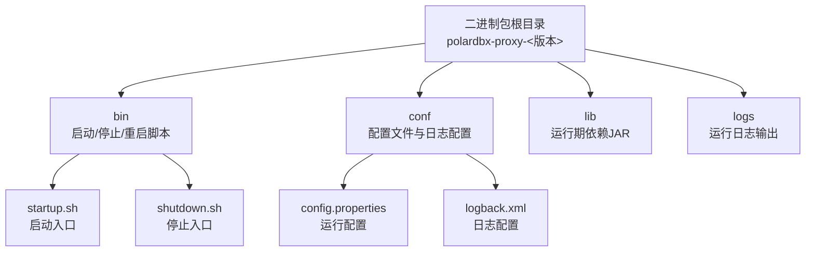
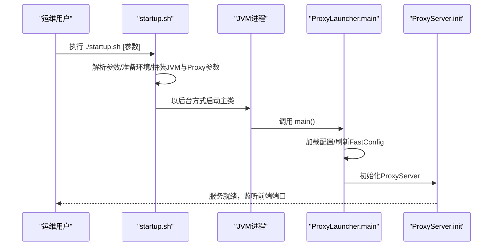
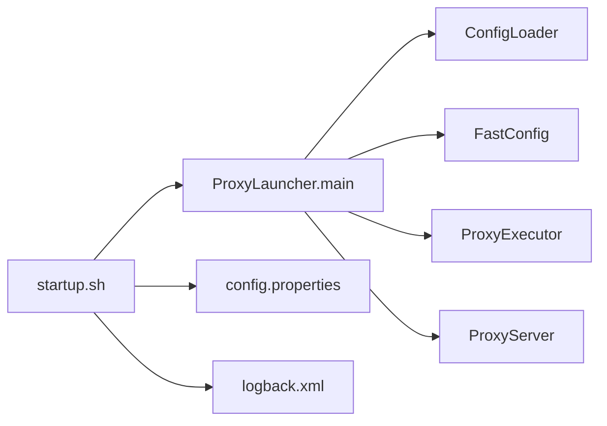

# 二进制包部署

<cite>
**本文引用的文件**
- [README.md](file://README.md)
- [polardbx_proxy_user_manual.md](file://polardbx_proxy_user_manual.md)
- [proxy-server/src/main/bin/startup.sh](file://proxy-server/src/main/bin/startup.sh)
- [proxy-server/src/main/bin/shutdown.sh](file://proxy-server/src/main/bin/shutdown.sh)
- [proxy-server/src/main/conf/config.properties](file://proxy-server/src/main/conf/config.properties)
- [proxy-server/src/main/conf/logback.xml](file://proxy-server/src/main/conf/logback.xml)
- [proxy-server/src/main/java/com/alibaba/polardbx/proxy/server/ProxyLauncher.java](file://proxy-server/src/main/java/com/alibaba/polardbx/proxy/server/ProxyLauncher.java)
- [proxy-server/src/main/assembly/release.xml](file://proxy-server/src/main/assembly/release.xml)
- [proxy-server/pom.xml](file://proxy-server/pom.xml)
- [docker/Dockerfile](file://docker/Dockerfile)
- [docker/docker_build.sh](file://docker/docker_build.sh)
- [quick_start.sh](file://quick_start.sh)
- [rpm/rpm_create](file://rpm/rpm_create)
- [rpm/t-polardbx-proxy.spec](file://rpm/t-polardbx-proxy.spec)
- [proxy-common/src/main/resources/config.properties](file://proxy-common/src/main/resources/config.properties)
</cite>

## 目录
1. [简介](#简介)
2. [项目结构](#项目结构)
3. [核心组件](#核心组件)
4. [架构总览](#架构总览)
5. [详细组件分析](#详细组件分析)
6. [依赖关系分析](#依赖关系分析)
7. [性能考量](#性能考量)
8. [故障排查指南](#故障排查指南)
9. [结论](#结论)
10. [附录](#附录)

## 简介
本指南面向希望使用二进制包部署 PolarDB-X Proxy 的用户，覆盖从官方发布版本与自编译版本差异、二进制包目录结构、系统环境要求、手动部署步骤、系统服务配置（systemd 或 init.d）、部署验证方法（连接测试、功能验证、性能基准测试）到常见问题排查与解决。文档内容严格基于仓库内的构建脚本、装配定义与用户手册。

## 项目结构
二进制包由 Maven Assembly 插件在 release 模式下打包产出，包含可执行脚本、配置文件、日志目录与依赖库。目录结构遵循“bin、conf、lib、logs”四件套，并通过启动脚本统一加载配置与类路径。

图表来源
- [proxy-server/src/main/assembly/release.xml](file://proxy-server/src/main/assembly/release.xml#L27-L78)
- [proxy-server/src/main/bin/startup.sh](file://proxy-server/src/main/bin/startup.sh#L44-L76)
- [proxy-server/src/main/conf/config.properties](file://proxy-server/src/main/conf/config.properties#L1-L117)
- [proxy-server/src/main/conf/logback.xml](file://proxy-server/src/main/conf/logback.xml#L19-L97)

章节来源
- [proxy-server/src/main/assembly/release.xml](file://proxy-server/src/main/assembly/release.xml#L27-L78)
- [polardbx_proxy_user_manual.md](file://polardbx_proxy_user_manual.md#L76-L127)

## 核心组件
- 启动脚本：负责解析参数、准备运行环境、选择 JVM、拼装 JVM 与 Proxy 参数、设置日志与类路径并以后台方式启动主类。
- 停止脚本：负责查找进程、优雅停止并清理 PID 文件。
- 主类：ProxyLauncher 负责加载配置、初始化执行器与服务器。
- 配置文件：config.properties 提供运行期参数；logback.xml 控制日志输出。
- 装配定义：release.xml 定义二进制包目录结构与文件权限。
- 构建与打包：proxy-server/pom.xml 与 maven-assembly-plugin 在 release 模式下产出 tar.gz 包。

章节来源
- [proxy-server/src/main/bin/startup.sh](file://proxy-server/src/main/bin/startup.sh#L44-L414)
- [proxy-server/src/main/bin/shutdown.sh](file://proxy-server/src/main/bin/shutdown.sh#L19-L116)
- [proxy-server/src/main/java/com/alibaba/polardbx/proxy/server/ProxyLauncher.java](file://proxy-server/src/main/java/com/alibaba/polardbx/proxy/server/ProxyLauncher.java#L29-L56)
- [proxy-server/src/main/conf/config.properties](file://proxy-server/src/main/conf/config.properties#L1-L117)
- [proxy-server/src/main/conf/logback.xml](file://proxy-server/src/main/conf/logback.xml#L19-L97)
- [proxy-server/src/main/assembly/release.xml](file://proxy-server/src/main/assembly/release.xml#L19-L78)
- [proxy-server/pom.xml](file://proxy-server/pom.xml#L58-L111)

## 架构总览
启动流程从 shell 脚本到 JVM，再到 ProxyLauncher，最终初始化 ProxyServer 与各子系统。

图表来源
- [proxy-server/src/main/bin/startup.sh](file://proxy-server/src/main/bin/startup.sh#L394-L411)
- [proxy-server/src/main/java/com/alibaba/polardbx/proxy/server/ProxyLauncher.java](file://proxy-server/src/main/java/com/alibaba/polardbx/proxy/server/ProxyLauncher.java#L32-L54)

## 详细组件分析

### 启动脚本 startup.sh
- 功能要点
  - 参数解析：支持调试端口、IDC、WISP、CGROUP、配置文件、实例ID、日志根目录、内存大小、MySQL 协议源流、源数据流 URL/用户/密码、别名开关、自定义键值对等。
  - 环境准备：检测非 root 用户、加载 /etc/profile 与 server_env.sh、尝试加载 env.properties。
  - JVM 选择：优先使用系统 java，其次尝试特定路径；校验 64 位；根据物理内存自动设置堆大小与直接内存上限。
  - JVM 选项：启用 G1、GC 日志、堆转储、崩溃日志、线程栈深度、偏向锁等；在特定内核版本下禁用 Netty/Native 以兼容 WISP。
  - 类路径与主类：按顺序拼装类路径，最后调用 ProxyLauncher。
  - PID 与日志：写入 pidfile，输出控制台日志到 logs/_system/proxy-console.log，GC 日志到 logs/_system/gc.log。
- 关键行为
  - 若存在 pidfile，提示先执行 shutdown.sh。
  - 32 位 JVM 不受支持。
  - 通过 -m 指定内存（MB）覆盖自动推断。
  - -M/-H/-U/-P 可直接注入源连接参数。

章节来源
- [proxy-server/src/main/bin/startup.sh](file://proxy-server/src/main/bin/startup.sh#L3-L30)
- [proxy-server/src/main/bin/startup.sh](file://proxy-server/src/main/bin/startup.sh#L71-L120)
- [proxy-server/src/main/bin/startup.sh](file://proxy-server/src/main/bin/startup.sh#L122-L143)
- [proxy-server/src/main/bin/startup.sh](file://proxy-server/src/main/bin/startup.sh#L255-L269)
- [proxy-server/src/main/bin/startup.sh](file://proxy-server/src/main/bin/startup.sh#L272-L313)
- [proxy-server/src/main/bin/startup.sh](file://proxy-server/src/main/bin/startup.sh#L315-L334)
- [proxy-server/src/main/bin/startup.sh](file://proxy-server/src/main/bin/startup.sh#L363-L377)
- [proxy-server/src/main/bin/startup.sh](file://proxy-server/src/main/bin/startup.sh#L384-L411)

### 停止脚本 shutdown.sh
- 功能要点
  - 通过 ps 查找包含 “polardbx-proxy”的 Java 进程，发送 kill 信号。
  - 支持 -d 附加调试参数回显；超时等待进程退出，超时后强制 kill -9。
  - 清理 pidfile。
- 关键行为
  - 优先从 pidfile 读取原启动参数，便于透传调试参数。

章节来源
- [proxy-server/src/main/bin/shutdown.sh](file://proxy-server/src/main/bin/shutdown.sh#L19-L116)

### 配置文件 config.properties
- 运行期关键参数
  - 前端端口、后端地址与凭证、连接超时、连接池大小、读写分离与一致性读策略、平滑切换、日志长度限制、最大包大小、动态配置文件等。
- 建议
  - cpus 设置为分配的 CPU 数；frontend_port 为应用连接端口；backend_address 指向当前 Leader。
  - 若使用密文密码，需设置 dn_password_key 并在 backend_password 中填入密文。

章节来源
- [proxy-server/src/main/conf/config.properties](file://proxy-server/src/main/conf/config.properties#L19-L117)
- [polardbx_proxy_user_manual.md](file://polardbx_proxy_user_manual.md#L129-L157)

### 日志配置 logback.xml
- 输出
  - 控制台与滚动文件（proxy.log、sql.log），支持按天与大小滚动。
  - 异步 appender，降低日志对性能的影响。
- 关键点
  - 日志根目录可通过 -l 参数或 loggerRoot 系统属性覆盖。
  - GC 日志由 startup.sh 注入 JVM 参数。

章节来源
- [proxy-server/src/main/conf/logback.xml](file://proxy-server/src/main/conf/logback.xml#L19-L97)
- [proxy-server/src/main/bin/startup.sh](file://proxy-server/src/main/bin/startup.sh#L367-L377)

### 主类 ProxyLauncher
- 行为
  - 加载配置、刷新 FastConfig、初始化 ProxyExecutor、初始化 ProxyServer。
  - 异常时触发 Kill.kill9() 并记录错误日志。
  - 注册 ShutdownHook，确保优雅停机。

章节来源
- [proxy-server/src/main/java/com/alibaba/polardbx/proxy/server/ProxyLauncher.java](file://proxy-server/src/main/java/com/alibaba/polardbx/proxy/server/ProxyLauncher.java#L29-L56)

### 装配定义 release.xml
- 结构
  - bin（含执行权限）、conf、lib、logs（空占位）。
  - 将 resources 中除 config.properties 与 logback.xml 外的资源复制到 conf。
- 影响
  - 二进制包解压后即可直接运行，无需额外安装。

章节来源
- [proxy-server/src/main/assembly/release.xml](file://proxy-server/src/main/assembly/release.xml#L27-L78)

### 构建与打包（release 模式）
- 构建命令
  - 在根目录执行 mvn clean package -DskipTests -Denv=release。
- 产物
  - proxy-server/target 下的 tar.gz 包，包含完整的二进制包结构。
- 版本信息
  - git.properties 由 git-commit-id-plugin 生成，随 conf 输出。

章节来源
- [polardbx_proxy_user_manual.md](file://polardbx_proxy_user_manual.md#L76-L82)
- [proxy-server/pom.xml](file://proxy-server/pom.xml#L189-L265)
- [proxy-server/src/main/assembly/release.xml](file://proxy-server/src/main/assembly/release.xml#L19-L78)

## 依赖关系分析
- 组件耦合
  - startup.sh 与 ProxyLauncher 强耦合（主类入口）。
  - ProxyLauncher 依赖 ConfigLoader/FastConfig/ProxyExecutor/ProxyServer。
  - 配置文件与日志配置由启动脚本注入到 JVM 参数。
- 外部依赖
  - JDK 11（推荐）及以上；32 位 JVM 不受支持。
  - Linux 64 位（Docker 快速开始文档亦强调 Linux 架构）。
  - 端口：默认 3307（前端）、8083（通用服务）。

图表来源
- [proxy-server/src/main/bin/startup.sh](file://proxy-server/src/main/bin/startup.sh#L384-L411)
- [proxy-server/src/main/java/com/alibaba/polardbx/proxy/server/ProxyLauncher.java](file://proxy-server/src/main/java/com/alibaba/polardbx/proxy/server/ProxyLauncher.java#L32-L54)
- [proxy-server/src/main/conf/config.properties](file://proxy-server/src/main/conf/config.properties#L19-L117)
- [proxy-server/src/main/conf/logback.xml](file://proxy-server/src/main/conf/logback.xml#L19-L97)

章节来源
- [proxy-server/src/main/bin/startup.sh](file://proxy-server/src/main/bin/startup.sh#L255-L269)
- [proxy-server/src/main/java/com/alibaba/polardbx/proxy/server/ProxyLauncher.java](file://proxy-server/src/main/java/com/alibaba/polardbx/proxy/server/ProxyLauncher.java#L29-L56)

## 性能考量
- JVM 与 GC
  - 默认启用 G1，设置最大暂停时间目标与 GC 超时策略；GC 日志与堆转储路径在启动脚本中配置。
- 内存
  - 启动脚本依据物理内存自动设置堆大小与直接内存上限；可通过 -m 指定堆大小（MB）。
- 线程与事件循环
  - cpus 与 reactor_factor 决定异步事件框架线程数；worker_threads 控制工作线程。
- 日志
  - 异步日志与滚动策略降低 IO 压力；可通过 config.properties 控制 SQL 日志开关以减少开销。

章节来源
- [proxy-server/src/main/bin/startup.sh](file://proxy-server/src/main/bin/startup.sh#L283-L313)
- [proxy-server/src/main/bin/startup.sh](file://proxy-server/src/main/bin/startup.sh#L355-L361)
- [proxy-server/src/main/conf/config.properties](file://proxy-server/src/main/conf/config.properties#L19-L117)
- [proxy-server/src/main/conf/logback.xml](file://proxy-server/src/main/conf/logback.xml#L47-L84)

## 故障排查指南
- 启动失败
  - 非 root 用户：startup.sh 明确禁止以 root 运行，需切换普通用户。
  - 32 位 JVM：startup.sh 检测到 32 位将拒绝启动。
  - 已有进程：若存在 pidfile，需先执行 shutdown.sh。
  - Java 未找到：startup.sh 会检查系统 java 与特定路径，确保可用。
- 端口冲突
  - 默认监听 3307/8083，启动前需确认端口可用。
- 连接失败
  - 核对 config.properties 中 backend_address、username、password。
  - 使用 mysql 客户端连接 3307 端口验证连通性。
- 日志定位
  - 查看 logs/_system/proxy.log 与 gc.log；SQL 日志位于 logs/sql.log。
- 停止异常
  - 若常规 kill 无效，shutdown.sh 会超时后强制 kill -9；检查进程是否存在。

章节来源
- [proxy-server/src/main/bin/startup.sh](file://proxy-server/src/main/bin/startup.sh#L80-L84)
- [proxy-server/src/main/bin/startup.sh](file://proxy-server/src/main/bin/startup.sh#L272-L313)
- [proxy-server/src/main/bin/startup.sh](file://proxy-server/src/main/bin/startup.sh#L274-L277)
- [proxy-server/src/main/bin/shutdown.sh](file://proxy-server/src/main/bin/shutdown.sh#L92-L116)
- [polardbx_proxy_user_manual.md](file://polardbx_proxy_user_manual.md#L269-L292)

## 结论
通过 release 模式构建的二进制包提供了开箱即用的部署体验：清晰的目录结构、完善的启动/停止脚本、可调的 JVM 与运行参数、完善的日志体系。结合本文档的环境准备、手动部署、系统服务配置与验证方法，可高效完成 PolarDB-X Proxy 的生产级部署与运维。

## 附录

### A. 官方发布版本与自编译版本区别
- 官方发布版本
  - 通过 Docker 镜像或 tar.gz 二进制包分发，适合快速上线与标准化部署。
- 自编译版本
  - 通过 mvn clean package -DskipTests -Denv=release 产出，适合定制化需求与内部发布流程。
- 共同点
  - 目录结构一致（bin、conf、lib、logs），启动脚本与主类相同。

章节来源
- [polardbx_proxy_user_manual.md](file://polardbx_proxy_user_manual.md#L76-L82)
- [proxy-server/src/main/assembly/release.xml](file://proxy-server/src/main/assembly/release.xml#L27-L78)

### B. 系统环境要求
- 操作系统
  - Linux 64 位（Docker 快速开始文档强调 Linux 架构）。
- Java 运行时
  - JDK 11（推荐）及以上；不支持 32 位 JVM。
- 系统资源
  - 推荐内存 ≥ 16GB；默认端口 3307/8083 可用。
- 网络配置
  - 前端应用访问 3307；Proxy 需可访问后端 PolarDB-X 集群地址与端口。

章节来源
- [polardbx_proxy_user_manual.md](file://polardbx_proxy_user_manual.md#L40-L44)
- [polardbx_proxy_user_manual.md](file://polardbx_proxy_user_manual.md#L85-L94)
- [proxy-server/src/main/bin/startup.sh](file://proxy-server/src/main/bin/startup.sh#L255-L269)

### C. 手动部署步骤
- 获取二进制包
  - 方式一：release 模式构建（见“构建与打包”）。
  - 方式二：Docker 快速开始（见“Docker 快速开始”）。
- 解压与目录
  - 解压至包含“polardbx-proxy”的目录，包含 bin、conf、lib、logs。
- 权限设置
  - 确保 bin 下脚本具有执行权限；普通用户运行（非 root）。
- 配置修改
  - 修改 conf/config.properties：frontend_port、backend_address、backend_username、backend_password、cpus、reactor_factor 等。
- 启动与验证
  - 进入 bin 目录执行 ./startup.sh -m <内存MB>；查看 logs/_system/proxy.log；使用 mysql -h127.0.0.1 -P3307 验证连接。
- 停止
  - 执行 ./shutdown.sh。

章节来源
- [polardbx_proxy_user_manual.md](file://polardbx_proxy_user_manual.md#L101-L127)
- [polardbx_proxy_user_manual.md](file://polardbx_proxy_user_manual.md#L129-L157)
- [polardbx_proxy_user_manual.md](file://polardbx_proxy_user_manual.md#L159-L202)
- [polardbx_proxy_user_manual.md](file://polardbx_proxy_user_manual.md#L259-L267)

### D. 系统服务配置（systemd 或 init.d）
- systemd 示例思路
  - ExecStart：指向 bin/startup.sh 并传入 -m 与 -l 等必要参数。
  - ExecStop：指向 bin/shutdown.sh。
  - User：普通用户；WorkingDirectory：二进制包根目录。
  - Environment：必要环境变量（如 dnPasswordKey）。
- init.d 示例思路
  - start/stop 函数中分别调用 startup.sh 与 shutdown.sh。
  - 设置权限与日志目录属主。

说明：本节为通用实践建议，具体实现请结合目标系统与安全策略定制。

### E. 部署验证方法
- 连接测试
  - 使用 mysql 客户端连接 3307 端口，执行基础查询验证。
- 功能验证
  - 通过 SHOW CLUSTER/BACKEND/FRONTEND/RO/RW 等命令观察后端状态与连接池情况。
- 性能基准测试
  - 建议使用标准数据库压测工具对 3307 端口进行吞吐与延迟测试；关注 GC 日志与 SQL 日志以评估开销。

章节来源
- [polardbx_proxy_user_manual.md](file://polardbx_proxy_user_manual.md#L269-L292)
- [polardbx_proxy_user_manual.md](file://polardbx_proxy_user_manual.md#L377-L572)

### F. Docker 快速开始
- 环境要求
  - Linux 64 位、Docker、可用端口 3307/8083。
- 启动
  - 使用 quick_start.sh 一键拉起容器并映射端口。
- 连接
  - 使用 mysql -h127.0.0.1 -P3307 连接。

章节来源
- [polardbx_proxy_user_manual.md](file://polardbx_proxy_user_manual.md#L39-L74)
- [quick_start.sh](file://quick_start.sh#L14-L88)
- [docker/Dockerfile](file://docker/Dockerfile#L1-L19)

### G. RPM 打包（可选）
- 构建流程
  - 使用 rpm/rpm_create 与 rpm/t-polardbx-proxy.spec 生成二进制与源码 RPM。
- 安装
  - 安装后将二进制包放置于 /home/admin/polardbx-proxy，配置文件位于 /home/admin/polardbx-proxy/conf。

章节来源
- [rpm/rpm_create](file://rpm/rpm_create#L12-L23)
- [rpm/t-polardbx-proxy.spec](file://rpm/t-polardbx-proxy.spec#L31-L81)