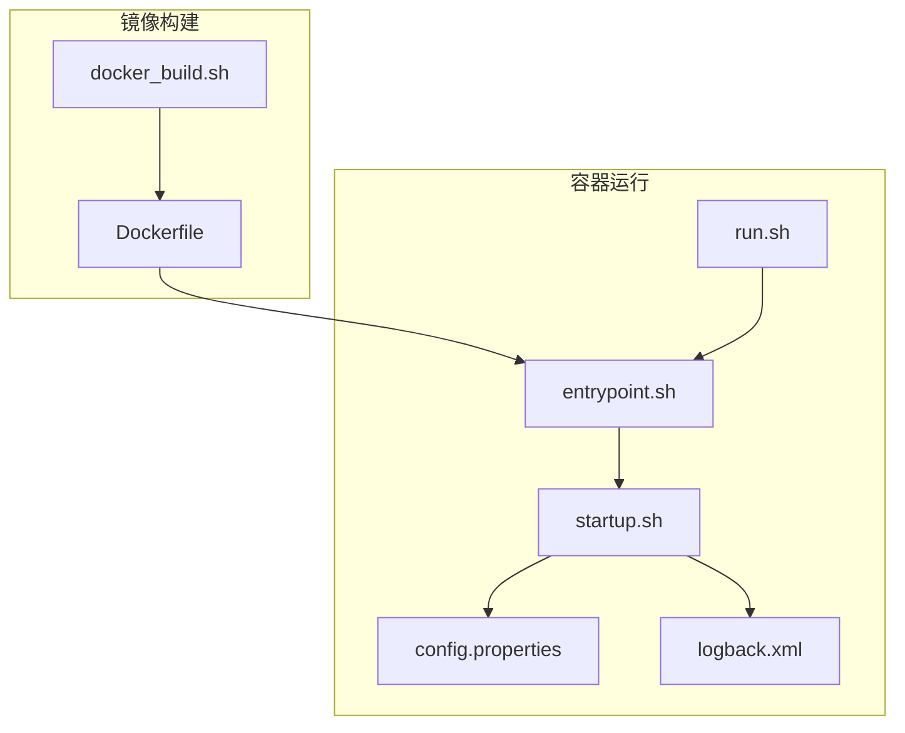
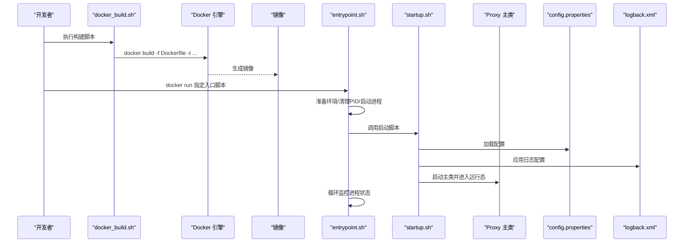
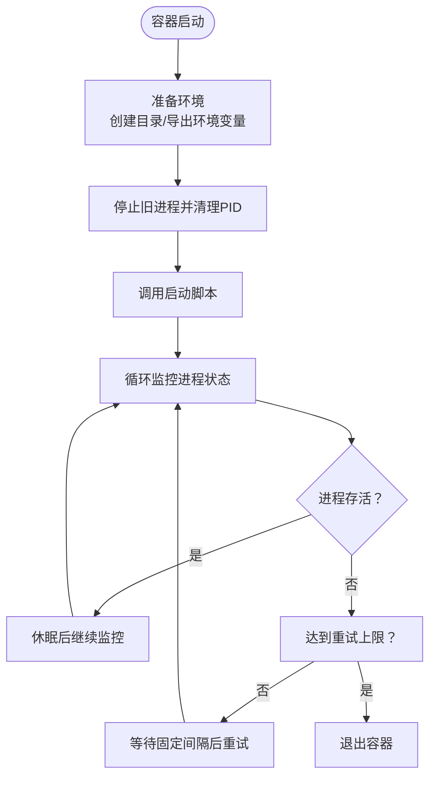
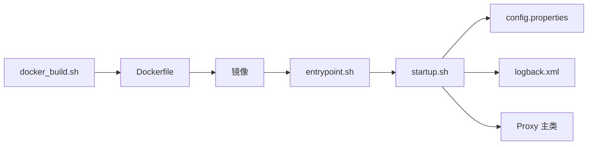

# 容器化部署

<cite>
**本文引用的文件**
- [docker/Dockerfile](file://docker/Dockerfile)
- [docker/docker_build.sh](file://docker/docker_build.sh)
- [docker/entrypoint.sh](file://docker/entrypoint.sh)
- [docker/run.sh](file://docker/run.sh)
- [docker/README.md](file://docker/README.md)
- [proxy-server/src/main/bin/startup.sh](file://proxy-server/src/main/bin/startup.sh)
- [proxy-server/src/main/conf/config.properties](file://proxy-server/src/main/conf/config.properties)
- [proxy-server/src/main/conf/logback.xml](file://proxy-server/src/main/conf/logback.xml)
- [proxy-common/src/main/java/com/alibaba/polardbx/proxy/config/ConfigProps.java](file://proxy-common/src/main/java/com/alibaba/polardbx/proxy/config/ConfigProps.java)
- [proxy-core/src/main/java/com/alibaba/polardbx/proxy/ProxyServer.java](file://proxy-core/src/main/java/com/alibaba/polardbx/proxy/ProxyServer.java)
- [polardbx_proxy_user_manual.md](file://polardbx_proxy_user_manual.md)
- [README.md](file://README.md)
</cite>

## 目录
1. [简介](#简介)
2. [项目结构](#项目结构)
3. [核心组件](#核心组件)
4. [架构总览](#架构总览)
5. [详细组件分析](#详细组件分析)
6. [依赖关系分析](#依赖关系分析)
7. [性能考虑](#性能考虑)
8. [故障排查指南](#故障排查指南)
9. [结论](#结论)
10. [附录](#附录)

## 简介
本指南面向希望在容器环境中部署 PolarDB-X Proxy 的工程师与运维人员，系统讲解基于仓库内现有 Docker 化脚本的构建与运行流程，覆盖以下主题：
- Dockerfile 的构建配置：基础镜像、工作目录、文件复制与权限设置
- 镜像构建脚本：构建流程、可选参数与自定义方式
- 容器启动流程：入口脚本功能、进程守护与健康观测、参数传递机制
- 容器运行最佳实践：端口映射、数据卷挂载、环境变量、资源限制
- 日志管理与网络通信：日志落盘路径、日志轮转策略、服务端口与网络模式
- 在不同编排平台的部署思路：Kubernetes 与 Docker Compose 的适配要点

## 项目结构
与容器化部署直接相关的目录与文件如下：
- docker/Dockerfile：镜像构建定义
- docker/docker_build.sh：构建脚本封装
- docker/entrypoint.sh：容器入口脚本，负责准备环境、启动进程、监控与重试
- docker/run.sh：本地运行脚本，封装端口检测、网络模式与容器启动命令
- docker/README.md：构建与运行说明
- proxy-server/src/main/bin/startup.sh：Proxy 启动脚本，解析参数并调用主类
- proxy-server/src/main/conf/config.properties：Proxy 基础配置（前端端口、后端地址等）
- proxy-server/src/main/conf/logback.xml：日志配置（控制台与文件滚动策略）
- proxy-common/src/main/java/com/alibaba/polardbx/proxy/config/ConfigProps.java：配置键常量（含通用服务端口）
- proxy-core/src/main/java/com/alibaba/polardbx/proxy/ProxyServer.java：服务端口加载与启动入口
- polardbx_proxy_user_manual.md：官方用户手册（包含默认端口与配置项说明）

图表来源
- [docker/Dockerfile](file://docker/Dockerfile#L1-L19)
- [docker/docker_build.sh](file://docker/docker_build.sh#L1-L21)
- [docker/entrypoint.sh](file://docker/entrypoint.sh#L1-L91)
- [docker/run.sh](file://docker/run.sh#L1-L89)
- [proxy-server/src/main/bin/startup.sh](file://proxy-server/src/main/bin/startup.sh#L1-L415)
- [proxy-server/src/main/conf/config.properties](file://proxy-server/src/main/conf/config.properties#L1-L117)
- [proxy-server/src/main/conf/logback.xml](file://proxy-server/src/main/conf/logback.xml#L1-L98)

章节来源
- [docker/Dockerfile](file://docker/Dockerfile#L1-L19)
- [docker/docker_build.sh](file://docker/docker_build.sh#L1-L21)
- [docker/README.md](file://docker/README.md#L1-L26)

## 核心组件
- Dockerfile：定义基础镜像、工作目录、复制产物与入口脚本、权限与用户切换、默认入口命令
- docker_build.sh：封装构建流程，先打包再构建镜像
- entrypoint.sh：准备环境变量快照、清理旧 PID、启动 Proxy、循环监控进程存活、有限次重试
- run.sh：本地运行脚本，检测端口占用、根据操作系统选择网络模式、拼装并执行 docker run 命令
- startup.sh：Proxy 主启动脚本，解析命令行参数、装载配置、设置 JVM 参数与 GC、启动主类
- config.properties：Proxy 默认配置，包含前端端口、后端地址、连接池、HA、读写分离等
- logback.xml：日志配置，控制台输出与文件滚动策略，支持异步日志与 SQL 日志

章节来源
- [docker/Dockerfile](file://docker/Dockerfile#L1-L19)
- [docker/docker_build.sh](file://docker/docker_build.sh#L1-L21)
- [docker/entrypoint.sh](file://docker/entrypoint.sh#L1-L91)
- [docker/run.sh](file://docker/run.sh#L1-L89)
- [proxy-server/src/main/bin/startup.sh](file://proxy-server/src/main/bin/startup.sh#L1-L415)
- [proxy-server/src/main/conf/config.properties](file://proxy-server/src/main/conf/config.properties#L1-L117)
- [proxy-server/src/main/conf/logback.xml](file://proxy-server/src/main/conf/logback.xml#L1-L98)

## 架构总览
下图展示从镜像构建到容器启动、进程监控与对外服务的整体流程。

图表来源
- [docker/docker_build.sh](file://docker/docker_build.sh#L19-L20)
- [docker/Dockerfile](file://docker/Dockerfile#L1-L19)
- [docker/entrypoint.sh](file://docker/entrypoint.sh#L33-L70)
- [proxy-server/src/main/bin/startup.sh](file://proxy-server/src/main/bin/startup.sh#L71-L120)
- [proxy-server/src/main/conf/config.properties](file://proxy-server/src/main/conf/config.properties#L32-L96)
- [proxy-server/src/main/conf/logback.xml](file://proxy-server/src/main/conf/logback.xml#L19-L93)

## 详细组件分析

### Dockerfile 构建配置
- 基础镜像：使用预置的基础 Java 镜像，确保运行时环境一致
- 工作目录：设置为非 root 用户的工作目录，便于后续权限控制
- 文件复制：将打包好的二进制目录与入口脚本复制到镜像内
- 权限与用户：设置入口脚本可执行、修改目录属主；切换到非 root 用户运行
- 入口命令：指定容器启动时执行入口脚本

章节来源
- [docker/Dockerfile](file://docker/Dockerfile#L1-L19)

### 镜像构建脚本（docker_build.sh）
- 功能：自动定位脚本所在目录、跳转到仓库根目录、执行打包命令、调用 docker build 构建镜像
- 流程：先清理并打包，再以 Dockerfile 为入口构建镜像
- 可扩展点：可在脚本中增加参数传入，用于定制镜像标签或构建上下文

章节来源
- [docker/docker_build.sh](file://docker/docker_build.sh#L1-L21)

### 容器启动流程（entrypoint.sh）
- 准备阶段：创建必要的运行目录、导出环境变量快照供启动脚本使用
- 启动阶段：停止旧进程并清理 PID 文件，调用启动脚本
- 监控阶段：通过进程名查找 PID，定期打印存活状态；若进程退出则继续按上限重试
- 重试策略：固定次数上限与固定间隔，避免无限重启

图表来源
- [docker/entrypoint.sh](file://docker/entrypoint.sh#L33-L87)

章节来源
- [docker/entrypoint.sh](file://docker/entrypoint.sh#L1-L91)

### 启动脚本参数与配置（startup.sh）
- 参数解析：支持调试端口、实例 ID、IDC、日志根目录、内存大小、MySQL 协议源流、源数据流地址/用户/密码、通用参数键值对等
- 环境注入：优先使用环境变量中的元数据库配置，其次回退到环境变量快照
- JVM 与 GC：根据内存大小动态设置堆大小与直接内存，启用 G1 GC，按 Java 版本输出 GC 日志
- 启动主类：最终以主类启动服务，标准输出/错误重定向至日志文件

章节来源
- [proxy-server/src/main/bin/startup.sh](file://proxy-server/src/main/bin/startup.sh#L86-L120)
- [proxy-server/src/main/bin/startup.sh](file://proxy-server/src/main/bin/startup.sh#L274-L313)
- [proxy-server/src/main/bin/startup.sh](file://proxy-server/src/main/bin/startup.sh#L346-L377)

### 配置与端口（config.properties 与 ConfigProps）
- 前端端口：默认前端端口为 3307，用于对外提供 MySQL 兼容协议
- 通用服务端口：默认 8083，用于内部通用服务与租约等
- 后端地址与认证：默认后端地址、用户名、密码与连接超时
- 连接池与 HA：读写/只读连接池最大值、HA 检查线程与间隔
- 日志开关：SQL 日志开关与最大长度等

章节来源
- [proxy-server/src/main/conf/config.properties](file://proxy-server/src/main/conf/config.properties#L32-L96)
- [proxy-common/src/main/java/com/alibaba/polardbx/proxy/config/ConfigProps.java](file://proxy-common/src/main/java/com/alibaba/polardbx/proxy/config/ConfigProps.java#L98-L101)
- [proxy-core/src/main/java/com/alibaba/polardbx/proxy/ProxyServer.java](file://proxy-core/src/main/java/com/alibaba/polardbx/proxy/ProxyServer.java#L81-L84)

### 日志配置（logback.xml）
- 控制台输出：带过滤器的控制台 Appender
- 文件滚动：按日期与大小滚动，保留历史与总量上限
- 异步日志：ROOT 与 SQL 使用异步 Appender，降低日志写入对业务影响
- SQL 日志：独立滚动策略，支持按连接上下文输出

章节来源
- [proxy-server/src/main/conf/logback.xml](file://proxy-server/src/main/conf/logback.xml#L19-L93)

### 本地运行脚本（run.sh）
- 端口检测：尝试使用 telnet 或 nc 检测端口占用
- 网络模式：Linux 下默认 host 网络模式，避免端口映射复杂性
- 命令拼装：根据传入的环境变量参数构造 docker run 命令并执行

章节来源
- [docker/run.sh](file://docker/run.sh#L14-L31)
- [docker/run.sh](file://docker/run.sh#L59-L74)
- [docker/run.sh](file://docker/run.sh#L84-L88)

## 依赖关系分析
- 构建链路：docker_build.sh -> Dockerfile -> 镜像
- 运行链路：容器 -> entrypoint.sh -> startup.sh -> Proxy 主类
- 配置链路：config.properties 与 logback.xml 由 startup.sh 加载并生效
- 端口链路：ProxyServer 从配置中读取通用服务端口并启动服务

图表来源
- [docker/docker_build.sh](file://docker/docker_build.sh#L19-L20)
- [docker/Dockerfile](file://docker/Dockerfile#L1-L19)
- [docker/entrypoint.sh](file://docker/entrypoint.sh#L33-L70)
- [proxy-server/src/main/bin/startup.sh](file://proxy-server/src/main/bin/startup.sh#L71-L120)
- [proxy-server/src/main/conf/config.properties](file://proxy-server/src/main/conf/config.properties#L32-L96)
- [proxy-server/src/main/conf/logback.xml](file://proxy-server/src/main/conf/logback.xml#L19-L93)

章节来源
- [proxy-core/src/main/java/com/alibaba/polardbx/proxy/ProxyServer.java](file://proxy-core/src/main/java/com/alibaba/polardbx/proxy/ProxyServer.java#L81-L84)

## 性能考虑
- JVM 内存：startup.sh 依据宿主机内存或显式传入内存大小设置堆与直接内存，建议结合业务规模合理设置
- GC 与日志：启用 G1 GC 并按 Java 版本输出 GC 日志；异步日志减少 IO 抖动
- 线程与 Reactor：配置文件中的 worker_threads、reactor_factor 等影响事件处理能力，需结合 CPU 与负载调优
- 端口与网络：默认前端 3307、通用服务 8083；host 网络模式可简化网络拓扑但需注意安全隔离

章节来源
- [proxy-server/src/main/bin/startup.sh](file://proxy-server/src/main/bin/startup.sh#L283-L313)
- [proxy-server/src/main/bin/startup.sh](file://proxy-server/src/main/bin/startup.sh#L355-L377)
- [proxy-server/src/main/conf/config.properties](file://proxy-server/src/main/conf/config.properties#L20-L27)

## 故障排查指南
- 容器无法启动或快速退出
  - 检查入口脚本是否成功启动进程并被监控
  - 查看启动脚本的标准输出与错误重定向日志
- 端口冲突
  - 使用 run.sh 的端口检测逻辑，确认 3307/8083 未被占用
- 网络模式问题
  - Linux 默认使用 host 模式，避免端口映射复杂度；其他系统按脚本逻辑处理
- 日志定位
  - 日志根目录由启动脚本注入，日志配置文件定义了滚动策略与异步写入
- 配置校验
  - 核对 config.properties 中的前端端口、后端地址、连接池与 HA 参数

章节来源
- [docker/entrypoint.sh](file://docker/entrypoint.sh#L59-L63)
- [docker/run.sh](file://docker/run.sh#L14-L31)
- [proxy-server/src/main/bin/startup.sh](file://proxy-server/src/main/bin/startup.sh#L390-L414)
- [proxy-server/src/main/conf/logback.xml](file://proxy-server/src/main/conf/logback.xml#L29-L45)

## 结论
本指南基于仓库内现有的 Docker 化脚本，给出了从镜像构建到容器运行、参数传递与日志配置的完整路径。建议在生产环境中结合资源限制、持久化存储与健康检查策略进一步完善部署方案。

## 附录

### 端口与默认配置
- 前端端口：3307
- 通用服务端口：8083
- 后端地址与认证：默认示例地址与凭据
- 连接池与 HA：默认连接池上限与 HA 检查间隔

章节来源
- [proxy-server/src/main/conf/config.properties](file://proxy-server/src/main/conf/config.properties#L32-L96)
- [polardbx_proxy_user_manual.md](file://polardbx_proxy_user_manual.md#L455-L503)

### 环境变量与参数传递
- 通过 run.sh 的 -e 选项传入后端地址、用户名、密码与内存大小等
- 启动脚本支持多种命令行参数，如日志根目录、实例 ID、IDC、源数据流参数等

章节来源
- [docker/run.sh](file://docker/run.sh#L7-L11)
- [proxy-server/src/main/bin/startup.sh](file://proxy-server/src/main/bin/startup.sh#L8-L30)

### 在 Kubernetes 中的部署要点
- Pod 定义
  - 使用镜像标签与入口脚本
  - 设置资源请求与限制（CPU/内存），参考启动脚本的内存策略
- 服务暴露
  - 对外暴露 3307（MySQL 协议）与 8083（通用服务）
- 存储与日志
  - 将日志目录映射到持久化卷，避免容器删除丢失日志
- 健康检查
  - 可基于通用服务端口进行就绪/存活探针，或通过进程监控逻辑判断
- 网络
  - 如需跨节点访问，建议使用 ClusterIP/NodePort 或 Ingress；如需简化网络，可考虑 hostNetwork（需评估安全影响）

[本节为概念性部署建议，不直接对应具体源码文件]

### 在 Docker Compose 中的部署要点
- 服务定义
  - image 指向构建的镜像
  - ports 映射 3307 与 8083
- 环境变量
  - 通过 environment 传入后端地址、用户名、密码与内存大小
- 卷挂载
  - 将日志目录映射到宿主机目录，实现日志持久化
- 健康检查
  - 使用 exec 方式探测通用服务端口或进程状态

[本节为概念性部署建议，不直接对应具体源码文件]