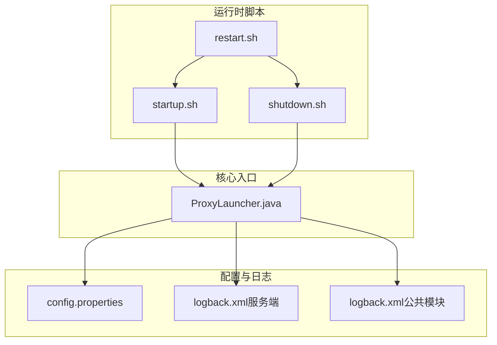
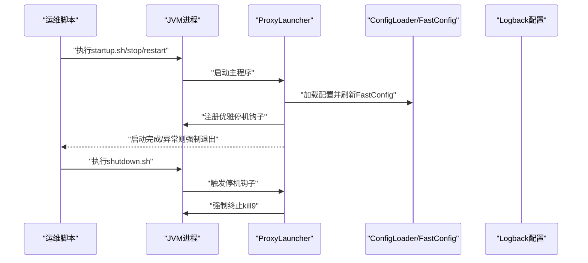
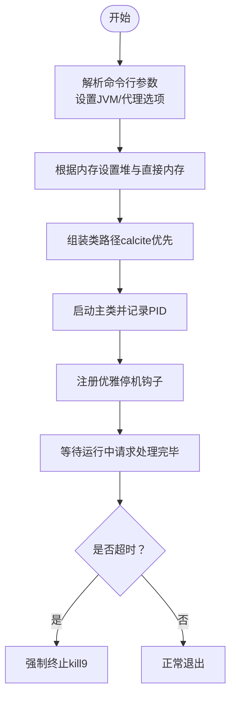
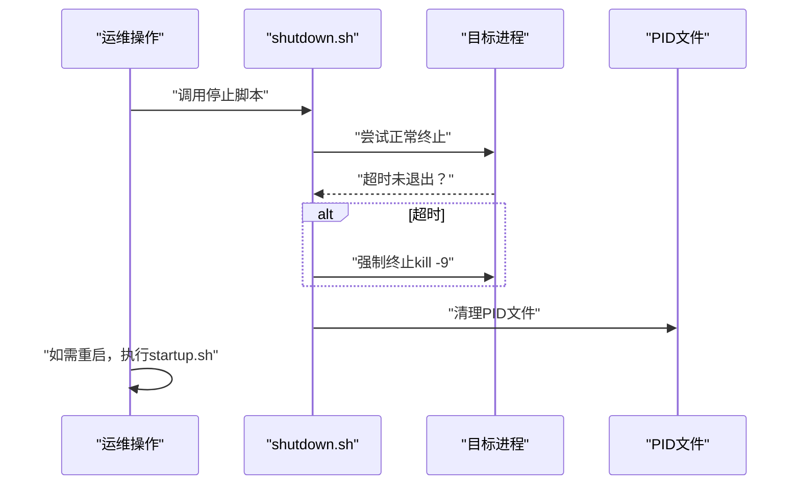
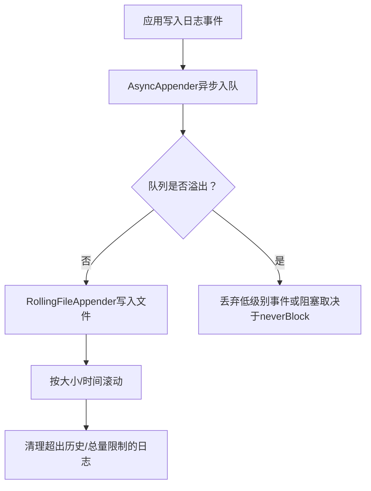
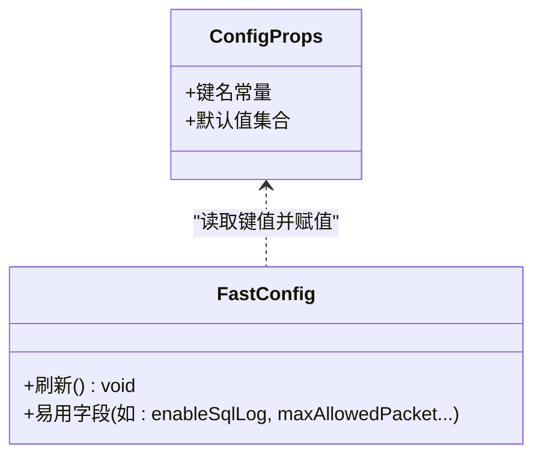
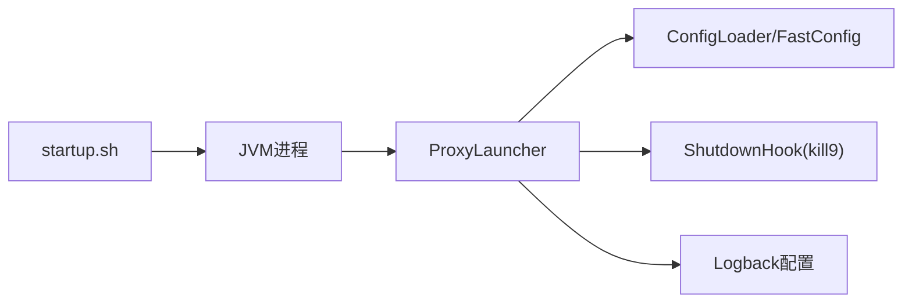

# 日常运维操作

<cite>
**本文引用的文件**
- [startup.sh](file://proxy-server/src/main/bin/startup.sh)
- [shutdown.sh](file://proxy-server/src/main/bin/shutdown.sh)
- [restart.sh](file://proxy-server/src/main/bin/restart.sh)
- [logback.xml（服务端）](file://proxy-server/src/main/conf/logback.xml)
- [logback.xml（公共模块）](file://proxy-common/src/main/resources/logback.xml)
- [config.properties](file://proxy-server/src/main/conf/config.properties)
- [ConfigProps.java](file://proxy-common/src/main/java/com/alibaba/polardbx/proxy/config/ConfigProps.java)
- [FastConfig.java](file://proxy-common/src/main/java/com/alibaba/polardbx/proxy/config/FastConfig.java)
- [AsyncAppender.java](file://proxy-common/src/main/java/com/alibaba/polardbx/proxy/logger/AsyncAppender.java)
- [ExtraLog.java](file://proxy-common/src/main/java/com/alibaba/polardbx/proxy/logger/ExtraLog.java)
- [ProxyLauncher.java](file://proxy-server/src/main/java/com/alibaba/polardbx/proxy/server/ProxyLauncher.java)
</cite>

## 目录
1. [简介](#简介)
2. [项目结构](#项目结构)
3. [核心组件](#核心组件)
4. [架构总览](#架构总览)
5. [详细组件分析](#详细组件分析)
6. [依赖关系分析](#依赖关系分析)
7. [性能与资源优化](#性能与资源优化)
8. [故障排查指南](#故障排查指南)
9. [结论](#结论)
10. [附录](#附录)

## 简介
本手册面向PolarDB-X Proxy的日常运维场景，围绕服务启动/停止/重启、日志管理、配置与动态参数、备份与恢复、版本升级、性能监控与调优、安全与审计、自动化运维脚本及工具使用等方面，提供可执行的操作步骤与最佳实践。文档中的所有技术细节均来源于仓库内现有实现与配置文件。

## 项目结构
- 运维脚本位于 proxy-server/src/main/bin，包含启动、停止、重启脚本。
- 配置文件位于 proxy-server/src/main/conf，包含运行时配置与日志配置。
- 核心启动入口为 ProxyLauncher，负责加载配置、初始化执行器与服务，并注册优雅停机钩子。
- 日志系统采用Logback，支持异步写入、按大小与时间滚动、总量与历史天数限制等策略。

图表来源
- [startup.sh](file://proxy-server/src/main/bin/startup.sh#L1-L415)
- [shutdown.sh](file://proxy-server/src/main/bin/shutdown.sh#L1-L117)
- [restart.sh](file://proxy-server/src/main/bin/restart.sh#L1-L18)
- [config.properties](file://proxy-server/src/main/conf/config.properties#L1-L117)
- [logback.xml（服务端）](file://proxy-server/src/main/conf/logback.xml#L1-L98)
- [logback.xml（公共模块）](file://proxy-common/src/main/resources/logback.xml#L1-L101)
- [ProxyLauncher.java](file://proxy-server/src/main/java/com/alibaba/polardbx/proxy/server/ProxyLauncher.java#L1-L57)

章节来源
- [startup.sh](file://proxy-server/src/main/bin/startup.sh#L1-L415)
- [shutdown.sh](file://proxy-server/src/main/bin/shutdown.sh#L1-L117)
- [restart.sh](file://proxy-server/src/main/bin/restart.sh#L1-L18)
- [config.properties](file://proxy-server/src/main/conf/config.properties#L1-L117)
- [logback.xml（服务端）](file://proxy-server/src/main/conf/logback.xml#L1-L98)
- [logback.xml（公共模块）](file://proxy-common/src/main/resources/logback.xml#L1-L101)
- [ProxyLauncher.java](file://proxy-server/src/main/java/com/alibaba/polardbx/proxy/server/ProxyLauncher.java#L1-L57)

## 核心组件
- 启动脚本：解析参数、设置JVM与代理参数、选择Java路径、计算内存、生成类路径、启动主程序并记录PID。
- 停止脚本：通过进程名或PID定位进程，先尝试正常终止，超时后强制终止，清理PID文件。
- 重启脚本：顺序执行停止与启动流程。
- 配置体系：静态配置文件与运行期动态参数，通过ConfigProps定义键名与默认值，FastConfig在运行期刷新为易用的volatile字段。
- 日志系统：Logback配置，支持根日志与SQL日志异步滚动输出，带队列容量、丢弃阈值与最大保留策略。
- 启动入口：ProxyLauncher负责加载配置、初始化执行器与服务，并注册优雅停机钩子（最终以强制方式退出，确保资源回收）。

章节来源
- [startup.sh](file://proxy-server/src/main/bin/startup.sh#L49-L415)
- [shutdown.sh](file://proxy-server/src/main/bin/shutdown.sh#L19-L117)
- [restart.sh](file://proxy-server/src/main/bin/restart.sh#L1-L18)
- [ConfigProps.java](file://proxy-common/src/main/java/com/alibaba/polardbx/proxy/config/ConfigProps.java#L23-L208)
- [FastConfig.java](file://proxy-common/src/main/java/com/alibaba/polardbx/proxy/config/FastConfig.java#L21-L75)
- [logback.xml（服务端）](file://proxy-server/src/main/conf/logback.xml#L19-L98)
- [logback.xml（公共模块）](file://proxy-common/src/main/resources/logback.xml#L19-L101)
- [ProxyLauncher.java](file://proxy-server/src/main/java/com/alibaba/polardbx/proxy/server/ProxyLauncher.java#L29-L57)

## 架构总览
下图展示从运维脚本到核心入口与配置/日志系统的交互关系。

图表来源
- [startup.sh](file://proxy-server/src/main/bin/startup.sh#L396-L415)
- [shutdown.sh](file://proxy-server/src/main/bin/shutdown.sh#L89-L117)
- [ProxyLauncher.java](file://proxy-server/src/main/java/com/alibaba/polardbx/proxy/server/ProxyLauncher.java#L32-L55)
- [FastConfig.java](file://proxy-common/src/main/java/com/alibaba/polardbx/proxy/config/FastConfig.java#L45-L75)
- [logback.xml（服务端）](file://proxy-server/src/main/conf/logback.xml#L19-L98)

## 详细组件分析

### 启动流程与优雅关闭策略
- 启动流程要点
  - 参数解析：支持调试端口、IDC、WISP、CGROUP、配置文件、实例ID、日志根目录、内存大小、MySQL源流协议与凭据、自定义键值对等。
  - 内存与线程：根据主机可用内存自动设置堆大小与直接内存上限；可选启用WISP与CGROUP多租；支持CPU核数限制。
  - 类路径与启动：优先加载calcite相关依赖，再拼接其他jar；将logback与配置文件路径注入JVM参数；后台启动主类并记录PID。
  - 日志：GC日志、堆dump与崩溃日志路径指向日志目录。
- 优雅关闭策略
  - ProxyLauncher注册了Runtime ShutdownHook，在收到中断信号时调用强制终止方法，确保资源回收与连接释放。
  - shutdown.sh会先尝试正常终止，若超时则发送强制终止信号，并清理PID文件。

图表来源
- [startup.sh](file://proxy-server/src/main/bin/startup.sh#L255-L415)
- [ProxyLauncher.java](file://proxy-server/src/main/java/com/alibaba/polardbx/proxy/server/ProxyLauncher.java#L45-L54)
- [shutdown.sh](file://proxy-server/src/main/bin/shutdown.sh#L89-L117)

章节来源
- [startup.sh](file://proxy-server/src/main/bin/startup.sh#L49-L415)
- [ProxyLauncher.java](file://proxy-server/src/main/java/com/alibaba/polardbx/proxy/server/ProxyLauncher.java#L32-L55)
- [shutdown.sh](file://proxy-server/src/main/bin/shutdown.sh#L76-L117)

### 停止与重启策略
- 停止策略
  - 通过进程名或PID定位目标进程，尝试正常终止；若超时未退出，则强制终止；最后清理PID文件。
- 重启策略
  - 先执行停止脚本，成功后再执行启动脚本；失败时提示人工检查。

图表来源
- [shutdown.sh](file://proxy-server/src/main/bin/shutdown.sh#L76-L117)
- [restart.sh](file://proxy-server/src/main/bin/restart.sh#L12-L17)

章节来源
- [shutdown.sh](file://proxy-server/src/main/bin/shutdown.sh#L76-L117)
- [restart.sh](file://proxy-server/src/main/bin/restart.sh#L1-L18)

### 日志管理最佳实践
- 日志级别与输出
  - 根日志默认级别为info；SQL日志通过独立logger输出；可通过覆盖级别调整grpc等子系统的日志等级。
- 异步与滚动
  - 使用AsyncAppender进行异步写入，降低日志I/O对业务的影响；滚动策略按大小与时间结合，限制单文件大小、历史天数与总大小。
- 存储位置与清理
  - 日志根目录由loggerRoot决定，默认指向logs目录；GC日志、堆dump与崩溃日志也统一落盘至日志目录。
- SQL日志开关
  - 可通过配置项开启/关闭SQL日志输出，避免生产环境产生大量SQL级日志。

图表来源
- [logback.xml（服务端）](file://proxy-server/src/main/conf/logback.xml#L29-L93)
- [logback.xml（公共模块）](file://proxy-common/src/main/resources/logback.xml#L29-L100)
- [AsyncAppender.java](file://proxy-common/src/main/java/com/alibaba/polardbx/proxy/logger/AsyncAppender.java#L24-L52)
- [ExtraLog.java](file://proxy-common/src/main/java/com/alibaba/polardbx/proxy/logger/ExtraLog.java#L24-L26)

章节来源
- [logback.xml（服务端）](file://proxy-server/src/main/conf/logback.xml#L19-L98)
- [logback.xml（公共模块）](file://proxy-common/src/main/resources/logback.xml#L19-L101)
- [AsyncAppender.java](file://proxy-common/src/main/java/com/alibaba/polardbx/proxy/logger/AsyncAppender.java#L1-L53)
- [ExtraLog.java](file://proxy-common/src/main/java/com/alibaba/polardbx/proxy/logger/ExtraLog.java#L1-L27)

### 配置与动态参数
- 静态配置
  - 包含前端端口、后端地址与认证、连接池大小、HA检查、读写分离与延迟阈值、全局变量刷新间隔、平滑切换等。
- 动态参数
  - 通过FastConfig在运行期刷新为易用的volatile字段，便于快速读取与热更新。
- 键名与默认值
  - 所有配置键名与默认值集中定义于ConfigProps，便于统一维护与校验。

图表来源
- [ConfigProps.java](file://proxy-common/src/main/java/com/alibaba/polardbx/proxy/config/ConfigProps.java#L23-L208)
- [FastConfig.java](file://proxy-common/src/main/java/com/alibaba/polardbx/proxy/config/FastConfig.java#L45-L75)

章节来源
- [config.properties](file://proxy-server/src/main/conf/config.properties#L19-L117)
- [ConfigProps.java](file://proxy-common/src/main/java/com/alibaba/polardbx/proxy/config/ConfigProps.java#L23-L208)
- [FastConfig.java](file://proxy-common/src/main/java/com/alibaba/polardbx/proxy/config/FastConfig.java#L21-L75)

### 备份与恢复（配置备份）
- 配置备份建议
  - 定期备份 config.properties 与动态配置文件（如dynamic.json），并纳入版本控制或配置中心。
  - 在升级/变更前，保存当前配置快照，以便快速回退。
- 数据导出与灾难恢复
  - 本仓库未提供专用的数据导出/恢复脚本。建议结合业务侧备份方案与数据库迁移工具进行演练与验证。

章节来源
- [config.properties](file://proxy-server/src/main/conf/config.properties#L50-L51)

### 版本升级指南
- 升级前准备
  - 备份当前配置与日志目录；确认JDK版本兼容性；评估变更影响面。
- 滚动升级
  - 逐节点执行停止/启动流程，确保流量切换期间无损。
- 回滚策略
  - 若升级后出现异常，使用上一版本二进制与备份配置快速回切。

章节来源
- [startup.sh](file://proxy-server/src/main/bin/startup.sh#L396-L415)
- [shutdown.sh](file://proxy-server/src/main/bin/shutdown.sh#L89-L117)

### 性能监控与调优
- 关键指标
  - GC日志、堆dump与崩溃日志路径已在启动脚本中配置，便于问题定位。
  - SQL日志开关可通过配置项控制，避免生产环境日志风暴。
- 瓶颈识别
  - 结合GC日志与SQL日志，定位慢查询与内存压力点。
- 资源配置优化
  - 根据主机内存自动设置堆与直接内存；必要时启用WISP与CGROUP；限制CPU核数以避免过度竞争。

章节来源
- [startup.sh](file://proxy-server/src/main/bin/startup.sh#L283-L375)
- [logback.xml（服务端）](file://proxy-server/src/main/conf/logback.xml#L35-L38)
- [logback.xml（公共模块）](file://proxy-common/src/main/resources/logback.xml#L35-L67)

### 安全与审计
- 访问控制
  - 前端端口与后端认证信息在配置文件中集中管理，建议最小权限原则与定期轮换。
- 审计与日志
  - SQL日志可按需开启，用于审计与问题追踪；注意控制日志量与敏感信息脱敏。
- 漏洞防护
  - 保持JDK与依赖库版本更新；避免在root用户下运行；严格控制脚本与配置文件权限。

章节来源
- [config.properties](file://proxy-server/src/main/conf/config.properties#L32-L37)
- [logback.xml（服务端）](file://proxy-server/src/main/conf/logback.xml#L113-L114)

### 自动化运维脚本示例
- 批量操作
  - 可基于现有脚本封装批量停止/启动/重启流程，结合主机清单与并发控制。
- 定时任务
  - 使用crontab定期巡检进程状态与磁盘空间，异常时触发告警。
- 告警处理
  - 将日志扫描与阈值检测集成到运维平台，实现自动通知与处置。

章节来源
- [startup.sh](file://proxy-server/src/main/bin/startup.sh#L1-L415)
- [shutdown.sh](file://proxy-server/src/main/bin/shutdown.sh#L1-L117)
- [restart.sh](file://proxy-server/src/main/bin/restart.sh#L1-L18)

### 运维工具使用
- 监控面板
  - 结合系统监控与应用埋点，关注CPU、内存、GC、连接数与响应时间。
- 日志分析
  - 使用日志收集与检索工具分析GC日志、SQL日志与错误日志，定位异常。
- 性能分析
  - 利用JVM自带工具与外部APM，配合GC日志与堆dump进行深度分析。

章节来源
- [startup.sh](file://proxy-server/src/main/bin/startup.sh#L367-L375)
- [logback.xml（服务端）](file://proxy-server/src/main/conf/logback.xml#L35-L38)

## 依赖关系分析
- 启动脚本依赖JVM与类路径组织，最终调用ProxyLauncher。
- ProxyLauncher依赖配置加载与FastConfig刷新，并注册停机钩子。
- 日志系统由Logback XML配置驱动，AsyncAppender与RollingPolicy共同保障高吞吐下的稳定性。

图表来源
- [startup.sh](file://proxy-server/src/main/bin/startup.sh#L396-L415)
- [ProxyLauncher.java](file://proxy-server/src/main/java/com/alibaba/polardbx/proxy/server/ProxyLauncher.java#L32-L55)
- [FastConfig.java](file://proxy-common/src/main/java/com/alibaba/polardbx/proxy/config/FastConfig.java#L45-L75)
- [logback.xml（服务端）](file://proxy-server/src/main/conf/logback.xml#L19-L98)

章节来源
- [startup.sh](file://proxy-server/src/main/bin/startup.sh#L396-L415)
- [ProxyLauncher.java](file://proxy-server/src/main/java/com/alibaba/polardbx/proxy/server/ProxyLauncher.java#L32-L55)
- [FastConfig.java](file://proxy-common/src/main/java/com/alibaba/polardbx/proxy/config/FastConfig.java#L45-L75)
- [logback.xml（服务端）](file://proxy-server/src/main/conf/logback.xml#L19-L98)

## 性能与资源优化
- JVM参数
  - 自动堆与直接内存设置；G1垃圾收集器；GC日志与堆dump路径；崩溃日志输出。
- 线程与网络
  - Reactor因子与CPU核数配置；TCP缓冲策略；连接池大小与HA检查间隔。
- 日志吞吐
  - 异步队列容量与丢弃策略；按大小/时间滚动与总量/历史限制。

章节来源
- [startup.sh](file://proxy-server/src/main/bin/startup.sh#L283-L375)
- [config.properties](file://proxy-server/src/main/conf/config.properties#L20-L117)
- [logback.xml（服务端）](file://proxy-server/src/main/conf/logback.xml#L35-L38)

## 故障排查指南
- 启动失败
  - 检查JDK版本与类路径；查看控制台日志与PID文件是否存在；确认端口占用。
- 停止失败
  - 查看进程是否存在；确认是否被强制终止；清理残留PID文件。
- 日志异常
  - 检查日志根目录权限与磁盘空间；确认滚动策略与总量限制；核对异步队列是否溢出。
- 性能问题
  - 分析GC日志与SQL日志；评估堆与直接内存设置；检查线程与连接池配置。

章节来源
- [startup.sh](file://proxy-server/src/main/bin/startup.sh#L255-L269)
- [shutdown.sh](file://proxy-server/src/main/bin/shutdown.sh#L76-L117)
- [logback.xml（服务端）](file://proxy-server/src/main/conf/logback.xml#L35-L38)

## 结论
本手册基于仓库现有实现，给出了PolarDB-X Proxy日常运维的标准化流程与最佳实践。通过规范化的启动/停止/重启、完善的日志管理、清晰的配置体系与性能优化手段，可有效提升系统的稳定性与可维护性。建议在生产环境中结合自动化与监控体系，持续完善运维流程。

## 附录
- 快速参考
  - 启动：./bin/startup.sh
  - 停止：./bin/shutdown.sh
  - 重启：./bin/restart.sh
  - 配置：conf/config.properties
  - 日志：conf/logback.xml