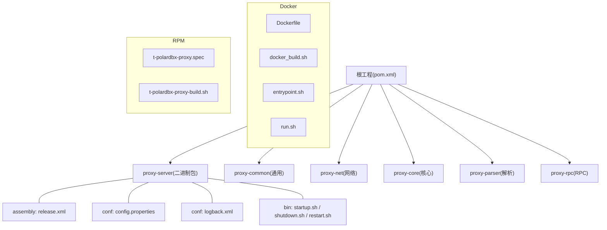
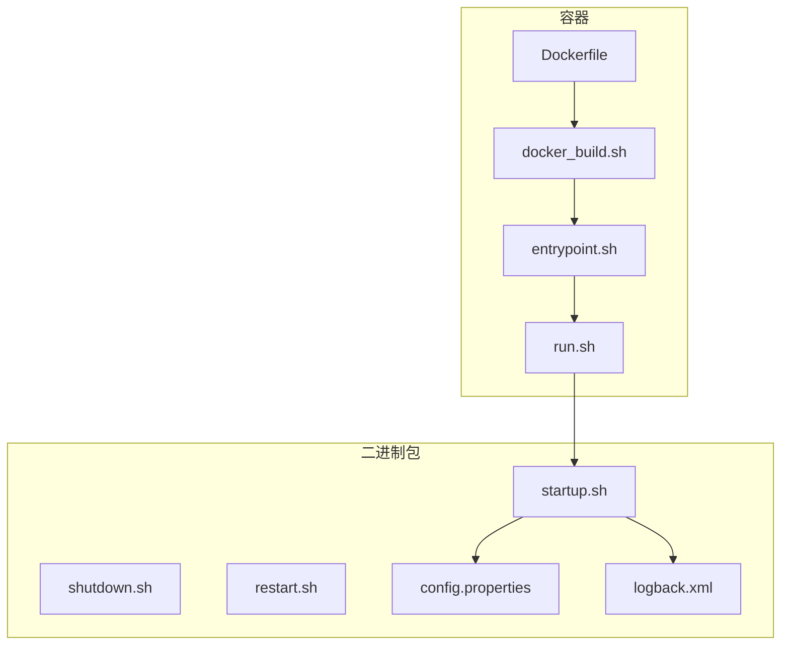
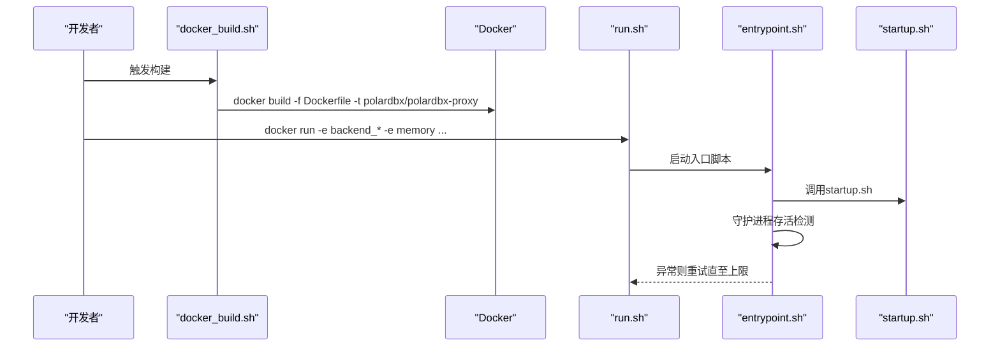
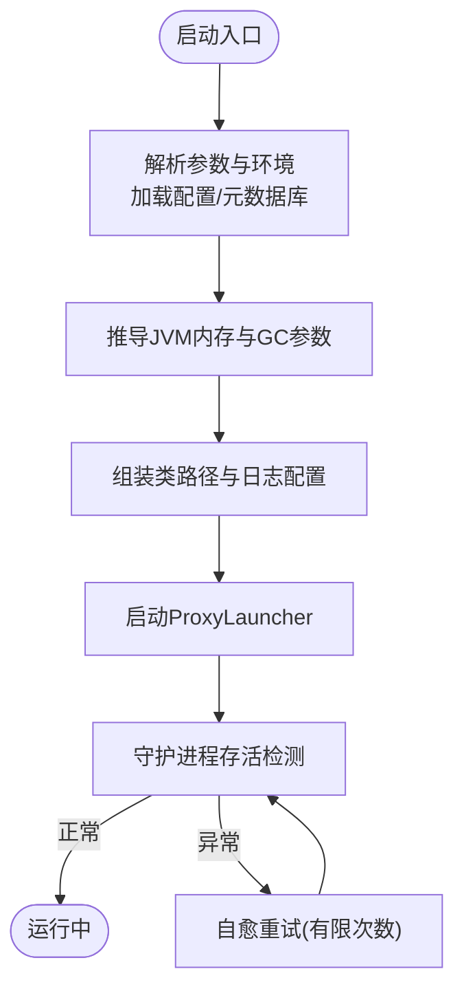
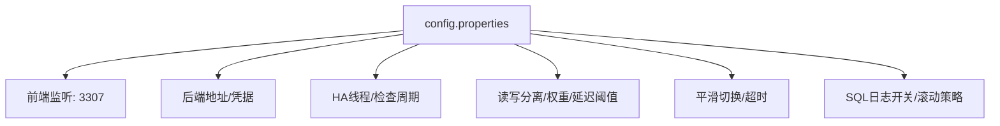
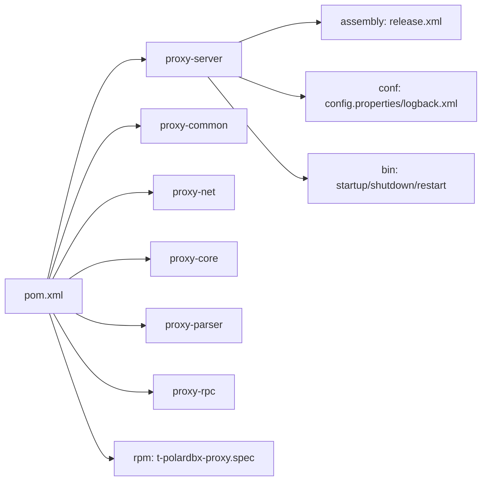

# 部署与运维

<cite>
**本文引用的文件**   
- [docker/Dockerfile](file://docker/Dockerfile)
- [docker/docker_build.sh](file://docker/docker_build.sh)
- [docker/run.sh](file://docker/run.sh)
- [docker/entrypoint.sh](file://docker/entrypoint.sh)
- [proxy-server/src/main/bin/startup.sh](file://proxy-server/src/main/bin/startup.sh)
- [proxy-server/src/main/bin/shutdown.sh](file://proxy-server/src/main/bin/shutdown.sh)
- [proxy-server/src/main/bin/restart.sh](file://proxy-server/src/main/bin/restart.sh)
- [proxy-server/src/main/conf/config.properties](file://proxy-server/src/main/conf/config.properties)
- [proxy-server/src/main/conf/logback.xml](file://proxy-server/src/main/conf/logback.xml)
- [proxy-server/src/main/assembly/release.xml](file://proxy-server/src/main/assembly/release.xml)
- [pom.xml](file://pom.xml)
- [README.md](file://README.md)
- [polardbx_proxy_user_manual.md](file://polardbx_proxy_user_manual.md)
- [rpm/t-polardbx-proxy.spec](file://rpm/t-polardbx-proxy.spec)
- [rpm/t-polardbx-proxy-build.sh](file://rpm/t-polardbx-proxy-build.sh)
</cite>

## 目录
1. [简介](#简介)
2. [项目结构](#项目结构)
3. [核心组件](#核心组件)
4. [架构总览](#架构总览)
5. [详细组件分析](#详细组件分析)
6. [依赖关系分析](#依赖关系分析)
7. [性能与资源](#性能与资源)
8. [运维操作指南](#运维操作指南)
9. [故障排查手册](#故障排查手册)
10. [监控与告警](#监控与告警)
11. [结论](#结论)
12. [附录](#附录)

## 简介
本指南面向PolarDB-X Proxy的部署与运维，覆盖Docker容器化部署、二进制包部署、集群配置、启动/停止/重启流程、系统资源与性能、日常运维、故障排查、监控告警与自动化最佳实践。文档基于仓库内的Dockerfile、构建与运行脚本、配置文件、用户手册与打包规范整理而成。

## 项目结构
- 顶层模块采用多模块聚合，核心模块包括proxy-server（二进制包与运行脚本）、proxy-common、proxy-net、proxy-core、proxy-parser、proxy-rpc。
- Docker相关位于docker目录，包含Dockerfile、构建脚本、入口脚本与容器运行脚本。
- 二进制包通过proxy-server的assembly定义打包，包含bin、conf、lib、logs等目录结构。
- RPM打包规范位于rpm目录，提供spec与构建脚本。

**图表来源**
- [pom.xml](file://pom.xml#L30-L37)
- [proxy-server/src/main/assembly/release.xml](file://proxy-server/src/main/assembly/release.xml#L19-L79)
- [docker/Dockerfile](file://docker/Dockerfile#L1-L19)
- [docker/docker_build.sh](file://docker/docker_build.sh#L1-L21)
- [docker/entrypoint.sh](file://docker/entrypoint.sh#L1-L91)
- [docker/run.sh](file://docker/run.sh#L1-L89)
- [proxy-server/src/main/conf/config.properties](file://proxy-server/src/main/conf/config.properties#L19-L117)
- [proxy-server/src/main/conf/logback.xml](file://proxy-server/src/main/conf/logback.xml#L19-L98)
- [rpm/t-polardbx-proxy.spec](file://rpm/t-polardbx-proxy.spec#L31-L81)
- [rpm/t-polardbx-proxy-build.sh](file://rpm/t-polardbx-proxy-build.sh#L1-L24)

**章节来源**
- [pom.xml](file://pom.xml#L30-L37)
- [README.md](file://README.md#L7-L9)

## 核心组件
- Docker容器化组件
  - Dockerfile：基础镜像、工作目录、复制产物、权限与用户、入口命令。
  - docker_build.sh：统一构建与镜像打包。
  - entrypoint.sh：容器内进程生命周期管理、健康检查与自愈循环。
  - run.sh：容器运行参数与端口映射、主机网络模式选择。
- 二进制包组件
  - startup.sh：JVM参数、内存策略、GC日志、类路径、启动入口。
  - shutdown.sh：优雅停机、PID查找、超时与强制终止。
  - restart.sh：先停后启的原子重启。
  - config.properties：前端端口、后端地址、连接池、HA、读写分离、平滑切换等。
  - logback.xml：异步日志、滚动策略、SQL日志开关。
- 打包与发布
  - assembly/release.xml：tar.gz打包布局与权限。
  - rpm/t-polardbx-proxy.spec：RPM包结构、安装/卸载钩子。
  - pom.xml：多模块聚合、依赖管理与插件。

**章节来源**
- [docker/Dockerfile](file://docker/Dockerfile#L1-L19)
- [docker/docker_build.sh](file://docker/docker_build.sh#L1-L21)
- [docker/entrypoint.sh](file://docker/entrypoint.sh#L1-L91)
- [docker/run.sh](file://docker/run.sh#L1-L89)
- [proxy-server/src/main/bin/startup.sh](file://proxy-server/src/main/bin/startup.sh#L256-L415)
- [proxy-server/src/main/bin/shutdown.sh](file://proxy-server/src/main/bin/shutdown.sh#L1-L117)
- [proxy-server/src/main/bin/restart.sh](file://proxy-server/src/main/bin/restart.sh#L1-L18)
- [proxy-server/src/main/conf/config.properties](file://proxy-server/src/main/conf/config.properties#L19-L117)
- [proxy-server/src/main/conf/logback.xml](file://proxy-server/src/main/conf/logback.xml#L19-L98)
- [proxy-server/src/main/assembly/release.xml](file://proxy-server/src/main/assembly/release.xml#L19-L79)
- [rpm/t-polardbx-proxy.spec](file://rpm/t-polardbx-proxy.spec#L31-L81)
- [pom.xml](file://pom.xml#L30-L37)

## 架构总览
下图展示从容器到二进制包的部署路径，以及配置与日志的关键落点。

**图表来源**
- [docker/Dockerfile](file://docker/Dockerfile#L1-L19)
- [docker/docker_build.sh](file://docker/docker_build.sh#L1-L21)
- [docker/entrypoint.sh](file://docker/entrypoint.sh#L1-L91)
- [docker/run.sh](file://docker/run.sh#L1-L89)
- [proxy-server/src/main/bin/startup.sh](file://proxy-server/src/main/bin/startup.sh#L256-L415)
- [proxy-server/src/main/bin/shutdown.sh](file://proxy-server/src/main/bin/shutdown.sh#L1-L117)
- [proxy-server/src/main/bin/restart.sh](file://proxy-server/src/main/bin/restart.sh#L1-L18)
- [proxy-server/src/main/conf/config.properties](file://proxy-server/src/main/conf/config.properties#L19-L117)
- [proxy-server/src/main/conf/logback.xml](file://proxy-server/src/main/conf/logback.xml#L19-L98)

## 详细组件分析

### Docker容器化部署
- 镜像构建
  - 基于官方基础镜像，复制二进制包与入口脚本，设置admin用户与sudo免密，赋予可执行权限。
  - 构建脚本统一执行mvn打包与docker build，输出镜像标签为polardbx/polardbx-proxy。
- 容器运行
  - run.sh负责端口检测、主机IP获取、网络模式(host或默认桥接)、端口映射(3307/8083)，并注入环境变量如node_ip。
  - entrypoint.sh负责准备环境、清理残留PID、启动startup.sh、守护进程存活检测与有限次自愈重试。
- 入口与生命周期
  - ENTRYPOINT指向entrypoint.sh；容器内通过jps定位进程，watch进程状态，异常退出时触发自愈循环。

**图表来源**
- [docker/docker_build.sh](file://docker/docker_build.sh#L1-L21)
- [docker/Dockerfile](file://docker/Dockerfile#L1-L19)
- [docker/run.sh](file://docker/run.sh#L1-L89)
- [docker/entrypoint.sh](file://docker/entrypoint.sh#L1-L91)
- [proxy-server/src/main/bin/startup.sh](file://proxy-server/src/main/bin/startup.sh#L256-L415)

**章节来源**
- [docker/Dockerfile](file://docker/Dockerfile#L1-L19)
- [docker/docker_build.sh](file://docker/docker_build.sh#L1-L21)
- [docker/run.sh](file://docker/run.sh#L1-L89)
- [docker/entrypoint.sh](file://docker/entrypoint.sh#L1-L91)

### 二进制包部署与系统服务
- 打包与目录结构
  - 使用assembly/release.xml定义tar.gz布局，包含bin、conf、lib、logs，bin脚本权限0755。
  - RPM通过t-polardbx-proxy.spec定义包体、权限、安装/卸载钩子。
- 启动流程
  - startup.sh解析参数，加载环境与元数据库配置，计算JVM内存与GC策略，设置类路径与日志配置，最终启动ProxyLauncher。
  - 支持WISP、CGroup、调试端口、源流协议、实例ID、日志根目录、内存大小等参数。
- 停止与重启
  - shutdown.sh通过进程名与PID文件查找目标进程，优雅停机并在超时后强制终止。
  - restart.sh先调用shutdown.sh再调用startup.sh，形成原子重启。

**图表来源**
- [proxy-server/src/main/bin/startup.sh](file://proxy-server/src/main/bin/startup.sh#L86-L415)
- [proxy-server/src/main/bin/shutdown.sh](file://proxy-server/src/main/bin/shutdown.sh#L19-L117)
- [proxy-server/src/main/bin/restart.sh](file://proxy-server/src/main/bin/restart.sh#L1-L18)
- [proxy-server/src/main/assembly/release.xml](file://proxy-server/src/main/assembly/release.xml#L19-L79)
- [rpm/t-polardbx-proxy.spec](file://rpm/t-polardbx-proxy.spec#L31-L81)

**章节来源**
- [proxy-server/src/main/assembly/release.xml](file://proxy-server/src/main/assembly/release.xml#L19-L79)
- [rpm/t-polardbx-proxy.spec](file://rpm/t-polardbx-proxy.spec#L31-L81)
- [proxy-server/src/main/bin/startup.sh](file://proxy-server/src/main/bin/startup.sh#L86-L415)
- [proxy-server/src/main/bin/shutdown.sh](file://proxy-server/src/main/bin/shutdown.sh#L19-L117)
- [proxy-server/src/main/bin/restart.sh](file://proxy-server/src/main/bin/restart.sh#L1-L18)

### 集群配置与高可用
- 前端/后端配置
  - 前端端口frontend_port默认3307；后端地址backend_address、用户名backend_username、密码backend_password。
  - 连接池：admin/rw/ro最大连接数；HA线程与检查周期；平滑切换开关与超时。
- 读写分离与一致性
  - enable_read_write_splitting、enable_follower_read、enable_leader_in_ro_pools、read_weights、latency阈值与记录数、stale-read开关。
- 日志与SQL可观测性
  - enable_sql_log控制SQL日志；日志滚动策略与队列容量；异步SQL日志appender。

**图表来源**
- [proxy-server/src/main/conf/config.properties](file://proxy-server/src/main/conf/config.properties#L19-L117)
- [proxy-server/src/main/conf/logback.xml](file://proxy-server/src/main/conf/logback.xml#L19-L98)

**章节来源**
- [proxy-server/src/main/conf/config.properties](file://proxy-server/src/main/conf/config.properties#L19-L117)
- [proxy-server/src/main/conf/logback.xml](file://proxy-server/src/main/conf/logback.xml#L19-L98)

## 依赖关系分析
- 模块依赖
  - proxy-server聚合其他模块，作为打包与运行入口。
- 外部依赖
  - 日志：SLF4J + Logback；RPC：gRPC；MySQL驱动等。
- 构建与打包
  - Maven编译、源码、装配与RPM插件；assembly定义产物布局；RPM spec定义安装行为。

**图表来源**
- [pom.xml](file://pom.xml#L30-L37)
- [proxy-server/src/main/assembly/release.xml](file://proxy-server/src/main/assembly/release.xml#L19-L79)
- [rpm/t-polardbx-proxy.spec](file://rpm/t-polardbx-proxy.spec#L31-L81)

**章节来源**
- [pom.xml](file://pom.xml#L30-L37)
- [proxy-server/src/main/assembly/release.xml](file://proxy-server/src/main/assembly/release.xml#L19-L79)
- [rpm/t-polardbx-proxy.spec](file://rpm/t-polardbx-proxy.spec#L31-L81)

## 性能与资源
- 系统要求
  - Docker环境：Linux 64位/X86或ARM，Docker，内存推荐≥16GB，端口3307/8083可用。
  - 二进制包：JDK 11+，按需设置内存大小与GC策略。
- JVM与内存
  - startup.sh依据系统内存动态设置堆大小与MaxDirectMemory，启用G1GC与相关参数，并输出GC日志。
- 日志与SQL可观测性
  - logback.xml配置异步ROOT与SQL日志，支持按天/按大小滚动与总量上限，降低对性能的影响。
- 性能基线与容量规划
  - 建议结合实际业务QPS与RT，评估连接池大小、读写分离权重与延迟阈值，观察GC日志与SQL日志，逐步收敛参数。

**章节来源**
- [polardbx_proxy_user_manual.md](file://polardbx_proxy_user_manual.md#L39-L50)
- [proxy-server/src/main/bin/startup.sh](file://proxy-server/src/main/bin/startup.sh#L283-L376)
- [proxy-server/src/main/conf/logback.xml](file://proxy-server/src/main/conf/logback.xml#L19-L98)

## 运维操作指南
- Docker容器化
  - 构建镜像：执行docker_build.sh，完成mvn打包与docker build。
  - 运行容器：使用run.sh传入backend_*与memory等环境变量，选择host网络或桥接网络。
  - 健康检查：entrypoint.sh守护进程，异常自动重试。
- 二进制包
  - 启动：进入bin目录执行startup.sh，可指定内存、调试端口、实例ID、日志根目录等。
  - 停止：执行shutdown.sh，优雅停机并清理PID文件。
  - 重启：执行restart.sh，内部先停后启。
- 配置热更新
  - config.properties支持动态配置文件路径与多项运行期参数，结合用户手册中的运维指令进行观测与调整。

**章节来源**
- [docker/docker_build.sh](file://docker/docker_build.sh#L1-L21)
- [docker/run.sh](file://docker/run.sh#L1-L89)
- [docker/entrypoint.sh](file://docker/entrypoint.sh#L1-L91)
- [proxy-server/src/main/bin/startup.sh](file://proxy-server/src/main/bin/startup.sh#L86-L415)
- [proxy-server/src/main/bin/shutdown.sh](file://proxy-server/src/main/bin/shutdown.sh#L19-L117)
- [proxy-server/src/main/bin/restart.sh](file://proxy-server/src/main/bin/restart.sh#L1-L18)
- [proxy-server/src/main/conf/config.properties](file://proxy-server/src/main/conf/config.properties#L19-L117)
- [polardbx_proxy_user_manual.md](file://polardbx_proxy_user_manual.md#L377-L573)

## 故障排查手册
- 启动失败
  - 检查JVM可执行路径与版本，确认JAVA/JAVA_HOME存在且为64位；查看startup.sh输出与GC日志。
  - 若PID文件存在但进程不存在，先执行shutdown.sh清理残留。
- 连接问题
  - 确认frontend_port(默认3307)与后端地址/backend_username/backend_password配置正确。
  - 使用show cluster/frontend/backend等运维指令观察集群与连接状态。
- 日志定位
  - 查看logs/_system/proxy.log与gc.log；SQL日志位于logs/sql.log，按日期/大小滚动。
- 停止异常
  - shutdown.sh在超时后会强制kill，若仍无法停止，检查进程是否存在并手动处理。

**章节来源**
- [proxy-server/src/main/bin/startup.sh](file://proxy-server/src/main/bin/startup.sh#L256-L415)
- [proxy-server/src/main/bin/shutdown.sh](file://proxy-server/src/main/bin/shutdown.sh#L76-L117)
- [proxy-server/src/main/conf/logback.xml](file://proxy-server/src/main/conf/logback.xml#L19-L98)
- [polardbx_proxy_user_manual.md](file://polardbx_proxy_user_manual.md#L377-L573)

## 监控与告警
- 运维指令
  - show cluster：查看后端集群角色、延迟、LSN等。
  - show frontend/backend：查看前端/后端连接状态与会话信息。
  - show properties：查看运行期配置快照。
  - show reactor/ro/rw：查看事件驱动框架与连接池状态。
- 日志与指标
  - 结合SQL日志与GC日志，观察慢查询、重试、切换等待时间等。
  - 建议将日志接入集中式日志系统，设置告警规则（如ERROR级别、RT异常、连接池耗尽、HA切换频率等）。

**章节来源**
- [polardbx_proxy_user_manual.md](file://polardbx_proxy_user_manual.md#L377-L573)
- [proxy-server/src/main/conf/logback.xml](file://proxy-server/src/main/conf/logback.xml#L19-L98)

## 结论
本指南基于仓库内Docker与二进制包部署脚本、配置与打包规范，给出了从构建、运行、配置到运维与故障排查的完整路径。建议在生产环境中结合业务规模与SLA，细化JVM参数、连接池与读写分离策略，并建立完善的日志与监控体系。

## 附录
- 快速开始参考
  - Docker快速开始与连接示例参见用户手册。
- 版本与构建
  - README提供构建命令；pom与assembly/RPM定义版本与打包细节。

**章节来源**
- [README.md](file://README.md#L7-L9)
- [polardbx_proxy_user_manual.md](file://polardbx_proxy_user_manual.md#L39-L75)
- [pom.xml](file://pom.xml#L39-L54)
- [proxy-server/src/main/assembly/release.xml](file://proxy-server/src/main/assembly/release.xml#L19-L79)
- [rpm/t-polardbx-proxy.spec](file://rpm/t-polardbx-proxy.spec#L31-L81)