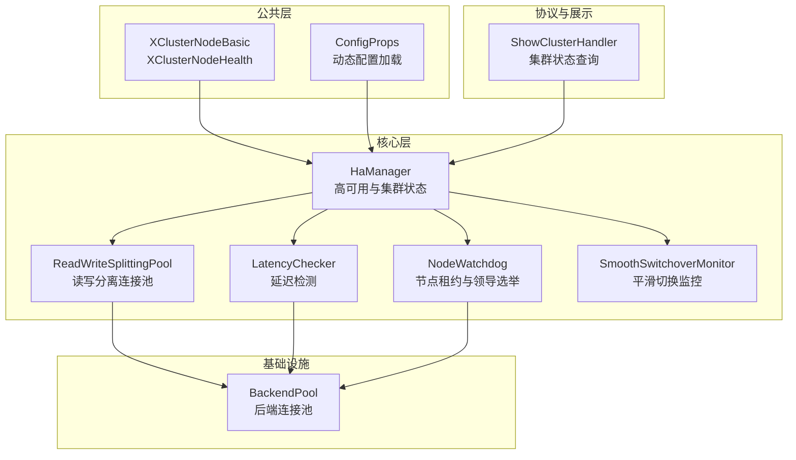
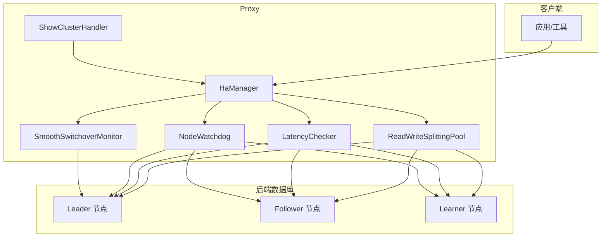
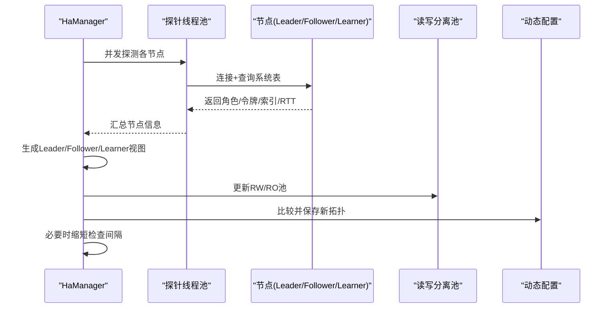
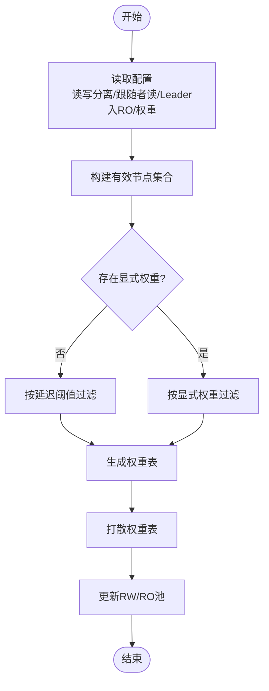
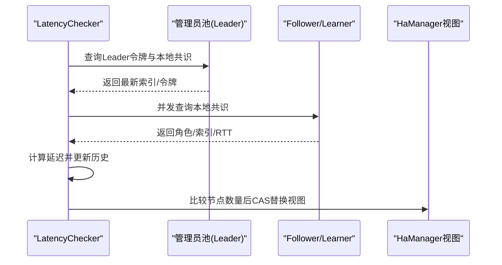
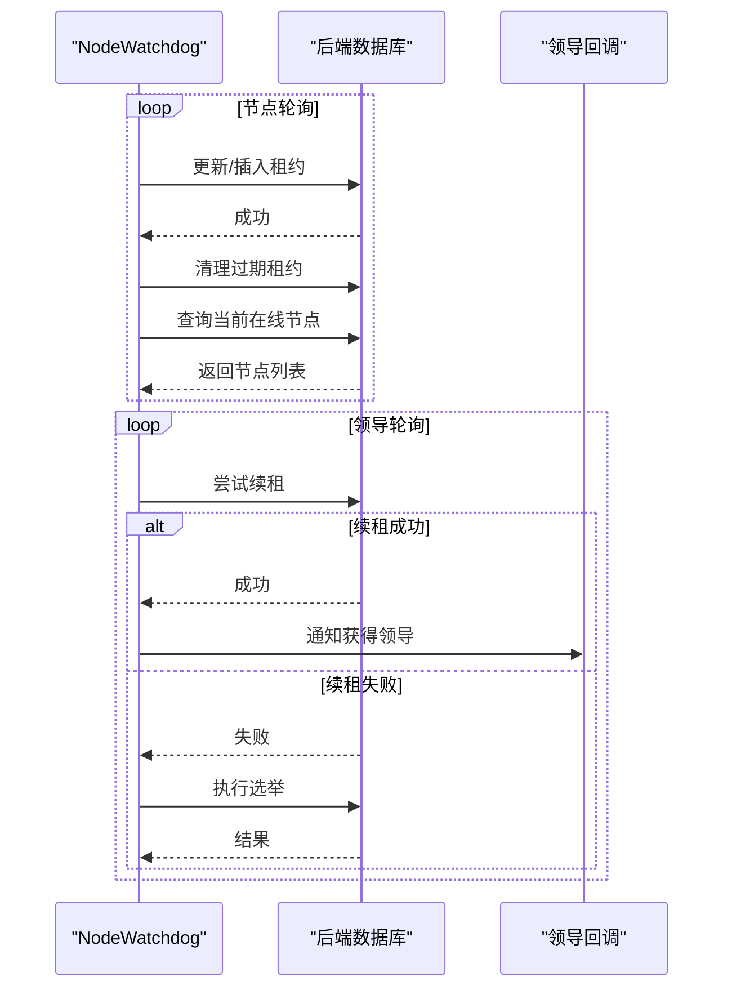
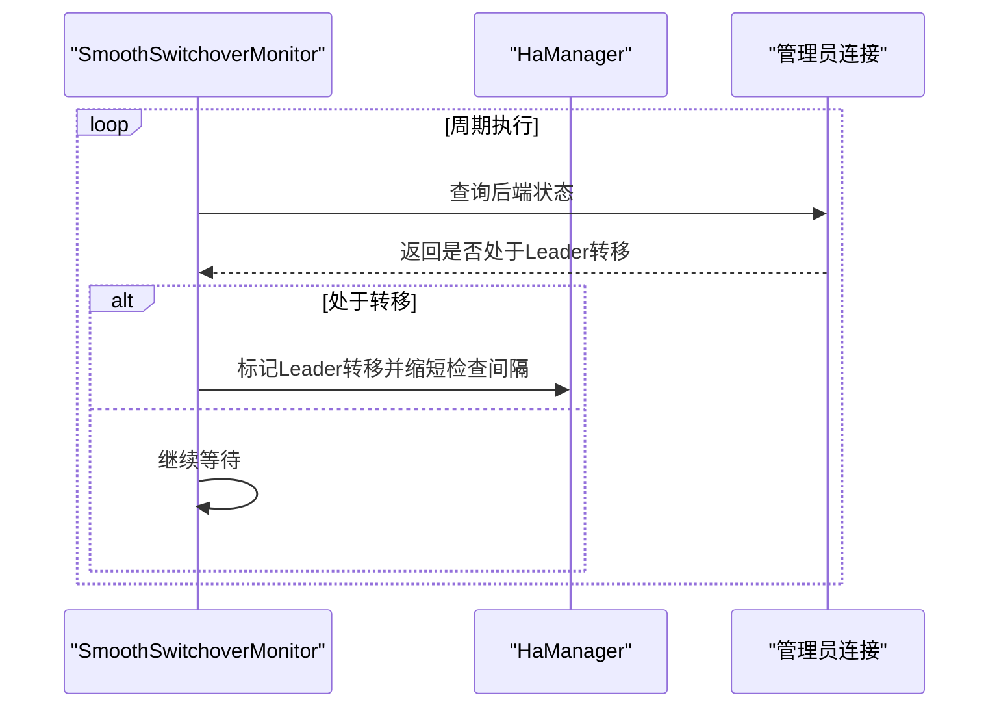
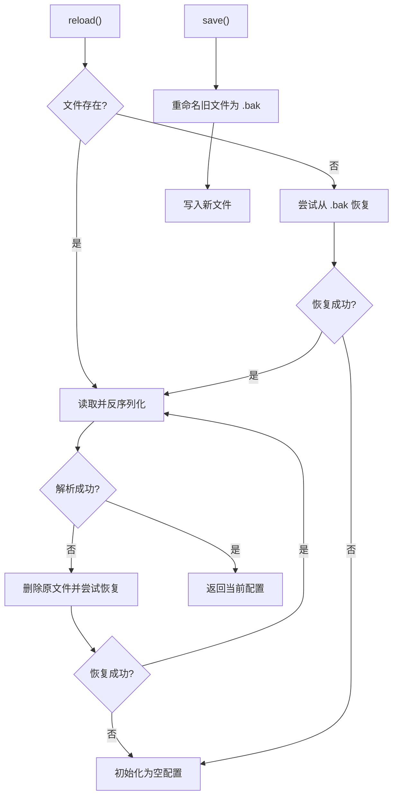
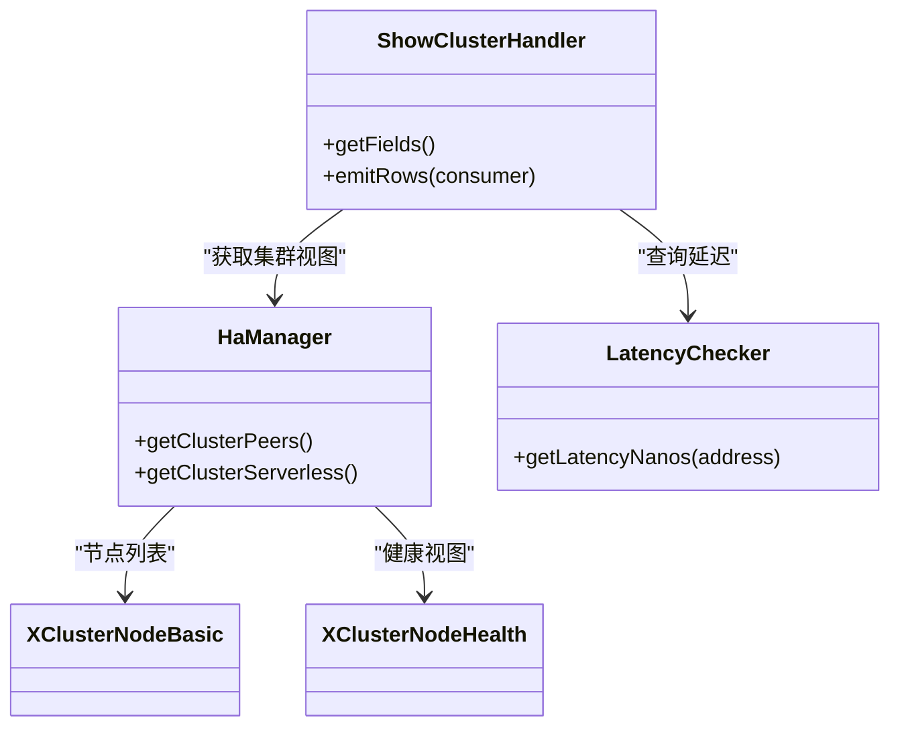
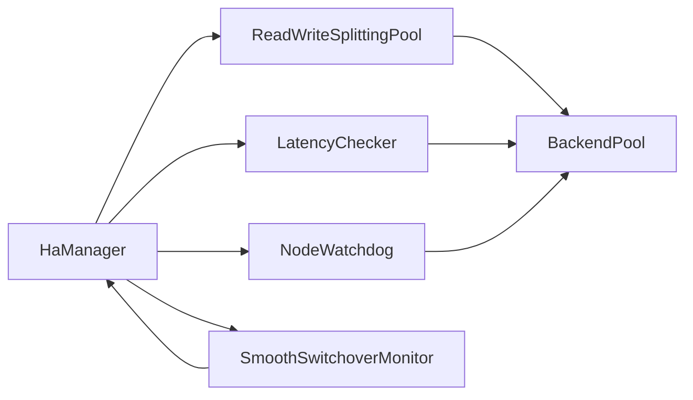

# 集群配置管理

<cite>
**本文引用的文件**
- [XClusterNodeBasic.java](file://proxy-common/src/main/java/com/alibaba/polardbx/proxy/common/XClusterNodeBasic.java)
- [XClusterNodeHealth.java](file://proxy-common/src/main/java/com/alibaba/polardbx/proxy/common/XClusterNodeHealth.java)
- [ConfigProps.java](file://proxy-common/src/main/java/com/alibaba/polardbx/proxy/config/ConfigProps.java)
- [DynamicConfig.java](file://proxy-common/src/main/java/com/alibaba/polardbx/proxy/dynamic/DynamicConfig.java)
- [config.properties（通用）](file://proxy-common/src/main/resources/config.properties)
- [config.properties（服务端）](file://proxy-server/src/main/conf/config.properties)
- [NodeWatchdog.java](file://proxy-core/src/main/java/com/alibaba/polardbx/proxy/cluster/NodeWatchdog.java)
- [HaManager.java](file://proxy-core/src/main/java/com/alibaba/polardbx/proxy/serverless/HaManager.java)
- [ReadWriteSplittingPool.java](file://proxy-core/src/main/java/com/alibaba/polardbx/proxy/serverless/ReadWriteSplittingPool.java)
- [LatencyChecker.java](file://proxy-core/src/main/java/com/alibaba/polardbx/proxy/serverless/LatencyChecker.java)
- [SmoothSwitchoverMonitor.java](file://proxy-core/src/main/java/com/alibaba/polardbx/proxy/serverless/SmoothSwitchoverMonitor.java)
- [ShowClusterHandler.java](file://proxy-core/src/main/java/com/alibaba/polardbx/proxy/protocol/handler/request/ShowClusterHandler.java)
- [BackendPool.java](file://proxy-core/src/main/java/com/alibaba/polardbx/proxy/connection/pool/BackendPool.java)
</cite>

## 目录
1. [简介](#简介)
2. [项目结构](#项目结构)
3. [核心组件](#核心组件)
4. [架构总览](#架构总览)
5. [详细组件分析](#详细组件分析)
6. [依赖关系分析](#依赖关系分析)
7. [性能考量](#性能考量)
8. [故障排查指南](#故障排查指南)
9. [结论](#结论)
10. [附录](#附录)

## 简介
本指南面向PolarDB-X Proxy集群的配置与运维，聚焦于多节点部署架构、主从角色与读写分离、成员管理与心跳、故障检测与切换、动态扩缩容、高可用参数、监控与运维接口、性能调优以及迁移升级流程。文档以代码为依据，结合可视化图示帮助读者快速理解系统设计与实现细节。

## 项目结构
- proxy-common：公共模型与配置常量、动态配置加载与持久化
- proxy-core：核心逻辑，包含高可用管理、读写分离、延迟检测、节点租约、系统表展示等
- proxy-server：服务端配置与启动入口
- proxy-net、proxy-parser、proxy-rpc：网络、解析与RPC支撑模块

图表来源
- [XClusterNodeBasic.java](file://proxy-common/src/main/java/com/alibaba/polardbx/proxy/common/XClusterNodeBasic.java#L28-L90)
- [XClusterNodeHealth.java](file://proxy-common/src/main/java/com/alibaba/polardbx/proxy/common/XClusterNodeHealth.java#L24-L56)
- [ConfigProps.java](file://proxy-common/src/main/java/com/alibaba/polardbx/proxy/config/ConfigProps.java#L23-L209)
- [DynamicConfig.java](file://proxy-common/src/main/java/com/alibaba/polardbx/proxy/dynamic/DynamicConfig.java#L43-L130)
- [HaManager.java](file://proxy-core/src/main/java/com/alibaba/polardbx/proxy/serverless/HaManager.java#L67-L744)
- [ReadWriteSplittingPool.java](file://proxy-core/src/main/java/com/alibaba/polardbx/proxy/serverless/ReadWriteSplittingPool.java#L48-L407)
- [LatencyChecker.java](file://proxy-core/src/main/java/com/alibaba/polardbx/proxy/serverless/LatencyChecker.java#L49-L277)
- [NodeWatchdog.java](file://proxy-core/src/main/java/com/alibaba/polardbx/proxy/cluster/NodeWatchdog.java#L48-L432)
- [SmoothSwitchoverMonitor.java](file://proxy-core/src/main/java/com/alibaba/polardbx/proxy/serverless/SmoothSwitchoverMonitor.java#L31-L95)
- [ShowClusterHandler.java](file://proxy-core/src/main/java/com/alibaba/polardbx/proxy/protocol/handler/request/ShowClusterHandler.java#L34-L121)
- [BackendPool.java](file://proxy-core/src/main/java/com/alibaba/polardbx/proxy/connection/pool/BackendPool.java#L46-L113)

章节来源
- [ConfigProps.java](file://proxy-common/src/main/java/com/alibaba/polardbx/proxy/config/ConfigProps.java#L23-L209)
- [config.properties（服务端）](file://proxy-server/src/main/conf/config.properties#L19-L117)

## 核心组件
- 集群节点模型：XClusterNodeBasic描述节点标签、主机、前端端口、X协议端口、Paxos端口、角色、同伴列表、版本、集群ID与更新时间；XClusterNodeHealth描述节点角色、代理令牌、提交索引、应用索引、RTT与更新时间。
- 高可用管理：HaManager负责探测集群节点、提取角色与同伴、维护Leader、Follower、Learner视图，驱动读写分离池与管理员池更新，并支持平滑切换监控。
- 读写分离池：ReadWriteSplittingPool根据配置与延迟阈值构建RW/RO连接池，支持权重与延迟剔除策略。
- 延迟检测：LatencyChecker周期性向Leader与各节点查询本地共识信息，计算延迟并更新健康视图。
- 节点租约与领导：NodeWatchdog通过数据库表维护租约，完成节点注册、清理与领导选举。
- 平滑切换监控：SmoothSwitchoverMonitor轮询后端状态判断是否处于Leader转移中，触发快速HA检查。
- 动态配置：DynamicConfig加载/保存dynamic.json，记录当前集群拓扑，支持回滚与恢复。
- 配置常量：ConfigProps集中定义所有可调参数及默认值，覆盖线程、TCP、前端/后端端口、连接池、HA、读写分离、延迟检测、平滑切换、日志与性能开关等。

章节来源
- [XClusterNodeBasic.java](file://proxy-common/src/main/java/com/alibaba/polardbx/proxy/common/XClusterNodeBasic.java#L28-L90)
- [XClusterNodeHealth.java](file://proxy-common/src/main/java/com/alibaba/polardbx/proxy/common/XClusterNodeHealth.java#L24-L56)
- [HaManager.java](file://proxy-core/src/main/java/com/alibaba/polardbx/proxy/serverless/HaManager.java#L67-L744)
- [ReadWriteSplittingPool.java](file://proxy-core/src/main/java/com/alibaba/polardbx/proxy/serverless/ReadWriteSplittingPool.java#L48-L407)
- [LatencyChecker.java](file://proxy-core/src/main/java/com/alibaba/polardbx/proxy/serverless/LatencyChecker.java#L49-L277)
- [NodeWatchdog.java](file://proxy-core/src/main/java/com/alibaba/polardbx/proxy/cluster/NodeWatchdog.java#L48-L432)
- [SmoothSwitchoverMonitor.java](file://proxy-core/src/main/java/com/alibaba/polardbx/proxy/serverless/SmoothSwitchoverMonitor.java#L31-L95)
- [DynamicConfig.java](file://proxy-common/src/main/java/com/alibaba/polardbx/proxy/dynamic/DynamicConfig.java#L43-L130)
- [ConfigProps.java](file://proxy-common/src/main/java/com/alibaba/polardbx/proxy/config/ConfigProps.java#L23-L209)

## 架构总览
下图展示Proxy在多节点环境中的角色分工与交互：HaManager作为中枢协调Leader选举、成员发现与健康度评估；ReadWriteSplittingPool按策略分发读写请求；LatencyChecker提供延迟指标；NodeWatchdog保障租约与领导；SmoothSwitchoverMonitor辅助平滑切换；ShowClusterHandler对外暴露集群状态。

图表来源
- [HaManager.java](file://proxy-core/src/main/java/com/alibaba/polardbx/proxy/serverless/HaManager.java#L67-L744)
- [ReadWriteSplittingPool.java](file://proxy-core/src/main/java/com/alibaba/polardbx/proxy/serverless/ReadWriteSplittingPool.java#L48-L407)
- [LatencyChecker.java](file://proxy-core/src/main/java/com/alibaba/polardbx/proxy/serverless/LatencyChecker.java#L49-L277)
- [NodeWatchdog.java](file://proxy-core/src/main/java/com/alibaba/polardbx/proxy/cluster/NodeWatchdog.java#L48-L432)
- [SmoothSwitchoverMonitor.java](file://proxy-core/src/main/java/com/alibaba/polardbx/proxy/serverless/SmoothSwitchoverMonitor.java#L31-L95)
- [ShowClusterHandler.java](file://proxy-core/src/main/java/com/alibaba/polardbx/proxy/protocol/handler/request/ShowClusterHandler.java#L34-L121)

## 详细组件分析

### 组件A：高可用管理器（HaManager）
- 角色与职责
  - 探测集群节点，收集角色、同伴、版本、端口映射与健康指标
  - 维护Leader/Follower/Learner视图，生成XClusterServerless
  - 更新管理员池与读写分离池，必要时触发快速HA检查
  - 持久化动态配置，记录集群拓扑变更
- 关键流程
  - 成员发现：从动态配置与静态配置合并探针地址集
  - 健康采集：并发探测各节点，提取角色、代理令牌、共识索引与RTT
  - 视图生成：整理Leader/Follower/Learner，排序稳定比较
  - 池更新：当Leader变化或拓扑变化时重建RW/RO池
  - 快速检查：Leader转移期间缩短检查间隔

图表来源
- [HaManager.java](file://proxy-core/src/main/java/com/alibaba/polardbx/proxy/serverless/HaManager.java#L431-L647)
- [ReadWriteSplittingPool.java](file://proxy-core/src/main/java/com/alibaba/polardbx/proxy/serverless/ReadWriteSplittingPool.java#L327-L341)
- [DynamicConfig.java](file://proxy-common/src/main/java/com/alibaba/polardbx/proxy/dynamic/DynamicConfig.java#L69-L103)

章节来源
- [HaManager.java](file://proxy-core/src/main/java/com/alibaba/polardbx/proxy/serverless/HaManager.java#L67-L744)

### 组件B：读写分离池（ReadWriteSplittingPool）
- 角色与职责
  - 基于配置与延迟阈值，维护RW/RO连接池
  - 支持权重表与随机打散，按负载与权重选择RO节点
  - 当Leader或代理令牌变化时重建RW/RO池
- 关键流程
  - RW池：仅指向Leader，令牌一致则复用
  - RO池：按配置权重或延迟阈值过滤，动态增删
  - 选择策略：最小化负载/权重比，优先空闲节点

图表来源
- [ReadWriteSplittingPool.java](file://proxy-core/src/main/java/com/alibaba/polardbx/proxy/serverless/ReadWriteSplittingPool.java#L123-L341)

章节来源
- [ReadWriteSplittingPool.java](file://proxy-core/src/main/java/com/alibaba/polardbx/proxy/serverless/ReadWriteSplittingPool.java#L48-L407)

### 组件C：延迟检测器（LatencyChecker）
- 角色与职责
  - 定期查询Leader与各节点的本地共识信息，计算延迟
  - 维护历史索引与延迟映射，更新XClusterNodeHealth
- 关键流程
  - 先刷新Leader索引与令牌，再并发探测Follower/Learner
  - 使用floor/ceil插值估算延迟，保持历史长度上限

图表来源
- [LatencyChecker.java](file://proxy-core/src/main/java/com/alibaba/polardbx/proxy/serverless/LatencyChecker.java#L204-L277)
- [HaManager.java](file://proxy-core/src/main/java/com/alibaba/polardbx/proxy/serverless/HaManager.java#L552-L560)

章节来源
- [LatencyChecker.java](file://proxy-core/src/main/java/com/alibaba/polardbx/proxy/serverless/LatencyChecker.java#L49-L277)

### 组件D：节点租约与领导（NodeWatchdog）
- 角色与职责
  - 在后端数据库中维护租约表，完成节点注册、清理与领导选举
  - 提供是否Leader的判定与回调通知
- 关键流程
  - 节点侧：更新/插入自身租约，清理过期节点，拉取当前在线节点
  - 领导侧：尝试续租或选举，成功则刷新到期时间并通知监听者

图表来源
- [NodeWatchdog.java](file://proxy-core/src/main/java/com/alibaba/polardbx/proxy/cluster/NodeWatchdog.java#L119-L205)
- [NodeWatchdog.java](file://proxy-core/src/main/java/com/alibaba/polardbx/proxy/cluster/NodeWatchdog.java#L256-L376)

章节来源
- [NodeWatchdog.java](file://proxy-core/src/main/java/com/alibaba/polardbx/proxy/cluster/NodeWatchdog.java#L48-L432)

### 组件E：平滑切换监控（SmoothSwitchoverMonitor）
- 角色与职责
  - 轮询后端状态判断Leader转移标志，触发快速HA检查
- 关键流程
  - 若启用平滑切换，定期查询后端状态，命中即标记Leader转移并通知HaManager

图表来源
- [SmoothSwitchoverMonitor.java](file://proxy-core/src/main/java/com/alibaba/polardbx/proxy/serverless/SmoothSwitchoverMonitor.java#L46-L80)
- [HaManager.java](file://proxy-core/src/main/java/com/alibaba/polardbx/proxy/serverless/HaManager.java#L660-L680)

章节来源
- [SmoothSwitchoverMonitor.java](file://proxy-core/src/main/java/com/alibaba/polardbx/proxy/serverless/SmoothSwitchoverMonitor.java#L31-L95)

### 组件F：动态配置（DynamicConfig）
- 角色与职责
  - 加载/保存dynamic.json，记录当前集群节点列表，支持备份与恢复
- 关键流程
  - reload：读取JSON并反序列化，异常时尝试从.bak恢复
  - save：先重命名为.bak，再写入新文件

图表来源
- [DynamicConfig.java](file://proxy-common/src/main/java/com/alibaba/polardbx/proxy/dynamic/DynamicConfig.java#L69-L103)
- [DynamicConfig.java](file://proxy-common/src/main/java/com/alibaba/polardbx/proxy/dynamic/DynamicConfig.java#L112-L128)

章节来源
- [DynamicConfig.java](file://proxy-common/src/main/java/com/alibaba/polardbx/proxy/dynamic/DynamicConfig.java#L43-L130)

### 组件G：集群状态查询（ShowClusterHandler）
- 角色与职责
  - 将集群节点基本信息与健康信息拼装为系统表结果返回
- 关键字段
  - 地址、主机、前端端口、X协议端口、Paxos端口、角色、令牌摘要、提交/应用索引、RTT、延迟、更新时间

图表来源
- [ShowClusterHandler.java](file://proxy-core/src/main/java/com/alibaba/polardbx/proxy/protocol/handler/request/ShowClusterHandler.java#L34-L121)
- [HaManager.java](file://proxy-core/src/main/java/com/alibaba/polardbx/proxy/serverless/HaManager.java#L682-L688)
- [LatencyChecker.java](file://proxy-core/src/main/java/com/alibaba/polardbx/proxy/serverless/LatencyChecker.java#L75-L77)

章节来源
- [ShowClusterHandler.java](file://proxy-core/src/main/java/com/alibaba/polardbx/proxy/protocol/handler/request/ShowClusterHandler.java#L34-L121)

## 依赖关系分析
- 耦合与内聚
  - HaManager聚合了成员发现、健康采集、视图维护与池更新，内聚度高但外部依赖较多
  - ReadWriteSplittingPool与LatencyChecker解耦，通过配置与共享视图交互
  - NodeWatchdog与HaManager通过租约表协作，避免直接耦合
- 外部依赖
  - 后端数据库：用于租约表、系统表查询与Leader转移状态查询
  - 线程池：并发探测、延迟计算与后台刷新任务
- 循环依赖
  - 未见循环依赖迹象，组件间通过接口与共享对象传递状态

图表来源
- [HaManager.java](file://proxy-core/src/main/java/com/alibaba/polardbx/proxy/serverless/HaManager.java#L142-L156)
- [ReadWriteSplittingPool.java](file://proxy-core/src/main/java/com/alibaba/polardbx/proxy/serverless/ReadWriteSplittingPool.java#L84-L97)
- [LatencyChecker.java](file://proxy-core/src/main/java/com/alibaba/polardbx/proxy/serverless/LatencyChecker.java#L56-L69)
- [NodeWatchdog.java](file://proxy-core/src/main/java/com/alibaba/polardbx/proxy/cluster/NodeWatchdog.java#L96-L117)
- [SmoothSwitchoverMonitor.java](file://proxy-core/src/main/java/com/alibaba/polardbx/proxy/serverless/SmoothSwitchoverMonitor.java#L37-L43)
- [BackendPool.java](file://proxy-core/src/main/java/com/alibaba/polardbx/proxy/connection/pool/BackendPool.java#L46-L98)

章节来源
- [BackendPool.java](file://proxy-core/src/main/java/com/alibaba/polardbx/proxy/connection/pool/BackendPool.java#L46-L113)

## 性能考量
- 连接池规模
  - 后端管理员池、RW池、RO池的最大连接数由配置项控制，应结合QPS与事务特性调整
- 并发控制
  - 探测线程数、延迟检测线程数与反应堆因子共同决定并发能力
- 资源分配
  - 前端端口、TCP缓冲、最大包尺寸影响吞吐与内存占用
- 读写分离
  - 通过延迟阈值与权重表平衡读流量，避免热点RO节点
- 刷新与缓存
  - 全局变量与权限刷新间隔、预处理语句缓存大小需权衡一致性与CPU开销

章节来源
- [ConfigProps.java](file://proxy-common/src/main/java/com/alibaba/polardbx/proxy/config/ConfigProps.java#L23-L209)
- [config.properties（服务端）](file://proxy-server/src/main/conf/config.properties#L19-L117)
- [ReadWriteSplittingPool.java](file://proxy-core/src/main/java/com/alibaba/polardbx/proxy/serverless/ReadWriteSplittingPool.java#L123-L341)
- [LatencyChecker.java](file://proxy-core/src/main/java/com/alibaba/polardbx/proxy/serverless/LatencyChecker.java#L204-L277)

## 故障排查指南
- 领导选举失败
  - 检查租约表是否存在、权限是否正确、后端连接超时与端口可达性
  - 关注NodeWatchdog日志中的“注册/续租/选举”记录
- 节点不可达
  - 查看HaManager对特定地址的连接拒绝/访问被拒错误
  - 确认后端账号密码、防火墙与端口
- 读写分离异常
  - 检查延迟阈值与权重配置，确认RO池是否为空
  - 通过ShowClusterHandler核对节点角色与健康信息
- 平滑切换卡顿
  - 确认后端状态查询是否返回“正在转移”，必要时缩短检查间隔
- 动态配置损坏
  - 检查dynamic.json与.bak文件，确认是否自动恢复

章节来源
- [NodeWatchdog.java](file://proxy-core/src/main/java/com/alibaba/polardbx/proxy/cluster/NodeWatchdog.java#L119-L205)
- [HaManager.java](file://proxy-core/src/main/java/com/alibaba/polardbx/proxy/serverless/HaManager.java#L384-L401)
- [ShowClusterHandler.java](file://proxy-core/src/main/java/com/alibaba/polardbx/proxy/protocol/handler/request/ShowClusterHandler.java#L68-L121)
- [SmoothSwitchoverMonitor.java](file://proxy-core/src/main/java/com/alibaba/polardbx/proxy/serverless/SmoothSwitchoverMonitor.java#L46-L80)
- [DynamicConfig.java](file://proxy-common/src/main/java/com/alibaba/polardbx/proxy/dynamic/DynamicConfig.java#L55-L103)

## 结论
本指南基于代码实现梳理了PolarDB-X Proxy集群的配置与运维要点：以HaManager为核心，结合读写分离、延迟检测、租约与领导选举、动态配置与监控接口，形成完整的高可用闭环。通过合理配置参数与持续监控，可在多节点环境下实现稳定的读写分离与平滑切换。

## 附录

### 集群配置参数说明（节选）
- 线程与反应堆
  - worker_threads、timer_threads、cpus、reactor_factor
- 网络与前端
  - frontend_port、tcp_ensure_minimum_buffer
- 后端与连接池
  - backend_address、backend_username、backend_password、backend_connect_timeout
  - backend_admin_max_pooled_size、backend_rw_max_pooled_size、backend_ro_max_pooled_size
- 高可用
  - backend_ha_worker_threads、backend_ha_check_interval、backend_ha_check_timeout
- 读写分离
  - enable_read_write_splitting、enable_follower_read、enable_leader_in_ro_pools、read_weights
  - latency_check_timeout、latency_check_interval、latency_record_count、slave_read_latency_threshold
  - fetch_lsn_timeout、fetch_lsn_retry_times、enable_stale_read
- 动态配置
  - dynamic_config_file
- 租约与通用服务
  - node_ip、general_service_port、general_service_timeout、node_lease、update_lease_timeout
- 平滑切换
  - smooth_switchover_enabled、smooth_switchover_check_interval、smooth_switchover_wait_timeout
- 日志与性能
  - enable_sql_log、enable_leak_check、max_allowed_packet
  - global_variables_refresh_interval、privilege_refresh_timeout、privilege_refresh_interval
  - prepared_statement_cache_size、log_sql_max_length、log_sql_param_max_length

章节来源
- [ConfigProps.java](file://proxy-common/src/main/java/com/alibaba/polardbx/proxy/config/ConfigProps.java#L23-L209)
- [config.properties（服务端）](file://proxy-server/src/main/conf/config.properties#L19-L117)
- [config.properties（通用）](file://proxy-common/src/main/resources/config.properties#L18-L29)