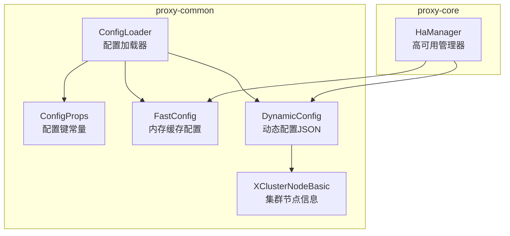
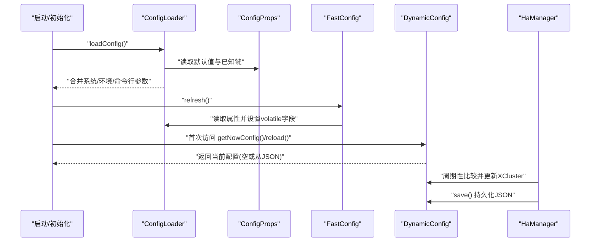
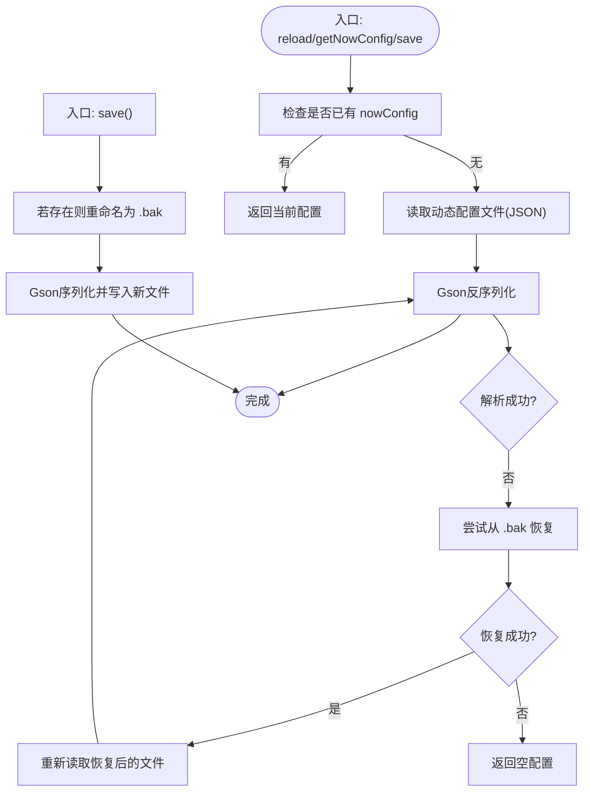
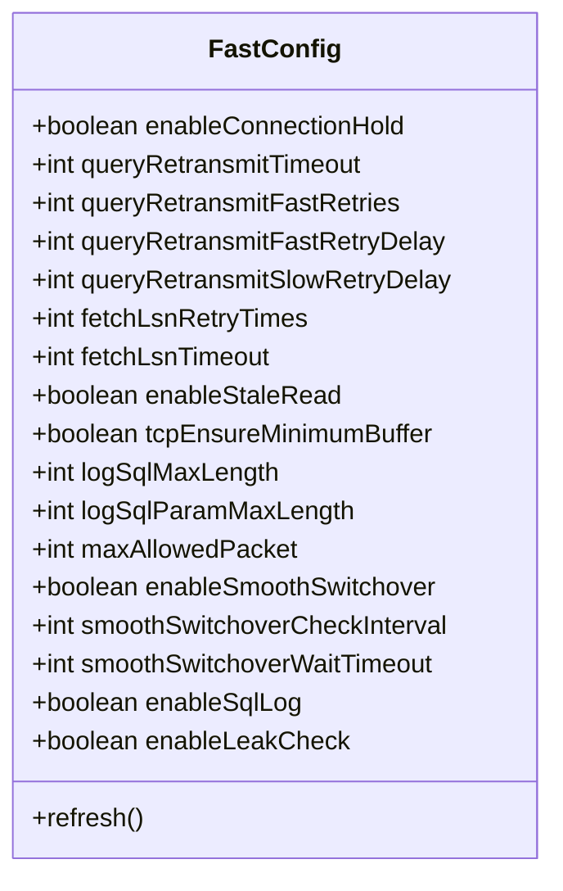
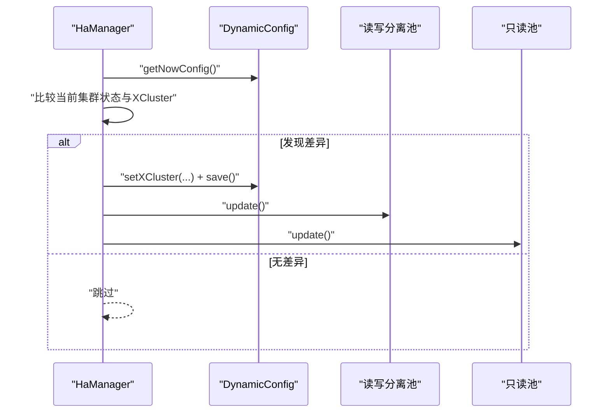
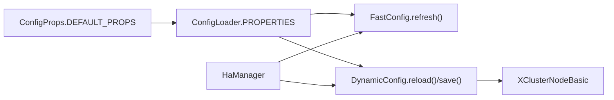

# 动态配置更新

<cite>
**本文引用的文件**
- [DynamicConfig.java](file://proxy-common/src/main/java/com/alibaba/polardbx/proxy/dynamic/DynamicConfig.java)
- [FastConfig.java](file://proxy-common/src/main/java/com/alibaba/polardbx/proxy/config/FastConfig.java)
- [ConfigProps.java](file://proxy-common/src/main/java/com/alibaba/polardbx/proxy/config/ConfigProps.java)
- [ConfigLoader.java](file://proxy-common/src/main/java/com/alibaba/polardbx/proxy/config/ConfigLoader.java)
- [XClusterNodeBasic.java](file://proxy-common/src/main/java/com/alibaba/polardbx/proxy/common/XClusterNodeBasic.java)
- [HaManager.java](file://proxy-core/src/main/java/com/alibaba/polardbx/proxy/serverless/HaManager.java)
- [config.properties](file://proxy-common/src/main/resources/config.properties)
</cite>

## 目录
1. [引言](#引言)
2. [项目结构](#项目结构)
3. [核心组件](#核心组件)
4. [架构总览](#架构总览)
5. [详细组件分析](#详细组件分析)
6. [依赖关系分析](#依赖关系分析)
7. [性能考量](#性能考量)
8. [故障排查指南](#故障排查指南)
9. [结论](#结论)
10. [附录](#附录)

## 引言
本文件系统性阐述代理系统的动态配置更新机制，重点覆盖以下方面：
- DynamicConfig 类的实现原理：配置变更监听、增量更新与实时生效机制
- FastConfig 的内存缓存策略：配置项的缓存结构、访问优化与性能提升效果
- 配置更新的触发机制：外部配置变更检测、内部配置修改与配置传播过程
- 使用示例与最佳实践：可动态更新的配置项、更新时机选择与回滚策略
- 一致性与并发控制：线程安全、原子操作与冲突处理
- 故障排查与性能监控要点

## 项目结构
动态配置相关代码主要位于 proxy-common 模块（配置加载、动态配置、常量定义）与 proxy-core 模块（HA 管理器对动态配置的使用与传播）。关键文件如下：
- proxy-common/config：ConfigLoader、ConfigProps、FastConfig
- proxy-common/dynamic：DynamicConfig
- proxy-common/common：XClusterNodeBasic（动态配置中 XCluster 字段的实体）
- proxy-core/serverless：HaManager（动态配置的读取与持久化触发点）

图表来源
- [ConfigLoader.java](file://proxy-common/src/main/java/com/alibaba/polardbx/proxy/config/ConfigLoader.java#L39-L71)
- [ConfigProps.java](file://proxy-common/src/main/java/com/alibaba/polardbx/proxy/config/ConfigProps.java#L127-L207)
- [FastConfig.java](file://proxy-common/src/main/java/com/alibaba/polardbx/proxy/config/FastConfig.java#L40-L73)
- [DynamicConfig.java](file://proxy-common/src/main/java/com/alibaba/polardbx/proxy/dynamic/DynamicConfig.java#L47-L128)
- [XClusterNodeBasic.java](file://proxy-common/src/main/java/com/alibaba/polardbx/proxy/common/XClusterNodeBasic.java#L28-L48)
- [HaManager.java](file://proxy-core/src/main/java/com/alibaba/polardbx/proxy/serverless/HaManager.java#L562-L570)

章节来源
- [ConfigLoader.java](file://proxy-common/src/main/java/com/alibaba/polardbx/proxy/config/ConfigLoader.java#L39-L71)
- [ConfigProps.java](file://proxy-common/src/main/java/com/alibaba/polardbx/proxy/config/ConfigProps.java#L127-L207)
- [FastConfig.java](file://proxy-common/src/main/java/com/alibaba/polardbx/proxy/config/FastConfig.java#L40-L73)
- [DynamicConfig.java](file://proxy-common/src/main/java/com/alibaba/polardbx/proxy/dynamic/DynamicConfig.java#L47-L128)
- [XClusterNodeBasic.java](file://proxy-common/src/main/java/com/alibaba/polardbx/proxy/common/XClusterNodeBasic.java#L28-L48)
- [HaManager.java](file://proxy-core/src/main/java/com/alibaba/polardbx/proxy/serverless/HaManager.java#L562-L570)

## 核心组件
- ConfigLoader：负责从多源加载配置（文件、资源、系统属性、环境变量、命令行参数），并清洗未知键，最终形成全局 Properties。
- ConfigProps：集中定义所有支持的配置键及其默认值，是配置项的权威来源。
- FastConfig：将常用运行时配置以静态 volatile 字段形式缓存在内存中，提供快速读取与刷新能力。
- DynamicConfig：封装动态 JSON 配置（如 XCluster 节点列表），提供加载、恢复、保存与当前实例获取。
- XClusterNodeBasic：描述 XCluster 节点的基本信息，用于 DynamicConfig 的序列化/反序列化。
- HaManager：在运行期读取 DynamicConfig 并在必要时进行增量更新与持久化，同时驱动读写分离池等模块更新。

章节来源
- [ConfigLoader.java](file://proxy-common/src/main/java/com/alibaba/polardbx/proxy/config/ConfigLoader.java#L39-L71)
- [ConfigProps.java](file://proxy-common/src/main/java/com/alibaba/polardbx/proxy/config/ConfigProps.java#L127-L207)
- [FastConfig.java](file://proxy-common/src/main/java/com/alibaba/polardbx/proxy/config/FastConfig.java#L40-L73)
- [DynamicConfig.java](file://proxy-common/src/main/java/com/alibaba/polardbx/proxy/dynamic/DynamicConfig.java#L47-L128)
- [XClusterNodeBasic.java](file://proxy-common/src/main/java/com/alibaba/polardbx/proxy/common/XClusterNodeBasic.java#L28-L48)
- [HaManager.java](file://proxy-core/src/main/java/com/alibaba/polardbx/proxy/serverless/HaManager.java#L562-L570)

## 架构总览
动态配置更新的整体流程如下：
- 启动阶段：ConfigLoader 加载配置，FastConfig 刷新静态字段；DynamicConfig 初始化为空或从 JSON 文件加载。
- 运行阶段：HaManager 周期性检查后端集群状态，若发现与 DynamicConfig 中的 XCluster 不一致，则更新并持久化到 JSON。
- 访问阶段：各模块通过 ConfigLoader/ConfigProps 获取默认值，FastConfig 提供高性能读取，DynamicConfig 提供动态变更后的最新值。

图表来源
- [ConfigLoader.java](file://proxy-common/src/main/java/com/alibaba/polardbx/proxy/config/ConfigLoader.java#L39-L71)
- [ConfigProps.java](file://proxy-common/src/main/java/com/alibaba/polardbx/proxy/config/ConfigProps.java#L127-L207)
- [FastConfig.java](file://proxy-common/src/main/java/com/alibaba/polardbx/proxy/config/FastConfig.java#L40-L73)
- [DynamicConfig.java](file://proxy-common/src/main/java/com/alibaba/polardbx/proxy/dynamic/DynamicConfig.java#L69-L128)
- [HaManager.java](file://proxy-core/src/main/java/com/alibaba/polardbx/proxy/serverless/HaManager.java#L562-L570)

## 详细组件分析

### DynamicConfig：动态配置加载、恢复与持久化
- 单例与线程安全
  - 通过静态字段保存当前配置，并在 reload/save 上使用同步块确保并发安全。
- 加载与恢复
  - 从 ConfigLoader 中读取动态配置文件路径，使用 Gson 反序列化为对象；若文件损坏则尝试从 .bak 恢复，失败则返回空配置。
- 实时生效
  - getNowConfig 在首次调用时触发 reload，后续直接返回内存中的 nowConfig，实现“按需加载”的实时生效。
- 持久化
  - save 先将现有文件重命名为 .bak，再写入新 JSON，确保原子性与可回滚。

图表来源
- [DynamicConfig.java](file://proxy-common/src/main/java/com/alibaba/polardbx/proxy/dynamic/DynamicConfig.java#L55-L128)
- [ConfigLoader.java](file://proxy-common/src/main/java/com/alibaba/polardbx/proxy/config/ConfigLoader.java#L39-L71)
- [ConfigProps.java](file://proxy-common/src/main/java/com/alibaba/polardbx/proxy/config/ConfigProps.java#L55-L56)

章节来源
- [DynamicConfig.java](file://proxy-common/src/main/java/com/alibaba/polardbx/proxy/dynamic/DynamicConfig.java#L55-L128)
- [ConfigLoader.java](file://proxy-common/src/main/java/com/alibaba/polardbx/proxy/config/ConfigLoader.java#L39-L71)
- [ConfigProps.java](file://proxy-common/src/main/java/com/alibaba/polardbx/proxy/config/ConfigProps.java#L55-L56)

### FastConfig：内存缓存与快速访问
- 缓存结构
  - 将常用运行时配置以静态 volatile 字段形式存储，避免每次从 Properties 读取带来的开销。
- 刷新策略
  - 在类初始化与 refresh() 中从 ConfigLoader.PROPERTIES 读取并解析为对应类型，确保与全局配置保持一致。
- 性能提升
  - volatile 字段的读取成本极低；通过一次性刷新替代多次读取，降低热点路径上的锁竞争与字符串解析次数。

图表来源
- [FastConfig.java](file://proxy-common/src/main/java/com/alibaba/polardbx/proxy/config/FastConfig.java#L21-L73)

章节来源
- [FastConfig.java](file://proxy-common/src/main/java/com/alibaba/polardbx/proxy/config/FastConfig.java#L40-L73)

### ConfigProps 与 ConfigLoader：配置来源与默认值
- ConfigProps
  - 定义所有受支持的配置键及默认值，包括动态配置文件名、查询重传、平滑切换、日志长度、最大包大小等。
- ConfigLoader
  - 从系统属性、环境变量、命令行参数合并配置，移除未知键，打印最终配置，确保运行期配置来源可控。

章节来源
- [ConfigProps.java](file://proxy-common/src/main/java/com/alibaba/polardbx/proxy/config/ConfigProps.java#L127-L207)
- [ConfigLoader.java](file://proxy-common/src/main/java/com/alibaba/polardbx/proxy/config/ConfigLoader.java#L39-L71)
- [config.properties](file://proxy-common/src/main/resources/config.properties#L18-L29)

### HaManager：动态配置的触发与传播
- 触发点
  - 在 HA 主循环中比较当前集群状态与 DynamicConfig 中的 XCluster，若不一致则更新并持久化。
- 传播链路
  - 更新后，HaManager 驱动读写分离池等模块进行相应调整，使动态配置影响到连接池、权重与路由策略等。

图表来源
- [HaManager.java](file://proxy-core/src/main/java/com/alibaba/polardbx/proxy/serverless/HaManager.java#L562-L570)
- [DynamicConfig.java](file://proxy-common/src/main/java/com/alibaba/polardbx/proxy/dynamic/DynamicConfig.java#L112-L128)

章节来源
- [HaManager.java](file://proxy-core/src/main/java/com/alibaba/polardbx/proxy/serverless/HaManager.java#L562-L570)
- [DynamicConfig.java](file://proxy-common/src/main/java/com/alibaba/polardbx/proxy/dynamic/DynamicConfig.java#L112-L128)

### XClusterNodeBasic：动态配置的数据模型
- 字段映射
  - 包含 tag、host、port、xport、paxos_port、role、peers、version、clusterId、updateTime 等，与 DynamicConfig 中的 XCluster 字段一一对应。
- 一致性校验
  - equals 忽略 updateTime，便于忽略时间戳差异导致的误判。

章节来源
- [XClusterNodeBasic.java](file://proxy-common/src/main/java/com/alibaba/polardbx/proxy/common/XClusterNodeBasic.java#L28-L90)

## 依赖关系分析
- ConfigLoader 依赖 ConfigProps 的默认值集合，确保仅保留受支持的键。
- FastConfig 依赖 ConfigLoader 的全局 Properties，实现“一次解析，多次读取”。
- DynamicConfig 依赖 ConfigLoader 获取动态配置文件路径，并通过 Gson 与 XClusterNodeBasic 进行数据绑定。
- HaManager 依赖 DynamicConfig 的 XCluster 字段，作为集群拓扑变更的依据。

图表来源
- [ConfigProps.java](file://proxy-common/src/main/java/com/alibaba/polardbx/proxy/config/ConfigProps.java#L127-L207)
- [ConfigLoader.java](file://proxy-common/src/main/java/com/alibaba/polardbx/proxy/config/ConfigLoader.java#L39-L71)
- [FastConfig.java](file://proxy-common/src/main/java/com/alibaba/polardbx/proxy/config/FastConfig.java#L40-L73)
- [DynamicConfig.java](file://proxy-common/src/main/java/com/alibaba/polardbx/proxy/dynamic/DynamicConfig.java#L69-L128)
- [XClusterNodeBasic.java](file://proxy-common/src/main/java/com/alibaba/polardbx/proxy/common/XClusterNodeBasic.java#L28-L48)
- [HaManager.java](file://proxy-core/src/main/java/com/alibaba/polardbx/proxy/serverless/HaManager.java#L562-L570)

章节来源
- [ConfigProps.java](file://proxy-common/src/main/java/com/alibaba/polardbx/proxy/config/ConfigProps.java#L127-L207)
- [ConfigLoader.java](file://proxy-common/src/main/java/com/alibaba/polardbx/proxy/config/ConfigLoader.java#L39-L71)
- [FastConfig.java](file://proxy-common/src/main/java/com/alibaba/polardbx/proxy/config/FastConfig.java#L40-L73)
- [DynamicConfig.java](file://proxy-common/src/main/java/com/alibaba/polardbx/proxy/dynamic/DynamicConfig.java#L69-L128)
- [XClusterNodeBasic.java](file://proxy-common/src/main/java/com/alibaba/polardbx/proxy/common/XClusterNodeBasic.java#L28-L48)
- [HaManager.java](file://proxy-core/src/main/java/com/alibaba/polardbx/proxy/serverless/HaManager.java#L562-L570)

## 性能考量
- FastConfig 的 volatile 字段读取成本低，适合高频访问路径；建议将热点配置迁移至 FastConfig，减少字符串解析与属性查找。
- DynamicConfig 的 reload/save 使用同步块与文件重命名策略，确保并发安全与原子性；建议在 HA 循环中尽量减少不必要的更新，避免频繁 IO。
- ConfigLoader 在启动阶段统一合并配置，避免运行期重复解析；建议通过系统属性/环境变量传递配置，减少磁盘 IO。
- 对于大规模集群拓扑变更，建议批量更新后再持久化，减少 save 次数。

## 故障排查指南
- 动态配置文件损坏
  - 现象：加载失败并记录错误日志。
  - 处理：删除损坏文件，系统会尝试从 .bak 恢复；若 .bak 也损坏，将返回空配置并继续运行。
- 未找到动态配置文件
  - 现象：首次加载时找不到文件。
  - 处理：确认 ConfigProps.DYNAMIC_CONFIG_FILE 对应的文件是否存在；检查 ConfigLoader 的加载顺序（系统属性优先于资源文件）。
- 配置未生效
  - 现象：修改配置后业务行为未变化。
  - 排查：确认 FastConfig 是否需要重启以刷新；对于 DynamicConfig，确认 HaManager 是否触发了更新与持久化。
- 并发写入冲突
  - 现象：save 期间其他线程读取到中间状态。
  - 处理：save 使用文件重命名作为原子性保障；避免在 save 期间并发写入同一文件。
- 日志定位
  - 关注 DynamicConfig 与 HaManager 的日志输出，定位 XCluster 变更与持久化动作。

章节来源
- [DynamicConfig.java](file://proxy-common/src/main/java/com/alibaba/polardbx/proxy/dynamic/DynamicConfig.java#L77-L101)
- [HaManager.java](file://proxy-core/src/main/java/com/alibaba/polardbx/proxy/serverless/HaManager.java#L562-L570)

## 结论
该动态配置体系通过“启动期加载 + 运行期增量更新 + 内存缓存”的组合，实现了低开销、高可靠的配置管理：
- DynamicConfig 提供 JSON 层面的动态配置与持久化能力；
- FastConfig 将热点配置以 volatile 字段形式缓存，显著降低访问延迟；
- HaManager 在运行期驱动配置变更与传播，确保系统行为与集群状态保持一致。

## 附录

### 可动态更新的配置清单（基于 ConfigProps）
- 动态配置文件路径：dynamic_config_file
- 查询重传相关：query_retransmit_timeout、query_retransmit_fast_retries、query_retransmit_fast_retry_delay、query_retransmit_slow_retry_delay
- 平滑切换：smooth_switchover_enabled、smooth_switchover_check_interval、smooth_switchover_wait_timeout
- 只读读取：enable_stale_read、fetch_lsn_timeout、fetch_lsn_retry_times
- 日志与包大小：log_sql_max_length、log_sql_param_max_length、max_allowed_packet
- 其他：enable_sql_log、enable_leak_check、tcp_ensure_minimum_buffer

章节来源
- [ConfigProps.java](file://proxy-common/src/main/java/com/alibaba/polardbx/proxy/config/ConfigProps.java#L55-L121)
- [ConfigProps.java](file://proxy-common/src/main/java/com/alibaba/polardbx/proxy/config/ConfigProps.java#L127-L207)

### 使用示例与最佳实践
- 示例场景
  - 集群拓扑变更：HaManager 检测到 XCluster 变更后，更新 DynamicConfig 并持久化，随后驱动读写分离池更新。
- 最佳实践
  - 仅在必要时更新 DynamicConfig，避免频繁 IO。
  - 对于高频访问的配置项，优先迁移到 FastConfig。
  - 更新前先备份，利用 .bak 回滚能力。
  - 在灰度发布或压测场景下，优先通过系统属性/环境变量临时覆盖，减少对 JSON 的直接修改。

章节来源
- [HaManager.java](file://proxy-core/src/main/java/com/alibaba/polardbx/proxy/serverless/HaManager.java#L562-L570)
- [DynamicConfig.java](file://proxy-common/src/main/java/com/alibaba/polardbx/proxy/dynamic/DynamicConfig.java#L112-L128)
- [FastConfig.java](file://proxy-common/src/main/java/com/alibaba/polardbx/proxy/config/FastConfig.java#L40-L73)