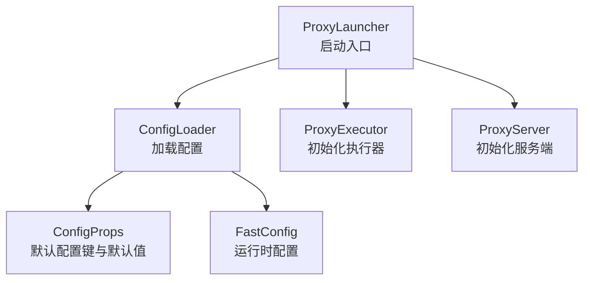
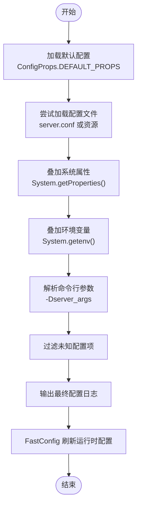
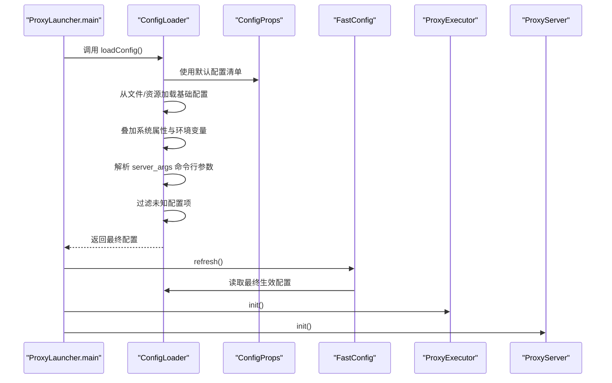
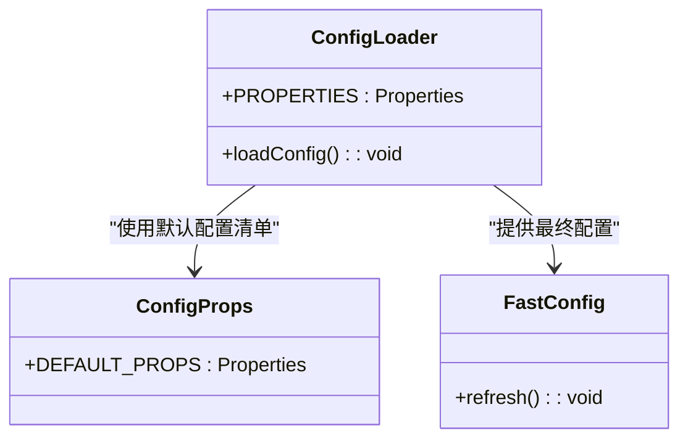
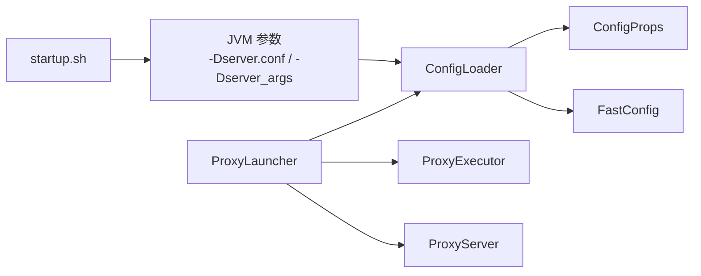

# 环境变量配置

<cite>
**本文引用的文件**
- [ProxyLauncher.java](file://proxy-server/src/main/java/com/alibaba/polardbx/proxy/server/ProxyLauncher.java)
- [ConfigLoader.java](file://proxy-common/src/main/java/com/alibaba/polardbx/proxy/config/ConfigLoader.java)
- [ConfigProps.java](file://proxy-common/src/main/java/com/alibaba/polardbx/proxy/config/ConfigProps.java)
- [FastConfig.java](file://proxy-common/src/main/java/com/alibaba/polardbx/proxy/config/FastConfig.java)
- [config.properties（资源）](file://proxy-common/src/main/resources/config.properties)
- [config.properties（打包）](file://proxy-server/src/main/conf/config.properties)
- [startup.sh](file://proxy-server/src/main/bin/startup.sh)
- [Dockerfile](file://docker/Dockerfile)
- [entrypoint.sh](file://docker/entrypoint.sh)
- [SecurityUtil.java](file://proxy-core/src/main/java/com/alibaba/polardbx/proxy/privilege/SecurityUtil.java)
- [NIOWorker.java](file://proxy-net/src/main/java/com/alibaba/polardbx/proxy/net/NIOWorker.java)
- [ShowPropertiesHandler.java](file://proxy-core/src/main/java/com/alibaba/polardbx/proxy/protocol/handler/request/ShowPropertiesHandler.java)
</cite>

## 目录
1. [简介](#简介)
2. [项目结构与入口](#项目结构与入口)
3. [核心组件与配置加载机制](#核心组件与配置加载机制)
4. [架构总览](#架构总览)
5. [详细组件分析](#详细组件分析)
6. [依赖关系分析](#依赖关系分析)
7. [性能考量](#性能考量)
8. [故障排查指南](#故障排查指南)
9. [结论](#结论)
10. [附录：配置清单与模板](#附录配置清单与模板)

## 简介
本文系统化阐述 PolarDB-X Proxy 的环境变量与配置加载机制，涵盖以下要点：
- 配置来源与优先级：默认配置 → 配置文件 → 系统属性 → 环境变量 → 命令行参数 → 过滤未知项
- 支持的关键环境变量与配置项：数据库连接、网络、日志、读写分离、平滑切换、动态配置等
- Docker 部署下的环境变量传递与容器运行示例
- 命令行参数解析流程与默认值设置
- 最佳实践与故障排查方法

## 项目结构与入口
- 启动入口位于 ProxyLauncher，负责加载配置、刷新快速配置、初始化执行器与服务端
- 配置加载由 ConfigLoader 完成，统一从资源或文件加载默认配置，叠加系统属性、环境变量与命令行参数
- FastConfig 将最终生效的配置映射到静态字段，供运行时快速访问

图表来源
- [ProxyLauncher.java](file://proxy-server/src/main/java/com/alibaba/polardbx/proxy/server/ProxyLauncher.java#L32-L55)
- [ConfigLoader.java](file://proxy-common/src/main/java/com/alibaba/polardbx/proxy/config/ConfigLoader.java#L39-L71)
- [ConfigProps.java](file://proxy-common/src/main/java/com/alibaba/polardbx/proxy/config/ConfigProps.java#L127-L207)
- [FastConfig.java](file://proxy-common/src/main/java/com/alibaba/polardbx/proxy/config/FastConfig.java#L45-L73)

章节来源
- [ProxyLauncher.java](file://proxy-server/src/main/java/com/alibaba/polardbx/proxy/server/ProxyLauncher.java#L32-L55)
- [ConfigLoader.java](file://proxy-common/src/main/java/com/alibaba/polardbx/proxy/config/ConfigLoader.java#L39-L71)
- [ConfigProps.java](file://proxy-common/src/main/java/com/alibaba/polardbx/proxy/config/ConfigProps.java#L127-L207)
- [FastConfig.java](file://proxy-common/src/main/java/com/alibaba/polardbx/proxy/config/FastConfig.java#L45-L73)

## 核心组件与配置加载机制
- 默认配置来源：ConfigProps 提供所有受支持配置项的默认值；同时存在两份配置文件：
  - 资源目录下的默认配置（随包分发）
  - 打包后的配置文件（部署目录）
- 加载顺序与覆盖规则：
  1) 从 server.conf 指定的配置文件或资源加载基础配置
  2) 叠加 System.getProperties()（JVM 系统属性）
  3) 叠加 System.getenv()（环境变量）
  4) 解析 -a k=v[;] 参数（通过 -Dserver_args），按分号拆分多组键值
  5) 移除不在默认配置清单中的未知键
  6) 输出最终生效配置日志
- 运行时配置：FastConfig 从最终生效的 Properties 中读取并转换为强类型字段，供运行时直接使用

图表来源
- [ConfigLoader.java](file://proxy-common/src/main/java/com/alibaba/polardbx/proxy/config/ConfigLoader.java#L39-L71)
- [ConfigProps.java](file://proxy-common/src/main/java/com/alibaba/polardbx/proxy/config/ConfigProps.java#L127-L207)
- [FastConfig.java](file://proxy-common/src/main/java/com/alibaba/polardbx/proxy/config/FastConfig.java#L45-L73)

章节来源
- [ConfigLoader.java](file://proxy-common/src/main/java/com/alibaba/polardbx/proxy/config/ConfigLoader.java#L39-L71)
- [ConfigProps.java](file://proxy-common/src/main/java/com/alibaba/polardbx/proxy/config/ConfigProps.java#L127-L207)
- [FastConfig.java](file://proxy-common/src/main/java/com/alibaba/polardbx/proxy/config/FastConfig.java#L45-L73)

## 架构总览
- 启动阶段：ProxyLauncher → ConfigLoader.loadConfig() → FastConfig.refresh() → ProxyExecutor.init() → ProxyServer.init()
- 配置来源链路：默认配置 → 文件/资源 → 系统属性 → 环境变量 → 命令行参数 → 过滤未知项
- 运行时：FastConfig 将最终配置映射到静态字段，供各模块直接读取

图表来源
- [ProxyLauncher.java](file://proxy-server/src/main/java/com/alibaba/polardbx/proxy/server/ProxyLauncher.java#L32-L55)
- [ConfigLoader.java](file://proxy-common/src/main/java/com/alibaba/polardbx/proxy/config/ConfigLoader.java#L39-L71)
- [FastConfig.java](file://proxy-common/src/main/java/com/alibaba/polardbx/proxy/config/FastConfig.java#L45-L73)

章节来源
- [ProxyLauncher.java](file://proxy-server/src/main/java/com/alibaba/polardbx/proxy/server/ProxyLauncher.java#L32-L55)
- [ConfigLoader.java](file://proxy-common/src/main/java/com/alibaba/polardbx/proxy/config/ConfigLoader.java#L39-L71)
- [FastConfig.java](file://proxy-common/src/main/java/com/alibaba/polardbx/proxy/config/FastConfig.java#L45-L73)

## 详细组件分析

### 组件一：配置加载器（ConfigLoader）
- 功能职责
  - 从指定配置文件或资源加载默认配置
  - 叠加系统属性与环境变量
  - 解析 server_args 命令行参数（-Dserver_args）
  - 过滤未知配置项，仅保留受支持键
  - 记录最终生效配置
- 关键行为
  - 配置文件优先级：显式 -Dserver.conf > 资源默认配置
  - 环境变量与系统属性叠加，后者覆盖前者
  - server_args 以分号分隔多组键值，等号分割键与值
  - 未知键被移除，避免污染运行时配置

图表来源
- [ConfigLoader.java](file://proxy-common/src/main/java/com/alibaba/polardbx/proxy/config/ConfigLoader.java#L37-L71)
- [ConfigProps.java](file://proxy-common/src/main/java/com/alibaba/polardbx/proxy/config/ConfigProps.java#L127-L207)
- [FastConfig.java](file://proxy-common/src/main/java/com/alibaba/polardbx/proxy/config/FastConfig.java#L45-L73)

章节来源
- [ConfigLoader.java](file://proxy-common/src/main/java/com/alibaba/polardbx/proxy/config/ConfigLoader.java#L39-L71)
- [ConfigProps.java](file://proxy-common/src/main/java/com/alibaba/polardbx/proxy/config/ConfigProps.java#L127-L207)
- [FastConfig.java](file://proxy-common/src/main/java/com/alibaba/polardbx/proxy/config/FastConfig.java#L45-L73)

### 组件二：默认配置清单（ConfigProps）
- 职责：集中定义所有受支持的配置键及其默认值
- 覆盖范围：线程模型、前端/后端端口、后端连接信息、连接池大小、HA、读写分离、平滑切换、日志、动态配置、SQL 日志开关、最大报文长度、泄漏检测等
- 作用：作为 ConfigLoader 的“白名单”，用于过滤未知配置项

章节来源
- [ConfigProps.java](file://proxy-common/src/main/java/com/alibaba/polardbx/proxy/config/ConfigProps.java#L24-L207)
- [config.properties（资源）](file://proxy-common/src/main/resources/config.properties#L18-L29)
- [config.properties（打包）](file://proxy-server/src/main/conf/config.properties#L19-L117)

### 组件三：运行时配置（FastConfig）
- 职责：将最终生效的配置映射到强类型字段，供运行时直接读取，避免重复解析
- 示例字段：连接保持、重传超时与重试、LSN 获取、SQL 日志开关、最大报文长度、平滑切换等

章节来源
- [FastConfig.java](file://proxy-common/src/main/java/com/alibaba/polardbx/proxy/config/FastConfig.java#L21-L73)

### 组件四：命令行参数解析（startup.sh）
- 支持选项
  - -f：指定配置文件路径（默认指向打包目录下的 config.properties）
  - -a：追加键值对配置（以分号分隔多组，等号分隔键与值）
  - -l/-d/-i/-w/-g/-m/-M/-H/-U/-P/-b 等 JVM 与运行参数
- 关键逻辑
  - 将 -a 的配置拼接为 -Dserver_args 传入 JVM
  - 设置 -Dserver.conf 指向实际配置文件
  - 设置 -Dlogback.configurationFile 指向日志配置
  - 在 Docker 场景下，通过环境变量控制 CPU 核数与内存上限

章节来源
- [startup.sh](file://proxy-server/src/main/bin/startup.sh#L86-L120)
- [startup.sh](file://proxy-server/src/main/bin/startup.sh#L208-L210)
- [startup.sh](file://proxy-server/src/main/bin/startup.sh#L336-L339)

### 组件五：Docker 环境变量与容器入口（Dockerfile、entrypoint.sh）
- Dockerfile
  - 基于官方 Java 基础镜像
  - 复制启动脚本与二进制包
  - 设置非 root 用户与可执行权限
- entrypoint.sh
  - 生成 server_env.sh 并注入环境变量
  - 调用 startup.sh 启动服务
  - 周期性监控进程状态，失败时自动重试

章节来源
- [Dockerfile](file://docker/Dockerfile#L1-L19)
- [entrypoint.sh](file://docker/entrypoint.sh#L33-L70)
- [entrypoint.sh](file://docker/entrypoint.sh#L59-L87)

### 组件六：敏感配置与环境变量覆盖（SecurityUtil）
- 密码加密/解密支持从环境变量 dn_password_key 覆盖配置文件中的密钥
- 若未设置环境变量，则回退到配置文件中的 dn_password_key

章节来源
- [SecurityUtil.java](file://proxy-core/src/main/java/com/alibaba/polardbx/proxy/privilege/SecurityUtil.java#L150-L175)

### 组件七：CPU 核数与线程上限（NIOWorker）
- 当存在环境变量 cpu_cores 时，根据其数值计算最大工作线程数
- 异常情况下回退至默认值并记录警告

章节来源
- [NIOWorker.java](file://proxy-net/src/main/java/com/alibaba/polardbx/proxy/net/NIOWorker.java#L39-L46)

### 组件八：配置展示接口（ShowPropertiesHandler）
- 提供 SQL 接口展示当前生效的配置键值
- 对敏感字段（如 password）进行脱敏显示

章节来源
- [ShowPropertiesHandler.java](file://proxy-core/src/main/java/com/alibaba/polardbx/proxy/protocol/handler/request/ShowPropertiesHandler.java#L50-L74)

## 依赖关系分析
- ProxyLauncher 依赖 ConfigLoader 与 FastConfig，以及 ProxyExecutor 和 ProxyServer
- ConfigLoader 依赖 ConfigProps 作为默认配置清单
- FastConfig 依赖 ConfigLoader 的最终生效配置
- 启动脚本 startup.sh 通过 JVM 参数将配置文件路径与 server_args 传递给主程序

图表来源
- [ProxyLauncher.java](file://proxy-server/src/main/java/com/alibaba/polardbx/proxy/server/ProxyLauncher.java#L32-L55)
- [ConfigLoader.java](file://proxy-common/src/main/java/com/alibaba/polardbx/proxy/config/ConfigLoader.java#L37-L71)
- [ConfigProps.java](file://proxy-common/src/main/java/com/alibaba/polardbx/proxy/config/ConfigProps.java#L127-L207)
- [FastConfig.java](file://proxy-common/src/main/java/com/alibaba/polardbx/proxy/config/FastConfig.java#L45-L73)
- [startup.sh](file://proxy-server/src/main/bin/startup.sh#L208-L210)

章节来源
- [ProxyLauncher.java](file://proxy-server/src/main/java/com/alibaba/polardbx/proxy/server/ProxyLauncher.java#L32-L55)
- [ConfigLoader.java](file://proxy-common/src/main/java/com/alibaba/polardbx/proxy/config/ConfigLoader.java#L37-L71)
- [ConfigProps.java](file://proxy-common/src/main/java/com/alibaba/polardbx/proxy/config/ConfigProps.java#L127-L207)
- [FastConfig.java](file://proxy-common/src/main/java/com/alibaba/polardbx/proxy/config/FastConfig.java#L45-L73)
- [startup.sh](file://proxy-server/src/main/bin/startup.sh#L208-L210)

## 性能考量
- 线程与缓冲
  - 通过 cpu_cores 控制最大工作线程数，避免过度并发
  - 根据堆内存上限动态调整直连缓冲区大小
- 日志与 SQL 输出
  - 适当降低日志长度限制与关闭 SQL 日志可减少开销
- 连接与池化
  - 合理设置后端连接池上限，避免资源争用
- 读写分离与一致性
  - 在低写入场景下，可考虑优化一致性读的 LSN 获取策略，减少备库延迟抖动

章节来源
- [NIOWorker.java](file://proxy-net/src/main/java/com/alibaba/polardbx/proxy/net/NIOWorker.java#L39-L56)
- [FastConfig.java](file://proxy-common/src/main/java/com/alibaba/polardbx/proxy/config/FastConfig.java#L61-L72)

## 故障排查指南
- 启动失败
  - 检查启动日志与 GC 日志，定位 OOM 或类加载问题
  - 确认配置文件路径与权限（-Dserver.conf）
- 配置未生效
  - 使用 show properties 接口确认最终生效配置
  - 检查环境变量与系统属性叠加顺序
  - 确认 server_args 的格式（分号分隔、等号分隔键值）
- 密钥与密码
  - 若使用 dn_password_key，需确保环境变量已正确设置
- Docker 场景
  - 确认容器内环境变量已注入（entrypoint.sh 生成 server_env.sh）
  - 检查 cpu_cores 与 memory 等环境变量是否符合预期

章节来源
- [ShowPropertiesHandler.java](file://proxy-core/src/main/java/com/alibaba/polardbx/proxy/protocol/handler/request/ShowPropertiesHandler.java#L50-L74)
- [SecurityUtil.java](file://proxy-core/src/main/java/com/alibaba/polardbx/proxy/privilege/SecurityUtil.java#L150-L175)
- [entrypoint.sh](file://docker/entrypoint.sh#L33-L70)

## 结论
PolarDB-X Proxy 的配置体系以 ConfigProps 为“白名单”，通过 ConfigLoader 实现“文件/资源 → 系统属性 → 环境变量 → 命令行参数”的多层叠加与过滤，最终由 FastConfig 提供高性能的运行时访问。Docker 场景下，可通过环境变量与启动脚本参数灵活控制 CPU、内存与后端连接信息。建议在生产环境中遵循最小暴露面原则，谨慎开放敏感配置，并结合 show properties 与日志进行持续验证。

## 附录：配置清单与模板

### 支持的环境变量与配置项（节选）
- 数据库连接
  - backend_address：后端数据库地址与端口
  - backend_username：后端数据库用户名
  - backend_password：后端数据库密码
  - backend_connect_timeout：后端连接超时（毫秒）
- 网络与前端
  - frontend_port：前端监听端口
  - tcp_ensure_minimum_buffer：TCP 缓冲最小值策略
  - max_allowed_packet：最大报文长度
- 连接池与后端
  - backend_admin_max_pooled_size：管理连接池上限
  - backend_rw_max_pooled_size：读写连接池上限
  - backend_ro_max_pooled_size：只读连接池上限
- 高可用与健康检查
  - backend_ha_worker_threads：HA 工作线程数
  - backend_ha_check_interval：HA 检查间隔（毫秒）
  - backend_ha_check_timeout：HA 检查超时（毫秒）
- 读写分离与一致性
  - enable_read_write_splitting：启用读写分离
  - enable_follower_read：允许跟随者承担读流量
  - enable_leader_in_ro_pools：允许领导者参与只读池
  - read_weights：权重列表（格式见默认配置）
  - latency_check_timeout/interval/record_count：延迟检测相关
  - slave_read_latency_threshold：备库延迟阈值
  - fetch_lsn_timeout/retry_times：LSN 获取相关
  - enable_stale_read：允许弱一致性读
- 平滑切换
  - smooth_switchover_enabled：启用平滑切换
  - smooth_switchover_check_interval：检查间隔（毫秒）
  - smooth_switchover_wait_timeout：等待超时（毫秒）
- 动态配置与日志
  - dynamic_config_file：动态配置文件名
  - enable_sql_log：启用 SQL 日志
  - log_sql_max_length/log_sql_param_max_length：日志截断长度
  - global_variables_refresh_interval：全局变量刷新间隔
- 安全与密钥
  - dn_password_key：数据节点密码加密/解密密钥（可由环境变量覆盖）
- 运行时与容器
  - cpu_cores：容器内 CPU 核数，影响线程上限
  - memory：容器内存限制（字节）

章节来源
- [ConfigProps.java](file://proxy-common/src/main/java/com/alibaba/polardbx/proxy/config/ConfigProps.java#L24-L207)
- [config.properties（资源）](file://proxy-common/src/main/resources/config.properties#L18-L29)
- [config.properties（打包）](file://proxy-server/src/main/conf/config.properties#L19-L117)
- [SecurityUtil.java](file://proxy-core/src/main/java/com/alibaba/polardbx/proxy/privilege/SecurityUtil.java#L150-L175)
- [NIOWorker.java](file://proxy-net/src/main/java/com/alibaba/polardbx/proxy/net/NIOWorker.java#L39-L46)

### Docker 部署示例（关键参数）
- 传递后端连接信息与内存限制
  - backend_address、backend_username、backend_password、memory
- 运行命令示例（基于仓库提供的 run.sh）
  - 在 run.sh 中通过 -e 传递环境变量
- 容器入口
  - ENTRYPOINT 指向 entrypoint.sh，内部调用 startup.sh 启动

章节来源
- [Dockerfile](file://docker/Dockerfile#L17-L19)
- [entrypoint.sh](file://docker/entrypoint.sh#L33-L70)
- [startup.sh](file://proxy-server/src/main/bin/startup.sh#L336-L339)

### 命令行参数与默认值设置
- -f：配置文件路径（默认指向打包目录下的 config.properties）
- -a：追加配置（格式：k=v[;k=v]），最终以 -Dserver_args 形式传入
- -l/-d/-i/-w/-g/-m/-M/-H/-U/-P/-b：日志根目录、调试端口、机房、WISP、cgroup、内存、MySQL 流、源地址、用户名、密码、bianque 开关
- 默认值来源于配置文件与 ConfigProps

章节来源
- [startup.sh](file://proxy-server/src/main/bin/startup.sh#L86-L120)
- [startup.sh](file://proxy-server/src/main/bin/startup.sh#L208-L210)
- [config.properties（打包）](file://proxy-server/src/main/conf/config.properties#L19-L117)
- [ConfigProps.java](file://proxy-common/src/main/java/com/alibaba/polardbx/proxy/config/ConfigProps.java#L127-L207)

### 最佳实践
- 生产安全
  - 不在配置文件中明文存储敏感信息；优先通过环境变量 dn_password_key 覆盖
  - 使用最小权限原则，限制容器用户与目录权限
- 配置管理
  - 使用 -Dserver.conf 指向独立配置文件，便于版本化管理
  - 使用 -Dserver_args 临时覆盖关键参数，避免修改持久配置
- 故障排查
  - 启动后立即通过 show properties 核对生效配置
  - 结合日志与 GC 日志定位性能与稳定性问题
  - Docker 场景下，确认 entrypoint.sh 注入的 server_env.sh 包含所需环境变量

章节来源
- [SecurityUtil.java](file://proxy-core/src/main/java/com/alibaba/polardbx/proxy/privilege/SecurityUtil.java#L150-L175)
- [ShowPropertiesHandler.java](file://proxy-core/src/main/java/com/alibaba/polardbx/proxy/protocol/handler/request/ShowPropertiesHandler.java#L50-L74)
- [entrypoint.sh](file://docker/entrypoint.sh#L33-L70)