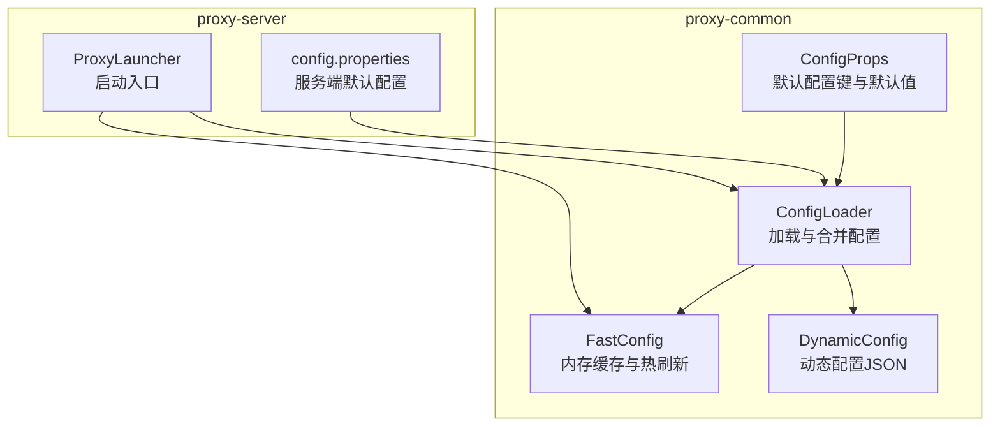
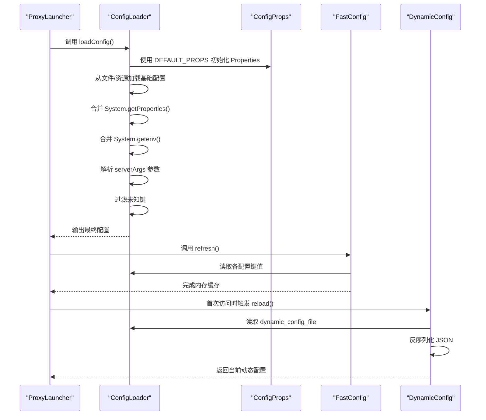
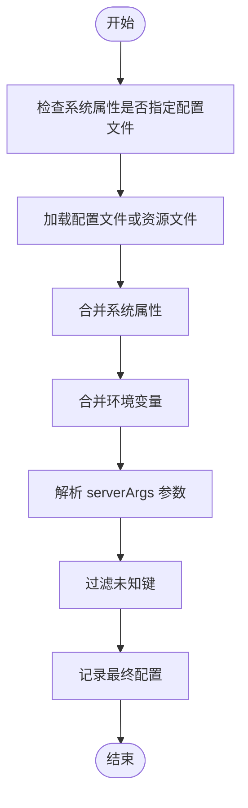
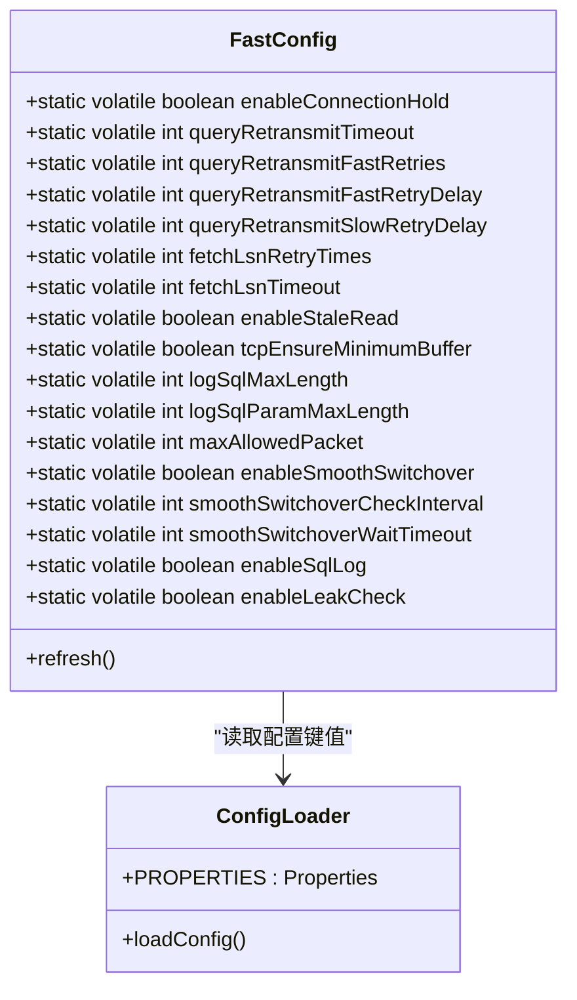
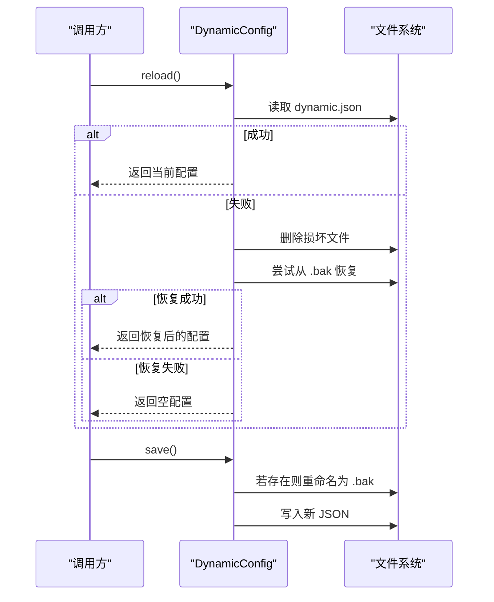
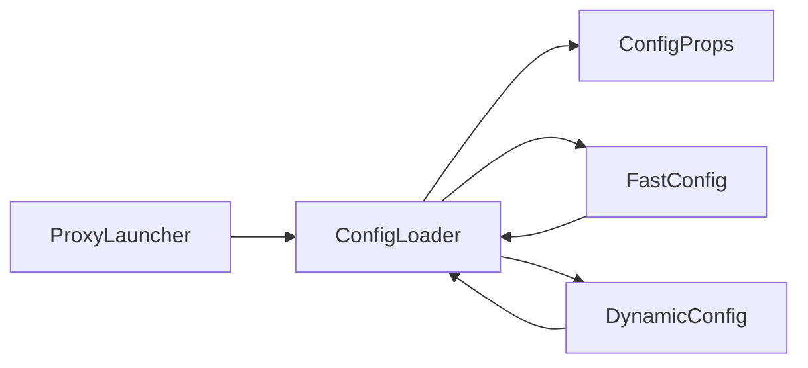

# 配置管理

<cite>
**本文引用的文件**
- [ConfigLoader.java](file://proxy-common/src/main/java/com/alibaba/polardbx/proxy/config/ConfigLoader.java)
- [FastConfig.java](file://proxy-common/src/main/java/com/alibaba/polardbx/proxy/config/FastConfig.java)
- [ConfigProps.java](file://proxy-common/src/main/java/com/alibaba/polardbx/proxy/config/ConfigProps.java)
- [DynamicConfig.java](file://proxy-common/src/main/java/com/alibaba/polardbx/proxy/dynamic/DynamicConfig.java)
- [config.properties（通用资源）](file://proxy-common/src/main/resources/config.properties)
- [config.properties（服务端）](file://proxy-server/src/main/conf/config.properties)
- [ProxyLauncher.java](file://proxy-server/src/main/java/com/alibaba/polardbx/proxy/server/ProxyLauncher.java)
</cite>

## 目录
1. [简介](#简介)
2. [项目结构](#项目结构)
3. [核心组件](#核心组件)
4. [架构总览](#架构总览)
5. [详细组件分析](#详细组件分析)
6. [依赖关系分析](#依赖关系分析)
7. [性能考量](#性能考量)
8. [故障排查指南](#故障排查指南)
9. [结论](#结论)
10. [附录](#附录)

## 简介
本文件系统性阐述 PolarDB-X Proxy 的配置管理系统，覆盖以下要点：
- 配置加载器（ConfigLoader）：配置文件解析、默认值注入与校验、环境变量与命令行参数融合。
- 快速配置（FastConfig）：内存缓存、热更新与性能优化策略。
- 动态配置（DynamicConfig）：实时更新机制、变更监听、增量更新与一致性保障。
- config.properties 中所有配置项详解：网络、数据库连接、性能调优等。
- 环境变量与命令行参数支持方式。
- 最佳实践、安全建议与故障排查方法。
- 配置模板与常见场景示例。

## 项目结构
配置相关模块主要位于 proxy-common 与 proxy-server 两个子工程中：
- proxy-common 提供通用配置定义、加载与快速配置缓存。
- proxy-server 提供服务端默认配置文件与启动入口。
- proxy-server 启动时加载配置并初始化运行时组件。

图表来源
- [ConfigProps.java](file://proxy-common/src/main/java/com/alibaba/polardbx/proxy/config/ConfigProps.java#L23-L209)
- [ConfigLoader.java](file://proxy-common/src/main/java/com/alibaba/polardbx/proxy/config/ConfigLoader.java#L30-L72)
- [FastConfig.java](file://proxy-common/src/main/java/com/alibaba/polardbx/proxy/config/FastConfig.java#L21-L75)
- [DynamicConfig.java](file://proxy-common/src/main/java/com/alibaba/polardbx/proxy/dynamic/DynamicConfig.java#L43-L130)
- [config.properties（服务端）](file://proxy-server/src/main/conf/config.properties#L19-L117)
- [ProxyLauncher.java](file://proxy-server/src/main/java/com/alibaba/polardbx/proxy/server/ProxyLauncher.java#L29-L56)

章节来源
- [ConfigLoader.java](file://proxy-common/src/main/java/com/alibaba/polardbx/proxy/config/ConfigLoader.java#L30-L72)
- [FastConfig.java](file://proxy-common/src/main/java/com/alibaba/polardbx/proxy/config/FastConfig.java#L21-L75)
- [ConfigProps.java](file://proxy-common/src/main/java/com/alibaba/polardbx/proxy/config/ConfigProps.java#L23-L209)
- [DynamicConfig.java](file://proxy-common/src/main/java/com/alibaba/polardbx/proxy/dynamic/DynamicConfig.java#L43-L130)
- [config.properties（通用资源）](file://proxy-common/src/main/resources/config.properties#L18-L29)
- [config.properties（服务端）](file://proxy-server/src/main/conf/config.properties#L19-L117)
- [ProxyLauncher.java](file://proxy-server/src/main/java/com/alibaba/polardbx/proxy/server/ProxyLauncher.java#L29-L56)

## 核心组件
- ConfigLoader：负责从多源加载配置、合并系统属性与环境变量、解析命令行参数、过滤未知键并输出最终配置。
- ConfigProps：集中定义所有受支持的配置键及其默认值。
- FastConfig：将常用运行时配置以静态字段形式缓存，提供统一刷新入口，便于全局快速读取。
- DynamicConfig：基于 JSON 文件的动态配置，支持重载与回滚备份，用于运行时调整部分集群拓扑或节点信息。

章节来源
- [ConfigLoader.java](file://proxy-common/src/main/java/com/alibaba/polardbx/proxy/config/ConfigLoader.java#L30-L72)
- [ConfigProps.java](file://proxy-common/src/main/java/com/alibaba/polardbx/proxy/config/ConfigProps.java#L23-L209)
- [FastConfig.java](file://proxy-common/src/main/java/com/alibaba/polardbx/proxy/config/FastConfig.java#L21-L75)
- [DynamicConfig.java](file://proxy-common/src/main/java/com/alibaba/polardbx/proxy/dynamic/DynamicConfig.java#L43-L130)

## 架构总览
下图展示了启动阶段配置加载与初始化流程：

图表来源
- [ProxyLauncher.java](file://proxy-server/src/main/java/com/alibaba/polardbx/proxy/server/ProxyLauncher.java#L32-L44)
- [ConfigLoader.java](file://proxy-common/src/main/java/com/alibaba/polardbx/proxy/config/ConfigLoader.java#L39-L71)
- [ConfigProps.java](file://proxy-common/src/main/java/com/alibaba/polardbx/proxy/config/ConfigProps.java#L127-L207)
- [FastConfig.java](file://proxy-common/src/main/java/com/alibaba/polardbx/proxy/config/FastConfig.java#L45-L73)
- [DynamicConfig.java](file://proxy-common/src/main/java/com/alibaba/polardbx/proxy/dynamic/DynamicConfig.java#L69-L103)

## 详细组件分析

### ConfigLoader：配置加载与合并
- 加载顺序与来源
  - 优先使用系统属性指定的配置文件路径；否则从类路径加载默认资源文件。
  - 合并系统属性与环境变量，允许运行时覆盖。
  - 支持通过 serverArgs 传入“键=值”列表，分号分隔、等号分割，进行细粒度覆盖。
- 键过滤
  - 仅保留受支持的配置键，丢弃未知键，确保运行时安全。
- 日志输出
  - 打印最终生效的配置集合，便于排障与审计。

图表来源
- [ConfigLoader.java](file://proxy-common/src/main/java/com/alibaba/polardbx/proxy/config/ConfigLoader.java#L39-L71)

章节来源
- [ConfigLoader.java](file://proxy-common/src/main/java/com/alibaba/polardbx/proxy/config/ConfigLoader.java#L30-L72)

### ConfigProps：配置键与默认值
- 覆盖范围
  - 基础线程与集群标识、TCP 缓冲、前端端口、后端地址与认证、连接池大小、高可用心跳、动态配置文件位置、查询重传、读写分离与延迟阈值、后端池刷新、权限刷新、预编译语句缓存、日志长度、全局变量刷新间隔、租约与通用服务端口、最大包长、平滑切换、密码密钥、SQL 日志开关、泄漏检测等。
- 默认值策略
  - 大多数数值型与布尔型均提供合理默认值，确保开箱即用。

章节来源
- [ConfigProps.java](file://proxy-common/src/main/java/com/alibaba/polardbx/proxy/config/ConfigProps.java#L23-L209)

### FastConfig：内存缓存与热更新
- 设计目标
  - 将频繁读取的运行时配置以静态字段缓存，避免每次从 Properties 查询带来的开销。
- 刷新机制
  - 提供统一刷新入口，从 ConfigLoader.PROPERTIES 读取各键值并转换为对应类型，完成热更新。
- 性能优化
  - volatile 字段保证可见性；在高频路径上直接读取静态字段，减少同步与装箱成本。
- 典型用途
  - 查询重传超时与重试策略、LSN 获取超时与次数、只读读取开关、TCP 缓冲策略、日志长度限制、最大包长、平滑切换参数、SQL 日志与泄漏检测开关等。

图表来源
- [FastConfig.java](file://proxy-common/src/main/java/com/alibaba/polardbx/proxy/config/FastConfig.java#L21-L75)
- [ConfigLoader.java](file://proxy-common/src/main/java/com/alibaba/polardbx/proxy/config/ConfigLoader.java#L30-L72)

章节来源
- [FastConfig.java](file://proxy-common/src/main/java/com/alibaba/polardbx/proxy/config/FastConfig.java#L21-L75)

### DynamicConfig：动态配置的加载与持久化
- 文件位置
  - 由配置键 dynamic_config_file 指定，默认指向 dynamic.json。
- 加载与恢复
  - 首次失败时尝试删除损坏文件并从 .bak 恢复；若无 .bak，则返回空配置。
- 保存与备份
  - 写入前将原文件重命名为 .bak，确保原子性与可回滚。
- 并发与一致性
  - reload/getNowConfig/save 均为同步方法，避免并发竞态；内部使用 Gson 进行 JSON 序列化与反序列化。

图表来源
- [DynamicConfig.java](file://proxy-common/src/main/java/com/alibaba/polardbx/proxy/dynamic/DynamicConfig.java#L69-L128)

章节来源
- [DynamicConfig.java](file://proxy-common/src/main/java/com/alibaba/polardbx/proxy/dynamic/DynamicConfig.java#L43-L130)

## 依赖关系分析
- 启动依赖
  - ProxyLauncher 在启动时依次执行：加载配置、刷新 FastConfig、初始化执行器与服务器。
- 运行时依赖
  - FastConfig 依赖 ConfigLoader.PROPERTIES 提供的键值。
  - DynamicConfig 依赖 ConfigLoader.PROPERTIES 中的 dynamic_config_file 键定位 JSON 文件。

图表来源
- [ProxyLauncher.java](file://proxy-server/src/main/java/com/alibaba/polardbx/proxy/server/ProxyLauncher.java#L32-L44)
- [ConfigLoader.java](file://proxy-common/src/main/java/com/alibaba/polardbx/proxy/config/ConfigLoader.java#L37-L71)
- [FastConfig.java](file://proxy-common/src/main/java/com/alibaba/polardbx/proxy/config/FastConfig.java#L45-L73)
- [DynamicConfig.java](file://proxy-common/src/main/java/com/alibaba/polardbx/proxy/dynamic/DynamicConfig.java#L69-L103)

章节来源
- [ProxyLauncher.java](file://proxy-server/src/main/java/com/alibaba/polardbx/proxy/server/ProxyLauncher.java#L29-L56)
- [ConfigLoader.java](file://proxy-common/src/main/java/com/alibaba/polardbx/proxy/config/ConfigLoader.java#L30-L72)
- [FastConfig.java](file://proxy-common/src/main/java/com/alibaba/polardbx/proxy/config/FastConfig.java#L21-L75)
- [DynamicConfig.java](file://proxy-common/src/main/java/com/alibaba/polardbx/proxy/dynamic/DynamicConfig.java#L43-L130)

## 性能考量
- 配置读取热点
  - FastConfig 将热点配置以静态字段缓存，避免重复解析与装箱，降低 CPU 与 GC 压力。
- I/O 与序列化
  - DynamicConfig 使用 Gson 进行 JSON 读写，建议控制 JSON 文件规模与更新频率，避免频繁磁盘 IO。
- 线程模型
  - ConfigLoader 与 FastConfig 的刷新通常发生在启动阶段；运行时尽量避免在热路径上频繁刷新。
- 网络与缓冲
  - TCP 缓冲与最大包长等参数直接影响吞吐与内存占用，应结合业务峰值与硬件能力调优。

[本节为通用性能建议，不直接分析具体文件]

## 故障排查指南
- 启动失败
  - 检查 serverArgs 参数格式是否为“键=值”，多个参数以分号分隔；格式错误会抛出异常。
  - 确认配置文件路径与资源文件是否存在；必要时通过系统属性指定外部配置文件。
- 动态配置异常
  - 若 dynamic.json 损坏，系统会尝试删除并从 .bak 恢复；若无 .bak，将回退为空配置。
  - 保存失败时检查目标目录权限与磁盘空间。
- 配置未生效
  - 确认键名是否在受支持列表内；ConfigLoader 会过滤未知键。
  - 检查环境变量与系统属性覆盖顺序，确认最终生效值。

章节来源
- [ConfigLoader.java](file://proxy-common/src/main/java/com/alibaba/polardbx/proxy/config/ConfigLoader.java#L54-L64)
- [DynamicConfig.java](file://proxy-common/src/main/java/com/alibaba/polardbx/proxy/dynamic/DynamicConfig.java#L77-L101)

## 结论
该配置管理体系通过“默认值 + 多源合并 + 热刷新 + 动态 JSON”的组合，实现了稳定、灵活且高性能的运行时配置管理。ConfigLoader 提供统一入口，ConfigProps 明确边界，FastConfig 保障性能，DynamicConfig 支持运行时调整。配合环境变量与命令行参数，满足生产环境的多样化部署需求。

[本节为总结性内容，不直接分析具体文件]

## 附录

### config.properties 配置项详解（按类别）
- 基础与线程
  - worker_threads：工作线程数
  - timer_threads：定时任务线程数
  - cpus：CPU 数（0 表示自动探测）
  - reactor_factor：反应器因子
  - cluster_node_id：集群节点 ID
- 网络与前端
  - frontend_port：前端监听端口
  - tcp_ensure_minimum_buffer：是否确保最小 TCP 缓冲
- 后端连接
  - backend_address：后端地址（可为多地址）
  - backend_username：后端用户名
  - backend_password：后端密码
  - backend_connect_timeout：后端连接超时（毫秒）
- 连接池
  - backend_admin_max_pooled_size：管理类连接池最大大小
  - backend_rw_max_pooled_size：读写连接池最大大小
  - backend_ro_max_pooled_size：只读连接池最大大小
- 高可用与健康检查
  - backend_ha_worker_threads：HA 工作线程数
  - backend_ha_check_interval：HA 检查间隔（毫秒）
  - backend_ha_check_timeout：HA 检查超时（毫秒）
- 动态配置文件
  - dynamic_config_file：动态配置 JSON 文件路径
- 前端连接与错误处理
  - enable_connection_hold：是否保持前端连接
  - query_retransmit_timeout：查询重传超时（毫秒）
  - query_retransmit_fast_retries：快速重试次数
  - query_retransmit_fast_retry_delay：快速重试间隔（毫秒）
  - query_retransmit_slow_retry_delay：慢速重试间隔（毫秒）
- 读写分离与延迟
  - enable_read_write_splitting：启用读写分离
  - enable_follower_read：启用跟随者读取
  - enable_leader_in_ro_pools：在只读池中启用领导者
  - read_weights：读权重配置
  - latency_check_timeout：延迟检查超时（毫秒）
  - latency_check_interval：延迟检查间隔（毫秒）
  - latency_record_count：延迟记录数量
  - slave_read_latency_threshold：从库读取延迟阈值（毫秒）
  - fetch_lsn_timeout：获取 LSN 超时（毫秒）
  - fetch_lsn_retry_times：获取 LSN 重试次数
  - enable_stale_read：允许陈旧读取
- 后端池刷新
  - backend_pool_refresh_threads：刷新线程数
  - backend_pool_refresh_task_interval：刷新任务间隔（毫秒）
  - backend_pool_refresh_interval：刷新周期（毫秒）
  - backend_pool_refresh_sql：刷新 SQL
  - backend_pool_refresh_timeout：刷新超时（毫秒）
- 权限与全局变量
  - privilege_refresh_timeout：权限刷新超时（毫秒）
  - privilege_refresh_interval：权限刷新间隔（毫秒）
  - global_variables_refresh_interval：全局变量刷新间隔（毫秒）
- 预编译语句与日志
  - prepared_statement_cache_size：预编译语句缓存大小
  - log_sql_max_length：SQL 日志最大长度
  - log_sql_param_max_length：SQL 参数日志最大长度
  - enable_sql_log：启用 SQL 日志
- 租约与通用服务
  - node_ip：节点 IP（留空表示自动获取）
  - general_service_port：通用服务端口
  - general_service_timeout：通用服务超时（毫秒）
  - node_lease：节点租约周期（毫秒）
  - update_lease_timeout：更新租约超时（毫秒）
- 性能与极端模式
  - max_allowed_packet：最大数据包大小
  - smooth_switchover_enabled：启用平滑切换
  - smooth_switchover_check_interval：平滑切换检查间隔（毫秒）
  - smooth_switchover_wait_timeout：平滑切换等待超时（毫秒）
  - dn_password_key：DN 密码密钥
  - enable_leak_check：启用泄漏检测

章节来源
- [config.properties（通用资源）](file://proxy-common/src/main/resources/config.properties#L18-L29)
- [config.properties（服务端）](file://proxy-server/src/main/conf/config.properties#L19-L117)
- [ConfigProps.java](file://proxy-common/src/main/java/com/alibaba/polardbx/proxy/config/ConfigProps.java#L23-L209)

### 环境变量与命令行参数支持
- 环境变量
  - ConfigLoader 会将系统环境变量合并到最终配置中，允许在容器或平台层面覆盖配置。
- 命令行参数
  - 通过 serverArgs 传入“键=值”列表，分号分隔；用于临时覆盖或灰度发布。
- 优先级（从低到高）
  - 默认值（ConfigProps）< 资源文件（config.properties）< 外部配置文件（可通过系统属性指定）< 系统属性（System.getProperties）< 环境变量（System.getenv）< serverArgs（最后覆盖）

章节来源
- [ConfigLoader.java](file://proxy-common/src/main/java/com/alibaba/polardbx/proxy/config/ConfigLoader.java#L39-L71)

### 配置模板与常见场景
- 开发环境模板
  - 前端端口：3307
  - 后端地址：127.0.0.1:3306
  - 用户名/密码：root/123456
  - 连接池：admin=2、rw=600、ro=600
  - HA：check_interval=5000、check_timeout=3000
  - 动态配置文件：dynamic.json
- 生产环境模板
  - 根据实例规模设置 worker_threads、cpus、reactor_factor
  - 设置合理的 max_allowed_packet、日志长度与 SQL 日志开关
  - 启用平滑切换与只读延迟阈值，结合 read_weights 实现流量调度
- 灰度与临时变更
  - 使用 serverArgs 临时调整 query_retransmit_* 或 enable_* 开关，快速验证效果

[本节为示例性内容，不直接分析具体文件]