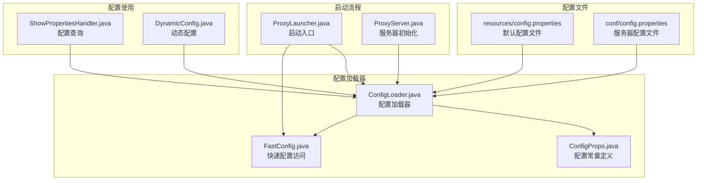
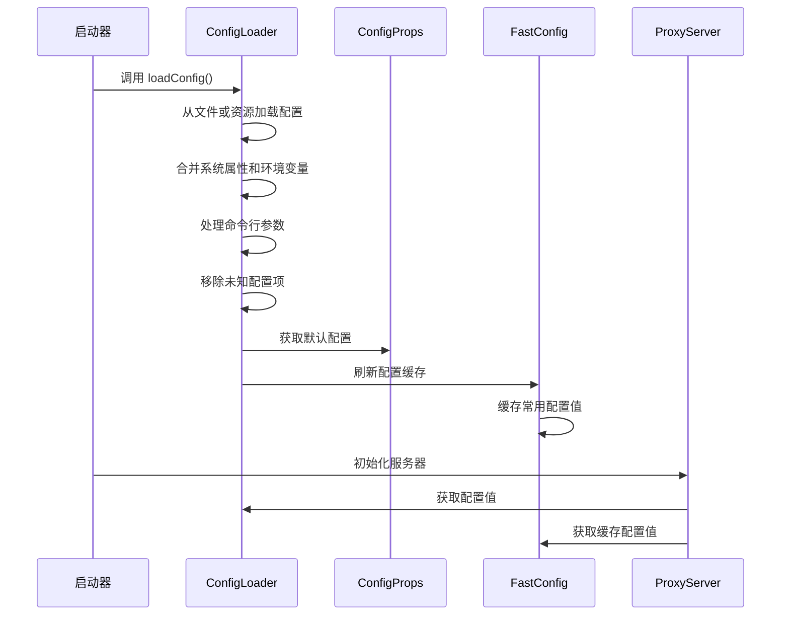
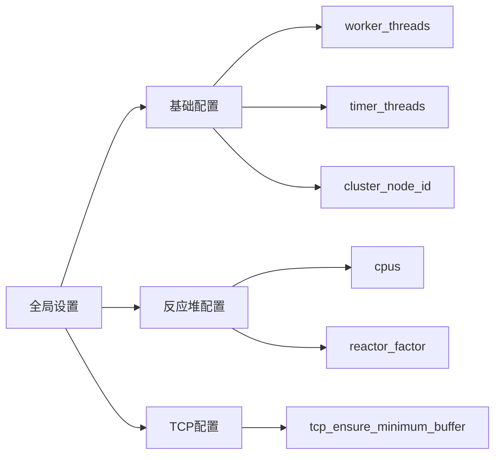
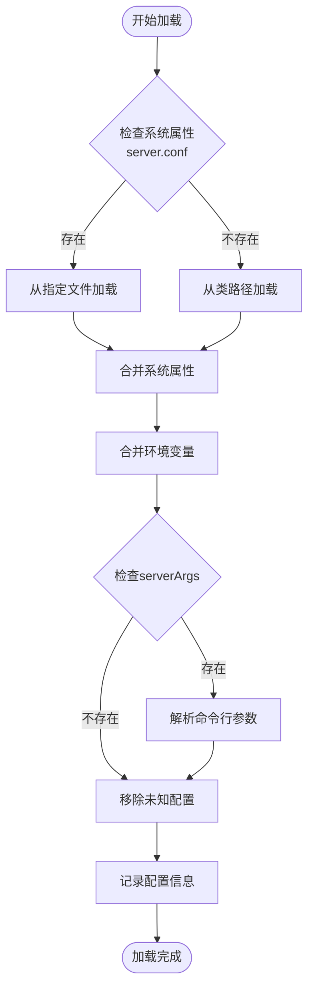
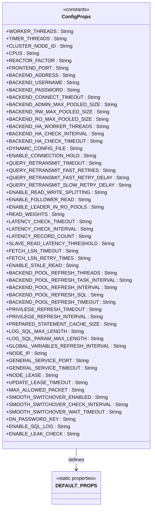
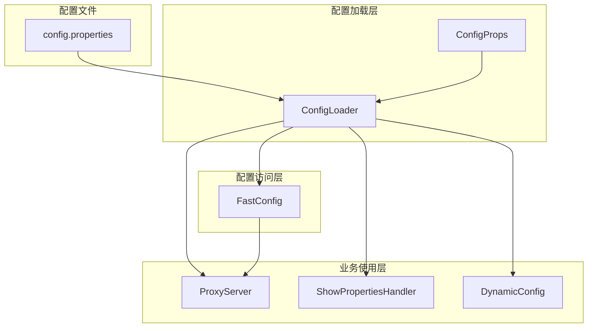

# 静态配置文件

<cite>
**本文档引用的文件**
- [config.properties（资源目录）](file://proxy-common/src/main/resources/config.properties)
- [config.properties（服务器目录）](file://proxy-server/src/main/conf/config.properties)
- [ConfigLoader.java](file://proxy-common/src/main/java/com/alibaba/polardbx/proxy/config/ConfigLoader.java)
- [ConfigProps.java](file://proxy-common/src/main/java/com/alibaba/polardbx/proxy/config/ConfigProps.java)
- [FastConfig.java](file://proxy-common/src/main/java/com/alibaba/polardbx/proxy/config/FastConfig.java)
- [ProxyLauncher.java](file://proxy-server/src/main/java/com/alibaba/polardbx/proxy/server/ProxyLauncher.java)
- [ShowPropertiesHandler.java](file://proxy-core/src/main/java/com/alibaba/polardbx/proxy/protocol/handler/request/ShowPropertiesHandler.java)
- [ProxyServer.java](file://proxy-core/src/main/java/com/alibaba/polardbx/proxy/ProxyServer.java)
- [DynamicConfig.java](file://proxy-common/src/main/java/com/alibaba/polardbx/proxy/dynamic/DynamicConfig.java)
</cite>

## 目录
1. [简介](#简介)
2. [项目结构](#项目结构)
3. [核心组件](#核心组件)
4. [架构概览](#架构概览)
5. [详细组件分析](#详细组件分析)
6. [依赖关系分析](#依赖关系分析)
7. [性能考量](#性能考量)
8. [故障排除指南](#故障排除指南)
9. [结论](#结论)
10. [附录](#附录)

## 简介

静态配置文件管理系统是 Polardbx Proxy 项目中的核心基础设施，负责管理整个系统的配置参数。该系统通过统一的配置文件格式和标准化的加载机制，为前端连接、后端连接池、网络处理、动态配置等功能提供一致的配置支持。

系统采用分层设计，通过 ConfigLoader 类统一加载和解析配置，ConfigProps 定义所有可用的配置常量，FastConfig 提供高性能的配置访问接口，形成了完整的配置管理体系。

## 项目结构

配置文件管理系统在项目中的组织结构如下：

**图表来源**
- [config.properties（资源目录）](file://proxy-common/src/main/resources/config.properties#L1-L29)
- [config.properties（服务器目录）](file://proxy-server/src/main/conf/config.properties#L1-L117)
- [ConfigLoader.java](file://proxy-common/src/main/java/com/alibaba/polardbx/proxy/config/ConfigLoader.java#L30-L72)
- [ConfigProps.java](file://proxy-common/src/main/java/com/alibaba/polardbx/proxy/config/ConfigProps.java#L23-L209)

**章节来源**
- [config.properties（资源目录）](file://proxy-common/src/main/resources/config.properties#L1-L29)
- [config.properties（服务器目录）](file://proxy-server/src/main/conf/config.properties#L1-L117)
- [ConfigLoader.java](file://proxy-common/src/main/java/com/alibaba/polardbx/proxy/config/ConfigLoader.java#L30-L72)

## 核心组件

### ConfigLoader 类

ConfigLoader 是配置系统的核心加载器，负责从多个来源加载和合并配置信息：

- **多源配置加载**：支持从文件系统、类路径资源、系统属性和环境变量加载配置
- **配置优先级**：系统属性 > 环境变量 > 命令行参数 > 配置文件
- **配置验证**：移除未知配置项，确保只有受支持的配置生效
- **日志记录**：记录最终生效的配置信息

### ConfigProps 类

ConfigProps 定义了所有可用的配置常量，涵盖以下主要类别：

- **基础信息**：worker_threads、timer_threads、cluster_node_id
- **线程框架**：cpus、reactor_factor
- **TCP 设置**：tcp_ensure_minimum_buffer
- **前端配置**：frontend_port
- **后端配置**：backend_address、backend_username、backend_password、backend_connect_timeout
- **后端连接池**：backend_admin_max_pooled_size、backend_rw_max_pooled_size、backend_ro_max_pooled_size
- **高可用配置**：backend_ha_worker_threads、backend_ha_check_interval、backend_ha_check_timeout
- **动态配置**：dynamic_config_file
- **读写分离**：enable_read_write_splitting、enable_follower_read、enable_leader_in_ro_pools、read_weights
- **其他功能配置**：大量与性能、日志、权限相关的配置项

### FastConfig 类

FastConfig 提供高性能的配置访问接口，将常用的配置项缓存到静态字段中，避免频繁的属性查找开销。

**章节来源**
- [ConfigLoader.java](file://proxy-common/src/main/java/com/alibaba/polardbx/proxy/config/ConfigLoader.java#L30-L72)
- [ConfigProps.java](file://proxy-common/src/main/java/com/alibaba/polardbx/proxy/config/ConfigProps.java#L23-L209)
- [FastConfig.java](file://proxy-common/src/main/java/com/alibaba/polardbx/proxy/config/FastConfig.java#L21-L75)

## 架构概览

配置系统采用分层架构设计，各组件职责明确：

**图表来源**
- [ProxyLauncher.java](file://proxy-server/src/main/java/com/alibaba/polardbx/proxy/server/ProxyLauncher.java#L32-L40)
- [ConfigLoader.java](file://proxy-common/src/main/java/com/alibaba/polardbx/proxy/config/ConfigLoader.java#L39-L71)
- [FastConfig.java](file://proxy-common/src/main/java/com/alibaba/polardbx/proxy/config/FastConfig.java#L45-L73)

## 详细组件分析

### 配置文件结构分析

#### 全局设置部分

配置文件采用分段注释的方式组织，每个部分都有清晰的功能分类：

**图表来源**
- [config.properties（服务器目录）](file://proxy-server/src/main/conf/config.properties#L19-L30)

#### 前端配置部分

前端配置主要涉及客户端连接相关的设置：

- **frontend_port**：前端监听端口，默认 3307
- **tcp_ensure_minimum_buffer**：TCP缓冲区最小保证设置

#### 后端配置部分

后端配置包含数据库连接的所有必要信息：

- **backend_address**：后端数据库地址，默认 127.0.0.1:3306
- **backend_username**：后端数据库用户名，默认 root
- **backend_password**：后端数据库密码，默认 123456
- **backend_connect_timeout**：连接超时时间，默认 3000ms

**章节来源**
- [config.properties（服务器目录）](file://proxy-server/src/main/conf/config.properties#L19-L49)

### ConfigLoader 加载流程

ConfigLoader 的加载过程遵循严格的优先级顺序：

**图表来源**
- [ConfigLoader.java](file://proxy-common/src/main/java/com/alibaba/polardbx/proxy/config/ConfigLoader.java#L39-L71)

### 配置常量定义

ConfigProps 类提供了完整的配置常量定义，涵盖了系统的所有可配置参数：

**图表来源**
- [ConfigProps.java](file://proxy-common/src/main/java/com/alibaba/polardbx/proxy/config/ConfigProps.java#L23-L209)

**章节来源**
- [ConfigProps.java](file://proxy-common/src/main/java/com/alibaba/polardbx/proxy/config/ConfigProps.java#L23-L209)

### 默认值设置机制

ConfigProps 使用静态初始化块设置所有默认值，确保系统在任何情况下都有合理的配置：

- **数值类型**：使用字符串形式的数字作为默认值
- **布尔类型**：使用 "true"/"false" 字符串
- **字符串类型**：使用具体的默认值或空字符串
- **复杂类型**：如连接池大小、超时时间等

**章节来源**
- [ConfigProps.java](file://proxy-common/src/main/java/com/alibaba/polardbx/proxy/config/ConfigProps.java#L127-L207)

## 依赖关系分析

配置系统各组件之间的依赖关系清晰明确：

**图表来源**
- [ProxyLauncher.java](file://proxy-server/src/main/java/com/alibaba/polardbx/proxy/server/ProxyLauncher.java#L23-L25)
- [ProxyServer.java](file://proxy-core/src/main/java/com/alibaba/polardbx/proxy/ProxyServer.java#L56-L80)
- [ShowPropertiesHandler.java](file://proxy-core/src/main/java/com/alibaba/polardbx/proxy/protocol/handler/request/ShowPropertiesHandler.java#L52-L74)
- [DynamicConfig.java](file://proxy-common/src/main/java/com/alibaba/polardbx/proxy/dynamic/DynamicConfig.java#L69-L129)

**章节来源**
- [ProxyLauncher.java](file://proxy-server/src/main/java/com/alibaba/polardbx/proxy/server/ProxyLauncher.java#L23-L25)
- [ProxyServer.java](file://proxy-core/src/main/java/com/alibaba/polardbx/proxy/ProxyServer.java#L56-L80)

## 性能考量

### 配置访问优化

FastConfig 通过静态字段缓存常用配置值，避免每次访问都进行属性查找：

- **静态缓存**：将频繁使用的配置值存储在静态字段中
- **类型转换**：在刷新时进行一次性的类型转换
- **线程安全**：使用 volatile 关键字确保配置更新的可见性

### 内存使用优化

- **属性对象复用**：ConfigLoader 使用单例 Properties 对象
- **默认值预设**：避免运行时重复设置默认值
- **配置清理**：移除未知配置项减少内存占用

## 故障排除指南

### 常见配置错误

#### 配置文件路径错误
- **问题**：server.conf 系统属性指向的文件不存在
- **解决方案**：检查文件路径是否正确，确认文件权限

#### 配置项拼写错误
- **问题**：配置项名称不正确导致被移除
- **解决方案**：参考 ConfigProps 中的常量定义核对配置项名称

#### 数据类型错误
- **问题**：数值配置项使用了非数字值
- **解决方案**：确保数值配置项使用整数或浮点数格式

#### 权限问题
- **问题**：配置文件权限不足导致无法读取
- **解决方案**：检查文件权限，确保进程有读取权限

### 排查步骤

1. **检查配置加载日志**：查看启动日志中的配置信息
2. **验证配置文件语法**：确保配置文件格式正确
3. **测试配置项有效性**：逐个验证关键配置项
4. **监控系统行为**：观察系统运行状态确认配置生效

**章节来源**
- [ConfigLoader.java](file://proxy-common/src/main/java/com/alibaba/polardbx/proxy/config/ConfigLoader.java#L59-L63)

## 结论

静态配置文件管理系统通过标准化的设计和严格的实现，为 Polardbx Proxy 提供了可靠、灵活的配置管理能力。系统的主要优势包括：

- **统一的配置格式**：所有配置都遵循相同的格式和命名规范
- **多源配置支持**：支持从多种来源加载配置，满足不同部署场景
- **配置验证机制**：自动验证配置的有效性，提高系统稳定性
- **性能优化**：通过缓存机制提升配置访问性能
- **易于维护**：清晰的代码结构和完善的注释便于维护

该系统为后续的功能扩展和配置管理奠定了坚实的基础。

## 附录

### 完整配置项列表

#### 基础配置
- **worker_threads**：工作线程数量，默认 4
- **timer_threads**：定时器线程数量，默认 1  
- **cluster_node_id**：集群节点 ID，默认 0

#### 反应堆配置
- **cpus**：CPU 核心数，默认 0（自动检测）
- **reactor_factor**：反应堆因子，默认 1

#### TCP 配置
- **tcp_ensure_minimum_buffer**：TCP 最小缓冲区保证，默认 false

#### 前端配置
- **frontend_port**：前端监听端口，默认 3307

#### 后端配置
- **backend_address**：后端地址，默认 127.0.0.1:3306
- **backend_username**：后端用户名，默认 root
- **backend_password**：后端密码，默认 123456
- **backend_connect_timeout**：连接超时，默认 3000ms

#### 后端连接池配置
- **backend_admin_max_pooled_size**：管理连接池最大大小，默认 2
- **backend_rw_max_pooled_size**：读写连接池最大大小，默认 600
- **backend_ro_max_pooled_size**：只读连接池最大大小，默认 600

#### 高可用配置
- **backend_ha_worker_threads**：HA 工作线程数，默认 8
- **backend_ha_check_interval**：HA 检查间隔，默认 5000ms
- **backend_ha_check_timeout**：HA 检查超时，默认 3000ms

#### 动态配置
- **dynamic_config_file**：动态配置文件名，默认 dynamic.json

#### 读写分离配置
- **enable_read_write_splitting**：启用读写分离，默认 true
- **enable_follower_read**：启用跟随者读取，默认 true
- **enable_leader_in_ro_pools**：在只读池中启用领导者，默认 true
- **read_weights**：读取权重配置，默认空字符串
- **latency_check_timeout**：延迟检查超时，默认 3000ms
- **latency_check_interval**：延迟检查间隔，默认 1000ms
- **latency_record_count**：延迟记录数量，默认 100
- **slave_read_latency_threshold**：从库读取延迟阈值，默认 3000ms
- **fetch_lsn_timeout**：LSN 获取超时，默认 1000ms
- **fetch_lsn_retry_times**：LSN 获取重试次数，默认 3

#### 连接保持和错误处理
- **enable_connection_hold**：启用连接保持，默认 false
- **query_retransmit_timeout**：查询重传超时，默认 20000ms
- **query_retransmit_fast_retries**：快速重传次数，默认 10
- **query_retransmit_fast_retry_delay**：快速重传延迟，默认 100ms
- **query_retransmit_slow_retry_delay**：慢速重传延迟，默认 1000ms

#### 其他配置
- **enable_stale_read**：启用陈旧读取，默认 false
- **backend_pool_refresh_threads**：连接池刷新线程数，默认 4
- **backend_pool_refresh_task_interval**：连接池刷新任务间隔，默认 1000ms
- **backend_pool_refresh_interval**：连接池刷新间隔，默认 49000ms
- **backend_pool_refresh_sql**：连接池刷新SQL，默认特定查询
- **backend_pool_refresh_timeout**：连接池刷新超时，默认 3000ms
- **privilege_refresh_timeout**：权限刷新超时，默认 10000ms
- **privilege_refresh_interval**：权限刷新间隔，默认 10000ms
- **prepared_statement_cache_size**：预编译语句缓存大小，默认 100
- **log_sql_max_length**：SQL日志最大长度，默认 4096
- **log_sql_param_max_length**：SQL参数日志最大长度，默认 4096
- **global_variables_refresh_interval**：全局变量刷新间隔，默认 60000ms
- **node_ip**：节点IP，默认空字符串
- **general_service_port**：通用服务端口，默认 8083
- **general_service_timeout**：通用服务超时，默认 3000ms
- **node_lease**：节点租约，默认 10000ms
- **update_lease_timeout**：更新租约超时，默认 3000ms
- **max_allowed_packet**：最大包大小，默认 1073741824（1GB）
- **smooth_switchover_enabled**：启用平滑切换，默认 true
- **smooth_switchover_check_interval**：平滑切换检查间隔，默认 100ms
- **smooth_switchover_wait_timeout**：平滑切换等待超时，默认 10000ms
- **dn_password_key**：数据节点密码密钥，默认空字符串
- **enable_sql_log**：启用SQL日志，默认 false
- **enable_leak_check**：启用泄漏检查，默认 false

### 最佳实践建议

1. **配置文件管理**
   - 使用版本控制系统管理配置文件
   - 为不同环境准备独立的配置文件
   - 定期备份配置文件

2. **安全考虑**
   - 不要在配置文件中存储明文密码
   - 使用环境变量或密钥管理服务存储敏感信息
   - 限制配置文件的文件权限

3. **性能优化**
   - 根据硬件资源合理设置线程数量
   - 监控连接池使用情况，调整连接池大小
   - 定期检查配置项的有效性

4. **监控和调试**
   - 启用配置加载日志
   - 定期检查配置生效情况
   - 建立配置变更的审计机制