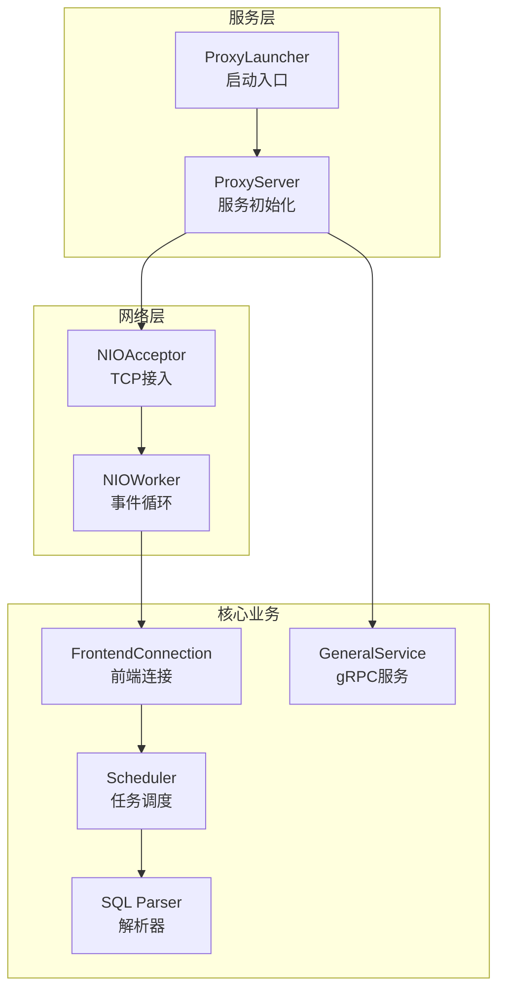
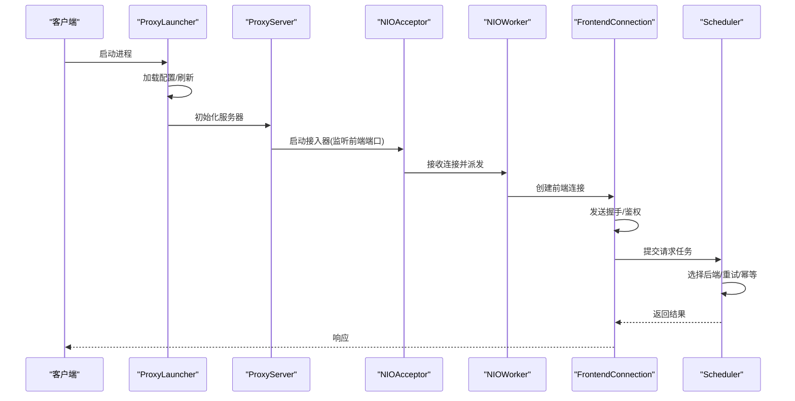
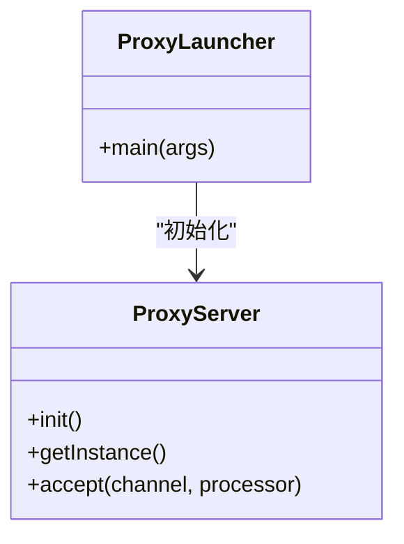
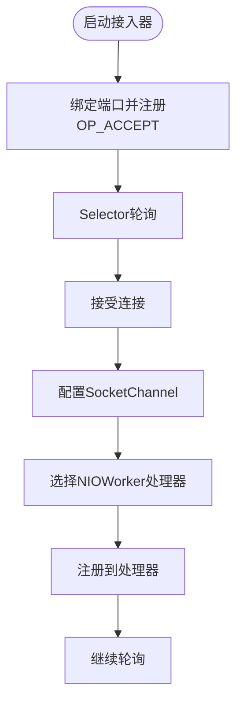
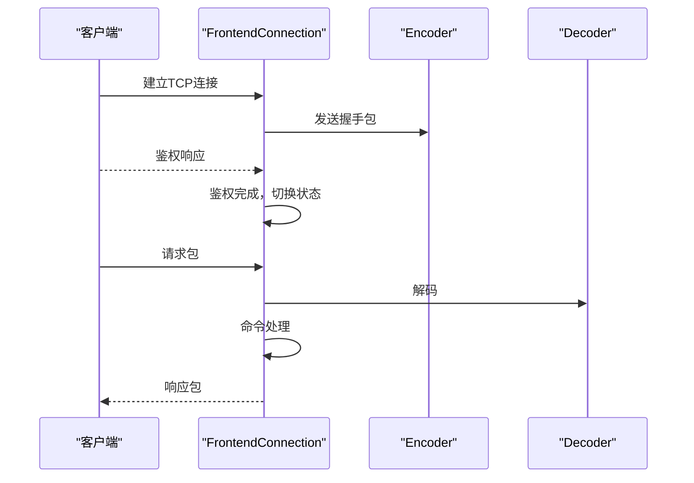
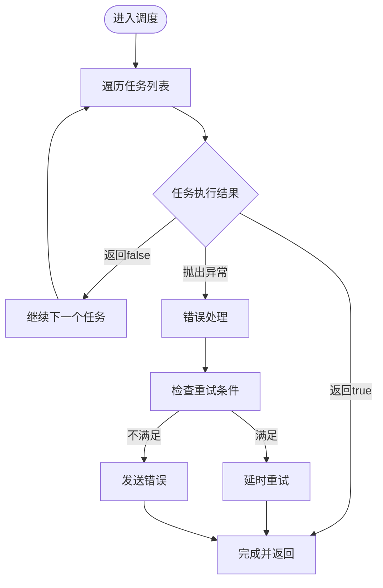
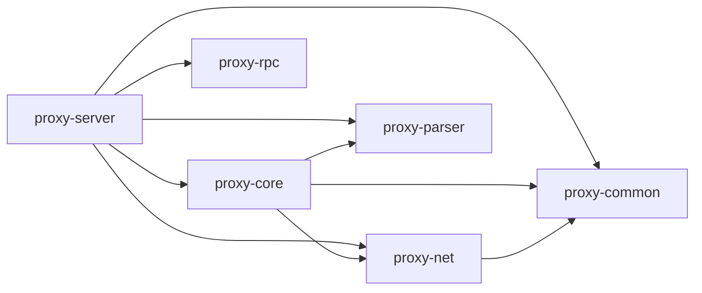

# 项目概述

<cite>
**本文引用的文件**
- [README.md](file://README.md)
- [polardbx_proxy_user_manual.md](file://polardbx_proxy_user_manual.md)
- [pom.xml](file://pom.xml)
- [proxy-server/src/main/java/com/alibaba/polardbx/proxy/server/ProxyLauncher.java](file://proxy-server/src/main/java/com/alibaba/polardbx/proxy/server/ProxyLauncher.java)
- [proxy-core/src/main/java/com/alibaba/polardbx/proxy/ProxyServer.java](file://proxy-core/src/main/java/com/alibaba/polardbx/proxy/ProxyServer.java)
- [proxy-net/src/main/java/com/alibaba/polardbx/proxy/net/NIOAcceptor.java](file://proxy-net/src/main/java/com/alibaba/polardbx/proxy/net/NIOAcceptor.java)
- [proxy-common/src/main/java/com/alibaba/polardbx/proxy/common/AddressDecoder.java](file://proxy-common/src/main/java/com/alibaba/polardbx/proxy/common/AddressDecoder.java)
- [proxy-rpc/src/main/proto/GeneralService.proto](file://proxy-rpc/src/main/proto/GeneralService.proto)
- [proxy-common/src/main/resources/config.properties](file://proxy-common/src/main/resources/config.properties)
- [proxy-core/src/main/java/com/alibaba/polardbx/proxy/connection/FrontendConnection.java](file://proxy-core/src/main/java/com/alibaba/polardbx/proxy/connection/FrontendConnection.java)
- [proxy-core/src/main/java/com/alibaba/polardbx/proxy/scheduler/Scheduler.java](file://proxy-core/src/main/java/com/alibaba/polardbx/proxy/scheduler/Scheduler.java)
- [proxy-common/src/main/java/com/alibaba/polardbx/proxy/config/ConfigLoader.java](file://proxy-common/src/main/java/com/alibaba/polardbx/proxy/config/ConfigLoader.java)
- [proxy-core/src/main/java/com/alibaba/polardbx/proxy/ProxyExecutor.java](file://proxy-core/src/main/java/com/alibaba/polardbx/proxy/ProxyExecutor.java)
</cite>

## 目录
1. [简介](#简介)
2. [项目结构](#项目结构)
3. [核心组件](#核心组件)
4. [架构总览](#架构总览)
5. [详细组件分析](#详细组件分析)
6. [依赖分析](#依赖分析)
7. [性能考量](#性能考量)
8. [故障排查指南](#故障排查指南)
9. [结论](#结论)
10. [附录](#附录)

## 简介
PolarDB-X Proxy 是面向 PolarDB-X 标准版的高性能数据库代理，旨在为上层应用提供稳定、低延迟、易运维的访问入口。它具备自动识别集群主节点、无感高可用切换、读写分离与一致性读、实例级连接池等能力，部署于 PolarDB-X 标准版之前，显著简化使用体验。

- 项目定位：PolarDB-X 标准版代理
- 核心价值：高性能、高可用、易用性、可观测性
- 技术目标：通过模块化架构与异步事件驱动模型，实现高并发、低延迟的数据库访问代理

**章节来源**
- [README.md](file://README.md#L1-L14)
- [polardbx_proxy_user_manual.md](file://polardbx_proxy_user_manual.md#L1-L36)

## 项目结构
项目采用多模块 Maven 结构，按职责划分清晰：
- proxy-server：服务启动入口与打包装配
- proxy-common：通用工具、配置加载、基础常量
- proxy-net：NIO 网络层（接受器、处理器、工作线程）
- proxy-core：核心业务逻辑（连接管理、调度器、协议编解码、权限与特权、HA 管理等）
- proxy-parser：SQL 解析与 AST 支持
- proxy-rpc：gRPC 服务定义与桩代码生成

**图表来源**
- [proxy-server/src/main/java/com/alibaba/polardbx/proxy/server/ProxyLauncher.java](file://proxy-server/src/main/java/com/alibaba/polardbx/proxy/server/ProxyLauncher.java#L32-L44)
- [proxy-core/src/main/java/com/alibaba/polardbx/proxy/ProxyServer.java](file://proxy-core/src/main/java/com/alibaba/polardbx/proxy/ProxyServer.java#L90-L96)
- [proxy-net/src/main/java/com/alibaba/polardbx/proxy/net/NIOAcceptor.java](file://proxy-net/src/main/java/com/alibaba/polardbx/proxy/net/NIOAcceptor.java#L46-L59)
- [proxy-core/src/main/java/com/alibaba/polardbx/proxy/connection/FrontendConnection.java](file://proxy-core/src/main/java/com/alibaba/polardbx/proxy/connection/FrontendConnection.java#L61-L86)
- [proxy-core/src/main/java/com/alibaba/polardbx/proxy/scheduler/Scheduler.java](file://proxy-core/src/main/java/com/alibaba/polardbx/proxy/scheduler/Scheduler.java#L300-L313)
- [proxy-rpc/src/main/proto/GeneralService.proto](file://proxy-rpc/src/main/proto/GeneralService.proto#L8-L10)

**章节来源**
- [pom.xml](file://pom.xml#L30-L37)

## 核心组件
- 启动器与服务初始化
  - 启动器负责加载配置、初始化执行器与服务器，并注册 JVM 关闭钩子
  - 服务器负责初始化 HA 管理、平滑切换监控、权限刷新、通用服务端口、节点看守等，并启动 NIO 接入器
- 网络层
  - NIO 接入器基于 Java NIO 的 Selector 实现，监听前端端口，接收连接并交由工作线程处理
- 前端连接
  - 建立握手、鉴权与命令处理流程，维护连接上下文与状态机
- 调度器
  - 将前端请求拆分为一系列可组合的任务，按需选择后端连接、执行重试与幂等处理
- 配置与工具
  - 统一配置加载与校验，地址解析工具支持多地址标签与映射

**章节来源**
- [proxy-server/src/main/java/com/alibaba/polardbx/proxy/server/ProxyLauncher.java](file://proxy-server/src/main/java/com/alibaba/polardbx/proxy/server/ProxyLauncher.java#L32-L55)
- [proxy-core/src/main/java/com/alibaba/polardbx/proxy/ProxyServer.java](file://proxy-core/src/main/java/com/alibaba/polardbx/proxy/ProxyServer.java#L56-L96)
- [proxy-net/src/main/java/com/alibaba/polardbx/proxy/net/NIOAcceptor.java](file://proxy-net/src/main/java/com/alibaba/polardbx/proxy/net/NIOAcceptor.java#L46-L107)
- [proxy-core/src/main/java/com/alibaba/polardbx/proxy/connection/FrontendConnection.java](file://proxy-core/src/main/java/com/alibaba/polardbx/proxy/connection/FrontendConnection.java#L47-L86)
- [proxy-core/src/main/java/com/alibaba/polardbx/proxy/scheduler/Scheduler.java](file://proxy-core/src/main/java/com/alibaba/polardbx/proxy/scheduler/Scheduler.java#L46-L149)
- [proxy-common/src/main/java/com/alibaba/polardbx/proxy/config/ConfigLoader.java](file://proxy-common/src/main/java/com/alibaba/polardbx/proxy/config/ConfigLoader.java#L39-L71)
- [proxy-common/src/main/java/com/alibaba/polardbx/proxy/common/AddressDecoder.java](file://proxy-common/src/main/java/com/alibaba/polardbx/proxy/common/AddressDecoder.java#L42-L60)

## 架构总览
整体采用“异步事件驱动 + 模块化职责分离”的架构：
- 启动阶段：加载配置 → 初始化执行器 → 初始化服务器 → 注册关闭钩子
- 运行阶段：NIO 接入器接收连接 → 工作线程派发 → 前端连接建立握手与鉴权 → 命令处理器解析与转发 → 调度器选择后端连接并执行 → 返回结果
- 服务扩展：通用服务通过 gRPC 提供远程过程调用能力，用于内部服务注册与运维指令

**图表来源**
- [proxy-server/src/main/java/com/alibaba/polardbx/proxy/server/ProxyLauncher.java](file://proxy-server/src/main/java/com/alibaba/polardbx/proxy/server/ProxyLauncher.java#L32-L44)
- [proxy-core/src/main/java/com/alibaba/polardbx/proxy/ProxyServer.java](file://proxy-core/src/main/java/com/alibaba/polardbx/proxy/ProxyServer.java#L90-L96)
- [proxy-net/src/main/java/com/alibaba/polardbx/proxy/net/NIOAcceptor.java](file://proxy-net/src/main/java/com/alibaba/polardbx/proxy/net/NIOAcceptor.java#L61-L81)
- [proxy-core/src/main/java/com/alibaba/polardbx/proxy/connection/FrontendConnection.java](file://proxy-core/src/main/java/com/alibaba/polardbx/proxy/connection/FrontendConnection.java#L88-L143)
- [proxy-core/src/main/java/com/alibaba/polardbx/proxy/scheduler/Scheduler.java](file://proxy-core/src/main/java/com/alibaba/polardbx/proxy/scheduler/Scheduler.java#L300-L313)

## 详细组件分析

### 启动与服务初始化
- ProxyLauncher
  - 负责加载配置、刷新动态配置、初始化执行器与服务器；异常时触发进程退出
- ProxyServer
  - 初始化 HA 管理器、平滑切换监控、权限刷新器、通用服务端口、节点看守器
  - 启动 NIO 接入器监听前端端口，创建 NIOWorker 事件循环

**图表来源**
- [proxy-server/src/main/java/com/alibaba/polardbx/proxy/server/ProxyLauncher.java](file://proxy-server/src/main/java/com/alibaba/polardbx/proxy/server/ProxyLauncher.java#L32-L55)
- [proxy-core/src/main/java/com/alibaba/polardbx/proxy/ProxyServer.java](file://proxy-core/src/main/java/com/alibaba/polardbx/proxy/ProxyServer.java#L113-L118)

**章节来源**
- [proxy-server/src/main/java/com/alibaba/polardbx/proxy/server/ProxyLauncher.java](file://proxy-server/src/main/java/com/alibaba/polardbx/proxy/server/ProxyLauncher.java#L32-L55)
- [proxy-core/src/main/java/com/alibaba/polardbx/proxy/ProxyServer.java](file://proxy-core/src/main/java/com/alibaba/polardbx/proxy/ProxyServer.java#L56-L96)

### 网络层：NIO 接入与连接派发
- NIOAcceptor
  - 使用 Selector 监听端口，接收 TCP 连接，设置 TCP_NODELAY，交由 NIOWorker 选择处理器并注册
  - 提供优雅下线接口，唤醒选择器并关闭通道与选择器

**图表来源**
- [proxy-net/src/main/java/com/alibaba/polardbx/proxy/net/NIOAcceptor.java](file://proxy-net/src/main/java/com/alibaba/polardbx/proxy/net/NIOAcceptor.java#L46-L107)

**章节来源**
- [proxy-net/src/main/java/com/alibaba/polardbx/proxy/net/NIOAcceptor.java](file://proxy-net/src/main/java/com/alibaba/polardbx/proxy/net/NIOAcceptor.java#L46-L107)

### 前端连接：握手、鉴权与命令处理
- FrontendConnection
  - 建立握手包、设置连接 ID、能力标志、字符集与状态标志
  - 鉴权完成后切换至命令处理阶段，按请求类型分派处理
  - 异步释放资源，避免死锁

**图表来源**
- [proxy-core/src/main/java/com/alibaba/polardbx/proxy/connection/FrontendConnection.java](file://proxy-core/src/main/java/com/alibaba/polardbx/proxy/connection/FrontendConnection.java#L88-L143)

**章节来源**
- [proxy-core/src/main/java/com/alibaba/polardbx/proxy/connection/FrontendConnection.java](file://proxy-core/src/main/java/com/alibaba/polardbx/proxy/connection/FrontendConnection.java#L47-L86)
- [proxy-core/src/main/java/com/alibaba/polardbx/proxy/connection/FrontendConnection.java](file://proxy-core/src/main/java/com/alibaba/polardbx/proxy/connection/FrontendConnection.java#L114-L143)

### 调度器：任务编排与重试
- Scheduler
  - 将请求拆分为可组合的 ScheduleTask 列表，按序执行
  - 支持重传限制、延迟统计、LSN 获取与等待、事务上下文去引用与错误处理
  - 在异常时根据条件进行快速重试或发送错误

**图表来源**
- [proxy-core/src/main/java/com/alibaba/polardbx/proxy/scheduler/Scheduler.java](file://proxy-core/src/main/java/com/alibaba/polardbx/proxy/scheduler/Scheduler.java#L300-L313)

**章节来源**
- [proxy-core/src/main/java/com/alibaba/polardbx/proxy/scheduler/Scheduler.java](file://proxy-core/src/main/java/com/alibaba/polardbx/proxy/scheduler/Scheduler.java#L46-L149)
- [proxy-core/src/main/java/com/alibaba/polardbx/proxy/scheduler/Scheduler.java](file://proxy-core/src/main/java/com/alibaba/polardbx/proxy/scheduler/Scheduler.java#L234-L297)

### 配置与地址解析
- ConfigLoader
  - 从文件或资源加载默认配置，合并系统属性、环境变量与服务器参数，移除未知键并打印最终配置
- AddressDecoder
  - 解析地址字符串，支持多地址标签与不可变映射，便于多后端节点管理

**章节来源**
- [proxy-common/src/main/java/com/alibaba/polardbx/proxy/config/ConfigLoader.java](file://proxy-common/src/main/java/com/alibaba/polardbx/proxy/config/ConfigLoader.java#L39-L71)
- [proxy-common/src/main/java/com/alibaba/polardbx/proxy/common/AddressDecoder.java](file://proxy-common/src/main/java/com/alibaba/polardbx/proxy/common/AddressDecoder.java#L42-L60)

### gRPC 服务定义
- GeneralService.proto
  - 定义通用远程过程调用接口，承载内部服务注册与运维指令

**章节来源**
- [proxy-rpc/src/main/proto/GeneralService.proto](file://proxy-rpc/src/main/proto/GeneralService.proto#L8-L20)

## 依赖分析
- 技术栈
  - Java 11+：编译与运行时版本
  - Netty 网络框架：NIO 事件驱动与高性能网络 I/O
  - gRPC：服务间通信与远程过程调用
  - SLF4J/Logback：统一日志门面与实现
  - Lombok：减少样板代码
  - JUnit/Gson：测试与 JSON 工具
- 模块依赖
  - proxy-server 依赖 proxy-core、proxy-net、proxy-common、proxy-parser、proxy-rpc
  - proxy-core 依赖 proxy-common、proxy-net、proxy-parser
  - proxy-net 依赖 proxy-common
  - proxy-parser 与 proxy-rpc 独立但被上层模块使用

**图表来源**
- [pom.xml](file://pom.xml#L30-L37)

**章节来源**
- [pom.xml](file://pom.xml#L39-L54)
- [pom.xml](file://pom.xml#L147-L254)

## 性能考量
- 异步事件驱动
  - NIO 接入器与 NIOWorker 通过单线程事件循环处理大量连接，降低上下文切换开销
- 线程池与定时器
  - ProxyExecutor 提供可配置的工作线程与定时线程池，用于调度与延时任务
- 连接与缓冲
  - 前端连接上下文与编码器/解码器复用，减少对象分配与 GC 压力
- 重试与延迟统计
  - 调度器对重试进行限制与延迟统计，避免雪崩效应

**章节来源**
- [proxy-core/src/main/java/com/alibaba/polardbx/proxy/ProxyServer.java](file://proxy-core/src/main/java/com/alibaba/polardbx/proxy/ProxyServer.java#L65-L74)
- [proxy-core/src/main/java/com/alibaba/polardbx/proxy/ProxyExecutor.java](file://proxy-core/src/main/java/com/alibaba/polardbx/proxy/ProxyExecutor.java#L34-L39)
- [proxy-core/src/main/java/com/alibaba/polardbx/proxy/scheduler/Scheduler.java](file://proxy-core/src/main/java/com/alibaba/polardbx/proxy/scheduler/Scheduler.java#L234-L297)

## 故障排查指南
- 启动失败
  - 检查配置文件路径与键值，确认 server.conf 属性与环境变量是否正确传递
  - 关注启动日志中的配置打印与端口绑定信息
- 连接异常
  - 查看前端连接握手与鉴权阶段的日志，确认客户端能力标志与字符集设置
  - 检查调度器错误处理分支，关注重试与错误发送逻辑
- 高可用与切换
  - 关注 HA 管理器与平滑切换监控的日志，确认后端集群状态变化与连接池更新
- 日志定位
  - 使用用户手册中的日志格式与字段定位请求耗时与阶段耗时，辅助性能优化

**章节来源**
- [proxy-common/src/main/java/com/alibaba/polardbx/proxy/config/ConfigLoader.java](file://proxy-common/src/main/java/com/alibaba/polardbx/proxy/config/ConfigLoader.java#L69-L71)
- [proxy-core/src/main/java/com/alibaba/polardbx/proxy/connection/FrontendConnection.java](file://proxy-core/src/main/java/com/alibaba/polardbx/proxy/connection/FrontendConnection.java#L163-L166)
- [proxy-core/src/main/java/com/alibaba/polardbx/proxy/scheduler/Scheduler.java](file://proxy-core/src/main/java/com/alibaba/polardbx/proxy/scheduler/Scheduler.java#L234-L297)
- [polardbx_proxy_user_manual.md](file://polardbx_proxy_user_manual.md#L554-L573)

## 结论
PolarDB-X Proxy 通过模块化设计与异步事件驱动，构建了高性能、高可用、易运维的数据库代理。其核心在于清晰的职责边界、可插拔的任务调度与完善的高可用机制。结合 gRPC 与统一配置体系，能够满足生产环境对稳定性与可观测性的严格要求。

## 附录

### 快速开始（基于用户手册）
- 环境要求
  - Linux 64 位 X86/ARM，Docker（推荐最新版本），内存推荐 16GB，开放 3307 与 8083 端口
- 启动
  - 下载镜像并使用 quick_start.sh 脚本一键启动，或手动拉起容器
- 连接
  - 使用 mysql 客户端连接代理端口，验证版本与连接状态
- 配置
  - 修改 config.properties，设置前端端口、后端地址、用户名与密码等

**章节来源**
- [polardbx_proxy_user_manual.md](file://polardbx_proxy_user_manual.md#L39-L74)
- [polardbx_proxy_user_manual.md](file://polardbx_proxy_user_manual.md#L76-L170)
- [polardbx_proxy_user_manual.md](file://polardbx_proxy_user_manual.md#L129-L157)
- [polardbx_proxy_user_manual.md](file://polardbx_proxy_user_manual.md#L269-L292)

### 配置文件示例（节选）
- 全局设置：worker_threads、cpus、reactor_factor、cluster_node_id
- 前端配置：frontend_port
- 后端配置：backend_address、backend_username、backend_password

**章节来源**
- [proxy-common/src/main/resources/config.properties](file://proxy-common/src/main/resources/config.properties#L18-L29)