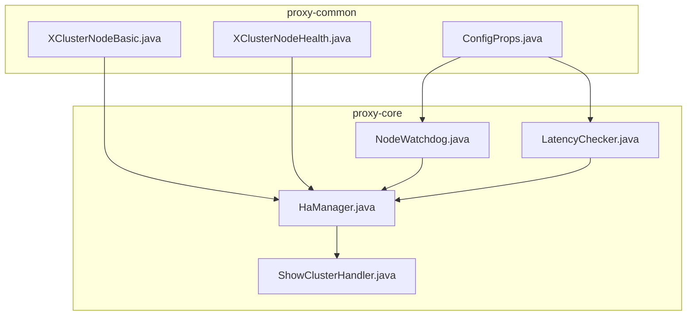
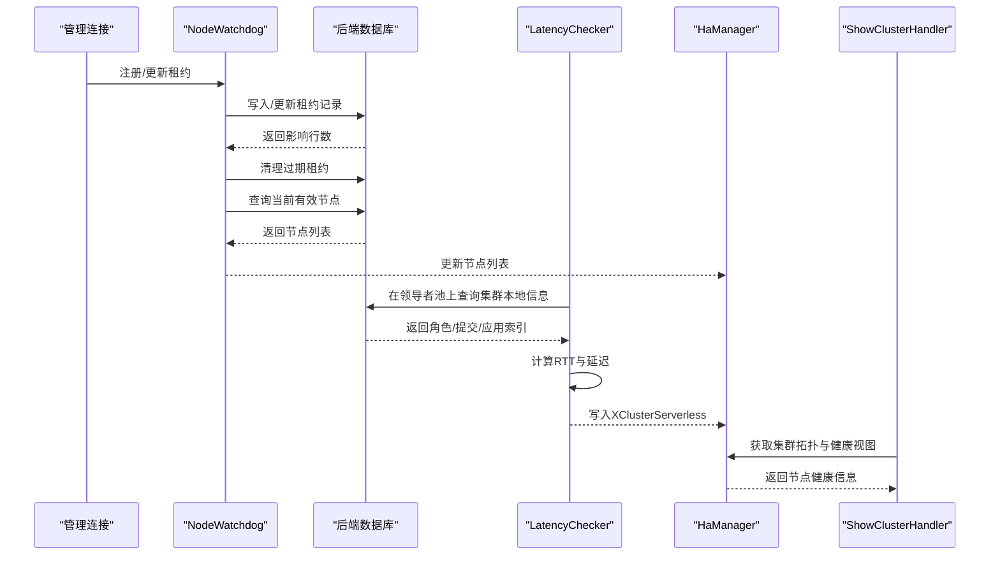
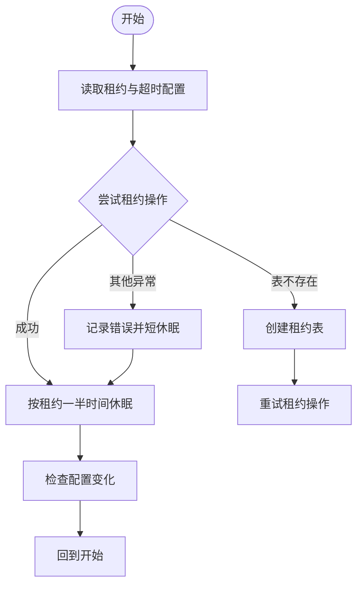
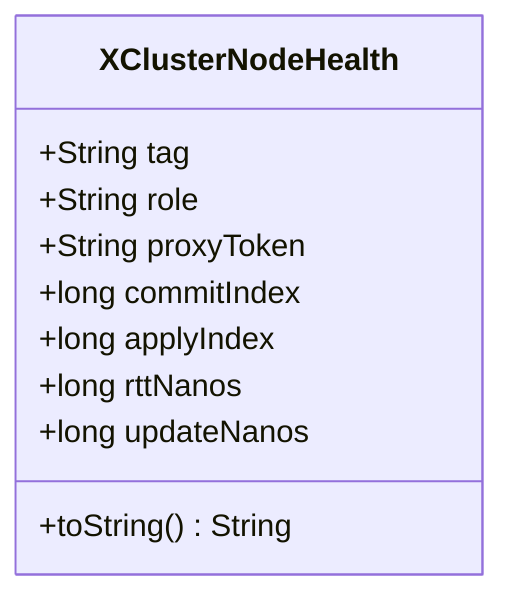
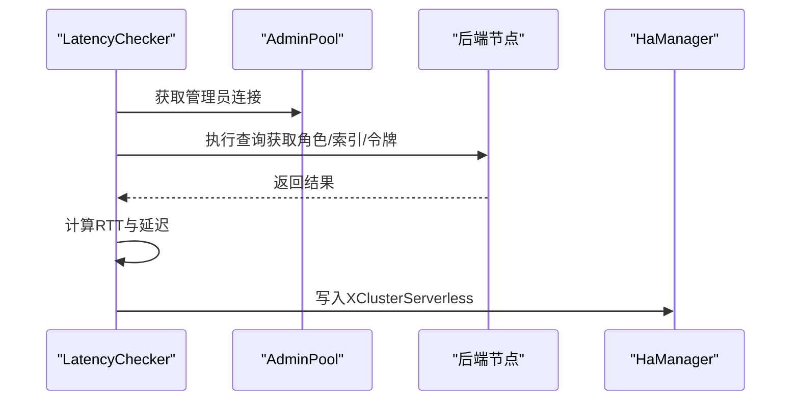
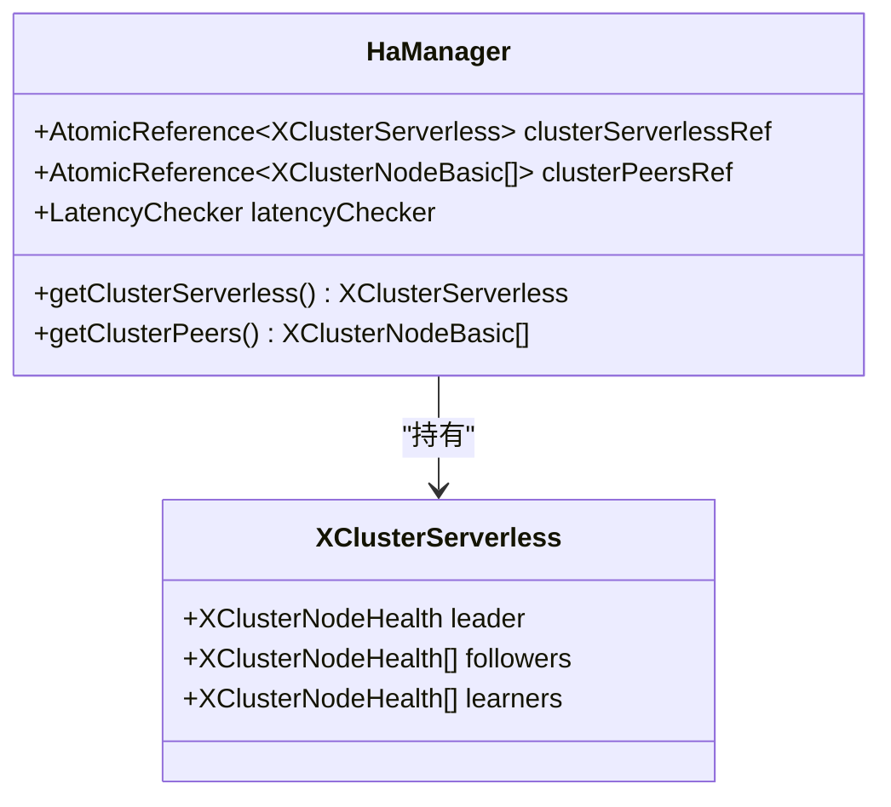
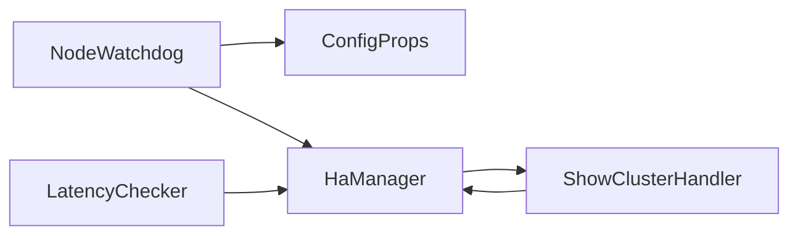

# 健康检查系统

<cite>
**本文引用的文件列表**
- [XClusterNodeHealth.java](file://proxy-common/src/main/java/com/alibaba/polardbx/proxy/common/XClusterNodeHealth.java)
- [XClusterNodeBasic.java](file://proxy-common/src/main/java/com/alibaba/polardbx/proxy/common/XClusterNodeBasic.java)
- [NodeWatchdog.java](file://proxy-core/src/main/java/com/alibaba/polardbx/proxy/cluster/NodeWatchdog.java)
- [LatencyChecker.java](file://proxy-core/src/main/java/com/alibaba/polardbx/proxy/serverless/LatencyChecker.java)
- [HaManager.java](file://proxy-core/src/main/java/com/alibaba/polardbx/proxy/serverless/HaManager.java)
- [ConfigProps.java](file://proxy-common/src/main/java/com/alibaba/polardbx/proxy/config/ConfigProps.java)
- [ShowClusterHandler.java](file://proxy-core/src/main/java/com/alibaba/polardbx/proxy/protocol/handler/request/ShowClusterHandler.java)
- [HaTest.java](file://proxy-core/src/test/java/com/alibaba/polardbx/proxy/client/HaTest.java)
</cite>

## 目录
1. [简介](#简介)
2. [项目结构](#项目结构)
3. [核心组件](#核心组件)
4. [架构总览](#架构总览)
5. [组件详解](#组件详解)
6. [依赖关系分析](#依赖关系分析)
7. [性能与配置](#性能与配置)
8. [监控指标](#监控指标)
9. [测试与验证](#测试与验证)
10. [故障排查](#故障排查)
11. [最佳实践与运维指南](#最佳实践与运维指南)
12. [结论](#结论)

## 简介
本文件面向PolarDB-X Proxy的健康检查系统，聚焦于NodeWatchdog的心跳与节点状态监控机制，以及XClusterNodeHealth数据结构的设计与使用。文档从架构、实现原理、配置参数、监控指标、测试方法、性能优化到故障诊断与运维建议进行系统化梳理，帮助读者快速理解并高效运维该健康检查体系。

## 项目结构
健康检查系统主要分布在以下模块：
- proxy-common：定义跨模块的节点基础信息与健康信息模型（XClusterNodeBasic、XClusterNodeHealth）
- proxy-core：实现健康检查与HA管理（NodeWatchdog、LatencyChecker、HaManager），并通过SQL接口对外暴露集群健康视图（ShowClusterHandler）

图表来源
- [XClusterNodeBasic.java](file://proxy-common/src/main/java/com/alibaba/polardbx/proxy/common/XClusterNodeBasic.java#L28-L62)
- [XClusterNodeHealth.java](file://proxy-common/src/main/java/com/alibaba/polardbx/proxy/common/XClusterNodeHealth.java#L24-L56)
- [NodeWatchdog.java](file://proxy-core/src/main/java/com/alibaba/polardbx/proxy/cluster/NodeWatchdog.java#L48-L117)
- [LatencyChecker.java](file://proxy-core/src/main/java/com/alibaba/polardbx/proxy/serverless/LatencyChecker.java#L49-L73)
- [HaManager.java](file://proxy-core/src/main/java/com/alibaba/polardbx/proxy/serverless/HaManager.java#L67-L156)
- [ShowClusterHandler.java](file://proxy-core/src/main/java/com/alibaba/polardbx/proxy/protocol/handler/request/ShowClusterHandler.java#L34-L121)

章节来源
- [XClusterNodeBasic.java](file://proxy-common/src/main/java/com/alibaba/polardbx/proxy/common/XClusterNodeBasic.java#L28-L92)
- [XClusterNodeHealth.java](file://proxy-common/src/main/java/com/alibaba/polardbx/proxy/common/XClusterNodeHealth.java#L24-L56)
- [NodeWatchdog.java](file://proxy-core/src/main/java/com/alibaba/polardbx/proxy/cluster/NodeWatchdog.java#L48-L117)
- [LatencyChecker.java](file://proxy-core/src/main/java/com/alibaba/polardbx/proxy/serverless/LatencyChecker.java#L49-L73)
- [HaManager.java](file://proxy-core/src/main/java/com/alibaba/polardbx/proxy/serverless/HaManager.java#L67-L156)
- [ShowClusterHandler.java](file://proxy-core/src/main/java/com/alibaba/polardbx/proxy/protocol/handler/request/ShowClusterHandler.java#L34-L121)

## 核心组件
- XClusterNodeBasic：描述节点的基础元信息（标签、主机、端口、角色、版本、集群ID等），用于构建集群拓扑视图。
- XClusterNodeHealth：描述节点的健康状态（角色、代理令牌、提交/应用索引、RTT、更新时间戳），用于计算延迟与健康评分。
- NodeWatchdog：负责节点注册、租约维护与领导者选举，通过后台线程周期性刷新节点列表与领导者状态。
- LatencyChecker：基于后端连接对各节点执行轻量查询，计算RTT与延迟，生成XClusterNodeHealth并写入HaManager的集群视图。
- HaManager：聚合节点基础信息与健康信息，形成XClusterServerless视图，并提供查询接口；同时启动LatencyChecker。
- ShowClusterHandler：将集群健康视图以SQL结果集形式对外展示，便于运维与监控系统消费。

章节来源
- [XClusterNodeBasic.java](file://proxy-common/src/main/java/com/alibaba/polardbx/proxy/common/XClusterNodeBasic.java#L28-L92)
- [XClusterNodeHealth.java](file://proxy-common/src/main/java/com/alibaba/polardbx/proxy/common/XClusterNodeHealth.java#L24-L56)
- [NodeWatchdog.java](file://proxy-core/src/main/java/com/alibaba/polardbx/proxy/cluster/NodeWatchdog.java#L48-L117)
- [LatencyChecker.java](file://proxy-core/src/main/java/com/alibaba/polardbx/proxy/serverless/LatencyChecker.java#L49-L73)
- [HaManager.java](file://proxy-core/src/main/java/com/alibaba/polardbx/proxy/serverless/HaManager.java#L67-L156)
- [ShowClusterHandler.java](file://proxy-core/src/main/java/com/alibaba/polardbx/proxy/protocol/handler/request/ShowClusterHandler.java#L34-L121)

## 架构总览
健康检查系统采用“租约+心跳+延迟测量”的双通道机制：
- 租约通道（NodeWatchdog）：所有节点向共享表注册自身租约，定期清理过期租约，动态维护节点列表；领导者通过租约续签/选举维持领导权。
- 延迟通道（LatencyChecker）：在领导者已就绪的前提下，对跟随者/学习者节点执行轻量查询，计算RTT与基于提交/应用索引的延迟，生成健康对象并写入集群视图。

图表来源
- [NodeWatchdog.java](file://proxy-core/src/main/java/com/alibaba/polardbx/proxy/cluster/NodeWatchdog.java#L119-L205)
- [LatencyChecker.java](file://proxy-core/src/main/java/com/alibaba/polardbx/proxy/serverless/LatencyChecker.java#L204-L276)
- [HaManager.java](file://proxy-core/src/main/java/com/alibaba/polardbx/proxy/serverless/HaManager.java#L546-L560)
- [ShowClusterHandler.java](file://proxy-core/src/main/java/com/alibaba/polardbx/proxy/protocol/handler/request/ShowClusterHandler.java#L68-L121)

## 组件详解

### NodeWatchdog：心跳与状态监控
- 节点注册与租约维护
  - 使用共享表记录每个节点的租约到期时间，周期性更新租约，清理过期租约，查询当前有效节点列表。
  - 当租约表不存在时自动创建，确保初始化容错。
- 领导者选举与续签
  - 领导者优先尝试续签，失败则发起选举；成功后更新领导者状态并回调监听器。
  - 支持“模拟领导者”模式用于测试。
- 线程与睡眠策略
  - 后台线程分别维护节点列表与领导者状态；根据租约周期调整休眠时长，支持运行中动态调整。
- 异常处理
  - 捕获未知异常并记录日志，发生错误时缩短休眠周期以快速恢复或降低压力。

图表来源
- [NodeWatchdog.java](file://proxy-core/src/main/java/com/alibaba/polardbx/proxy/cluster/NodeWatchdog.java#L119-L205)
- [NodeWatchdog.java](file://proxy-core/src/main/java/com/alibaba/polardbx/proxy/cluster/NodeWatchdog.java#L256-L376)

章节来源
- [NodeWatchdog.java](file://proxy-core/src/main/java/com/alibaba/polardbx/proxy/cluster/NodeWatchdog.java#L48-L117)
- [NodeWatchdog.java](file://proxy-core/src/main/java/com/alibaba/polardbx/proxy/cluster/NodeWatchdog.java#L119-L205)
- [NodeWatchdog.java](file://proxy-core/src/main/java/com/alibaba/polardbx/proxy/cluster/NodeWatchdog.java#L256-L376)

### XClusterNodeHealth：健康数据结构
- 字段含义
  - tag：节点标识（通常为地址或标签）
  - role：节点角色（Leader/Follower/Candidate/Learner）
  - proxyToken：代理令牌（用于鉴权/追踪）
  - commitIndex/applyIndex：提交与应用索引，用于计算延迟
  - rttNanos：往返时间（纳秒）
  - updateNanos：健康信息更新时间戳（纳秒）
- 时间戳与延迟
  - toString中包含“updated=...ms ago”，用于显示健康信息距离当前的时间差
  - 延迟由LatencyChecker基于提交/应用索引与RTT推算得出

图表来源
- [XClusterNodeHealth.java](file://proxy-common/src/main/java/com/alibaba/polardbx/proxy/common/XClusterNodeHealth.java#L24-L56)

章节来源
- [XClusterNodeHealth.java](file://proxy-common/src/main/java/com/alibaba/polardbx/proxy/common/XClusterNodeHealth.java#L24-L56)

### LatencyChecker：延迟测量与健康更新
- 测量流程
  - 在领导者池上查询集群本地信息，获取角色、提交/应用索引与代理令牌
  - 记录查询发送时刻，计算RTT；基于提交/应用索引与历史提交点估算延迟
  - 生成XClusterNodeHealth并写入HaManager的XClusterServerless
- 并发与批处理
  - 对跟随者与学习者节点并发测量，完成后比较数量一致性再原子替换集群视图
  - 维护延迟历史窗口，限制最大记录数，避免内存膨胀
- 配置项
  - 延迟检查间隔、超时、记录条数、延迟阈值等均来自配置属性

图表来源
- [LatencyChecker.java](file://proxy-core/src/main/java/com/alibaba/polardbx/proxy/serverless/LatencyChecker.java#L79-L135)
- [LatencyChecker.java](file://proxy-core/src/main/java/com/alibaba/polardbx/proxy/serverless/LatencyChecker.java#L137-L202)
- [LatencyChecker.java](file://proxy-core/src/main/java/com/alibaba/polardbx/proxy/serverless/LatencyChecker.java#L204-L276)

章节来源
- [LatencyChecker.java](file://proxy-core/src/main/java/com/alibaba/polardbx/proxy/serverless/LatencyChecker.java#L49-L73)
- [LatencyChecker.java](file://proxy-core/src/main/java/com/alibaba/polardbx/proxy/serverless/LatencyChecker.java#L79-L135)
- [LatencyChecker.java](file://proxy-core/src/main/java/com/alibaba/polardbx/proxy/serverless/LatencyChecker.java#L137-L202)
- [LatencyChecker.java](file://proxy-core/src/main/java/com/alibaba/polardbx/proxy/serverless/LatencyChecker.java#L204-L276)

### HaManager：健康聚合与视图输出
- 聚合逻辑
  - 将XClusterNodeBasic与XClusterNodeHealth组合，生成XClusterServerless（包含Leader、Followers、Learners）
  - 依据领导者角色过滤健康信息，形成统一的集群健康视图
- 运行时上下文
  - 提供管理员连接、读写分离池、延迟检查器等资源
  - 通过原子引用维护集群拓扑与健康视图，保证并发安全

图表来源
- [HaManager.java](file://proxy-core/src/main/java/com/alibaba/polardbx/proxy/serverless/HaManager.java#L91-L112)
- [HaManager.java](file://proxy-core/src/main/java/com/alibaba/polardbx/proxy/serverless/HaManager.java#L546-L560)

章节来源
- [HaManager.java](file://proxy-core/src/main/java/com/alibaba/polardbx/proxy/serverless/HaManager.java#L67-L156)
- [HaManager.java](file://proxy-core/src/main/java/com/alibaba/polardbx/proxy/serverless/HaManager.java#L546-L560)

### ShowClusterHandler：健康视图输出
- 输出字段
  - 地址、主机、端口、xport、paxos端口、角色、令牌、提交/应用索引、RTT（ms）、延迟（ms）、更新时间
- 数据来源
  - 从HaManager获取集群拓扑与健康视图，结合延迟检查器的延迟映射，拼装最终结果集

章节来源
- [ShowClusterHandler.java](file://proxy-core/src/main/java/com/alibaba/polardbx/proxy/protocol/handler/request/ShowClusterHandler.java#L34-L121)

## 依赖关系分析
- NodeWatchdog依赖配置属性（租约时长、更新超时）与后端连接池，负责节点列表与领导者状态的维护
- LatencyChecker依赖HaManager的管理员池与延迟检查器，负责健康信息的采集与更新
- HaManager聚合基础信息与健康信息，形成统一视图，并对外提供查询接口
- ShowClusterHandler依赖HaManager视图，将健康信息以SQL形式输出

图表来源
- [NodeWatchdog.java](file://proxy-core/src/main/java/com/alibaba/polardbx/proxy/cluster/NodeWatchdog.java#L96-L117)
- [LatencyChecker.java](file://proxy-core/src/main/java/com/alibaba/polardbx/proxy/serverless/LatencyChecker.java#L63-L73)
- [HaManager.java](file://proxy-core/src/main/java/com/alibaba/polardbx/proxy/serverless/HaManager.java#L142-L156)
- [ShowClusterHandler.java](file://proxy-core/src/main/java/com/alibaba/polardbx/proxy/protocol/handler/request/ShowClusterHandler.java#L68-L121)

章节来源
- [NodeWatchdog.java](file://proxy-core/src/main/java/com/alibaba/polardbx/proxy/cluster/NodeWatchdog.java#L96-L117)
- [LatencyChecker.java](file://proxy-core/src/main/java/com/alibaba/polardbx/proxy/serverless/LatencyChecker.java#L63-L73)
- [HaManager.java](file://proxy-core/src/main/java/com/alibaba/polardbx/proxy/serverless/HaManager.java#L142-L156)
- [ShowClusterHandler.java](file://proxy-core/src/main/java/com/alibaba/polardbx/proxy/protocol/handler/request/ShowClusterHandler.java#L68-L121)

## 性能与配置
- 关键配置项（节选）
  - 节点租约时长：node_lease，默认10000ms
  - 更新租约超时：update_lease_timeout，默认3000ms
  - 延迟检查间隔：latency_check_interval，默认1000ms
  - 延迟检查超时：latency_check_timeout，默认3000ms
  - 延迟记录条数上限：latency_record_count，默认100
  - 从节点延迟阈值：slave_read_latency_threshold，默认3000ms
  - 后端HA检查间隔：backend_ha_check_interval，默认5000ms
  - 后端HA检查超时：backend_ha_check_timeout，默认3000ms
- 性能要点
  - 租约更新采用半租约周期休眠，平衡实时性与开销
  - 延迟检查并发对跟随者/学习者节点执行，减少串行等待
  - 历史延迟窗口限制，避免内存持续增长
  - 表不存在时自动创建，提升初始化鲁棒性

章节来源
- [ConfigProps.java](file://proxy-common/src/main/java/com/alibaba/polardbx/proxy/config/ConfigProps.java#L193-L194)
- [ConfigProps.java](file://proxy-common/src/main/java/com/alibaba/polardbx/proxy/config/ConfigProps.java#L166-L172)
- [ConfigProps.java](file://proxy-common/src/main/java/com/alibaba/polardbx/proxy/config/ConfigProps.java#L150-L152)

## 监控指标
- 节点存活率：通过NodeWatchdog维护的有效节点列表统计存活节点占比
- 响应时间（RTT）：XClusterNodeHealth中的rttNanos，单位纳秒
- 延迟（Delay）：基于提交/应用索引与RTT推算的延迟，单位纳秒
- 错误率：租约更新与延迟检查过程中的异常次数与总请求比
- 更新时间：健康信息更新时间戳，用于判断数据新鲜度
- 领导者状态：是否处于领导者状态及变更事件

章节来源
- [XClusterNodeHealth.java](file://proxy-common/src/main/java/com/alibaba/polardbx/proxy/common/XClusterNodeHealth.java#L24-L56)
- [LatencyChecker.java](file://proxy-core/src/main/java/com/alibaba/polardbx/proxy/serverless/LatencyChecker.java#L204-L276)
- [ShowClusterHandler.java](file://proxy-core/src/main/java/com/alibaba/polardbx/proxy/protocol/handler/request/ShowClusterHandler.java#L68-L121)

## 测试与验证
- 单元测试
  - HaTest演示了如何初始化ProxyExecutor、获取HaManager实例并使用管理员连接执行查询，适合手动验证健康检查链路
- 自动化建议
  - 基于ShowClusterHandler输出的SQL结果，编写自动化脚本校验字段完整性与时效性
  - 验证租约表创建、领导者选举、延迟计算与视图更新的端到端流程

章节来源
- [HaTest.java](file://proxy-core/src/test/java/com/alibaba/polardbx/proxy/client/HaTest.java#L36-L67)

## 故障排查
- 常见问题与定位
  - 租约表不存在：NodeWatchdog会自动创建，若仍失败，检查后端权限与网络连通性
  - 租约更新失败：检查update_lease_timeout与后端负载；观察NodeWatchdog日志中的错误堆栈
  - 延迟计算异常：确认后端节点可访问、代理令牌可用；查看LatencyChecker日志
  - 视图为空：确认HaManager已正确聚合基础信息与健康信息
- 日志与告警
  - NodeWatchdog与LatencyChecker均记录关键路径日志，建议结合业务日志与监控系统进行关联分析

章节来源
- [NodeWatchdog.java](file://proxy-core/src/main/java/com/alibaba/polardbx/proxy/cluster/NodeWatchdog.java#L163-L171)
- [NodeWatchdog.java](file://proxy-core/src/main/java/com/alibaba/polardbx/proxy/cluster/NodeWatchdog.java#L334-L342)
- [LatencyChecker.java](file://proxy-core/src/main/java/com/alibaba/polardbx/proxy/serverless/LatencyChecker.java#L198-L201)

## 最佳实践与运维指南
- 参数调优
  - 根据网络与后端负载调整node_lease与update_lease_timeout，确保租约更新稳定
  - 合理设置latency_check_interval与latency_check_timeout，兼顾观测精度与系统开销
  - 控制latency_record_count，避免历史窗口过大导致内存压力
- 可靠性保障
  - 开启租约表自动创建能力，减少初始化复杂度
  - 使用管理员连接池执行延迟检查，避免普通业务连接干扰
- 运维建议
  - 定期通过ShowClusterHandler输出的SQL结果核对节点角色、RTT与延迟
  - 结合SLA设定延迟阈值（slave_read_latency_threshold），触发读写分离策略调整
  - 在高可用场景下，关注领导者切换频率与持续时间，评估网络抖动与后端稳定性

[本节为通用指导，不直接分析具体文件]

## 结论
PolarDB-X Proxy的健康检查系统通过“租约+心跳+延迟测量”的双通道机制，实现了对XCluster节点的实时监控与健康视图输出。XClusterNodeHealth作为核心数据结构，承载了角色、索引、RTT与时间戳等关键信息；NodeWatchdog与LatencyChecker分别负责节点状态与延迟测量，HaManager进行聚合与对外输出。配合完善的配置参数与监控指标，系统具备良好的可运维性与扩展性。