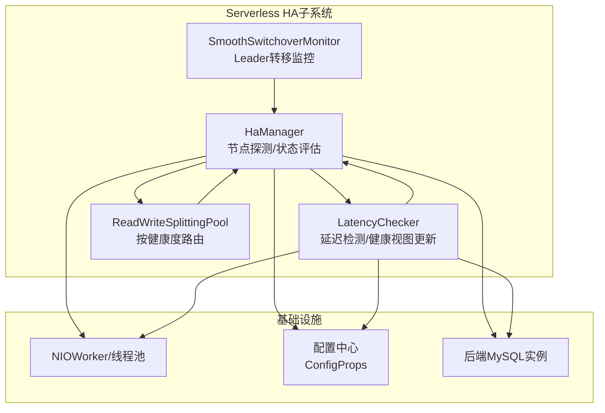
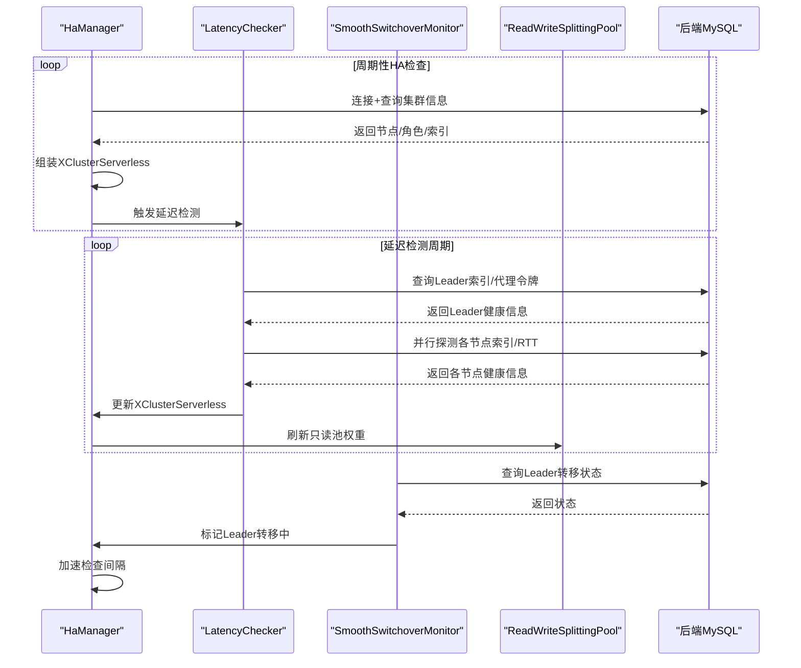
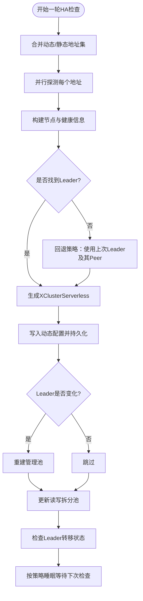
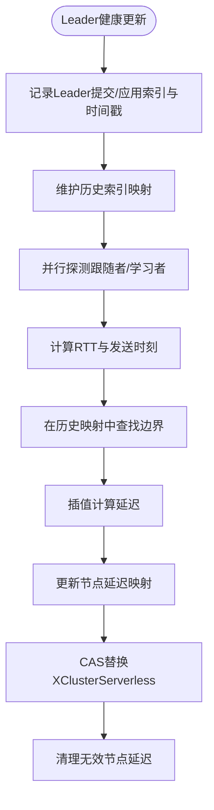
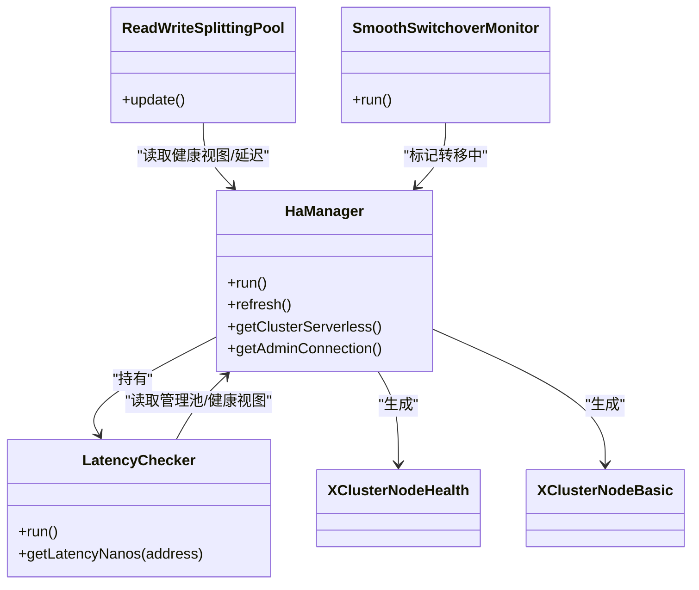

# 故障检测机制

<cite>
**本文引用的文件列表**
- [HaManager.java](file://proxy-core/src/main/java/com/alibaba/polardbx/proxy/serverless/HaManager.java)
- [LatencyChecker.java](file://proxy-core/src/main/java/com/alibaba/polardbx/proxy/serverless/LatencyChecker.java)
- [XClusterNodeHealth.java](file://proxy-common/src/main/java/com/alibaba/polardbx/proxy/common/XClusterNodeHealth.java)
- [XClusterNodeBasic.java](file://proxy-common/src/main/java/com/alibaba/polardbx/proxy/common/XClusterNodeBasic.java)
- [ConfigProps.java](file://proxy-common/src/main/java/com/alibaba/polardbx/proxy/config/ConfigProps.java)
- [ReadWriteSplittingPool.java](file://proxy-core/src/main/java/com/alibaba/polardbx/proxy/serverless/ReadWriteSplittingPool.java)
- [SmoothSwitchoverMonitor.java](file://proxy-core/src/main/java/com/alibaba/polardbx/proxy/serverless/SmoothSwitchoverMonitor.java)
- [HaTest.java](file://proxy-core/src/test/java/com/alibaba/polardbx/proxy/client/HaTest.java)
</cite>

## 目录
1. [简介](#简介)
2. [项目结构与定位](#项目结构与定位)
3. [核心组件](#核心组件)
4. [架构总览](#架构总览)
5. [关键组件详解](#关键组件详解)
6. [依赖关系分析](#依赖关系分析)
7. [性能与并发特性](#性能与并发特性)
8. [故障检测配置参数](#故障检测配置参数)
9. [测试与验证](#测试与验证)
10. [故障场景模拟与演练](#故障场景模拟与演练)
11. [最佳实践与调试技巧](#最佳实践与调试技巧)
12. [结论](#结论)

## 简介
本文件系统性梳理PolarDB-X Proxy在Serverless模式下的故障检测机制，重点覆盖以下方面：
- HaManager的节点探测、连接测试与状态评估流程
- LatencyChecker的延迟检测原理（RTT测量、健康评分、异常节点识别）
- 触发条件、检测频率与超时阈值
- 多线程并发检测的实现（异步任务调度与结果聚合）
- 配置参数详解与调优建议
- 测试方法、性能影响分析与故障场景模拟
- 最佳实践与调试技巧

## 项目结构与定位
- HaManager负责集群节点发现、角色判定、领导者转移监控与后台刷新
- LatencyChecker负责基于Raft提交/应用索引的时间戳差值进行延迟估算，并更新健康视图
- ReadWriteSplittingPool根据健康视图与延迟阈值选择可用后端节点
- SmoothSwitchoverMonitor辅助感知Leader转移状态并驱动快速刷新

图表来源
- [HaManager.java](file://proxy-core/src/main/java/com/alibaba/polardbx/proxy/serverless/HaManager.java#L67-L156)
- [LatencyChecker.java](file://proxy-core/src/main/java/com/alibaba/polardbx/proxy/serverless/LatencyChecker.java#L49-L73)
- [ReadWriteSplittingPool.java](file://proxy-core/src/main/java/com/alibaba/polardbx/proxy/serverless/ReadWriteSplittingPool.java#L123-L319)
- [SmoothSwitchoverMonitor.java](file://proxy-core/src/main/java/com/alibaba/polardbx/proxy/serverless/SmoothSwitchoverMonitor.java#L31-L94)

章节来源
- [HaManager.java](file://proxy-core/src/main/java/com/alibaba/polardbx/proxy/serverless/HaManager.java#L67-L156)
- [LatencyChecker.java](file://proxy-core/src/main/java/com/alibaba/polardbx/proxy/serverless/LatencyChecker.java#L49-L73)
- [ReadWriteSplittingPool.java](file://proxy-core/src/main/java/com/alibaba/polardbx/proxy/serverless/ReadWriteSplittingPool.java#L123-L319)
- [SmoothSwitchoverMonitor.java](file://proxy-core/src/main/java/com/alibaba/polardbx/proxy/serverless/SmoothSwitchoverMonitor.java#L31-L94)

## 核心组件
- HaManager：周期性探测集群节点，建立健康视图，维护领导者与追随者/候选者/学习者集合，必要时切换管理池并触发后续任务
- LatencyChecker：以Leader的提交/应用索引为基准，对跟随者/学习者进行延迟估算，生成健康信息并回写到HaManager
- ReadWriteSplittingPool：依据健康视图与延迟阈值构建只读池权重表，决定路由策略
- SmoothSwitchoverMonitor：轮询Leader转移状态，触发快速HA刷新

章节来源
- [HaManager.java](file://proxy-core/src/main/java/com/alibaba/polardbx/proxy/serverless/HaManager.java#L67-L156)
- [LatencyChecker.java](file://proxy-core/src/main/java/com/alibaba/polardbx/proxy/serverless/LatencyChecker.java#L49-L73)
- [ReadWriteSplittingPool.java](file://proxy-core/src/main/java/com/alibaba/polardbx/proxy/serverless/ReadWriteSplittingPool.java#L123-L319)
- [SmoothSwitchoverMonitor.java](file://proxy-core/src/main/java/com/alibaba/polardbx/proxy/serverless/SmoothSwitchoverMonitor.java#L31-L94)

## 架构总览
下图展示从节点探测到延迟评估再到路由决策的关键交互路径。

图表来源
- [HaManager.java](file://proxy-core/src/main/java/com/alibaba/polardbx/proxy/serverless/HaManager.java#L430-L647)
- [LatencyChecker.java](file://proxy-core/src/main/java/com/alibaba/polardbx/proxy/serverless/LatencyChecker.java#L204-L275)
- [SmoothSwitchoverMonitor.java](file://proxy-core/src/main/java/com/alibaba/polardbx/proxy/serverless/SmoothSwitchoverMonitor.java#L46-L79)
- [ReadWriteSplittingPool.java](file://proxy-core/src/main/java/com/alibaba/polardbx/proxy/serverless/ReadWriteSplittingPool.java#L123-L319)

## 关键组件详解

### HaManager：节点探测、连接测试与状态评估
- 节点探测
  - 从动态配置与静态配置合并得到待探测地址集
  - 使用阻塞连接方式在限定时间内完成连接与登录
  - 通过系统表查询获取集群ID、端口、角色、Leader地址、提交/应用索引等
  - 计算全局端口偏移量，用于推导业务端口
- 连接测试
  - 在超时限制内执行多条查询，确保网络与认证有效
  - 对访问受限或认证异常进行降噪处理，避免频繁错误日志
- 状态评估
  - 生成XClusterNodeBasic与XClusterNodeHealth对象
  - 汇聚所有节点，筛选Leader，补充Peer列表
  - 将最新集群视图写入动态配置并持久化
  - 若Leader变更，重建管理池；若Leader转移中，加速检查间隔
- 并发与刷新
  - 使用CompletableFuture并行探测多个节点
  - 通过wait/notify机制支持外部刷新触发

图表来源
- [HaManager.java](file://proxy-core/src/main/java/com/alibaba/polardbx/proxy/serverless/HaManager.java#L430-L647)

章节来源
- [HaManager.java](file://proxy-core/src/main/java/com/alibaba/polardbx/proxy/serverless/HaManager.java#L164-L401)
- [HaManager.java](file://proxy-core/src/main/java/com/alibaba/polardbx/proxy/serverless/HaManager.java#L430-L647)

### LatencyChecker：延迟检测原理与健康评分
- RTT测量
  - 发送查询前记录发送时间，收到响应后计算RTT
  - 以Leader的提交/应用索引作为时间戳基准，记录历史映射
- 健康评分计算
  - 对跟随者/学习者，基于其提交/应用索引在Leader历史映射中插值得到对应时间戳
  - 当前节点时间戳 = 发送时刻 + RTT/2
  - 延迟 = 当前节点时间戳 − 对应Leader时间戳
- 异常节点识别
  - 若无法找到更高/更低的边界项，将延迟标记为最大值或0
  - 仅当Leader健康信息更新后才批量刷新跟随者/学习者健康信息
- 结果聚合
  - 使用ConcurrentSkipListMap维护有序的历史索引映射
  - 使用ConcurrentHashMap维护节点到延迟的映射
  - 定期清理超出记录数的历史条目

图表来源
- [LatencyChecker.java](file://proxy-core/src/main/java/com/alibaba/polardbx/proxy/serverless/LatencyChecker.java#L79-L202)
- [LatencyChecker.java](file://proxy-core/src/main/java/com/alibaba/polardbx/proxy/serverless/LatencyChecker.java#L204-L275)

章节来源
- [LatencyChecker.java](file://proxy-core/src/main/java/com/alibaba/polardbx/proxy/serverless/LatencyChecker.java#L79-L202)
- [LatencyChecker.java](file://proxy-core/src/main/java/com/alibaba/polardbx/proxy/serverless/LatencyChecker.java#L204-L275)

### ReadWriteSplittingPool：基于延迟的路由决策
- 只读池构建
  - 根据配置决定是否启用读写分离、跟随者读取、Leader加入RO池
  - 依据节点代理令牌与地址构建BackendPool
- 延迟阈值过滤
  - 读取LatencyChecker的延迟映射，超过阈值的节点被剔除
  - 支持显式权重配置，未配置权重的节点按延迟阈值过滤
- 权重表生成
  - 对可用节点生成加权表，排序后打乱以均衡负载
  - 无可用节点时清空权重表

章节来源
- [ReadWriteSplittingPool.java](file://proxy-core/src/main/java/com/alibaba/polardbx/proxy/serverless/ReadWriteSplittingPool.java#L123-L319)

### SmoothSwitchoverMonitor：Leader转移监控
- 定期查询Leader转移状态
- 若检测到转移中，调用HaManager标记Leader转移中，从而缩短HA检查间隔
- 出错时主动通知快速刷新

章节来源
- [SmoothSwitchoverMonitor.java](file://proxy-core/src/main/java/com/alibaba/polardbx/proxy/serverless/SmoothSwitchoverMonitor.java#L46-L79)

## 依赖关系分析
- HaManager依赖
  - NIOWorker/线程池：用于异步探测与后台刷新
  - BackendConnection/BackendPool：用于连接后端与管理池
  - 动态配置：保存/加载集群视图
  - 配置中心：读取HA/延迟检测相关参数
- LatencyChecker依赖
  - HaManager的管理池：用于Leader索引记录
  - 后端连接：用于跟随者/学习者探测
- ReadWriteSplittingPool依赖
  - HaManager的LatencyChecker：获取延迟映射
  - 配置中心：读取延迟阈值与权重配置

图表来源
- [HaManager.java](file://proxy-core/src/main/java/com/alibaba/polardbx/proxy/serverless/HaManager.java#L67-L156)
- [LatencyChecker.java](file://proxy-core/src/main/java/com/alibaba/polardbx/proxy/serverless/LatencyChecker.java#L49-L73)
- [ReadWriteSplittingPool.java](file://proxy-core/src/main/java/com/alibaba/polardbx/proxy/serverless/ReadWriteSplittingPool.java#L123-L319)
- [SmoothSwitchoverMonitor.java](file://proxy-core/src/main/java/com/alibaba/polardbx/proxy/serverless/SmoothSwitchoverMonitor.java#L31-L94)
- [XClusterNodeHealth.java](file://proxy-common/src/main/java/com/alibaba/polardbx/proxy/common/XClusterNodeHealth.java#L24-L42)
- [XClusterNodeBasic.java](file://proxy-common/src/main/java/com/alibaba/polardbx/proxy/common/XClusterNodeBasic.java#L28-L62)

## 性能与并发特性
- 并发探测
  - 使用CompletableFuture并行探测多个节点，显著降低整体HA检查耗时
  - 探测超时受配置控制，避免长时间阻塞
- 延迟检测
  - Leader索引记录后批量更新跟随者/学习者，减少重复查询
  - 历史映射采用有序结构，插值计算复杂度低
- 路由优化
  - 通过延迟阈值过滤不可用节点，提升只读请求成功率
  - 权重表随机化，避免热点集中
- 睡眠策略
  - 根据Leader转移状态、未知Leader存在与否、无Leader存在与否调整睡眠间隔，兼顾实时性与资源占用

章节来源
- [HaManager.java](file://proxy-core/src/main/java/com/alibaba/polardbx/proxy/serverless/HaManager.java#L441-L453)
- [LatencyChecker.java](file://proxy-core/src/main/java/com/alibaba/polardbx/proxy/serverless/LatencyChecker.java#L214-L238)
- [ReadWriteSplittingPool.java](file://proxy-core/src/main/java/com/alibaba/polardbx/proxy/serverless/ReadWriteSplittingPool.java#L123-L319)

## 故障检测配置参数
以下参数来自配置中心，默认值与用途如下：

- HA相关
  - backend_ha_worker_threads：HA探测线程数，默认8
  - backend_ha_check_interval：HA检查间隔（毫秒），默认5000
  - backend_ha_check_timeout：HA单节点探测超时（毫秒），默认3000
- 延迟检测相关
  - latency_check_timeout：延迟检测单节点探测超时（毫秒），默认3000
  - latency_check_interval：延迟检测周期（毫秒），默认1000
  - latency_record_count：历史索引记录数量上限，默认100
  - slave_read_latency_threshold：只读延迟阈值（毫秒），默认3000
- 其他
  - enable_read_write_splitting：启用读写分离，默认true
  - enable_follower_read：允许跟随者读取，默认true
  - enable_leader_in_ro_pools：允许Leader加入只读池，默认true
  - read_weights：节点权重配置，格式为“ip:port@权重,...”
  - smooth_switchover_enabled：启用平滑切换，默认true
  - smooth_switchover_check_interval：平滑切换监控间隔（毫秒），默认100
  - smooth_switchover_wait_timeout：平滑切换等待超时（毫秒），默认10000

章节来源
- [ConfigProps.java](file://proxy-common/src/main/java/com/alibaba/polardbx/proxy/config/ConfigProps.java#L150-L209)

## 测试与验证
- 单元测试
  - 提供手动测试类，初始化HaManager后通过管理连接执行简单查询，验证HA功能可用
- 手动验证步骤
  - 启动Proxy与后端MySQL
  - 初始化HaManager
  - 获取管理连接并执行查询，观察日志输出
- 日志与可观测性
  - HA检查与延迟检测均输出DEBUG级别日志，便于问题定位

章节来源
- [HaTest.java](file://proxy-core/src/test/java/com/alibaba/polardbx/proxy/client/HaTest.java#L36-L66)

## 故障场景模拟与演练
- 场景一：后端节点不可达
  - 现象：节点探测失败，延迟映射为最大值或缺失
  - 处理：只读池将该节点剔除，路由自动避开
- 场景二：Leader转移中
  - 现象：监控检测到转移状态，HaManager加速检查间隔
  - 处理：更快收敛新的Leader视图，减少业务抖动
- 场景三：网络抖动导致延迟升高
  - 现象：延迟映射上升，超过阈值的节点被剔除
  - 处理：路由自动切换到更健康的节点

章节来源
- [SmoothSwitchoverMonitor.java](file://proxy-core/src/main/java/com/alibaba/polardbx/proxy/serverless/SmoothSwitchoverMonitor.java#L46-L79)
- [HaManager.java](file://proxy-core/src/main/java/com/alibaba/polardbx/proxy/serverless/HaManager.java#L604-L646)
- [LatencyChecker.java](file://proxy-core/src/main/java/com/alibaba/polardbx/proxy/serverless/LatencyChecker.java#L174-L192)

## 最佳实践与调试技巧
- 参数调优
  - HA检查间隔与超时需结合后端规模与网络状况平衡
  - 延迟记录数量与只读延迟阈值应与业务SLA匹配
- 观测与告警
  - 开启DEBUG日志，关注“Latency history/Map”与“serverless”输出
  - 监控Leader转移状态，及时发现切换窗口
- 稳定性保障
  - 合理设置只读池权重，避免过度集中在少数节点
  - 在高抖动环境下适当提高延迟阈值，减少误剔除
- 故障排查
  - 若只读池为空，检查延迟阈值与节点可达性
  - 若Leader转移频繁，检查后端一致性状态与网络稳定性

[本节为通用指导，不直接分析具体文件]

## 结论
PolarDB-X Proxy的Serverless故障检测机制通过HaManager与LatencyChecker协同工作，实现了对X-Cluster节点的高效探测、健康评估与延迟估算，并通过ReadWriteSplittingPool实现智能路由。配合SmoothSwitchoverMonitor的Leader转移监控，系统能够在保证高可用的同时，尽量减少业务抖动与延迟。合理配置参数与持续观测日志，是确保机制稳定运行的关键。