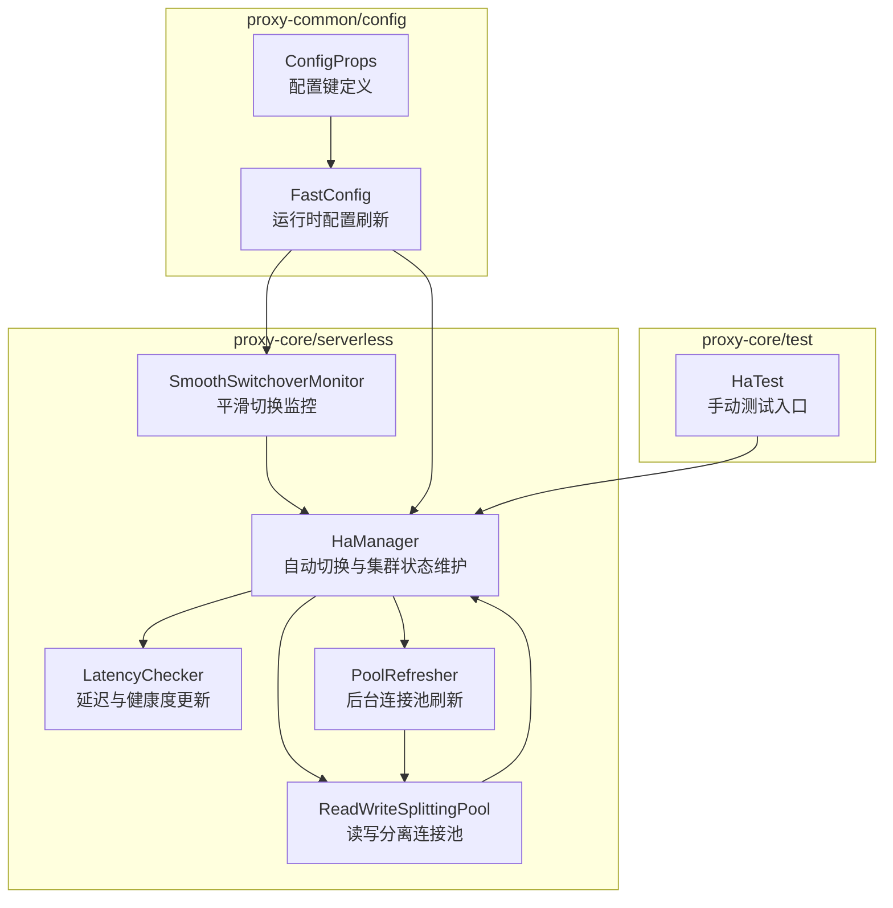
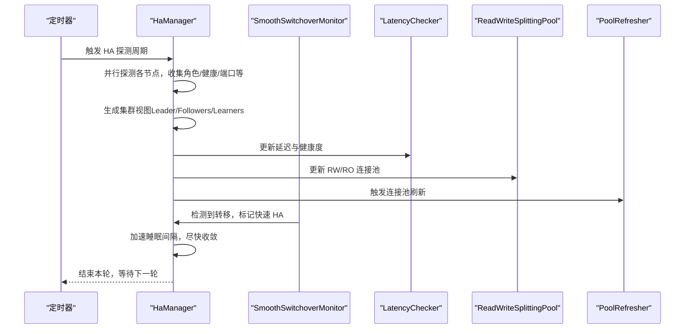
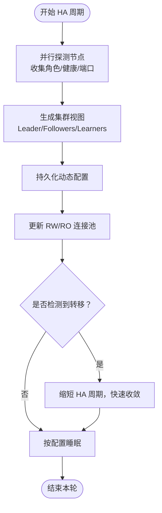
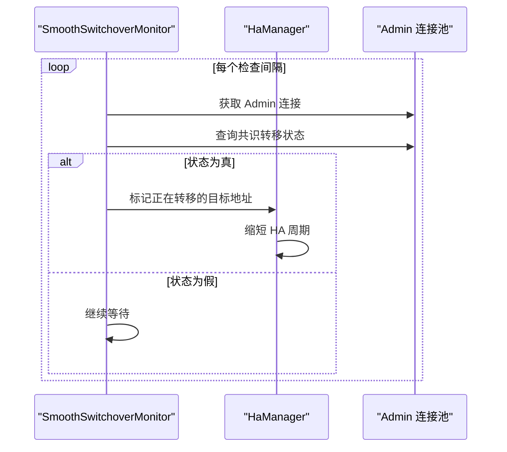
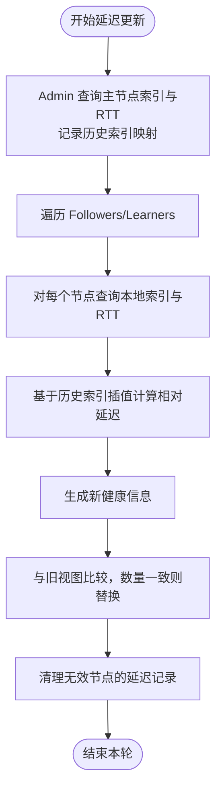
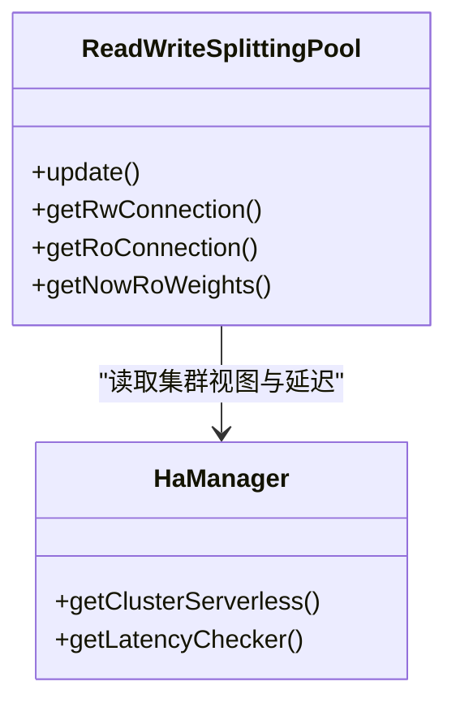
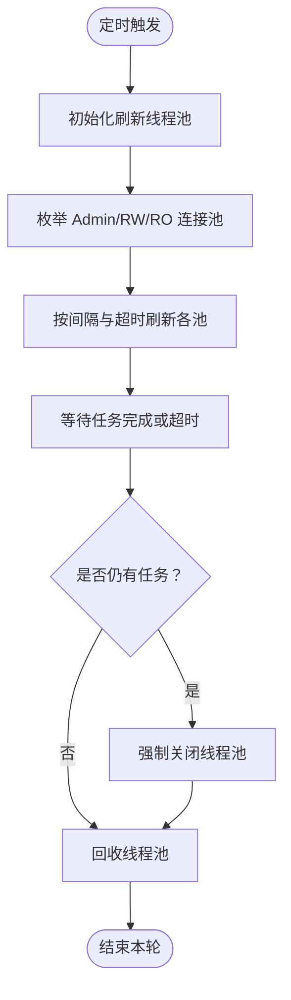
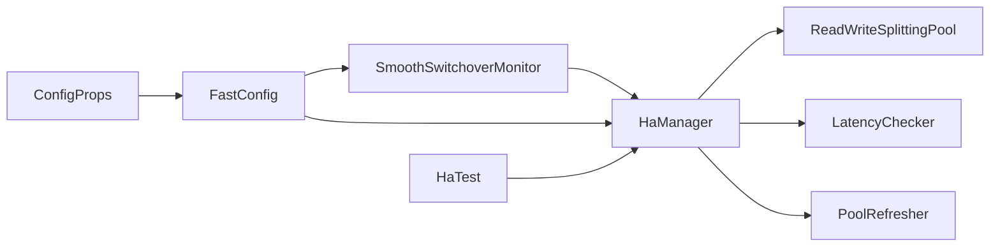

# 自动切换流程

<cite>
**本文引用的文件**
- [HaManager.java](file://proxy-core/src/main/java/com/alibaba/polardbx/proxy/serverless/HaManager.java)
- [SmoothSwitchoverMonitor.java](file://proxy-core/src/main/java/com/alibaba/polardbx/proxy/serverless/SmoothSwitchoverMonitor.java)
- [LatencyChecker.java](file://proxy-core/src/main/java/com/alibaba/polardbx/proxy/serverless/LatencyChecker.java)
- [ReadWriteSplittingPool.java](file://proxy-core/src/main/java/com/alibaba/polardbx/proxy/serverless/ReadWriteSplittingPool.java)
- [PoolRefresher.java](file://proxy-core/src/main/java/com/alibaba/polardbx/proxy/serverless/PoolRefresher.java)
- [ConfigProps.java](file://proxy-common/src/main/java/com/alibaba/polardbx/proxy/config/ConfigProps.java)
- [FastConfig.java](file://proxy-common/src/main/java/com/alibaba/polardbx/proxy/config/FastConfig.java)
- [HaTest.java](file://proxy-core/src/test/java/com/alibaba/polardbx/proxy/client/HaTest.java)
</cite>

## 目录
1. [简介](#简介)
2. [项目结构](#项目结构)
3. [核心组件](#核心组件)
4. [架构总览](#架构总览)
5. [详细组件分析](#详细组件分析)
6. [依赖关系分析](#依赖关系分析)
7. [性能考量](#性能考量)
8. [故障排查指南](#故障排查指南)
9. [结论](#结论)
10. [附录：切换配置参数与测试场景](#附录切换配置参数与测试场景)

## 简介
本文件系统化梳理 PolarDB-X Proxy 在无服务器模式下的自动切换（Failover/Leader Transfer）流程，重点覆盖：
- HaManager 的自动切换算法：候选节点识别、切换时机判断、切换过程管理
- SmoothSwitchoverMonitor 的平滑切换机制：监控、状态同步、切换完成确认
- 切换前准备：连接迁移、事务处理、数据一致性保障
- 切换过程关键步骤：主节点变更、连接池更新、状态广播
- 配置参数详解：切换等待时间、超时阈值、重试策略等
- 测试场景、性能影响评估与故障恢复验证
- 最佳实践与故障排查

## 项目结构
围绕自动切换的关键代码位于 proxy-core 模块的 serverless 包中，并通过 proxy-common 提供配置能力；测试用例位于 proxy-core 测试模块。

图表来源
- [HaManager.java](file://proxy-core/src/main/java/com/alibaba/polardbx/proxy/serverless/HaManager.java#L67-L744)
- [SmoothSwitchoverMonitor.java](file://proxy-core/src/main/java/com/alibaba/polardbx/proxy/serverless/SmoothSwitchoverMonitor.java#L31-L94)
- [LatencyChecker.java](file://proxy-core/src/main/java/com/alibaba/polardbx/proxy/serverless/LatencyChecker.java#L49-L277)
- [ReadWriteSplittingPool.java](file://proxy-core/src/main/java/com/alibaba/polardbx/proxy/serverless/ReadWriteSplittingPool.java#L48-L407)
- [PoolRefresher.java](file://proxy-core/src/main/java/com/alibaba/polardbx/proxy/serverless/PoolRefresher.java#L35-L147)
- [ConfigProps.java](file://proxy-common/src/main/java/com/alibaba/polardbx/proxy/config/ConfigProps.java#L23-L200)
- [FastConfig.java](file://proxy-common/src/main/java/com/alibaba/polardbx/proxy/config/FastConfig.java#L21-L75)
- [HaTest.java](file://proxy-core/src/test/java/com/alibaba/polardbx/proxy/client/HaTest.java#L36-L67)

章节来源
- [HaManager.java](file://proxy-core/src/main/java/com/alibaba/polardbx/proxy/serverless/HaManager.java#L67-L744)
- [SmoothSwitchoverMonitor.java](file://proxy-core/src/main/java/com/alibaba/polardbx/proxy/serverless/SmoothSwitchoverMonitor.java#L31-L94)
- [LatencyChecker.java](file://proxy-core/src/main/java/com/alibaba/polardbx/proxy/serverless/LatencyChecker.java#L49-L277)
- [ReadWriteSplittingPool.java](file://proxy-core/src/main/java/com/alibaba/polardbx/proxy/serverless/ReadWriteSplittingPool.java#L48-L407)
- [PoolRefresher.java](file://proxy-core/src/main/java/com/alibaba/polardbx/proxy/serverless/PoolRefresher.java#L35-L147)
- [ConfigProps.java](file://proxy-common/src/main/java/com/alibaba/polardbx/proxy/config/ConfigProps.java#L23-L200)
- [FastConfig.java](file://proxy-common/src/main/java/com/alibaba/polardbx/proxy/config/FastConfig.java#L21-L75)
- [HaTest.java](file://proxy-core/src/test/java/com/alibaba/polardbx/proxy/client/HaTest.java#L36-L67)

## 核心组件
- HaManager：负责探测 X-Cluster 节点、解析角色与健康信息、生成集群视图、维护管理员连接池、触发读写分离连接池更新、处理“正在转移”状态并通知后续任务。
- SmoothSwitchoverMonitor：周期性查询后端节点的“共识是否在转移”状态，一旦检测到转移，立即标记 HaManager 进入快速 HA 周期，加速收敛。
- LatencyChecker：基于主节点提交/应用索引与 RTT 计算从节点相对延迟，用于 RO 池权重选择与可用性过滤。
- ReadWriteSplittingPool：根据集群健康视图动态维护 RW/RO 连接池，按权重与延迟选择后端节点，支持领导者加入 RO 池。
- PoolRefresher：定时刷新所有连接池，确保连接有效性与配置一致性。
- ConfigProps/FastConfig：集中定义与加载运行时配置，包括 HA、延迟检查、平滑切换等参数。

章节来源
- [HaManager.java](file://proxy-core/src/main/java/com/alibaba/polardbx/proxy/serverless/HaManager.java#L67-L744)
- [SmoothSwitchoverMonitor.java](file://proxy-core/src/main/java/com/alibaba/polardbx/proxy/serverless/SmoothSwitchoverMonitor.java#L31-L94)
- [LatencyChecker.java](file://proxy-core/src/main/java/com/alibaba/polardbx/proxy/serverless/LatencyChecker.java#L49-L277)
- [ReadWriteSplittingPool.java](file://proxy-core/src/main/java/com/alibaba/polardbx/proxy/serverless/ReadWriteSplittingPool.java#L48-L407)
- [PoolRefresher.java](file://proxy-core/src/main/java/com/alibaba/polardbx/proxy/serverless/PoolRefresher.java#L35-L147)
- [ConfigProps.java](file://proxy-common/src/main/java/com/alibaba/polardbx/proxy/config/ConfigProps.java#L23-L200)
- [FastConfig.java](file://proxy-common/src/main/java/com/alibaba/polardbx/proxy/config/FastConfig.java#L21-L75)

## 架构总览
自动切换由“探测—健康—决策—执行—广播”闭环构成：HaManager 定期探测节点并生成集群视图；LatencyChecker 维护延迟与健康；SmoothSwitchoverMonitor 提前感知转移；RW/RO 连接池根据新视图动态调整；PoolRefresher 保障连接池健康。

图表来源
- [HaManager.java](file://proxy-core/src/main/java/com/alibaba/polardbx/proxy/serverless/HaManager.java#L430-L647)
- [SmoothSwitchoverMonitor.java](file://proxy-core/src/main/java/com/alibaba/polardbx/proxy/serverless/SmoothSwitchoverMonitor.java#L45-L79)
- [LatencyChecker.java](file://proxy-core/src/main/java/com/alibaba/polardbx/proxy/serverless/LatencyChecker.java#L204-L275)
- [ReadWriteSplittingPool.java](file://proxy-core/src/main/java/com/alibaba/polardbx/proxy/serverless/ReadWriteSplittingPool.java#L326-L341)
- [PoolRefresher.java](file://proxy-core/src/main/java/com/alibaba/polardbx/proxy/serverless/PoolRefresher.java#L41-L145)

## 详细组件分析

### HaManager：自动切换算法与过程管理
- 节点探测与集群视图生成
  - 并行探测多个地址，收集基础信息、代理令牌、本地角色与领导地址、全局节点列表等。
  - 解析端口差值以推导业务端口，合并“已知领导者”与“未知领导者”的节点集合。
  - 生成稳定的节点列表与健康视图（Leader/Followers/Learners），并持久化到动态配置。
- 主节点变更与管理员连接池更新
  - 当 Leader 变更或版本变化时，重建管理员连接池，确保后续查询使用最新 Leader。
- “正在转移”状态与快速 HA
  - 通过 LeaderTransferInfo 记录目标 Leader 与超时时间；若检测到转移或超时则清理；在转移期间缩短 HA 周期，加速收敛。
  - 转移完成后，顺序执行 leaderTransferredTask 中的任务队列。
- 读写分离池更新
  - 在每次 HA 循环末尾调用 RW/RO 池更新，确保路由与连接池与当前健康视图一致。

图表来源
- [HaManager.java](file://proxy-core/src/main/java/com/alibaba/polardbx/proxy/serverless/HaManager.java#L430-L647)

章节来源
- [HaManager.java](file://proxy-core/src/main/java/com/alibaba/polardbx/proxy/serverless/HaManager.java#L158-L401)
- [HaManager.java](file://proxy-core/src/main/java/com/alibaba/polardbx/proxy/serverless/HaManager.java#L430-L647)

### SmoothSwitchoverMonitor：平滑切换监控与状态同步
- 监控机制
  - 周期性查询后端节点的“共识是否在转移”状态，若为真，则调用 HaManager.markLeaderTransferring 将当前 Admin 连接的后端地址标记为“正在转移”的目标。
- 快速 HA 周期
  - HaManager 在 HA 主循环中检测到“正在转移”标志后，缩短睡眠间隔，从而更快地重新探测并收敛到新的 Leader。
- 异常处理
  - 查询异常时主动调用 HaManager.refresh，触发一次快速 HA，避免因监控线程异常导致的停滞。

图表来源
- [SmoothSwitchoverMonitor.java](file://proxy-core/src/main/java/com/alibaba/polardbx/proxy/serverless/SmoothSwitchoverMonitor.java#L45-L79)
- [HaManager.java](file://proxy-core/src/main/java/com/alibaba/polardbx/proxy/serverless/HaManager.java#L604-L620)

章节来源
- [SmoothSwitchoverMonitor.java](file://proxy-core/src/main/java/com/alibaba/polardbx/proxy/serverless/SmoothSwitchoverMonitor.java#L31-L94)
- [HaManager.java](file://proxy-core/src/main/java/com/alibaba/polardbx/proxy/serverless/HaManager.java#L659-L680)

### LatencyChecker：延迟计算与健康度更新
- 主节点索引记录
  - 使用 Admin 连接查询主节点的提交/应用索引与 RTT，构建历史索引映射，用于后续从节点延迟估算。
- 从/学徒节点延迟计算
  - 对每个从/学徒节点执行相同查询，基于主节点历史索引进行插值，得到该节点的相对延迟。
- 健康视图更新
  - 将新健康信息与旧视图比较，仅在节点数量不变的前提下替换，保证一致性。
- 延迟剔除
  - 清理不在当前有效节点集合内的延迟记录，避免陈旧数据影响。

图表来源
- [LatencyChecker.java](file://proxy-core/src/main/java/com/alibaba/polardbx/proxy/serverless/LatencyChecker.java#L79-L135)
- [LatencyChecker.java](file://proxy-core/src/main/java/com/alibaba/polardbx/proxy/serverless/LatencyChecker.java#L137-L202)
- [LatencyChecker.java](file://proxy-core/src/main/java/com/alibaba/polardbx/proxy/serverless/LatencyChecker.java#L204-L275)

章节来源
- [LatencyChecker.java](file://proxy-core/src/main/java/com/alibaba/polardbx/proxy/serverless/LatencyChecker.java#L49-L277)

### ReadWriteSplittingPool：读写分离与连接池管理
- RW 池更新
  - 若 Leader 地址或代理令牌变化，则重建 RW 连接池，确保只向当前 Leader 发送写请求。
- RO 池更新
  - 根据配置决定是否允许从节点/学徒节点读取，以及是否允许领导者加入 RO 池。
  - 支持显式权重配置；若未配置，则基于延迟阈值过滤不可用节点，再按权重随机打散。
  - 释放不再有效的 RO 连接池，避免资源浪费。
- 连接选择
  - RO 连接按权重与负载（活跃连接数）选择最优节点；若无可用 RO，则返回空。

图表来源
- [ReadWriteSplittingPool.java](file://proxy-core/src/main/java/com/alibaba/polardbx/proxy/serverless/ReadWriteSplittingPool.java#L99-L121)
- [ReadWriteSplittingPool.java](file://proxy-core/src/main/java/com/alibaba/polardbx/proxy/serverless/ReadWriteSplittingPool.java#L123-L341)
- [ReadWriteSplittingPool.java](file://proxy-core/src/main/java/com/alibaba/polardbx/proxy/serverless/ReadWriteSplittingPool.java#L343-L406)
- [HaManager.java](file://proxy-core/src/main/java/com/alibaba/polardbx/proxy/serverless/HaManager.java#L115-L122)

章节来源
- [ReadWriteSplittingPool.java](file://proxy-core/src/main/java/com/alibaba/polardbx/proxy/serverless/ReadWriteSplittingPool.java#L48-L407)

### PoolRefresher：后台连接池刷新
- 定时刷新
  - 周期性扫描 Admin/RW/RO 连接池，按配置执行刷新，确保连接有效性与配置一致性。
- 线程池控制
  - 动态创建刷新线程池，等待所有任务完成或超时后回收，避免长时间占用资源。
- 错误处理
  - 出错时强制关闭刷新线程池，防止资源泄漏。

图表来源
- [PoolRefresher.java](file://proxy-core/src/main/java/com/alibaba/polardbx/proxy/serverless/PoolRefresher.java#L41-L145)

章节来源
- [PoolRefresher.java](file://proxy-core/src/main/java/com/alibaba/polardbx/proxy/serverless/PoolRefresher.java#L35-L147)

## 依赖关系分析
- 组件耦合
  - HaManager 是中心协调者，依赖 RW/RO 池、延迟检查器、连接池刷新器；SmoothSwitchoverMonitor 通过 HaManager 的公共接口与其交互。
- 外部依赖
  - 配置来自 ConfigProps 与 FastConfig；测试通过 HaTest 展示如何初始化与使用 HaManager。

图表来源
- [SmoothSwitchoverMonitor.java](file://proxy-core/src/main/java/com/alibaba/polardbx/proxy/serverless/SmoothSwitchoverMonitor.java#L31-L94)
- [HaManager.java](file://proxy-core/src/main/java/com/alibaba/polardbx/proxy/serverless/HaManager.java#L67-L156)
- [ReadWriteSplittingPool.java](file://proxy-core/src/main/java/com/alibaba/polardbx/proxy/serverless/ReadWriteSplittingPool.java#L48-L97)
- [LatencyChecker.java](file://proxy-core/src/main/java/com/alibaba/polardbx/proxy/serverless/LatencyChecker.java#L49-L73)
- [PoolRefresher.java](file://proxy-core/src/main/java/com/alibaba/polardbx/proxy/serverless/PoolRefresher.java#L35-L61)
- [FastConfig.java](file://proxy-common/src/main/java/com/alibaba/polardbx/proxy/config/FastConfig.java#L21-L75)
- [ConfigProps.java](file://proxy-common/src/main/java/com/alibaba/polardbx/proxy/config/ConfigProps.java#L23-L200)
- [HaTest.java](file://proxy-core/src/test/java/com/alibaba/polardbx/proxy/client/HaTest.java#L36-L67)

章节来源
- [SmoothSwitchoverMonitor.java](file://proxy-core/src/main/java/com/alibaba/polardbx/proxy/serverless/SmoothSwitchoverMonitor.java#L31-L94)
- [HaManager.java](file://proxy-core/src/main/java/com/alibaba/polardbx/proxy/serverless/HaManager.java#L67-L156)
- [ReadWriteSplittingPool.java](file://proxy-core/src/main/java/com/alibaba/polardbx/proxy/serverless/ReadWriteSplittingPool.java#L48-L97)
- [LatencyChecker.java](file://proxy-core/src/main/java/com/alibaba/polardbx/proxy/serverless/LatencyChecker.java#L49-L73)
- [PoolRefresher.java](file://proxy-core/src/main/java/com/alibaba/polardbx/proxy/serverless/PoolRefresher.java#L35-L61)
- [FastConfig.java](file://proxy-common/src/main/java/com/alibaba/polardbx/proxy/config/FastConfig.java#L21-L75)
- [ConfigProps.java](file://proxy-common/src/main/java/com/alibaba/polardbx/proxy/config/ConfigProps.java#L23-L200)
- [HaTest.java](file://proxy-core/src/test/java/com/alibaba/polardbx/proxy/client/HaTest.java#L36-L67)

## 性能考量
- 探测并发与吞吐
  - HaManager 使用并行任务探测节点，结合线程池大小与超时控制，避免单点阻塞。
- 延迟与路由
  - LatencyChecker 通过历史索引插值估算延迟，RW/RO 池据此筛选与加权，降低跨域/高延迟节点的流量。
- 连接池刷新
  - PoolRefresher 采用固定间隔与超时控制，避免长时间占用刷新线程池；错误时强制回收，减少资源泄漏风险。
- 平滑切换监控
  - SmoothSwitchoverMonitor 以短周期轮询，配合 HaManager 的快速 HA，显著缩短切换收敛时间。

章节来源
- [HaManager.java](file://proxy-core/src/main/java/com/alibaba/polardbx/proxy/serverless/HaManager.java#L441-L453)
- [LatencyChecker.java](file://proxy-core/src/main/java/com/alibaba/polardbx/proxy/serverless/LatencyChecker.java#L204-L275)
- [PoolRefresher.java](file://proxy-core/src/main/java/com/alibaba/polardbx/proxy/serverless/PoolRefresher.java#L41-L145)
- [SmoothSwitchoverMonitor.java](file://proxy-core/src/main/java/com/alibaba/polardbx/proxy/serverless/SmoothSwitchoverMonitor.java#L49-L79)

## 故障排查指南
- 常见问题定位
  - 节点无法连接：检查后端地址、用户名密码、连接超时；关注日志中“连接被拒绝”等提示。
  - 代理令牌不匹配：RW/RO 池重建时会校验代理令牌，若不一致需确认后端版本与配置。
  - 无可用 RO：检查延迟阈值与权重配置，确认延迟记录是否过期。
  - 切换未生效：确认 SmoothSwitchoverMonitor 是否启用与轮询间隔设置合理；查看 HaManager 的快速 HA 行为。
- 关键日志与位置
  - HaManager 探测与错误日志：[HaManager.java](file://proxy-core/src/main/java/com/alibaba/polardbx/proxy/serverless/HaManager.java#L384-L401)
  - SmoothSwitchoverMonitor 异常与刷新：[SmoothSwitchoverMonitor.java](file://proxy-core/src/main/java/com/alibaba/polardbx/proxy/serverless/SmoothSwitchoverMonitor.java#L64-L72)
  - LatencyChecker 延迟更新失败：[LatencyChecker.java](file://proxy-core/src/main/java/com/alibaba/polardbx/proxy/serverless/LatencyChecker.java#L198-L201)
  - PoolRefresher 刷新异常与强制回收：[PoolRefresher.java](file://proxy-core/src/main/java/com/alibaba/polardbx/proxy/serverless/PoolRefresher.java#L92-L139)

章节来源
- [HaManager.java](file://proxy-core/src/main/java/com/alibaba/polardbx/proxy/serverless/HaManager.java#L384-L401)
- [SmoothSwitchoverMonitor.java](file://proxy-core/src/main/java/com/alibaba/polardbx/proxy/serverless/SmoothSwitchoverMonitor.java#L64-L72)
- [LatencyChecker.java](file://proxy-core/src/main/java/com/alibaba/polardbx/proxy/serverless/LatencyChecker.java#L198-L201)
- [PoolRefresher.java](file://proxy-core/src/main/java/com/alibaba/polardbx/proxy/serverless/PoolRefresher.java#L92-L139)

## 结论
PolarDB-X Proxy 的自动切换流程通过 HaManager 的多源探测与健康视图、SmoothSwitchoverMonitor 的提前感知、LatencyChecker 的延迟估计与 RW/RO 连接池的动态调整，形成高效、低侵入的平滑切换闭环。配合 PoolRefresher 的后台刷新与 FastConfig 的参数化控制，可在保证数据一致性的前提下，最小化业务中断时间。

## 附录：切换配置参数与测试场景

### 切换配置参数详解
- HA 探测与超时
  - 后端 HA 工作线程数：backend_ha_worker_threads
  - HA 探测间隔：backend_ha_check_interval
  - HA 探测超时：backend_ha_check_timeout
- 连接池大小
  - 管理员池最大连接数：backend_admin_max_pooled_size
  - 写池最大连接数：backend_rw_max_pooled_size
  - 读池最大连接数：backend_ro_max_pooled_size
- 读写分离与延迟
  - 启用读写分离：enable_read_write_splitting
  - 允许从节点读取：enable_follower_read
  - 允许领导者加入 RO 池：enable_leader_in_ro_pools
  - 读权重配置：read_weights
  - 延迟检查超时：latency_check_timeout
  - 延迟检查间隔：latency_check_interval
  - 延迟记录条数：latency_record_count
  - 从节点延迟阈值：slave_read_latency_threshold
- 连接池刷新
  - 刷新线程数：backend_pool_refresh_threads
  - 刷新任务间隔：backend_pool_refresh_task_interval
  - 刷新间隔：backend_pool_refresh_interval
  - 刷新 SQL：backend_pool_refresh_sql
  - 刷新超时：backend_pool_refresh_timeout
- 平滑切换
  - 启用平滑切换：smooth_switchover_enabled
  - 平滑切换检查间隔：smooth_switchover_check_interval
  - 平滑切换等待超时：smooth_switchover_wait_timeout

章节来源
- [ConfigProps.java](file://proxy-common/src/main/java/com/alibaba/polardbx/proxy/config/ConfigProps.java#L50-L83)
- [ConfigProps.java](file://proxy-common/src/main/java/com/alibaba/polardbx/proxy/config/ConfigProps.java#L150-L178)
- [ConfigProps.java](file://proxy-common/src/main/java/com/alibaba/polardbx/proxy/config/ConfigProps.java#L198-L200)
- [FastConfig.java](file://proxy-common/src/main/java/com/alibaba/polardbx/proxy/config/FastConfig.java#L45-L73)

### 切换测试场景与验证
- 基础连通性测试
  - 使用 HaTest 初始化 HaManager 并通过 Admin 连接执行简单查询，验证初始化与连接池可用性。
- 手动切换验证
  - 在具备共识转移能力的后端环境中，启动 SmoothSwitchoverMonitor，观察 HaManager 的快速 HA 行为与连接池切换。
- 性能影响评估
  - 调整 HA 探测间隔与延迟检查间隔，对比切换收敛时间与系统资源占用。
- 故障恢复验证
  - 模拟节点不可达、代理令牌失效、延迟记录缺失等场景，验证 HaManager 的容错与恢复行为。

章节来源
- [HaTest.java](file://proxy-core/src/test/java/com/alibaba/polardbx/proxy/client/HaTest.java#L36-L67)
- [SmoothSwitchoverMonitor.java](file://proxy-core/src/main/java/com/alibaba/polardbx/proxy/serverless/SmoothSwitchoverMonitor.java#L84-L93)
- [HaManager.java](file://proxy-core/src/main/java/com/alibaba/polardbx/proxy/serverless/HaManager.java#L709-L735)

### 自动切换最佳实践
- 合理设置 HA 探测间隔与超时，避免频繁探测或探测超时导致误判。
- 使用延迟阈值与权重配置优化 RO 路由，提升读取性能与稳定性。
- 开启平滑切换监控并设置合理的检查间隔与等待超时，缩短切换收敛时间。
- 定期执行连接池刷新，确保连接有效性与配置一致性。
- 在生产环境启用日志与告警，及时发现并处理异常。