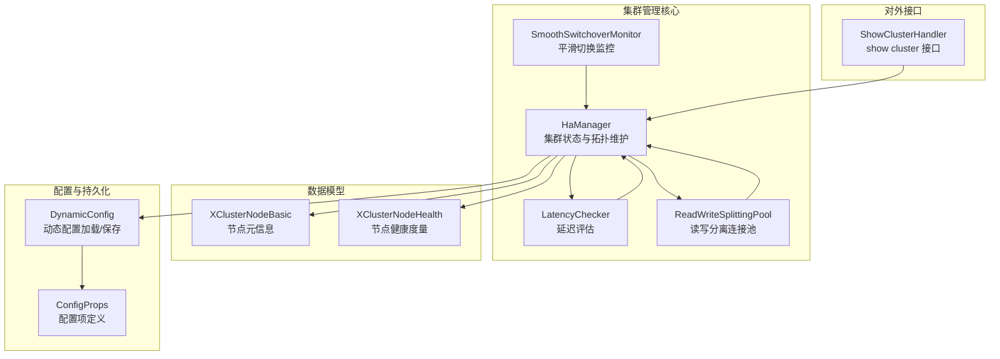
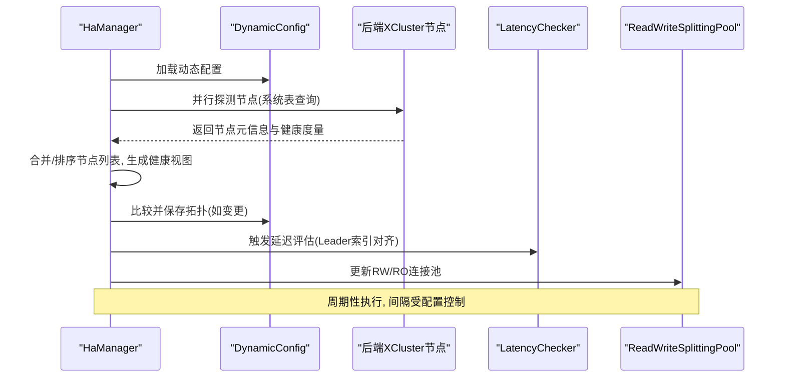
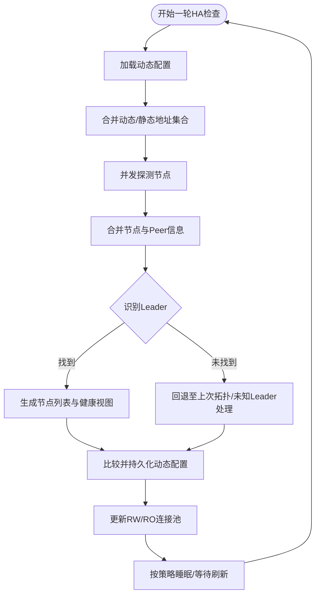
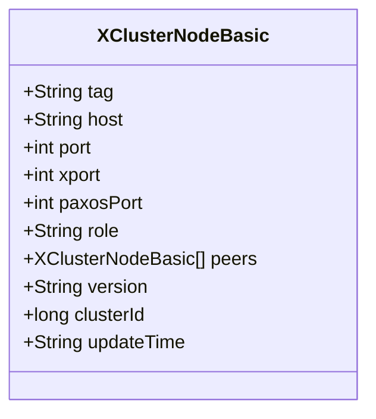
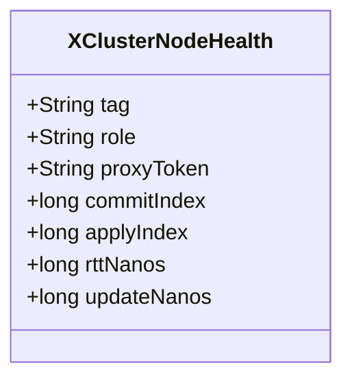
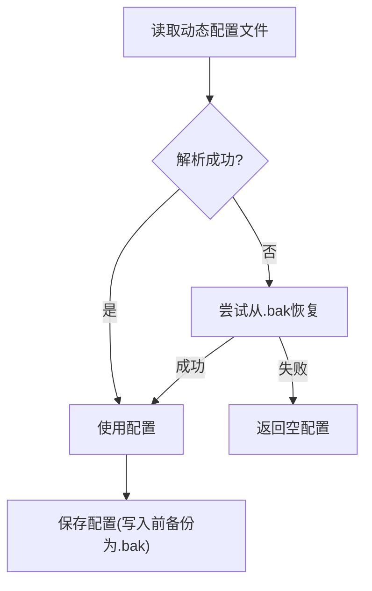
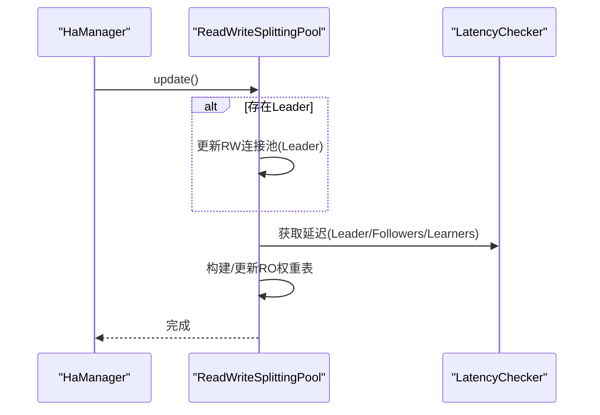
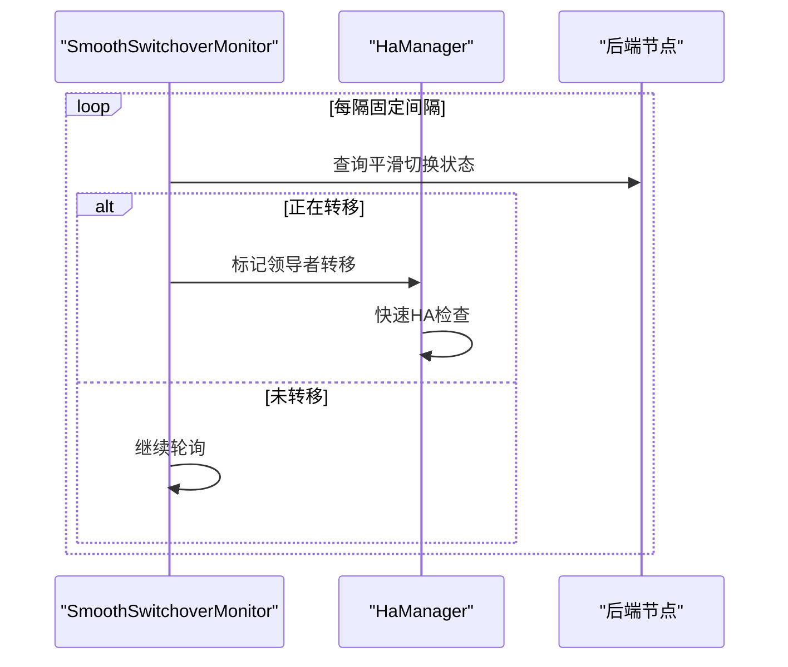
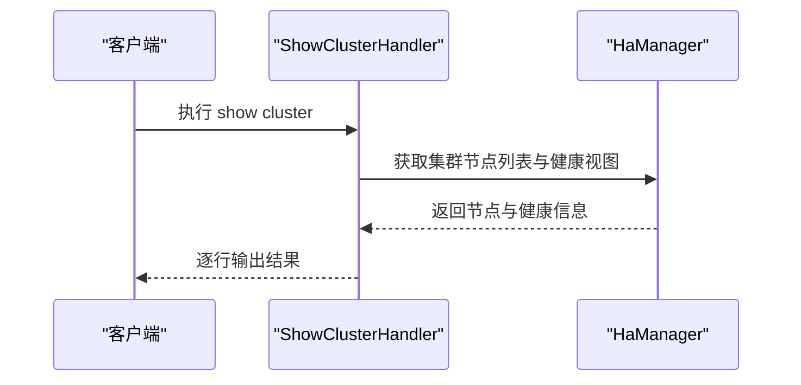
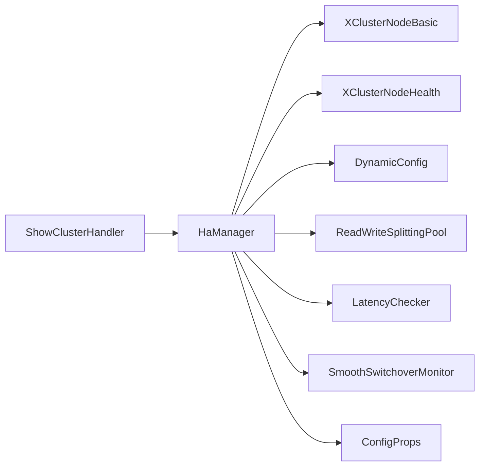

# 集群管理

<cite>
**本文引用的文件列表**
- [HaManager.java](file://proxy-core/src/main/java/com/alibaba/polardbx/proxy/serverless/HaManager.java)
- [XClusterNodeBasic.java](file://proxy-common/src/main/java/com/alibaba/polardbx/proxy/common/XClusterNodeBasic.java)
- [XClusterNodeHealth.java](file://proxy-common/src/main/java/com/alibaba/polardbx/proxy/common/XClusterNodeHealth.java)
- [DynamicConfig.java](file://proxy-common/src/main/java/com/alibaba/polardbx/proxy/dynamic/DynamicConfig.java)
- [ConfigProps.java](file://proxy-common/src/main/java/com/alibaba/polardbx/proxy/config/ConfigProps.java)
- [LatencyChecker.java](file://proxy-core/src/main/java/com/alibaba/polardbx/proxy/serverless/LatencyChecker.java)
- [ReadWriteSplittingPool.java](file://proxy-core/src/main/java/com/alibaba/polardbx/proxy/serverless/ReadWriteSplittingPool.java)
- [SmoothSwitchoverMonitor.java](file://proxy-core/src/main/java/com/alibaba/polardbx/proxy/serverless/SmoothSwitchoverMonitor.java)
- [ShowClusterHandler.java](file://proxy-core/src/main/java/com/alibaba/polardbx/proxy/protocol/handler/request/ShowClusterHandler.java)
</cite>

## 目录
1. [简介](#简介)
2. [项目结构与定位](#项目结构与定位)
3. [核心组件](#核心组件)
4. [架构总览](#架构总览)
5. [详细组件分析](#详细组件分析)
6. [依赖关系分析](#依赖关系分析)
7. [性能与优化](#性能与优化)
8. [故障处理与排障](#故障处理与排障)
9. [运维最佳实践](#运维最佳实践)
10. [结论](#结论)

## 简介
本文件面向PolarDB-X Proxy的“无服务器”集群管理能力，聚焦于HaManager在XCluster环境下的状态管理与动态拓扑维护，系统性阐述以下主题：
- 节点注册/注销与状态同步机制
- XClusterNodeBasic数据结构设计（节点基本信息、角色标识、集群关系）
- 成员管理：动态节点发现、拓扑维护、健康状态传播
- 配置管理：静态配置、动态配置与持久化策略
- 集群管理API：节点查询、状态获取、配置更新
- 监控指标、性能优化与故障处理
- 最佳实践与运维指南

## 项目结构与定位
- HaManager负责周期性探测后端XCluster节点，构建并维护集群拓扑与健康视图，同时驱动读写分离连接池与延迟评估。
- XClusterNodeBasic与XClusterNodeHealth分别承载“节点元信息”和“健康度量”，二者共同构成集群状态的核心数据模型。
- DynamicConfig提供动态配置的加载、恢复与持久化，作为集群拓扑变更的落盘依据。
- LatencyChecker通过与Leader节点的索引对齐计算延迟，为RO池权重选择提供依据。
- ReadWriteSplittingPool根据集群健康状态与权重表，动态维护RW/RO连接池。
- SmoothSwitchoverMonitor监测平滑切换状态，触发快速HA检查。
- ShowClusterHandler提供SQL接口“show cluster”以查询当前集群状态。

图表来源
- [HaManager.java](file://proxy-core/src/main/java/com/alibaba/polardbx/proxy/serverless/HaManager.java#L67-L744)
- [LatencyChecker.java](file://proxy-core/src/main/java/com/alibaba/polardbx/proxy/serverless/LatencyChecker.java#L49-L277)
- [ReadWriteSplittingPool.java](file://proxy-core/src/main/java/com/alibaba/polardbx/proxy/serverless/ReadWriteSplittingPool.java#L48-L407)
- [SmoothSwitchoverMonitor.java](file://proxy-core/src/main/java/com/alibaba/polardbx/proxy/serverless/SmoothSwitchoverMonitor.java#L31-L95)
- [XClusterNodeBasic.java](file://proxy-common/src/main/java/com/alibaba/polardbx/proxy/common/XClusterNodeBasic.java#L28-L92)
- [XClusterNodeHealth.java](file://proxy-common/src/main/java/com/alibaba/polardbx/proxy/common/XClusterNodeHealth.java#L24-L57)
- [DynamicConfig.java](file://proxy-common/src/main/java/com/alibaba/polardbx/proxy/dynamic/DynamicConfig.java#L43-L130)
- [ConfigProps.java](file://proxy-common/src/main/java/com/alibaba/polardbx/proxy/config/ConfigProps.java#L23-L209)
- [ShowClusterHandler.java](file://proxy-core/src/main/java/com/alibaba/polardbx/proxy/protocol/handler/request/ShowClusterHandler.java#L34-L121)

章节来源
- [HaManager.java](file://proxy-core/src/main/java/com/alibaba/polardbx/proxy/serverless/HaManager.java#L67-L744)
- [XClusterNodeBasic.java](file://proxy-common/src/main/java/com/alibaba/polardbx/proxy/common/XClusterNodeBasic.java#L28-L92)
- [XClusterNodeHealth.java](file://proxy-common/src/main/java/com/alibaba/polardbx/proxy/common/XClusterNodeHealth.java#L24-L57)
- [DynamicConfig.java](file://proxy-common/src/main/java/com/alibaba/polardbx/proxy/dynamic/DynamicConfig.java#L43-L130)
- [ConfigProps.java](file://proxy-common/src/main/java/com/alibaba/polardbx/proxy/config/ConfigProps.java#L23-L209)
- [LatencyChecker.java](file://proxy-core/src/main/java/com/alibaba/polardbx/proxy/serverless/LatencyChecker.java#L49-L277)
- [ReadWriteSplittingPool.java](file://proxy-core/src/main/java/com/alibaba/polardbx/proxy/serverless/ReadWriteSplittingPool.java#L48-L407)
- [SmoothSwitchoverMonitor.java](file://proxy-core/src/main/java/com/alibaba/polardbx/proxy/serverless/SmoothSwitchoverMonitor.java#L31-L95)
- [ShowClusterHandler.java](file://proxy-core/src/main/java/com/alibaba/polardbx/proxy/protocol/handler/request/ShowClusterHandler.java#L34-L121)

## 核心组件
- HaManager：集群状态与拓扑维护的主控线程，负责动态发现、健康探测、拓扑收敛、动态配置持久化、管理员连接池切换与领导者转移状态感知。
- XClusterNodeBasic：节点元信息载体，包含标签、主机、端口、RPC端口、Paxos端口、角色、同Leader的Peer列表、版本、集群ID、更新时间等。
- XClusterNodeHealth：节点健康度量载体，包含标签、角色、代理令牌、提交索引、应用索引、RTT、更新时间戳等。
- DynamicConfig：动态配置的加载、恢复与持久化，用于记录XCluster拓扑。
- LatencyChecker：基于Leader提交/应用索引进行时序对齐，计算从Leader到各节点的延迟，供RO池权重选择使用。
- ReadWriteSplittingPool：根据集群健康状态与权重表，动态维护RW/RO连接池，并按权重选择后端节点。
- SmoothSwitchoverMonitor：周期性检测平滑切换状态，触发快速HA检查。
- ShowClusterHandler：提供“show cluster”接口，输出集群节点与健康信息。

章节来源
- [HaManager.java](file://proxy-core/src/main/java/com/alibaba/polardbx/proxy/serverless/HaManager.java#L67-L744)
- [XClusterNodeBasic.java](file://proxy-common/src/main/java/com/alibaba/polardbx/proxy/common/XClusterNodeBasic.java#L28-L92)
- [XClusterNodeHealth.java](file://proxy-common/src/main/java/com/alibaba/polardbx/proxy/common/XClusterNodeHealth.java#L24-L57)
- [DynamicConfig.java](file://proxy-common/src/main/java/com/alibaba/polardbx/proxy/dynamic/DynamicConfig.java#L43-L130)
- [LatencyChecker.java](file://proxy-core/src/main/java/com/alibaba/polardbx/proxy/serverless/LatencyChecker.java#L49-L277)
- [ReadWriteSplittingPool.java](file://proxy-core/src/main/java/com/alibaba/polardbx/proxy/serverless/ReadWriteSplittingPool.java#L48-L407)
- [SmoothSwitchoverMonitor.java](file://proxy-core/src/main/java/com/alibaba/polardbx/proxy/serverless/SmoothSwitchoverMonitor.java#L31-L95)
- [ShowClusterHandler.java](file://proxy-core/src/main/java/com/alibaba/polardbx/proxy/protocol/handler/request/ShowClusterHandler.java#L34-L121)

## 架构总览
HaManager作为集群管理中枢，周期性扫描已知地址集合，通过后端系统表查询获取节点角色、Leader、端口映射与健康指标；随后生成“节点列表”和“健康视图”，并与动态配置对比，必要时持久化；同时驱动延迟评估、读写分离连接池更新与管理员连接池切换。

图表来源
- [HaManager.java](file://proxy-core/src/main/java/com/alibaba/polardbx/proxy/serverless/HaManager.java#L430-L647)
- [DynamicConfig.java](file://proxy-common/src/main/java/com/alibaba/polardbx/proxy/dynamic/DynamicConfig.java#L105-L128)
- [LatencyChecker.java](file://proxy-core/src/main/java/com/alibaba/polardbx/proxy/serverless/LatencyChecker.java#L204-L277)
- [ReadWriteSplittingPool.java](file://proxy-core/src/main/java/com/alibaba/polardbx/proxy/serverless/ReadWriteSplittingPool.java#L326-L341)

## 详细组件分析

### HaManager：集群状态管理与拓扑维护
- 动态发现与地址集合
  - 从动态配置中收集已有节点，提取其“标签”作为探测目标；若存在Leader节点，计算并缓存“服务端口- Paxos端口”的差值，用于推导其他节点的服务端口。
  - 同时合并静态配置中的地址集合，形成最终探测集合。
- 节点探测与健康采集
  - 对每个地址建立后端连接，查询集群基础信息、代理令牌、Leader、角色、端口映射、提交/应用索引等。
  - 若为Leader，进一步拉取全局节点列表，构造完整Peer集合；否则仅记录其指向的Leader。
- 拓扑收敛与健康视图
  - 从所有探测结果中识别唯一Leader（优先真实IP），补充缺失的Peer信息（如Paxos端口）。
  - 生成有序的节点列表与健康视图（Leader/Follower/Candidate/Learner三类健康对象）。
- 动态配置持久化
  - 将当前拓扑与健康视图写入动态配置文件，确保重启后可恢复。
- 连接池与版本
  - 当Leader变化或版本信息更新时，重建管理员连接池与RW连接池。
- 领导者转移状态
  - 通过平滑切换监控器标记转移状态，缩短HA检查间隔，加速收敛。
- 外部刷新与阻塞等待
  - 提供外部刷新通知与初始化阶段的阻塞等待，保证后台任务在管理员连接池就绪后再启动。

图表来源
- [HaManager.java](file://proxy-core/src/main/java/com/alibaba/polardbx/proxy/serverless/HaManager.java#L158-L647)

章节来源
- [HaManager.java](file://proxy-core/src/main/java/com/alibaba/polardbx/proxy/serverless/HaManager.java#L158-L647)

### XClusterNodeBasic：节点元信息与角色标识
- 字段设计
  - 标签tag：统一的节点标识，通常为“host:port”或VIP形式。
  - 主机host、服务端口port、RPC端口xport、Paxos端口paxosPort。
  - 角色role：Leader/Follower/Candidate/Learner等。
  - Peer列表peers：同Leader的其他节点，用于拓扑收敛。
  - 版本version、集群IDclusterId、更新时间updateTime。
- 用途
  - 作为拓扑收敛的基础单元，承载节点间关系与端口映射。
  - 参与动态配置的序列化/反序列化与持久化。

图表来源
- [XClusterNodeBasic.java](file://proxy-common/src/main/java/com/alibaba/polardbx/proxy/common/XClusterNodeBasic.java#L28-L92)

章节来源
- [XClusterNodeBasic.java](file://proxy-common/src/main/java/com/alibaba/polardbx/proxy/common/XClusterNodeBasic.java#L28-L92)

### XClusterNodeHealth：健康度量与延迟计算
- 字段设计
  - 标签tag、角色role、代理令牌proxyToken、提交索引commitIndex、应用索引applyIndex、RTT（纳秒）、更新时间戳updateNanos。
- 延迟计算
  - 由LatencyChecker基于Leader的提交/应用索引与查询往返时间，计算从Leader到各节点的延迟，用于RO池权重选择。

图表来源
- [XClusterNodeHealth.java](file://proxy-common/src/main/java/com/alibaba/polardbx/proxy/common/XClusterNodeHealth.java#L24-L57)

章节来源
- [XClusterNodeHealth.java](file://proxy-common/src/main/java/com/alibaba/polardbx/proxy/common/XClusterNodeHealth.java#L24-L57)
- [LatencyChecker.java](file://proxy-core/src/main/java/com/alibaba/polardbx/proxy/serverless/LatencyChecker.java#L79-L135)

### 动态配置管理：加载、恢复与持久化
- 加载与恢复
  - 从配置文件读取JSON，若文件损坏则尝试从.bak恢复；若仍失败则返回空配置。
- 持久化
  - 写入前将原文件重命名为.bak，再写入新内容，确保原子性与可恢复性。
- 与HaManager协作
  - HaManager在拓扑稳定后比较并保存动态配置，确保重启后可恢复最新拓扑。

图表来源
- [DynamicConfig.java](file://proxy-common/src/main/java/com/alibaba/polardbx/proxy/dynamic/DynamicConfig.java#L69-L128)

章节来源
- [DynamicConfig.java](file://proxy-common/src/main/java/com/alibaba/polardbx/proxy/dynamic/DynamicConfig.java#L43-L130)

### 读写分离连接池：拓扑驱动的连接池维护
- RW池
  - 以Leader健康信息为基准，当Leader变化或代理令牌变化时重建RW连接池。
- RO池
  - 根据配置决定是否启用跟随者读取与Leader加入RO池；支持自定义权重或基于延迟阈值的选择。
  - 通过权重表与运行中连接数/权重综合计算，选择最优后端节点。
- 权重表
  - 支持显式权重配置或自动延迟阈值过滤；权重表按标签排序并打乱，避免热点。

图表来源
- [ReadWriteSplittingPool.java](file://proxy-core/src/main/java/com/alibaba/polardbx/proxy/serverless/ReadWriteSplittingPool.java#L326-L341)
- [LatencyChecker.java](file://proxy-core/src/main/java/com/alibaba/polardbx/proxy/serverless/LatencyChecker.java#L204-L277)

章节来源
- [ReadWriteSplittingPool.java](file://proxy-core/src/main/java/com/alibaba/polardbx/proxy/serverless/ReadWriteSplittingPool.java#L48-L407)

### 平滑切换监控：领导者转移感知
- 周期性查询后端状态变量，检测是否存在领导者转移过程；若检测到，则标记转移状态并触发快速HA检查，缩短等待时间。

图表来源
- [SmoothSwitchoverMonitor.java](file://proxy-core/src/main/java/com/alibaba/polardbx/proxy/serverless/SmoothSwitchoverMonitor.java#L46-L79)
- [HaManager.java](file://proxy-core/src/main/java/com/alibaba/polardbx/proxy/serverless/HaManager.java#L660-L680)

章节来源
- [SmoothSwitchoverMonitor.java](file://proxy-core/src/main/java/com/alibaba/polardbx/proxy/serverless/SmoothSwitchoverMonitor.java#L31-L95)
- [HaManager.java](file://proxy-core/src/main/java/com/alibaba/polardbx/proxy/serverless/HaManager.java#L604-L680)

### 集群管理API：节点查询、状态获取与配置更新
- show cluster
  - 输出节点地址、主机、端口、RPC端口、Paxos端口、角色、代理令牌摘要、提交/应用索引、RTT、延迟、更新时间等。
  - 数据来源于HaManager的集群节点列表与健康视图。
- 配置更新
  - 通过动态配置文件进行持久化；HaManager在拓扑变更时自动保存。
  - 配置项由ConfigProps集中定义，包括HA检查间隔/超时、连接池大小、读写分离开关、延迟评估参数等。

图表来源
- [ShowClusterHandler.java](file://proxy-core/src/main/java/com/alibaba/polardbx/proxy/protocol/handler/request/ShowClusterHandler.java#L68-L121)
- [HaManager.java](file://proxy-core/src/main/java/com/alibaba/polardbx/proxy/serverless/HaManager.java#L682-L705)

章节来源
- [ShowClusterHandler.java](file://proxy-core/src/main/java/com/alibaba/polardbx/proxy/protocol/handler/request/ShowClusterHandler.java#L34-L121)
- [ConfigProps.java](file://proxy-common/src/main/java/com/alibaba/polardbx/proxy/config/ConfigProps.java#L50-L173)

## 依赖关系分析
- HaManager依赖
  - XClusterNodeBasic/XClusterNodeHealth：承载拓扑与健康数据。
  - DynamicConfig：持久化拓扑。
  - ReadWriteSplittingPool：维护RW/RO连接池。
  - LatencyChecker：提供延迟度量。
  - SmoothSwitchoverMonitor：感知领导者转移。
  - ConfigProps：读取配置项。
- 低耦合高内聚
  - 各组件职责清晰：探测与收敛在HaManager，健康度量在LatencyChecker，连接池在ReadWriteSplittingPool，配置在DynamicConfig。
- 潜在循环依赖
  - 通过接口调用与单例访问避免直接循环依赖；例如ShowClusterHandler仅读取HaManager状态，不反向依赖。

图表来源
- [HaManager.java](file://proxy-core/src/main/java/com/alibaba/polardbx/proxy/serverless/HaManager.java#L67-L744)
- [ShowClusterHandler.java](file://proxy-core/src/main/java/com/alibaba/polardbx/proxy/protocol/handler/request/ShowClusterHandler.java#L34-L121)

章节来源
- [HaManager.java](file://proxy-core/src/main/java/com/alibaba/polardbx/proxy/serverless/HaManager.java#L67-L744)
- [ShowClusterHandler.java](file://proxy-core/src/main/java/com/alibaba/polardbx/proxy/protocol/handler/request/ShowClusterHandler.java#L34-L121)

## 性能与优化
- 并行探测
  - 使用线程池并发探测多个节点，显著降低整体HA检查耗时。
- 自适应睡眠
  - 根据Leader状态与拓扑稳定性调整检查间隔：领导者转移期间100ms，未知Leader最多500ms，无Leader最多1000ms，正常情况下使用配置间隔。
- 延迟评估
  - 基于Leader提交/应用索引与RTT进行插值计算，减少对后端频繁查询。
- 连接池复用
  - 仅在Leader或代理令牌变化时重建连接池，避免不必要的资源抖动。
- 权重选择
  - 支持自定义权重或延迟阈值过滤，结合运行中连接数与权重，提升吞吐与公平性。

章节来源
- [HaManager.java](file://proxy-core/src/main/java/com/alibaba/polardbx/proxy/serverless/HaManager.java#L430-L647)
- [LatencyChecker.java](file://proxy-core/src/main/java/com/alibaba/polardbx/proxy/serverless/LatencyChecker.java#L204-L277)
- [ReadWriteSplittingPool.java](file://proxy-core/src/main/java/com/alibaba/polardbx/proxy/serverless/ReadWriteSplittingPool.java#L251-L308)

## 故障处理与排障
- 连接拒绝/认证异常
  - 对连接被拒等常见错误进行降噪日志处理，避免频繁告警。
- 无Leader或多Leader
  - 在探测阶段严格校验Leader数量与一致性，出现异常时记录错误并回退至上一轮拓扑。
- 动态配置损坏
  - 解析失败时尝试.bak恢复，若仍失败则回退空配置，保证系统可用。
- 平滑切换
  - 通过监控器及时感知转移状态，缩短收敛时间。
- 连接池重建
  - Leader变化或代理令牌变化时自动重建连接池，避免脏连接导致的请求失败。

章节来源
- [HaManager.java](file://proxy-core/src/main/java/com/alibaba/polardbx/proxy/serverless/HaManager.java#L384-L401)
- [HaManager.java](file://proxy-core/src/main/java/com/alibaba/polardbx/proxy/serverless/HaManager.java#L458-L476)
- [DynamicConfig.java](file://proxy-common/src/main/java/com/alibaba/polardbx/proxy/dynamic/DynamicConfig.java#L69-L103)
- [SmoothSwitchoverMonitor.java](file://proxy-core/src/main/java/com/alibaba/polardbx/proxy/serverless/SmoothSwitchoverMonitor.java#L46-L79)

## 运维最佳实践
- 配置项建议
  - HA检查间隔与超时：根据网络与节点规模调整，避免过短导致压力过大或过长影响收敛。
  - 连接池大小：根据业务峰值QPS与SLA设置RW/RO池最大连接数。
  - 读写分离：开启跟随者读取与Leader加入RO池，结合延迟阈值与权重配置，平衡负载与一致性。
  - 平滑切换：启用平滑切换监控，缩短领导者转移后的HA收敛时间。
- 动态配置
  - 定期备份dynamic.json与.bak，确保故障可恢复。
  - 避免手工修改动态配置，尽量通过系统接口或自动化流程更新。
- 监控与告警
  - 关注“show cluster”输出的延迟列，异常升高需排查网络或后端节点性能。
  - 结合日志中的“Backend cluster RW/RO pool changed”提示，确认连接池切换是否符合预期。
- 故障演练
  - 定期模拟Leader转移、节点下线/上线，验证HA与读写分离行为。

章节来源
- [ConfigProps.java](file://proxy-common/src/main/java/com/alibaba/polardbx/proxy/config/ConfigProps.java#L50-L173)
- [ShowClusterHandler.java](file://proxy-core/src/main/java/com/alibaba/polardbx/proxy/protocol/handler/request/ShowClusterHandler.java#L68-L121)
- [ReadWriteSplittingPool.java](file://proxy-core/src/main/java/com/alibaba/polardbx/proxy/serverless/ReadWriteSplittingPool.java#L123-L341)

## 结论
HaManager通过“动态发现—健康探测—拓扑收敛—持久化—连接池更新”的闭环，实现了PolarDB-X Proxy在XCluster环境下的高可用与弹性扩展。XClusterNodeBasic与XClusterNodeHealth提供了清晰的数据模型，DynamicConfig保障了拓扑的可恢复性，ReadWriteSplittingPool与LatencyChecker则将拓扑转化为高效的读写分离能力。配合平滑切换监控与完善的API接口，系统在稳定性、可观测性与运维效率方面均具备良好表现。