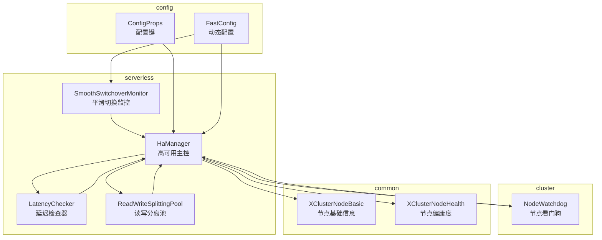
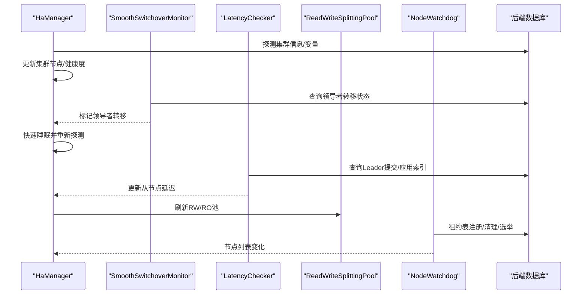
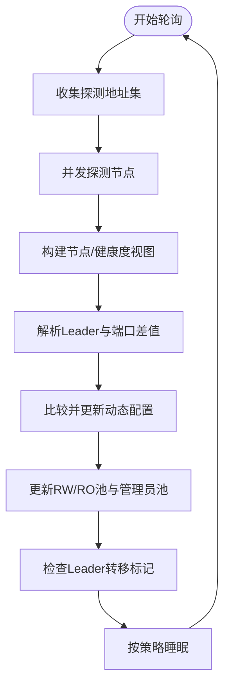
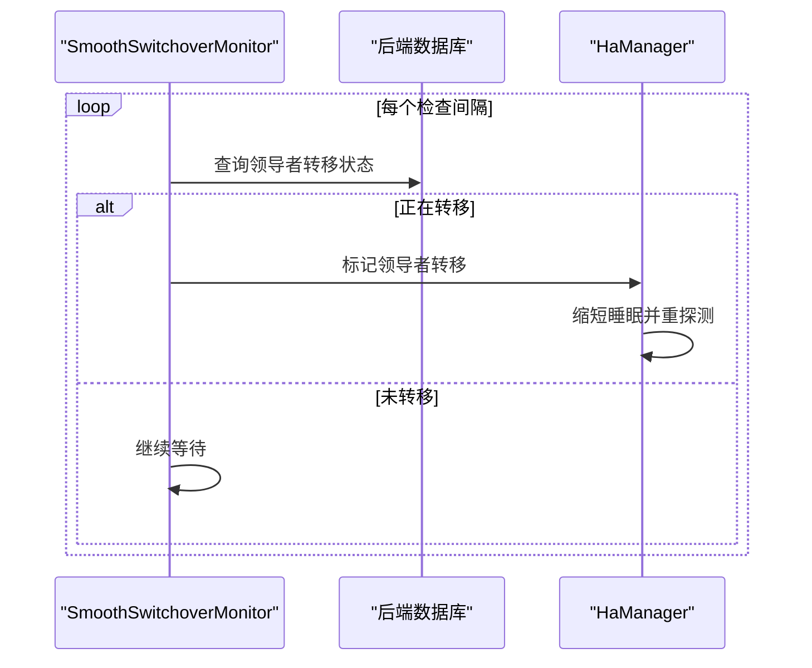
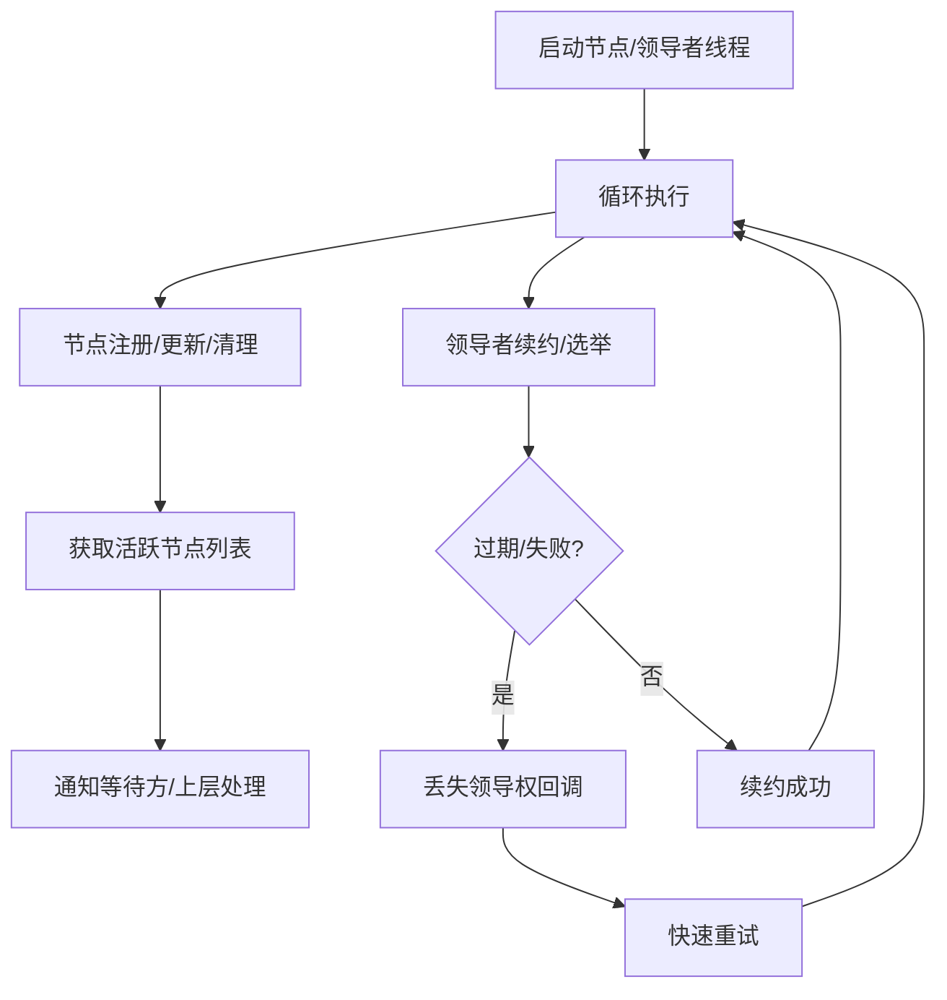
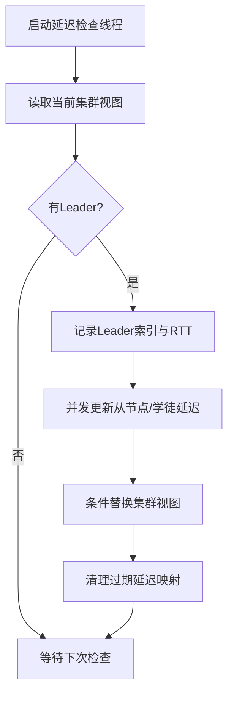
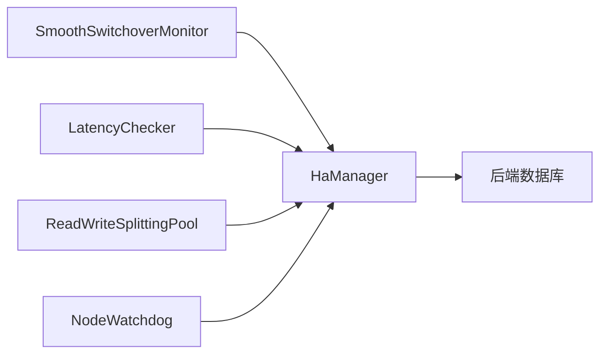

# 高可用性

<cite>
**本文引用的文件列表**
- [HaManager.java](file://proxy-core/src/main/java/com/alibaba/polardbx/proxy/serverless/HaManager.java)
- [SmoothSwitchoverMonitor.java](file://proxy-core/src/main/java/com/alibaba/polardbx/proxy/serverless/SmoothSwitchoverMonitor.java)
- [NodeWatchdog.java](file://proxy-core/src/main/java/com/alibaba/polardbx/proxy/cluster/NodeWatchdog.java)
- [LatencyChecker.java](file://proxy-core/src/main/java/com/alibaba/polardbx/proxy/serverless/LatencyChecker.java)
- [ReadWriteSplittingPool.java](file://proxy-core/src/main/java/com/alibaba/polardbx/proxy/serverless/ReadWriteSplittingPool.java)
- [XClusterNodeBasic.java](file://proxy-common/src/main/java/com/alibaba/polardbx/proxy/common/XClusterNodeBasic.java)
- [XClusterNodeHealth.java](file://proxy-common/src/main/java/com/alibaba/polardbx/proxy/common/XClusterNodeHealth.java)
- [ConfigProps.java](file://proxy-common/src/main/java/com/alibaba/polardbx/proxy/config/ConfigProps.java)
- [FastConfig.java](file://proxy-common/src/main/java/com/alibaba/polardbx/proxy/config/FastConfig.java)
- [HaTest.java](file://proxy-core/src/test/java/com/alibaba/polardbx/proxy/client/HaTest.java)
</cite>

## 目录
1. [简介](#简介)
2. [项目结构](#项目结构)
3. [核心组件](#核心组件)
4. [架构总览](#架构总览)
5. [组件详解](#组件详解)
6. [依赖关系分析](#依赖关系分析)
7. [性能与调优](#性能与调优)
8. [故障排查指南](#故障排查指南)
9. [结论](#结论)
10. [附录：高可用配置参数表](#附录高可用配置参数表)

## 简介
本文件面向PolarDB-X Proxy的高可用性系统，围绕以下目标展开：
- 深入解释高可用管理器（HaManager）的设计原理与故障检测算法
- 阐述平滑切换监控器（SmoothSwitchoverMonitor）的工作机制与切换时机判断
- 说明节点看门狗（NodeWatchdog）的健康检查机制、心跳检测、故障识别与自动恢复流程
- 解释集群状态同步、节点注册与注销的实现细节
- 提供高可用配置参数的详细说明（检测间隔、超时阈值、切换策略等）
- 包含故障场景模拟、切换测试与性能影响分析
- 提供高可用性最佳实践与故障排查指南

## 项目结构
高可用性相关代码主要分布在以下模块与包中：
- serverless：高可用主控与读写分离池
- cluster：节点看门狗与集群节点管理
- common：集群节点基础信息与健康度模型
- config：运行期配置与默认配置项
- test：高可用测试用例

图表来源
- [HaManager.java](file://proxy-core/src/main/java/com/alibaba/polardbx/proxy/serverless/HaManager.java#L67-L156)
- [SmoothSwitchoverMonitor.java](file://proxy-core/src/main/java/com/alibaba/polardbx/proxy/serverless/SmoothSwitchoverMonitor.java#L31-L94)
- [NodeWatchdog.java](file://proxy-core/src/main/java/com/alibaba/polardbx/proxy/cluster/NodeWatchdog.java#L48-L117)
- [LatencyChecker.java](file://proxy-core/src/main/java/com/alibaba/polardbx/proxy/serverless/LatencyChecker.java#L49-L73)
- [ReadWriteSplittingPool.java](file://proxy-core/src/main/java/com/alibaba/polardbx/proxy/serverless/ReadWriteSplittingPool.java#L48-L97)
- [XClusterNodeBasic.java](file://proxy-common/src/main/java/com/alibaba/polardbx/proxy/common/XClusterNodeBasic.java#L28-L62)
- [XClusterNodeHealth.java](file://proxy-common/src/main/java/com/alibaba/polardbx/proxy/common/XClusterNodeHealth.java#L24-L42)
- [ConfigProps.java](file://proxy-common/src/main/java/com/alibaba/polardbx/proxy/config/ConfigProps.java#L150-L209)
- [FastConfig.java](file://proxy-common/src/main/java/com/alibaba/polardbx/proxy/config/FastConfig.java#L21-L75)

章节来源
- [HaManager.java](file://proxy-core/src/main/java/com/alibaba/polardbx/proxy/serverless/HaManager.java#L67-L156)
- [NodeWatchdog.java](file://proxy-core/src/main/java/com/alibaba/polardbx/proxy/cluster/NodeWatchdog.java#L48-L117)
- [SmoothSwitchoverMonitor.java](file://proxy-core/src/main/java/com/alibaba/polardbx/proxy/serverless/SmoothSwitchoverMonitor.java#L31-L94)
- [LatencyChecker.java](file://proxy-core/src/main/java/com/alibaba/polardbx/proxy/serverless/LatencyChecker.java#L49-L73)
- [ReadWriteSplittingPool.java](file://proxy-core/src/main/java/com/alibaba/polardbx/proxy/serverless/ReadWriteSplittingPool.java#L48-L97)
- [XClusterNodeBasic.java](file://proxy-common/src/main/java/com/alibaba/polardbx/proxy/common/XClusterNodeBasic.java#L28-L62)
- [XClusterNodeHealth.java](file://proxy-common/src/main/java/com/alibaba/polardbx/proxy/common/XClusterNodeHealth.java#L24-L42)
- [ConfigProps.java](file://proxy-common/src/main/java/com/alibaba/polardbx/proxy/config/ConfigProps.java#L150-L209)
- [FastConfig.java](file://proxy-common/src/main/java/com/alibaba/polardbx/proxy/config/FastConfig.java#L21-L75)

## 核心组件
- 高可用管理器（HaManager）：负责集群探测、节点健康采集、领导者变更与池刷新、延迟更新与版本解析
- 平滑切换监控器（SmoothSwitchoverMonitor）：周期查询集群是否处于“领导者转移”状态，触发快速HA检查
- 节点看门狗（NodeWatchdog）：通过租约表进行节点注册/注销与领导者选举，维护节点列表与领导状态
- 延迟检查器（LatencyChecker）：基于提交索引与RTT计算从节点相对延迟，用于读写分离权重与路由决策
- 读写分离池（ReadWriteSplittingPool）：根据集群健康度与权重动态维护RW/RO连接池

章节来源
- [HaManager.java](file://proxy-core/src/main/java/com/alibaba/polardbx/proxy/serverless/HaManager.java#L67-L156)
- [SmoothSwitchoverMonitor.java](file://proxy-core/src/main/java/com/alibaba/polardbx/proxy/serverless/SmoothSwitchoverMonitor.java#L31-L94)
- [NodeWatchdog.java](file://proxy-core/src/main/java/com/alibaba/polardbx/proxy/cluster/NodeWatchdog.java#L48-L117)
- [LatencyChecker.java](file://proxy-core/src/main/java/com/alibaba/polardbx/proxy/serverless/LatencyChecker.java#L49-L73)
- [ReadWriteSplittingPool.java](file://proxy-core/src/main/java/com/alibaba/polardbx/proxy/serverless/ReadWriteSplittingPool.java#L48-L97)

## 架构总览
高可用系统以HaManager为核心，驱动以下流程：
- 定时探测集群节点，收集角色、端口、集群ID、代理令牌、提交/应用索引与RTT
- 维护Leader/Follower/Learner三类节点集合与健康度
- 通过SmoothSwitchoverMonitor感知Leader转移状态，触发快速HA检查
- 通过LatencyChecker基于Leader提交索引推算从节点延迟，更新健康度
- 通过ReadWriteSplittingPool按权重与延迟选择RO后端，RW直连Leader
- 通过NodeWatchdog维护租约表，实现节点注册/注销与领导者选举

图表来源
- [HaManager.java](file://proxy-core/src/main/java/com/alibaba/polardbx/proxy/serverless/HaManager.java#L431-L647)
- [SmoothSwitchoverMonitor.java](file://proxy-core/src/main/java/com/alibaba/polardbx/proxy/serverless/SmoothSwitchoverMonitor.java#L46-L79)
- [LatencyChecker.java](file://proxy-core/src/main/java/com/alibaba/polardbx/proxy/serverless/LatencyChecker.java#L204-L275)
- [NodeWatchdog.java](file://proxy-core/src/main/java/com/alibaba/polardbx/proxy/cluster/NodeWatchdog.java#L119-L205)
- [ReadWriteSplittingPool.java](file://proxy-core/src/main/java/com/alibaba/polardbx/proxy/serverless/ReadWriteSplittingPool.java#L99-L200)

## 组件详解

### 高可用管理器（HaManager）
- 设计要点
  - 使用异步并发探测多个节点，聚合结果生成集群视图
  - 通过系统表查询获取集群ID、角色、Leader地址、RPC端口、代理令牌等
  - 维护Leader/Follower/Learner三类节点，记录提交/应用索引与RTT
  - 支持动态配置持久化与版本解析，用于后续池刷新与兼容性判断
  - 在Leader转移期间缩短探测间隔，提升收敛速度
- 故障检测算法
  - 连接超时与查询超时控制在配置项内
  - 对无权限/拒绝连接等可预期错误进行降噪处理
  - 当无法识别Leader或存在多个Leader时抛出异常并回退
  - 通过端口差值推断真实Leader端口，保证跨环境一致性
- 关键流程
  - 获取探测地址集（动态+静态），并发探测
  - 解析本地与全局集群信息，构建节点与健康度映射
  - 比较动态配置，必要时保存并通知
  - 更新RW/RO池，必要时重建管理员池
  - 处理Leader转移标记，执行转移后任务队列

图表来源
- [HaManager.java](file://proxy-core/src/main/java/com/alibaba/polardbx/proxy/serverless/HaManager.java#L431-L647)

章节来源
- [HaManager.java](file://proxy-core/src/main/java/com/alibaba/polardbx/proxy/serverless/HaManager.java#L67-L156)
- [HaManager.java](file://proxy-core/src/main/java/com/alibaba/polardbx/proxy/serverless/HaManager.java#L164-L401)
- [HaManager.java](file://proxy-core/src/main/java/com/alibaba/polardbx/proxy/serverless/HaManager.java#L431-L647)
- [XClusterNodeBasic.java](file://proxy-common/src/main/java/com/alibaba/polardbx/proxy/common/XClusterNodeBasic.java#L28-L62)
- [XClusterNodeHealth.java](file://proxy-common/src/main/java/com/alibaba/polardbx/proxy/common/XClusterNodeHealth.java#L24-L42)

### 平滑切换监控器（SmoothSwitchoverMonitor）
- 工作机制
  - 周期查询后端数据库的“领导者转移”状态标志
  - 若检测到正在转移，则调用HaManager标记领导者转移，触发快速HA检查
  - 异常时主动通知HaManager刷新，避免阻塞
- 切换时机判断
  - 依据FastConfig中的开关与检查间隔
  - 采用短超时限制单次查询耗时
- 切换过程管理
  - 由HaManager在快速模式下缩短睡眠时间，加速收敛
  - 转移完成后执行等待队列中的任务

图表来源
- [SmoothSwitchoverMonitor.java](file://proxy-core/src/main/java/com/alibaba/polardbx/proxy/serverless/SmoothSwitchoverMonitor.java#L46-L79)
- [HaManager.java](file://proxy-core/src/main/java/com/alibaba/polardbx/proxy/serverless/HaManager.java#L660-L680)

章节来源
- [SmoothSwitchoverMonitor.java](file://proxy-core/src/main/java/com/alibaba/polardbx/proxy/serverless/SmoothSwitchoverMonitor.java#L31-L94)
- [FastConfig.java](file://proxy-common/src/main/java/com/alibaba/polardbx/proxy/config/FastConfig.java#L65-L70)

### 节点看门狗（NodeWatchdog）
- 健康检查机制
  - 通过租约表进行节点注册/更新/清理，维护当前活跃节点列表
  - 通过租约表进行领导者选举与续约，维护领导状态
- 心跳检测
  - 节点侧定时更新租约，清理过期节点
  - 领导者侧定时尝试续约或选举，失败则快速重试
- 故障识别与自动恢复
  - 节点列表变化时唤醒等待线程
  - 领导者过期或丢失时回调监听器，触发上层处理
- 节点注册与注销
  - 注册：更新租约，不存在则插入
  - 注销：清理过期租约，移除无效节点
  - 通过唯一索引保证同一进程仅一个领导者

图表来源
- [NodeWatchdog.java](file://proxy-core/src/main/java/com/alibaba/polardbx/proxy/cluster/NodeWatchdog.java#L119-L205)
- [NodeWatchdog.java](file://proxy-core/src/main/java/com/alibaba/polardbx/proxy/cluster/NodeWatchdog.java#L256-L376)

章节来源
- [NodeWatchdog.java](file://proxy-core/src/main/java/com/alibaba/polardbx/proxy/cluster/NodeWatchdog.java#L48-L117)
- [NodeWatchdog.java](file://proxy-core/src/main/java/com/alibaba/polardbx/proxy/cluster/NodeWatchdog.java#L119-L205)
- [NodeWatchdog.java](file://proxy-core/src/main/java/com/alibaba/polardbx/proxy/cluster/NodeWatchdog.java#L256-L376)

### 延迟检查器（LatencyChecker）
- 数据来源
  - 通过管理员池查询Leader的提交/应用索引与RTT
  - 基于Leader历史索引时间戳序列，对从节点应用索引进行插值计算相对延迟
- 更新策略
  - 先更新Leader健康度，再并发更新从节点健康度
  - 仅在从节点数量不变且健康度有效时才替换整个集群视图
  - 清理过期延迟映射，保持内存占用可控
- 性能与准确性
  - 通过历史窗口大小限制延迟记录数量
  - 插值法估算从节点相对延迟，避免强一致时间戳依赖

图表来源
- [LatencyChecker.java](file://proxy-core/src/main/java/com/alibaba/polardbx/proxy/serverless/LatencyChecker.java#L204-L275)

章节来源
- [LatencyChecker.java](file://proxy-core/src/main/java/com/alibaba/polardbx/proxy/serverless/LatencyChecker.java#L49-L73)
- [LatencyChecker.java](file://proxy-core/src/main/java/com/alibaba/polardbx/proxy/serverless/LatencyChecker.java#L204-L275)

### 读写分离池（ReadWriteSplittingPool）
- 路由策略
  - RW池：直连Leader，令牌随健康度更新
  - RO池：按权重与延迟选择从节点；可选开启跟随者读、允许Leader加入RO池
- 权重与延迟
  - 权重来源于配置项，支持为特定节点设置权重
  - 延迟来源于LatencyChecker，超过阈值的节点可能被剔除
- 动态维护
  - 发现新节点即创建连接池，令牌变化时替换连接池
  - 旧连接池在替换后关闭，避免资源泄漏

章节来源
- [ReadWriteSplittingPool.java](file://proxy-core/src/main/java/com/alibaba/polardbx/proxy/serverless/ReadWriteSplittingPool.java#L99-L200)
- [ReadWriteSplittingPool.java](file://proxy-core/src/main/java/com/alibaba/polardbx/proxy/serverless/ReadWriteSplittingPool.java#L123-L200)

## 依赖关系分析
- 组件耦合
  - HaManager是核心协调者，依赖ReadWriteSplittingPool、LatencyChecker、NodeWatchdog
  - SmoothSwitchoverMonitor依赖HaManager与后端数据库状态
  - LatencyChecker依赖HaManager的管理员池与集群视图
  - ReadWriteSplittingPool依赖HaManager的集群视图与权重配置
- 外部依赖
  - 后端数据库系统表与变量查询
  - 配置中心与动态配置刷新（FastConfig）

图表来源
- [HaManager.java](file://proxy-core/src/main/java/com/alibaba/polardbx/proxy/serverless/HaManager.java#L67-L156)
- [SmoothSwitchoverMonitor.java](file://proxy-core/src/main/java/com/alibaba/polardbx/proxy/serverless/SmoothSwitchoverMonitor.java#L52-L62)
- [LatencyChecker.java](file://proxy-core/src/main/java/com/alibaba/polardbx/proxy/serverless/LatencyChecker.java#L80-L135)
- [NodeWatchdog.java](file://proxy-core/src/main/java/com/alibaba/polardbx/proxy/cluster/NodeWatchdog.java#L131-L174)

## 性能与调优
- 探测与延迟检查
  - BACKEND_HA_CHECK_INTERVAL与BACKEND_HA_CHECK_TIMEOUT控制HA轮询频率与单次探测超时
  - LATENCY_CHECK_INTERVAL与LATENCY_CHECK_TIMEOUT控制延迟更新频率与查询超时
  - LATENCY_RECORD_COUNT限制历史窗口大小，平衡精度与内存
- 连接池与权重
  - BACKEND_ADMIN_MAX_POOLED_SIZE、BACKEND_RW_MAX_POOLED_SIZE、BACKEND_RO_MAX_POOLED_SIZE控制池容量
  - READ_WEIGHTS与SLAVE_READ_LATENCY_THRESHOLD影响RO路由权重与延迟阈值
- 平滑切换
  - SMOOTH_SWITCHOVER_CHECK_INTERVAL与SMOOTH_SWITCHOVER_WAIT_TIMEOUT影响切换检测灵敏度与等待时长
- 节点租约
  - NODE_LEASE与UPDATE_LEASE_TIMEOUT决定节点存活判定与租约更新频率

章节来源
- [ConfigProps.java](file://proxy-common/src/main/java/com/alibaba/polardbx/proxy/config/ConfigProps.java#L150-L209)
- [FastConfig.java](file://proxy-common/src/main/java/com/alibaba/polardbx/proxy/config/FastConfig.java#L65-L70)

## 故障排查指南
- 常见问题定位
  - 无法连接后端：检查后端用户名/密码、连接超时与HA探测超时配置
  - 无Leader或多Leader：确认集群ID一致性、Leader地址解析逻辑
  - 读写分离异常：检查权重配置、延迟阈值与Leader令牌一致性
  - 切换不生效：确认平滑切换开关与检查间隔，查看Leader转移标记是否被清除
  - 节点未注册：检查租约表是否存在、超时配置与节点IP/端口
- 日志与告警
  - HaManager与SmoothSwitchoverMonitor均记录错误日志，注意区分连接拒绝与认证错误
  - NodeWatchdog在领导者变更时输出事件日志
- 测试验证
  - 可参考手动测试用例，初始化HaManager并执行简单查询验证连通性

章节来源
- [HaManager.java](file://proxy-core/src/main/java/com/alibaba/polardbx/proxy/serverless/HaManager.java#L384-L401)
- [SmoothSwitchoverMonitor.java](file://proxy-core/src/main/java/com/alibaba/polardbx/proxy/serverless/SmoothSwitchoverMonitor.java#L64-L71)
- [NodeWatchdog.java](file://proxy-core/src/main/java/com/alibaba/polardbx/proxy/cluster/NodeWatchdog.java#L334-L342)
- [HaTest.java](file://proxy-core/src/test/java/com/alibaba/polardbx/proxy/client/HaTest.java#L52-L65)

## 结论
该高可用系统通过多线程并发探测、延迟评估与平滑切换监控，实现了对PolarDB-X集群的稳定感知与快速收敛。HaManager作为中枢协调者，结合ReadWriteSplittingPool的智能路由与NodeWatchdog的租约管理，确保在Leader转移、节点故障等场景下维持服务连续性。合理的配置参数与监控策略是保障系统性能与可靠性的关键。

## 附录：高可用配置参数表
- HA探测与超时
  - BACKEND_HA_CHECK_INTERVAL：HA轮询间隔（毫秒）
  - BACKEND_HA_CHECK_TIMEOUT：HA单次探测超时（毫秒）
- 延迟检查
  - LATENCY_CHECK_INTERVAL：延迟检查间隔（毫秒）
  - LATENCY_CHECK_TIMEOUT：延迟查询超时（毫秒）
  - LATENCY_RECORD_COUNT：延迟历史记录条数上限
  - SLAVE_READ_LATENCY_THRESHOLD：从节点延迟阈值（微秒）
- 连接池
  - BACKEND_ADMIN_MAX_POOLED_SIZE：管理员池最大连接数
  - BACKEND_RW_MAX_POOLED_SIZE：RW池最大连接数
  - BACKEND_RO_MAX_POOLED_SIZE：RO池最大连接数
- 读写分离
  - ENABLE_READ_WRITE_SPLITTING：启用读写分离
  - ENABLE_FOLLOWER_READ：允许从节点读
  - ENABLE_LEADER_IN_RO_POOLS：允许Leader加入RO池
  - READ_WEIGHTS：节点权重配置（ip:port@权重）
- 平滑切换
  - SMOOTH_SWITCHOVER_ENABLED：启用平滑切换
  - SMOOTH_SWITCHOVER_CHECK_INTERVAL：切换检测间隔（毫秒）
  - SMOOTH_SWITCHOVER_WAIT_TIMEOUT：切换等待超时（毫秒）
- 节点租约
  - NODE_LEASE：租约时长（毫秒）
  - UPDATE_LEASE_TIMEOUT：租约更新超时（毫秒）
  - NODE_IP：节点IP（为空则自动获取）
  - GENERAL_SERVICE_PORT：通用服务端口

章节来源
- [ConfigProps.java](file://proxy-common/src/main/java/com/alibaba/polardbx/proxy/config/ConfigProps.java#L150-L209)
- [FastConfig.java](file://proxy-common/src/main/java/com/alibaba/polardbx/proxy/config/FastConfig.java#L65-L70)